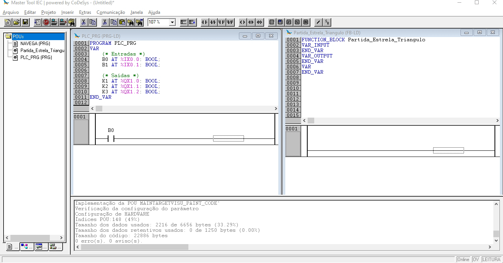

# 5. Partida Estrela Triângulo

## 5.1 Objetivo
Desenvolver uma aplicação, bloco funcional e programa, 
para um dispositivo de comando para partida Estrela-Triângulo.

| Figura 1: Diagramas de comando e potência da partida Estrela-Triângulo |
|:-------------------:|
|  |
|Fonte: [Wikipedia](https://pt.wikipedia.org/wiki/Partida_estrela-tri%C3%A2ngulo) |

## 5.2 - Requisitos da solução
* Comportamento
    * Ao pressionar S1
	    * Ligar K1, K2 (fechamento estrela);
        * Temporizar 5 segundos
        * Desligar K2 e ligar K3 (fechamento triângulo).
	* Ao pressionar S0, em qualquer momento:
		* Desligar todos os contatores.

## 5.3 Planejamento

Definir como será feita a entrega: 
simulador, montagem de protótipo, montagem de circuito em painel ou PCI, etc, 
assim como listar os materiais e ferramentas em função do tipo de entrega. 
Por fim o planejamento do processo, em que deve ficar explicito como, 
utilizando os materiais listados e manipulando da ferramentas, 
chega-se ao produto final, com um encadeamento lógico das tarefas que compoem o processo.

### 5.3.1 Planejamento do produto final

* Apresentação de funcionamento em kit didático
* Arquivo .pdf contendo:
	* declaração de interface física, entradas e saídas com respectivos endereços;
	* declaração de bloco funcional contendo interface e comportamento para a partida proposta.

### 5.3.2 - Ferramentas

1. Software Master Tool IEC
2. Kit didático: TB131 Altus

### 5.3.3 - Materiais

* Não há!

### 5.3.4 - Planejamento do processo
* [ ] Abrir projeto a partir do modelo: `Modelo_DU350_DU351_v110.pro`
* [ ] Acrescentar objeto POU do tipo Programa em linguagem Ladder
* [ ] Declarar entradas e saídas físicas
* [ ] Acrescentar bloco funcional `Partida_Estrela_Triangulo`
* [ ] Declarar bloco funcional `Partida_Estrela_Triangulo` no programa principal `PLC_PRG`
* [ ] Programar a lógica do bloco funcional

## 5.4 - Solução

Produto ou processo que atinge o objetivo proposto, 
através da execução de seu planejamento e satisfação dos seus requisitos.

### 5.4.1 Declaração de entradas e saídas físicas no programa principal:

### 5.4.2 Adicionando um bloco funcional (*function block*):

### 5.4.3 Adicionando variáveis no bloco funcional:

### 5.4.4 Adicionando o bloco funcional ao programa principal:

### 5.4.5 Programando o comportamento do bloco funcional:

### 5.4.6 Baixando o programa para o PLC:

### 5.4.7 Executando o programa no PLC:

