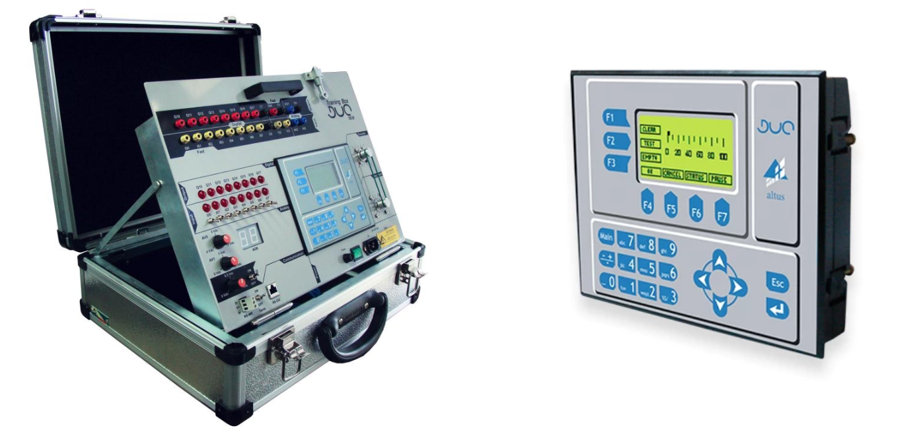
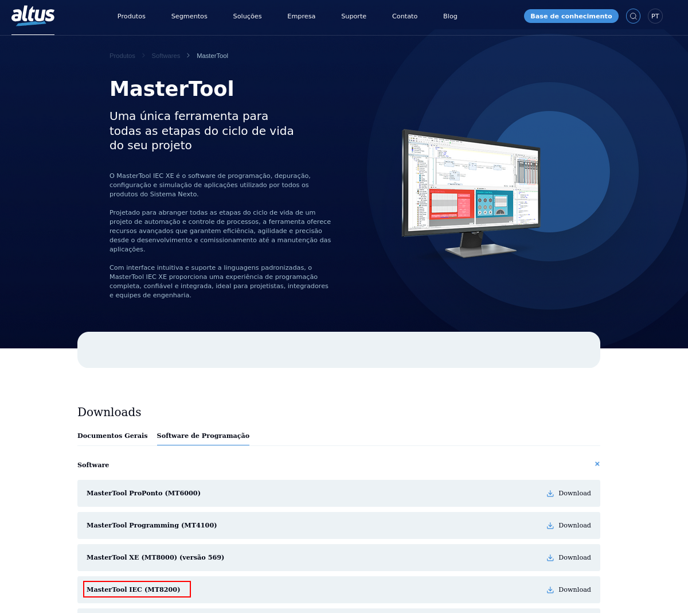
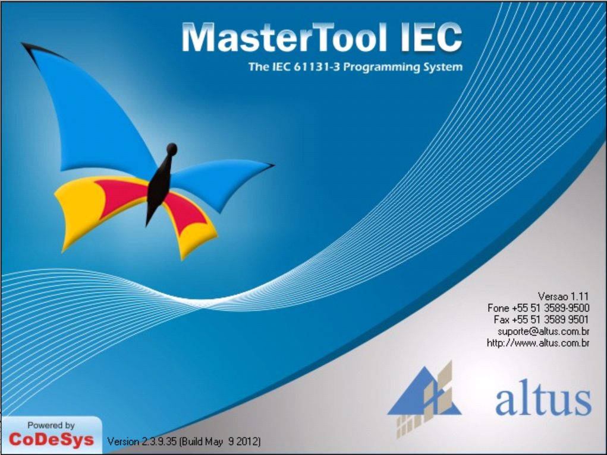
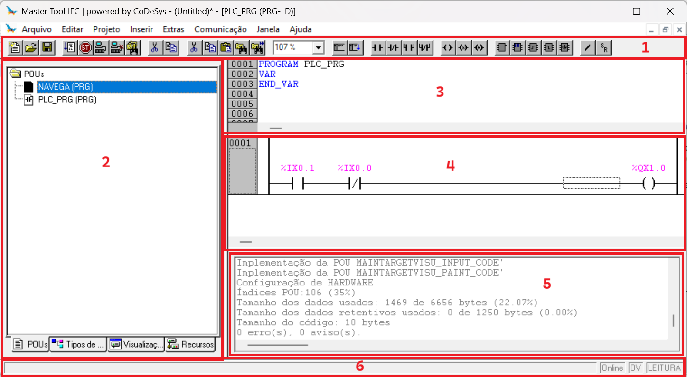

# Equipamento

O **Duo** é um equipamento da série de **Controladores Programáveis** da Altus com **Interface Homem Máquina (IHM)** incorporada. Utilizado em sistemas que demandam supervisão e controle em um só ambiente. 

O controlador utilizado no laboratório está montado em um kit didático denominado [TB131](https://www.altus.com.br/produto/15/kit-didatico), contendo conexões que facilitam testes de bancada e conexões com eletroválvulas, contatores e sensores com a utilização de [cabos com pino tipo 'banana'](https://www.ryndackcomponentes.com.br/conectores-e-chaves/outros-conectores/pinos-e-bornes-banana-garras-jacare-e-pontas-de-prova/pinos-banana.html). Possui ainda cháves para simulação de acionamentos, motor de passo incorporado, potenciômetros em entradas analógicas e display de 7 segmentos para saída analógica. 

---

# Ferramentas de Desenvolvimento

Para o desenvolvimento dos programas, pode-se baixar o software [Master Tool IEC](https://www.altus.com.br/wp-content/uploads/2024/11/mastertool_iec_mt8200.zip) diretamente do site da [Altus SA](https://www.altus.com.br/serie/programacao-clp/), acessando o seguinte caminho:

- Produtos > Controladores Programáveis > Série Duo

Para a comunicação do controlador com o computador, pode ser necessária a instalação de um [driver de comunicação](driver/PL23XX_Prolific_DriverInstaller_v408.zip).

---

# Ambiente de Desenvolvimento

O Master Tool IEC é o ambiente de desenvolvimento para o controlador programável da série Duo, da Altus. 

A figura abaixo ilustra as ferramentas da sua interface padrão, destacando-se:

1. Barra de ferramentas;
2. Janela de navegação no projeto ou Organizador de objetos;
3. Editor de declaração de variáveis;
4. Editor de código (programa);
5. Janela de mensagens;
6. Barra de status;

