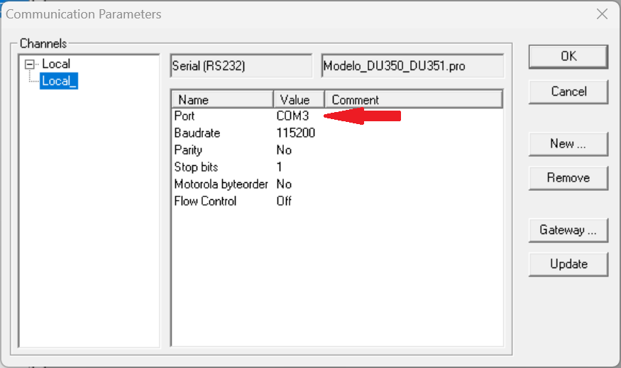

# Criando um novo projeto


**1. Criando um novo projeto a partir de um modelo:**

1.1 Com o **Master Tool IEC** aberto, clique em `Arquivo` > `Novo a partir do modelo...`

1.2 Selecione a segunda opção: **Modelo_DU350_DU351_v110** > Abrir


---

**2. Verificando arquivo `NAVEGA (PRG)`:**

Em POUs, abra o arquivo `NAVEGA (PRG)` e **verifique** se o conteúdo está como ilustrado abaixo:

``` Pascal
PROGRAM NAVEGA
VAR
	ControleTelas : NAVIGATION;
	ListaTelas 	: ARRAY [0..30] OF STRING(10);
END_VAR
```

``` Pascal
(* Adiciona a tela MAIN como tela principal *)
ListaTelas[0] := 'MAIN';

(* Ativa o controle automático de navegação somente pelo teclado *)
ControleTelas(ENABLE_UPDW := FALSE, VISU_LIST := ListaTelas, UP := FALSE , DOWN := FALSE);
```

Caso o conteúdo esteja ausente, copie este conteúdo e insira-o no arquivo `NAVEGA (PRG)`.

---

**3. Acrescentando um objeto do tipo `Programa` em linguagem `Ladder`:**

3.1 Em POUs, clique com o botão direito do mouse e selecione: **Acrescentar objeto...**

3.2 Na janela `Nova POU`, selecione:

3.3 Tipo da POU: **Programa**;

3.4 Linguagem da POU: **LD**;

3.5 Mantenha o Nome da nova POU: **PLC_PRG**;

3.6 Clique em **OK**.


---

**4. Testando comunicação com PLC:**

4.1 Conecte o PLC ao computador;

4.2 Abra o **gerenciador de dispositivos** e verifique qual porta foi alocada para a comunicação com o PLC:


Aqui a porta alocada foi a `COM3`.


4.3 No MasterTool, clique em `Comunicação` -> `Parâmetros de comunicação ...`



4.4 Para ajustar a porta **clique duplo** sobre a `COMn` e use as setas para cima e para baixo para ajustar a porta correta, neste caso a `COM3`;

4.5 Clique em `OK`.

---

**5. Testando o processo de gravação:**

5.1 Após todos os ajustes realizados, clique em `Comunicação` e `Login`.

5.2 A mensagem: `O programa foi alterado! Enviar o novo programa?` deve aparecer se estiver tudo certo.

5.3 Estando tudo certo, clique em `Sim` e o *Download* será realizado.


5.4 Caso um **erro** ocorra, ***não entre em pânico***:

5.4.1 Verificar os cabos de conexão e tente novamente. Se persistir, solicite orientação ao professor.

5.**4.2**
