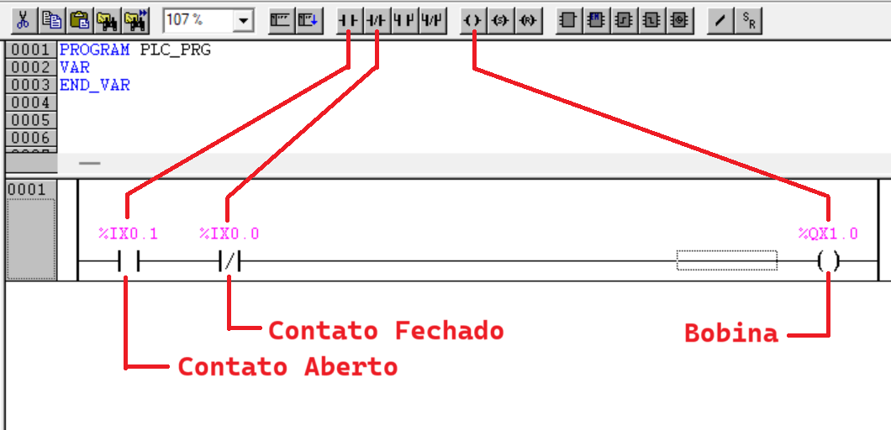

# Contatos e Bobinas

Os elementos básicos na programação em linguagem **Ladder** são os **contatos** e as **bobinas**. 

Um **contato** é uma representação do **estado lógico** de uma das **entradas**. 

Os contatos mais comuns são: aberto e fechado, em sua condição normal.

Na condição em que não há estímulo da entrada, o contato respectivo permanece na condição normal, mas quando a entrada é estimulada, ou seja, é aplicada uma tensão proveniente do fechamento de uma chave, fim-de-curso ou sensor, o cotato muda de estado: o contato aberto fecha e o fechado abre, indicando uma mudança de estado da entrada física. 

Uma **bobina** é uma representação do **estado lógico** de uma das **saídas**. Da mesma forma que nas entradas, porém, a saída física que é acionada ou não dependendo do estado lógico da bobina, no programa. 



---

# Endereçamento das entradas e saídas digitais

Todas as entradas e saídas são mapeadas em regiões de memória. Assim para fazer a lógica em um programa, basta acessar o endereço correspondente à entrada que se quer ler e associá-la a um contato, que passa a representar o estado lógico da entrada física. 


No kit de treinamento TB131 há a seguinte relação das entradas e saídas com os respectivos endereços de memória:

| TB131 <BR> Entradas| Memória |   | TB131 <br> Saídas | Memória |
|:-----:|:-------:|---|:-----:|:-------:|
|  I00  |  %IX0.0 |   |  Q10  |  %QX1.0 |
|  I01  |  %IX0.1 |   |  Q11  |  %QX1.1 |
|  I02  |  %IX0.2 |   |  Q12  |  %QX1.2 |
|  I03  |  %IX0.3 |   |  Q13  |  %QX1.3 |
|  I04  |  %IX0.4 |   |  Q14  |  %QX1.4 |
|  I05  |  %IX0.5 |   |  Q15  |  %QX1.5 |
|  I06  |  %IX0.6 |   |  Q16  |  %QX1.6 |
|  I07  |  %IX0.7 |   |  Q17  |  %QX1.7 |


Assim, para a primeira entrada acionar a primeira saída com lógica direta, basta realizar a seguinte ligação: 

```ld
   %IX0.0                     %QX1.0
|----| |------------------------( )----|
```

Ou ainda, pode-se utilizar a declaração das variáveis já existente para o equipamento, em que os endereços das variáveis estão associados com os respectivos nomes de marcação na parte física do equipamento. Então, o mesmo código pode ser declarado da seguinte forma:

```ld
     I00                        Q10
|----| |------------------------( )----|
```


--- 

# Declaração de Variáveis e Identificadores

A sintaxe da declaração de variáveis é:

```pascal
<Identificador> {AT <Endereço>}:<Type> {:=<inicialização>}; 
```

- Os elementos entre chaves `{ }` são opcionais.
- O **identificador** é o nome de uma variável:
    - não pode conter espaços ou caracteres não permitidos;
    - ele não pode ser declarado em dobro;
    - não pode ser idêntico a qualquer palavra-chave.
    - a escrita de variáveis em maiúsculas/minúsculas é ignorada
        - Ex: VAR1, Var1 e var1 não são variáveis diferentes. 


Exemplo: 

```Pascal
(* Declaração de variáveis *)

Ligar       AT %IX0.1: BOOL := 0; 
Desligar    AT %IX0.0: BOOL := 0; 
Motor       AT %QX1.0: BOOL := 0; 
```

Obs: Nos exemplos são apresentadas apenas as declarações das variáveis, sem a seguinte estrutura: 

```pascal
PROGRAM PLC_PRG
VAR

END_VAR
```

Bem como o programa, é apresentado em forma de texto monoespaçado, para reduzir a quantidade de imagens no site, facilitando a sua renderização da página. 


```Pascal
(* Programa em linguagem Ladder *)

     Ligar     Desligar                       Motor
|-----| |--------|/|---------------------------( )----|
           |
     Motor |
|-----| |--´
```

Obs: Este trecho não pode ser copiado, pois o editor do Master Tool IEC é gráfico e não possui interface para este tipo de notação. 


Segue ilustração da declaração das variáveis e do programa inseridos no Master Tool IEC. 


Note que **após a compilação**, deve aparecer a mensagem como na Janela de Mansagens: `0 erro(s), 0 aviso(s)`.

Para executar o programa clique em `Comunicação` -> `Run`.

---

# Operações lógicas 

As operações lógicas são regras que se baseiam em proposições iniciais para produzir um valor lógico como resultado. 

As proposições iniciais e o resultado são estados lógicos booleanos, Verdadeiro e Falso, que são aqui representados com os valores 1 e 0 respectivamente.

As operações lógicas mais comuns são: Negação (~), Conjunção (^), Disjunção (v) e ainda Condicional (->) e Bicondicional (<->) que estão fora do escopo deste material. 

Para utilizar estes operandos, é necessário conhecer as suas regras de aplicação, que normalmente são expressas em forma de tabela verdade. 

A linguagem ladder utiliza a simbologia de contatos para representar os estados lógicos: 

- Contato aberto:  `---| |----`
- Contato fechado: `---|/|----`

---


**Operação: Negação (NÃO)**

| A   |\(Y = \bar{A}\) |
|:---:|:---:|
| 0   |  1  |
| 1   |  0  |

```
      A                   Y
|----|/|-----------------( )----|
```

---

**Operação: Conjunção (E)**

| A   | B   | Y = A.B |
|:---:|:---:|:---:|
| 0   | 0   |  0  |
| 0   | 1   |  0  |
| 1   | 0   |  0  |
| 1   | 1   |  1  |


```
      A      B               Y
|----| |----| |-------------( )----|
```

---


**Operação: Disjunção (OU)**

| A   | B   | Y = A+B |
|:---:|:---:|:---:|
| 0   | 0   |  0  |
| 0   | 1   |  1  |
| 1   | 0   |  1  |
| 1   | 1   |  1  |


```
      A                      Y
|----| |--------------------( )----|
            |
      B     |
|----| |----'
```

---

**Associação de operações**

As associações de operações podem ser realizadas, como o já visto acionamento do motor.

```Pascal
     Ligar     Desligar                       Motor
|-----| |--------|/|---------------------------( )----|
           |
     Motor |
|-----| |--´
```

Este programa pode ser descrito na forma de expressão algébrica da seguinte forma:

$$
Motor = (Ligar + Motor).\overline{ Desligar }
$$

Lembrando que o operador `OU` é representado pelo símbolo `+` e o operador `E` é representado pelo símbolo `.`.

---


**Como ficam os programas para as seguintes expressões?**

1. \(Y_1 = A \cdot \overline{B} + \overline{A} \cdot B\)
2. \(Y_2 = \overline{A} \cdot \overline{B}+A \cdot B\)
3. \(Y_3 = \overline{A \cdot B}\)
4. \(Y_4 = \overline{A+B}\)

