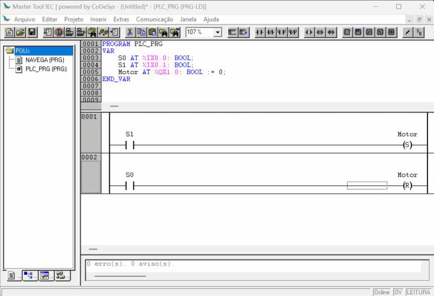

# Funções SET e RESET

As funções `SET` e `RESET` podem ser atribuídas à uma bobina 
de modo que ela precise apenas de um pulso para permanecer no estado de acionamento, 1 e 0, respectivamente. 


Essas funções operam de forma complementar, assim, após ativar uma bobina com a função `SET` é necessário um acionamento da mesma bobina com a função `RESET` para que ela retorne à condição normal desligada. 





Em algumas situações, seu uso facilita a construção do programa, mas pode trazer erros lógicos ao desenvolvimento da aplicação caso sejam utilizadas de modo inadequado. 


O seguinte trecho de código: 

```Ld
     Ligar     Desligar                       Motor
|-----| |--------|/|---------------------------( )----|
           |
     Motor |
|-----| |--´
```

pode ser declarado da seguinte forma:

```Ld
     Ligar                                     Motor
|-----| |--------------------------------------( S )----|
            
     Desligar                                  Motor
|-----| |--------------------------------------( R )----|
```

> Recomendação: 
> 
> Não usar no código a bobina `Motor` mais do que uma vez para cada função. Ou seja, apenas um uso para o `SET` e apenas um uso para o `RESET`.

