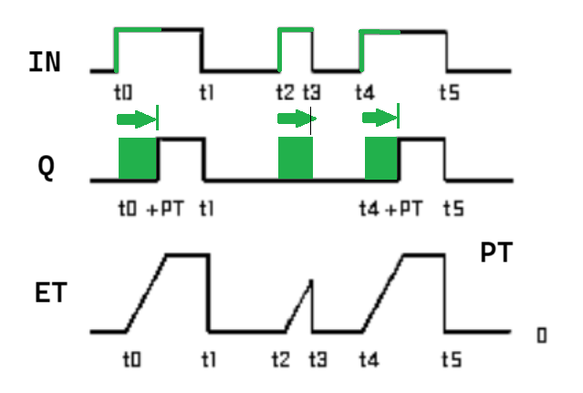
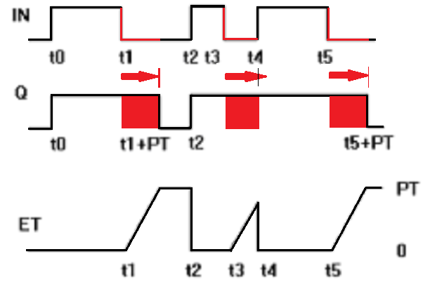
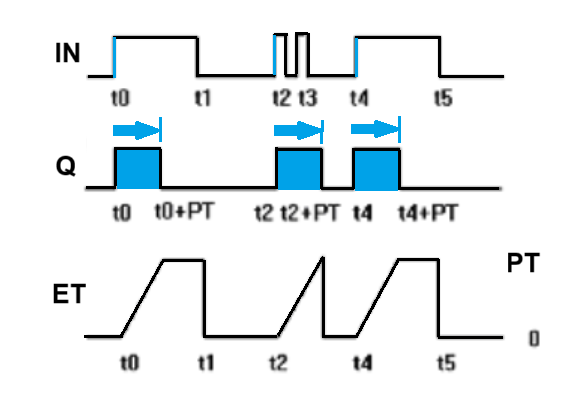
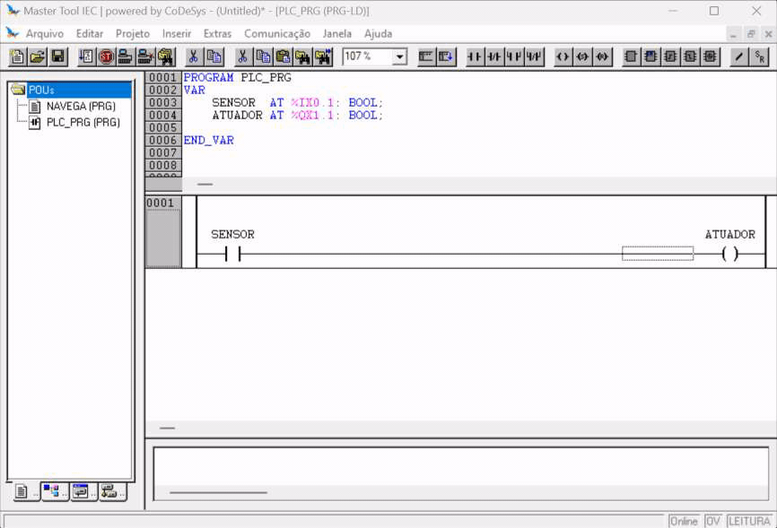
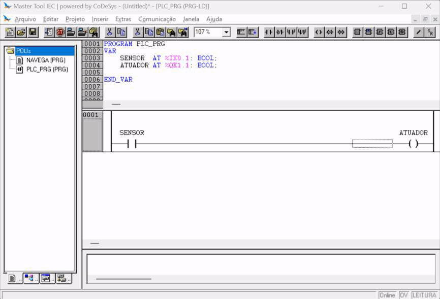

# Temporizadores

---

## 1. TON - *ON Delay Timer*

Bloco funcional que produz uma atraso de acionamento da saída em função do acionamento da entrada. 

A Figura 1 apresenta uma carta de tempos de funcionamento do TON.

Nomenclatura:

- IN: Entrada digital;
- Q: Saída digital;
- PT (*Preset Time*): Tempo de atraso;
- ET (*Elapsed Time*): Tempo decorrido.

1. Note que no instante `t0`, o sinal de entrada `IN` é acionado. Com isso a variável `ET` começa a contar o tempo, até atingir o valor de `PT`. Quando isso ocorre, a saída `Q` é acionada. 
2. Ao desligar a entrada `IN`, independente do tempo decorrido `ET`, a saída também desliga. 

| Figura 1: Carta de tempos do TON            | 
|:-------------------------------------------:|
|  |
| Fonte: Master Tool IEC (Ajuda->Pesquisar...)|

**Exemplo**

Acionar um **atuador**, com **atraso de 5 segundos** em relação ao acionamento de um **sensor**. 

Para realizar o acionamento conforme indicado, são necessárias as declarações das variáveis para o sensor, atuador e o temporizador.

A declaração do sensor e do atuador, associados a um endereço físico já foi abordado. 

Para executar o bloco funcional TON, é necessária a declaração de uma variável do tipo `TON`, que aloca espaço para o funcionamento adequando do bloco. 

Para visualizar o tempo decorrido enquanto ele avança, sugiro declarar uma variável de apoio. Costumo utilizar o nome da declaração principal, acrescido das letras da porta que esta variável vai receber o valor, assim, para o temporizador declarado como `T1`, o valor da saída `ET` será armazenado na variável `T1et`, que deve ser do tipo `TIME`.


**Declaração de variáveis**

``` Pascal
VAR
    SENSOR  AT %IX0.1: BOOL;
    ATUADOR AT %QX1.1: BOOL;

    T1: TON;
    T1et: TIME;
END_VAR
```

**Programa LD (Ladder)**

- Inserindo um bloco funcional de temporização: 
    - Inserir \( \rightarrow \) Bloco Funcional... (Ctrl+B)
    - Blocos funcionais padrão
    - `C:\ ... \STANDARD.LIB` \( \rightarrow \) Timer \( \rightarrow \) TON(FB)

``` Pascal
                 T1
              ________
    SENSOR   |   TON  |                          ATUADOR 
|----| |-----|IN     Q|----------------------------( )---|
             |        |
       T#5s -|PT    ET|- T1et
             |________|
```

**Programa ST (Structured Text)**

```Pascal
T1( IN := SENSOR, PT := T#5s )

T1et := T1.ET;
ATUADOR := T1.Q;
```

---

A Figura 2 apresenta um resumo da declaração e do uso do temporizador do tipo TON.


| Figura 2: Declaração e exemplo de uso do TON |
|:-------------------------------------------:|
|                 |
| Fonte: Autor                                |

---

## 2. TOF - *OFF Delay Timer*

Bloco funcional que produz uma atraso de desenergização da saída em função do desligamento do sinal da entrada.

A Figura 3 apresenta uma carta de tempos de funcionamento do TOF.

Nomenclatura:

- IN: Entrada digital;
- Q: Saída digital;
- PT (*Preset Time*): Tempo de atraso;
- ET (*Elapsed Time*): Tempo decorrido.

| Figura 3: Carta de tempos do TOF            | 
|:-------------------------------------------:|
|  |
| Fonte: Master Tool IEC (Ajuda->Pesquisar...)|


**Exemplo**

Dado o acionamento de um **sensor**, ligar um **atuador**. Ao desacionar o **sensor**, produzir um **atraso de 5 segundos** e desligar o **atuador**.

Para realizar o acionamento conforme indicado, são necessárias as declarações das variáveis para o sensor, atuador e o temporizador.

A declaração do sensor e do atuador, associados a um endereço físico já foi abordado. 

Para este tipo de temporização, o bloco funcional TOF é o mais adequado, necessitando a declaração de uma variável do tipo `TOF`. 

Para visualizar o tempo decorrido da temporização, assim como com o `TON`, sugiro declarar uma variável de apoio. Costumo utilizar o nome da declaração principal, acrescido das letras da porta que esta variável vai receber o valor, assim, para o temporizador declarado como `T2`, o valor da saída `ET` será armazenado na variável `T2et`, que deve ser do tipo `TIME`.


**Declaração de variáveis**

``` Pascal
VAR
    SENSOR  AT %IX0.1: BOOL;
    ATUADOR AT %QX1.1: BOOL;

    T2: TOF;
    T2et: TIME;
END_VAR
```

**Programa LD (Ladder)**

- Inserindo um bloco funcional de temporização: 
    - Inserir \( \rightarrow \) Bloco Funcional... (Ctrl+B)
    - Blocos funcionais padrão
    - `C:\ ... \STANDARD.LIB` \( \rightarrow \) Timer \( \rightarrow \) TOF(FB)

``` Pascal
                 T2
              ________
    SENSOR   |   TOF  |                          ATUADOR 
|----| |-----|IN     Q|----------------------------( )---|
             |        |
       T#5s -|PT    ET|- T2et
             |________|
```

**Programa ST (Structured Text)**

```Pascal
T2( IN := SENSOR, PT := T#5s )

T2et := T2.ET;
ATUADOR := T2.Q;
```


<!--  -->


---


## 3. TP - *Pulse Timer*

Bloco funcional que produz um acionamento temporizado, mediante uma borda de subida como estímulo de acionamento em sua entrada.

A Figura 4 apresenta uma carta de tempos de funcionamento do TP.

Nomenclatura:

- IN: Entrada digital;
- Q: Saída digital;
- PT (*Preset Time*): Tempo de atraso;
- ET (*Elapsed Time*): Tempo decorrido.

| Figura 4: Carta de tempos do TP             | 
|:-------------------------------------------:|
|    |
| Fonte: Master Tool IEC (Ajuda->Pesquisar...)|


**Exemplo**

Dada uma borda de subida em um **sensor**, ligar um **atuador** por um tempo de **5 segundos** e ao final da temporização, desligá-lo.

Para realizar o acionamento conforme indicado, são necessárias as declarações das variáveis para o sensor, atuador e o temporizador.

A declaração do sensor e do atuador, associados a um endereço físico já foi abordado. 

Para este tipo de temporização, o bloco funcional TP é o mais adequado, necessitando a declaração de uma variável do tipo `TP`. 

Para visualizar o tempo decorrido da temporização, assim como com o `TON` e o `TOF`, sugiro declarar uma variável de apoio. Costumo utilizar o nome da declaração principal, acrescido das letras da porta que esta variável vai receber o valor, assim, para o temporizador declarado como `T3`, o valor da saída `ET` será armazenado na variável `T3et`, que deve ser do tipo `TIME`.


**Declaração de variáveis**

``` Pascal
VAR
    SENSOR  AT %IX0.1: BOOL;
    ATUADOR AT %QX1.1: BOOL;

    T3: TP;
    T3et: TIME;
END_VAR
```

**Programa LD (Ladder)**

- Inserindo um bloco funcional de temporização: 
    - Inserir \( \rightarrow \) Bloco Funcional... (Ctrl+B)
    - Blocos funcionais padrão
    - `C:\ ... \STANDARD.LIB` \( \rightarrow \) Timer \( \rightarrow \) TP(FB)

``` Pascal
                 T3
              ________
    SENSOR   |   TP   |                          ATUADOR 
|----| |-----|IN     Q|----------------------------( )---|
             |        |
       T#5s -|PT    ET|- T3et
             |________|
```

**Programa ST (Structured Text)**

```Pascal
T3( IN := SENSOR, PT := T#5s )

T3et := T3.ET;
ATUADOR := T3.Q;
```


<!--  -->

---

<!-- **4. Real Time Clock**

 -->

---
