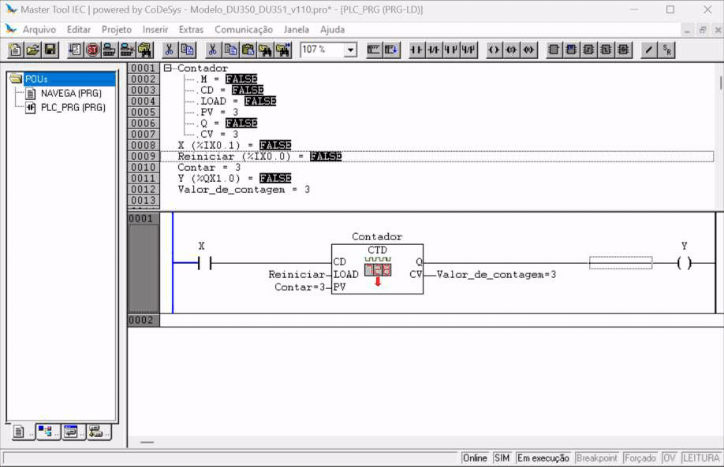
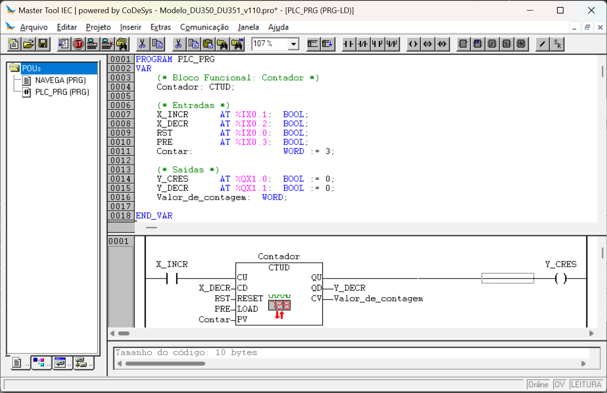

# Contadores


## *Counter UP* - CTU

Bloco funcional de contagem incremental e apresenta o seguinte formato:

``` Pascal
            CTU_instancia
              _________
             |   CTU   | 
            -|CU      Q|-
            -|RESET    |
            -|PV     CV|-
             |_________|
```

Sendo:

- `CU`: Entrada do tipo `Bool`. Incrementa a contagem ao detectar uma borda de subida;
- `RESET`: Entrada do tipo `Bool`. Quando estiver o valor `True`, ou seja, estiver acionada, inicializa o contador com o valor `0`;
- `PV`: Entrada do tipo `Word`. Valor limite superior de contagem;
- `Q`: Saída do tipo `Bool`. É acionada quando a contagem é igual ou superior ao valor de `PV`;
- `CV`: Saída do tipo `Word`. Valor de contagem. 


Para exemplificar o contador crescente, vamos declarar um `sensor` para servir de gatilho ao incremento, um `atuador` para ser acionado ao final da contagem e uma entrada `RST` para reiniciar o contatdor. 

`C1` é a instância do tipo `CTU`, ou seja, o objetivo ou a estrutura de memória que armazena todos os registradores envolvidos na contagem. Já a variável `C1cv` foi declarada para receber o valor de contagem. 

``` Pascal
VAR
    SENSOR  AT %IX0.1: BOOL;
    RST     AT %IX0.0: BOOL;
    ATUADOR AT %QX1.1: BOOL;


    C1: CTU;
    C1cv: WORD;
END_VAR
```

O bloco funcional de contagem pertence à biblioteca `standard.lib` e pode ser inserido em um programa em linguagem `LD (Ladder)` da seguinte forma:

- Inserindo um bloco funcional CTU: 
    - Inserir \( \rightarrow \) Bloco Funcional... (Ctrl+B)
    - Blocos funcionais padrão
    - `C:\ ... \STANDARD.LIB` \( \rightarrow \) Counter \( \rightarrow \) CTU(FB)


| Figura 1: Inserindo bloco funcional CTU       |
|:---------------------------------------------:|
|     |
| Fonte: Autor                                  |


**Programa em LD (Ladder)**


``` Pascal
                 C1
              _________
    SENSOR   |   CTU   |                          ATUADOR 
|----| |-----|CU      Q|----------------------------( )---|
        RST -|RESET    |
         10 -|PV     CV|- C1cv
             |_________|
```

**Programa ST (Structured Text)**

```Pascal
C1( CU := SENSOR, RESET := RST, PV := 10 );

T1et := C1.CV;
ATUADOR := C1.Q;
```


<!-- 
## 3. Contador Decrescente - *Counter DOWN*




## 4. Contador Crescente/Decrescente - *Counter UP/DOWN*




 -->
