# Blocos Funcionais

## Comparação

- EQ: *EQUAL* - IGUAL
- NE: *NOT EQUAL* - DIFERENTE
- LT - *LESS THAN* - MENOR QUE
- LE - *LESS OR EQUAL* - MENOR OU IGUAL
- GT - *GREATER THAN* - MAIOR QUE
- GE - *GREATER OR EQUAL* - MAIOR OU IGUAL

**Tipos de dados suportados para as comparações**

<!-- 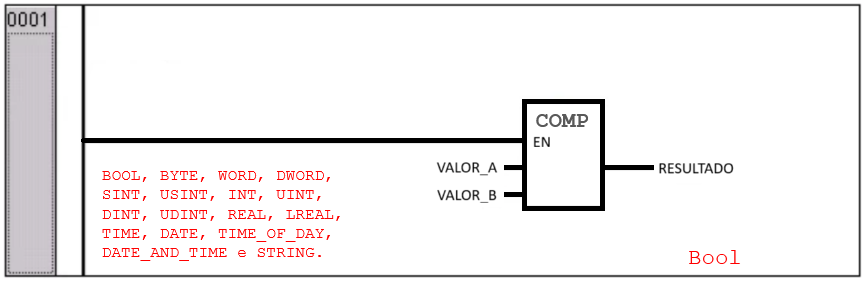 -->


```PASCAL
                         ________
                        |  COMP  |
|-----------------------|EN      |
                        |        |----- Resultado
            Valor_A ----|        |
            Valor_B ----|________|
```

Os blocos de comparação possuem três entradas e uma saída, sendo elas:

- EN: Entrada do tipo `bool`, que tem como função habilitar a comparação;
- Resultado: Saída do tipo `bool`, que expressa o resultado da operação de comparação entre as duas entradas `Valor_A` e `Valor_B`;
- Valor_A e Valor_B: Valores de comparação. Podem ser de vários tipos: BOOL, BYTE, WORD, DWORD, SINT, USINT, INT, UINT, DINT, UDINT, REAL, LREAL, TIME, DATE, TIME_OF_DAY, DATE_AND_TIME e STRING.

Podemos representar o comportamento do bloco COMP da seguinte forma: 

```
IF EN == True THEN
    Resultado = Valor_A COMP Valor_B
END_IF;
```
O bloco `COMP` representa uma das operações lógicas de comparação.


**1. Função EQ - *EQUAL* - IGUAL**

```PASCAL
                         ________
                        |   EQ   |
|-----------------------|EN      |
                        |        |----- Igual
            Valor_A ----|        |
            Valor_B ----|________|
```


<!-- 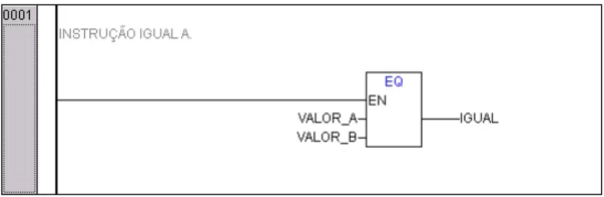 -->

**2. Função NE - *NOT EQUAL* - DIFERENTE**

```PASCAL
                         ________
                        |   NE   |
|-----------------------|EN      |
                        |        |----- Diferente
            Valor_A ----|        |
            Valor_B ----|________|
```

<!-- 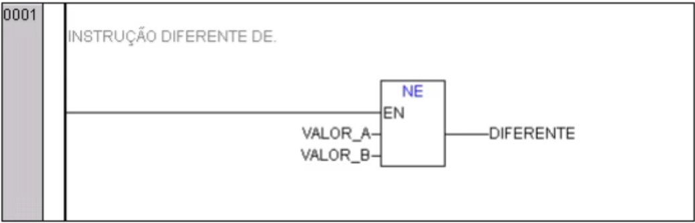 -->

**3. Função LT - *LESS THAN* - MENOR QUE**

```PASCAL
                         ________
                        |   LT   |
|-----------------------|EN      |
                        |        |----- Menor_Que
            Valor_A ----|        |
            Valor_B ----|________|
```

<!-- 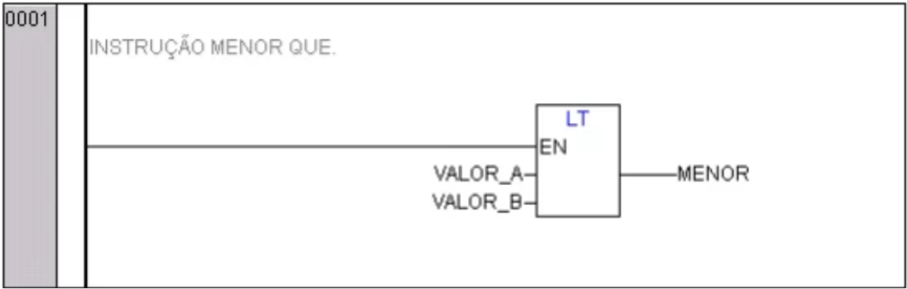 -->

**4. Função LE - *LESS OR EQUAL* - MENOR OU IGUAL**

```PASCAL
                         ________
                        |   EQ   |
|-----------------------|EN      |
                        |        |----- Menor_ou_Igual
            Valor_A ----|        |
            Valor_B ----|________|
```

<!-- 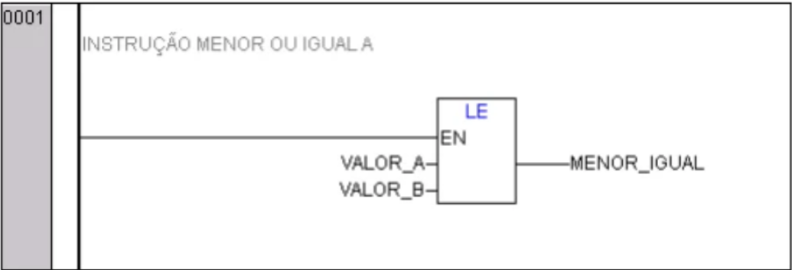 -->

**5. Função GT - *GREATER THAN* - MAIOR QUE**

```PASCAL
                         ________
                        |   GT   |
|-----------------------|EN      |
                        |        |----- Maior_Que
            Valor_A ----|        |
            Valor_B ----|________|
```

<!-- 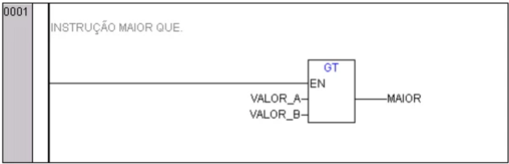 -->

**6. Função GE - *GREATER OR EQUAL* - MAIOR OU IGUAL**

```PASCAL
                         ________
                        |   GE   |
|-----------------------|EN      |
                        |        |----- Maior_ou_Igual
            Valor_A ----|        |
            Valor_B ----|________|
```

<!-- 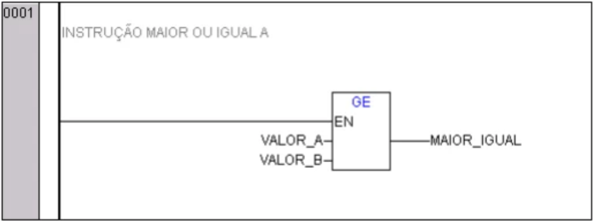 -->


---

## Aritméticos

- ADD: Adição
- SUB: Subtração
- ADD/SUB TIME: Adição e Subtração de tempo
- MUL: Multiplicação
- DIV: Divisão
- MOD: Módulo - Resto da Divisão


**Tipos de dados suportados para as operações aritméticas**

Os tipos de dados suportados pelas entradas `Valor_A` e `Valor_B` são:
BYTE, WORD, DWORD, SINT, USINT, INT, UINT, DINT, UDINT, REAL e LREAL;

```PASCAL
                         ________
                        |OPERACAO|
|-----------------------|EN      |
                        |        |----- Resultado
            Valor_A ----|        |
            Valor_B ----|________|
```

As entradas `Valor_A` e `Valor_B` devem ser do mesmo tipo, que é o tipo do `Resultado`.


O bloco `OPERACAO` representa uma das operações aritméticas. 

<!-- 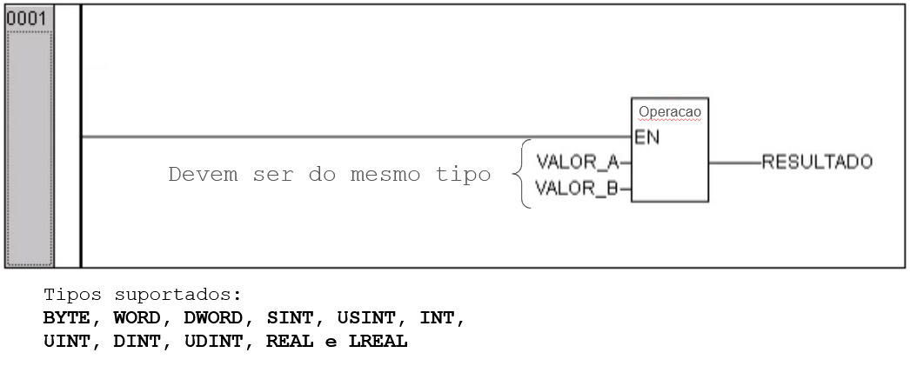 -->

**1. Função ADD - Adição**

```PASCAL
                         _________
                        |   ADD   |
|-----------------------|EN       |
                        |         |----- SOMA
            Valor_A ----|         |
            Valor_B ----|_________|
```
<!-- 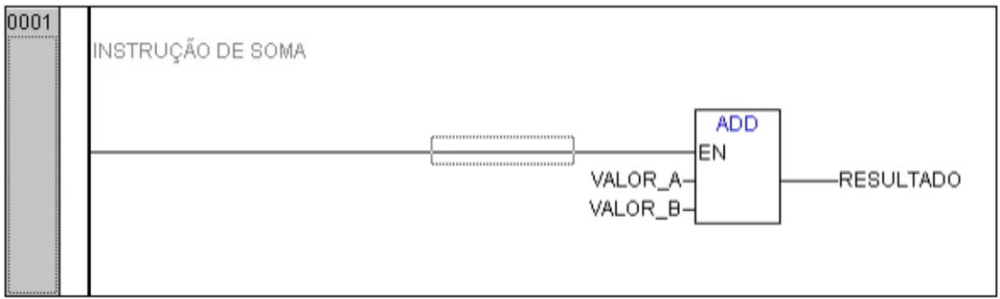 -->

**2. Função SUB - Subtração**

```PASCAL
                         _________
                        |   SUB   |
|-----------------------|EN       |
                        |         |----- SUBTRACAO
            Valor_A ----|         |
            Valor_B ----|_________|
```

<!-- 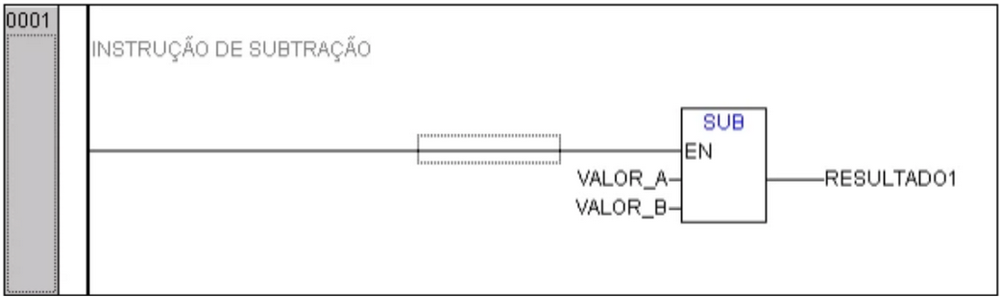 -->

**3. Função ADD/SUB TIME - Adição e Subtração de tempo**

```PASCAL
                         _________
                        | ADD/SUB |
|-----------------------|EN       |
                        |         |----- ADD_SUB_TIME
            Valor_A ----|         |
            Valor_B ----|_________|
```

O tipo de dado aqui suportado é apenas o tipo `TIME`.

Ex: T#45s + T#50s = T#1m35s
<!--  -->

**4. Função MUL - Multiplicação**

```PASCAL
                         _________
                        |   MUL   |
|-----------------------|EN       |
                        |         |----- MULTIPLICACAO
            Valor_A ----|         |
            Valor_B ----|_________|
```

<!-- 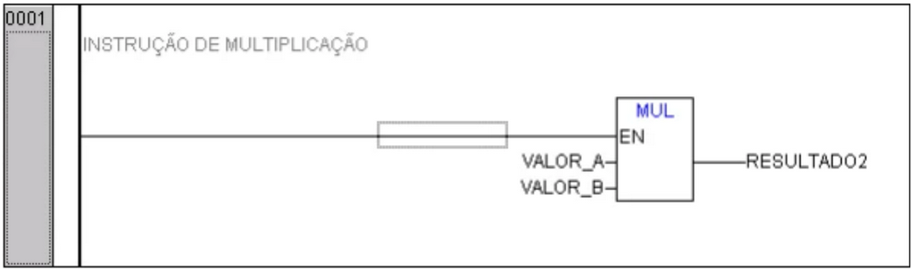 -->

**5. Função DIV - Divisão**

```PASCAL
                         _________
                        |   DIV   |
|-----------------------|EN       |
                        |         |----- DIVISAO
            Valor_A ----|         |
            Valor_B ----|_________|
```

Funções `DIV` com os seguintes nomes:
`CheckDivByte`, `CheckDivWord`, `CheckDivDWord` e `CheckDivReal` realizam o teste no divisor para evitar divisão por zero.
<!--  -->

**6. Função MOD - Módulo - Resto da Divisão**

```PASCAL
                         _________
                        |   MOD   |
|-----------------------|EN       |
                        |         |----- RESTO
            Valor_A ----|         |
            Valor_B ----|_________|
```

<!-- 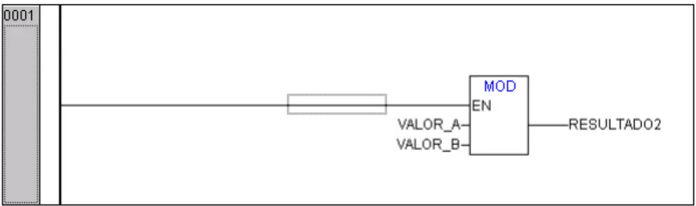 -->


---


<!--  -->


---


## Seleção

- MOVE: Mover
- MIN: Menor valor
- MAX: Maior valor
- LIMIT: Limitadores
- SEL: Seleção
- MUX: Multiplexação

<!--  -->

**1. Função MOVE - Mover**

<!-- 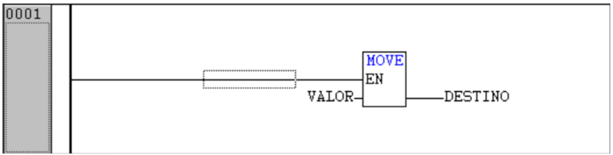 -->

```PASCAL
                         ________
                        |  MOVE  |
|-----------------------|EN      |
                        |        |----- DESTINO
              VALOR ----|        |
                        |________|
```


**2. Função MIN - Menor valor**

<!--  -->

```PASCAL
                         ________
                        |   MIN  |
|-----------------------|EN      |
                        |        |----- MENOR_VALOR
            VALOR_A ----|        |
            VALOR_B ----|________|
```

**3. Função MAX - Maior valor**

<!--  -->
```PASCAL
                         ________
                        |   MAX  |
|-----------------------|EN      |
                        |        |----- MAIOR_VALOR
            VALOR_A ----|        |
            VALOR_B ----|________|
```

**4. Função LIMIT - Limitadores**

<!-- 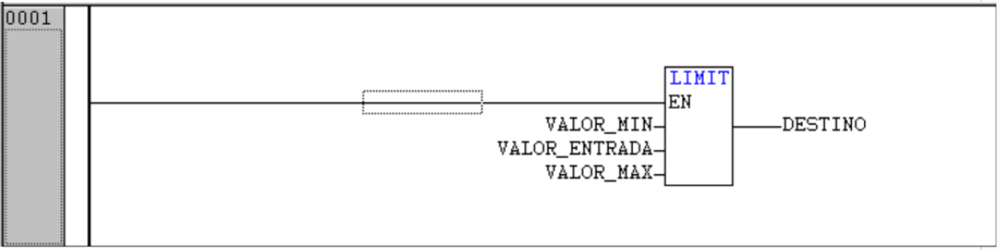 -->
```PASCAL
                         _________
                        |  LIMIT  |
|-----------------------|EN       |
            VALOR_MIN --|         |
     VALOR_DE_ENTRADA --|         |----- VALOR_LIMITADO
            VALOR_MAX --|_________|
```


**5. Função SEL - Seleção**

<!-- 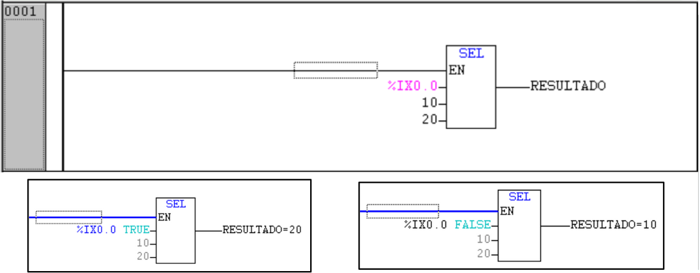 -->
```PASCAL
                         _________
                        |   SEL   |
|-----------------------|EN       |
              SELECAO --|         |
            ENTRADA_0 --|         |----- VALOR_SELECIONADO
            ENTRADA_1 --|_________|
```


**6. Função MUX - Multiplexação**

<!-- 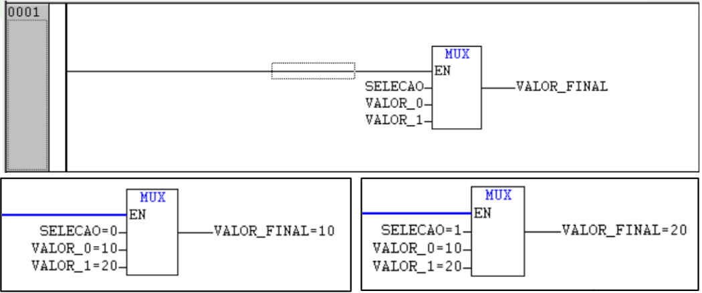 -->

```PASCAL
                         _________
                        |   MUX   |
|-----------------------|EN       |
              SELECAO --|         |
            ENTRADA_0 --|         |----- VALOR_MULTIPLEXADO
            ENTRADA_1 --|_________|
```


---

## Inserir Bloco Funcional

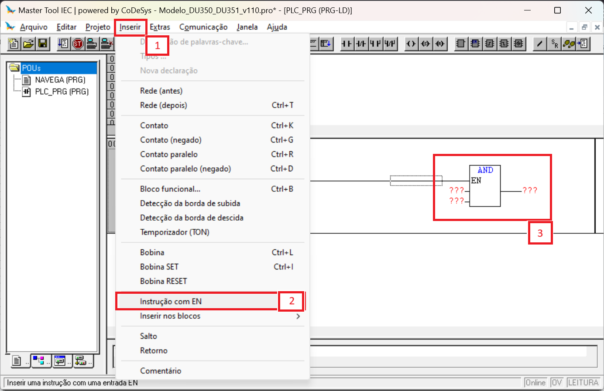

---
