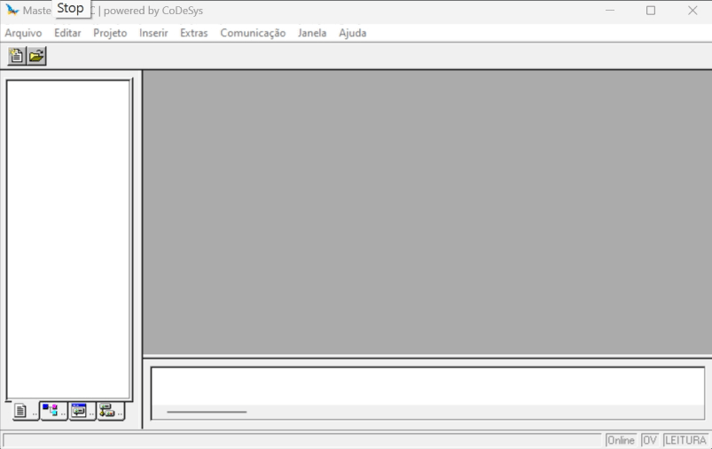
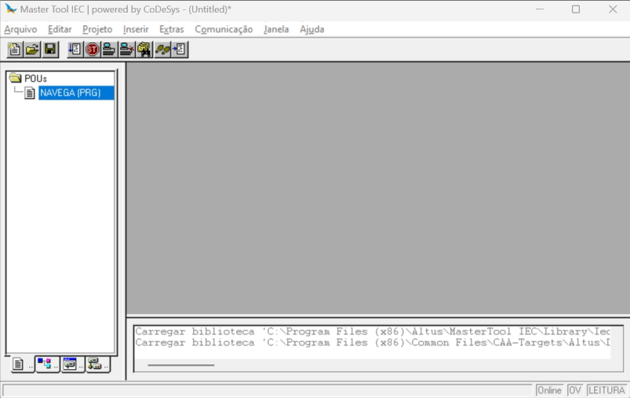
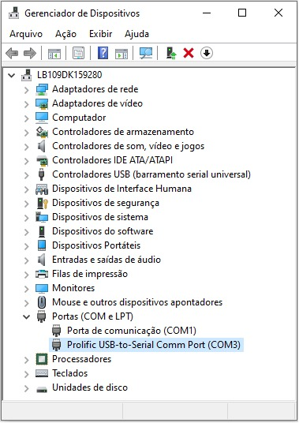
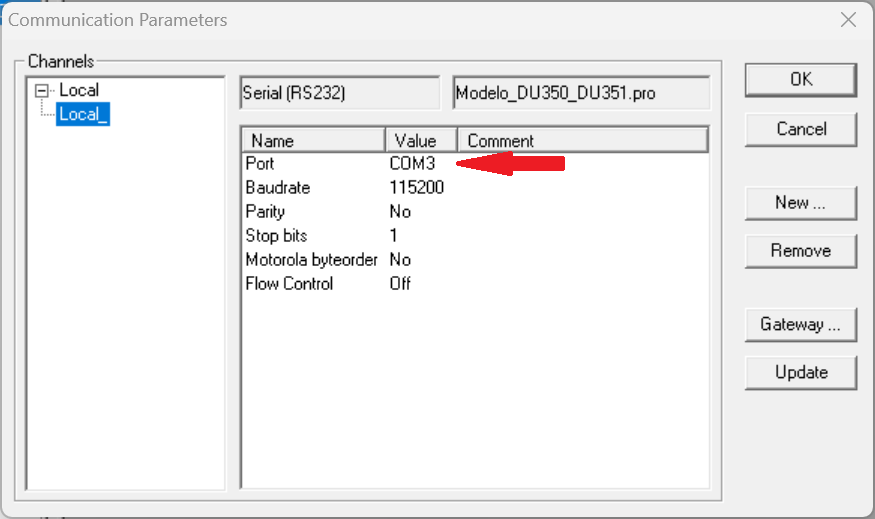

# Criando um novo projeto

## 1. Criando um novo projeto a partir de um modelo: 




## 2. Verificando arquivo `NAVEGA (PRG)`:


``` Pascal
PROGRAM NAVEGA
VAR
	ControleTelas : NAVIGATION;
	ListaTelas 	: ARRAY [0..30] OF STRING(10);
END_VAR
```

``` Pascal
(* Adiciona a tela MAIN como tela principal *)
ListaTelas[0] := 'MAIN';

(* Ativa o controle automático de navegação somente pelo teclado *)
ControleTelas(ENABLE_UPDW := FALSE, VISU_LIST := ListaTelas, UP := FALSE , DOWN := FALSE);
```


## 3. Acrescentando um objeto do tipo `Programa` em linguagem `Ladder`: 




## 4. Testando comunicação com PLC:

4.1 Conecte o PLC ao computador;

4.2 Abra o gerenciador de dispositivos e verifique qual porta foi alocada para a comunicação com o PLC:



4.3 Clique em `Comunicação` -> `Parâmetros de comunicação ...`



	* Para ajustar a porta clique duplo sobre a `COM n` e use as setas para cima e para baixo para ajustar a porta correta, neste caso a `COM3`;
	* Clique em `OK`.


## 5. Testando o processo de gravação:


