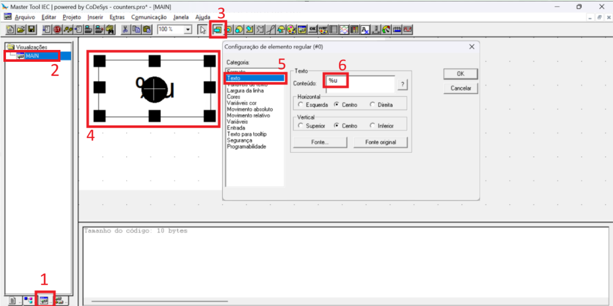
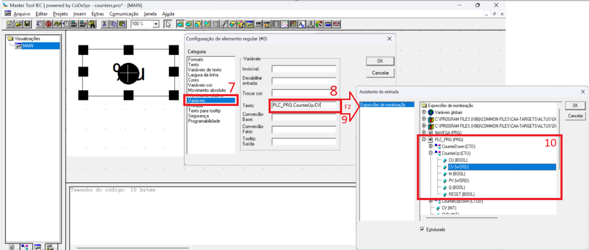

# 

# Display Variável

## 1. Configuração de formato de exibição

1) Selecione a aba `Visualizações`;

2) Duplo clique na visualização `MAIN`;

3) Selecione a ferramenta de desenho `retângulo`;

4) Desenhe um retângulo e aplique um duplo clique sobre ele, abrindo a janela `Configuração de elemento regular`;

5) Selecione a categoria: `Texto`;

6) Insira `%u` para a exibição da variável no formato inteiro.

	* Para informações de formatos possíveis, clique no botão `?` ao lado da janela de `Conteúdo`.

## 2. Link de exibição com variável

7) Selecione a categoria: `Variáveis`;

8) Um clique simples no campo `Texto` da seção `Variáveis`;

9) Pressione a tecla `F2` para abrir o `Assistente de entrada`;

10) Selecione a variável que se quer exibir, seja ela global ou do seu projeto.

11) Clique em `OK` e novamente em `OK`.

12) Clique em `Projetos` e `Compilar Tudo`;

13) Estando tudo certo `0 Erros` faça o *Download* e execute a aplicação.
