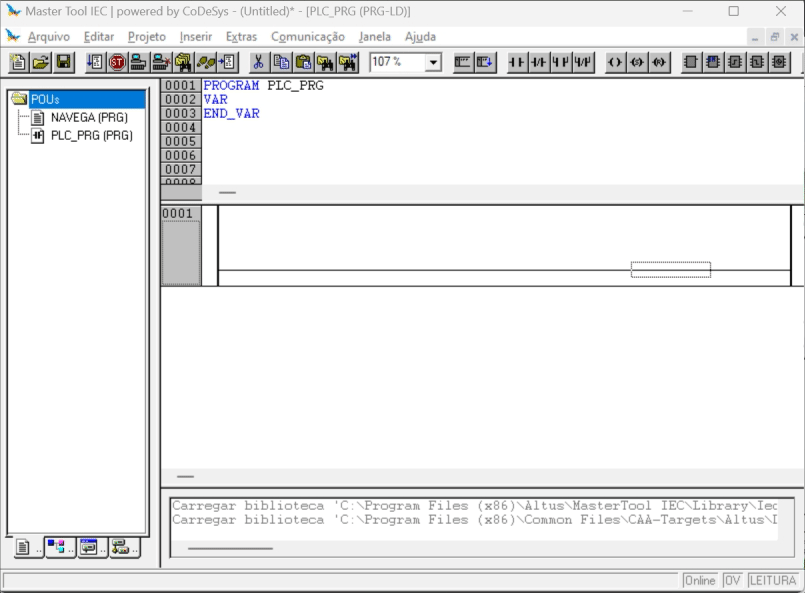
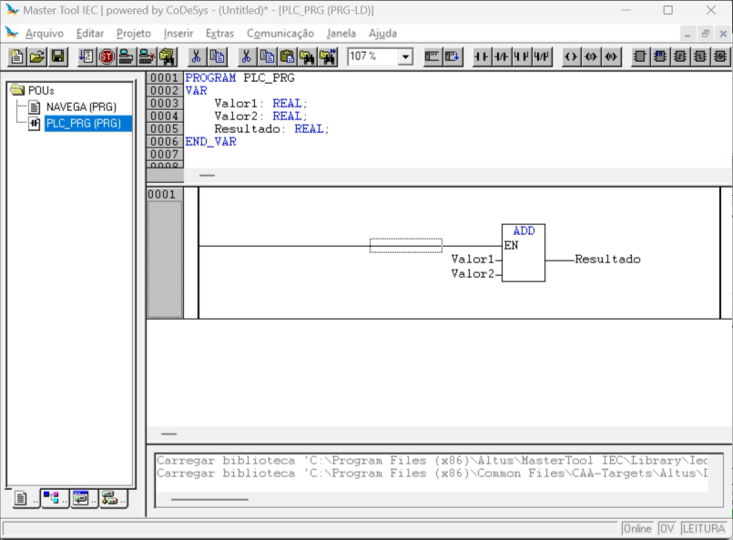
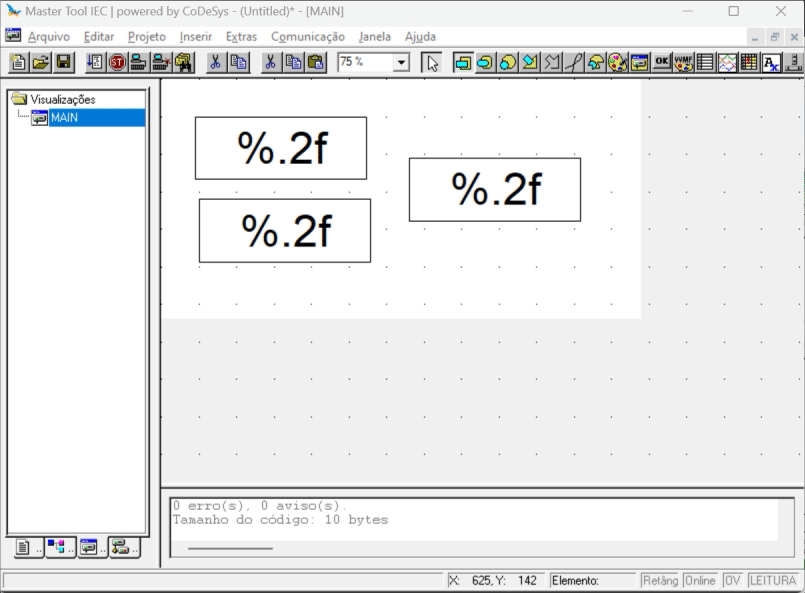

# 

# Edição de Variáveis através da IHM

## 1. Criando programa de exemplo: Adição de dois valores editáveis.

## 2. Construção de tela e atribução de variáveis

## 3. Simulação de bloco de adição

