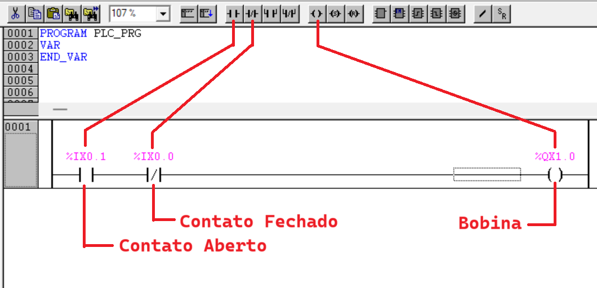
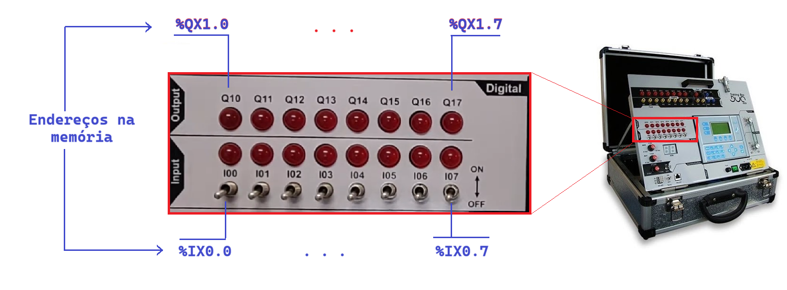

# Contatos e Bobinas

Os elementos básicos na programação em linguagem **Ladder** são os **contatos** e as **bobinas**. 

Um **contato** é uma representação do **estado lógico** de uma das **entradas**. 

Os contatos mais comuns são: aberto e fechado, em sua condição normal.

Na condição em que não há estímulo da entrada, o contato respectivo permanece na condição normal, mas quando a entrada é estimulada, ou seja, é aplicada uma tensão proveniente do fechamento de uma chave, fim-de-curso ou sensor, o cotato muda de estado: o contato aberto fecha e o fechado abre, indicando uma mudança de estado da entrada física. 

Uma **bobina** é uma representação do **estado lógico** de uma das **saídas**. Da mesma forma que nas entradas, porém, a saída física que é acionada ou não dependendo do estado lógico da bobina, no programa. 




**1. Endereçamento das entradas e saídas digitais**

Todas as entradas e saídas são mapeadas em regiões de memória. Assim para fazer a lógica em um programa, basta acessar o endereço correspondente à entrada que se quer ler e associá-la a um contato, que passa a representar o estado lógico da entrada física. 



No kit de treinamento TB131 há a seguinte relação das entradas e saídas com os respectivos endereços de memória:

| TB131 <BR> Entradas| Memória |   | TB131 <br> Saídas | Memória |
|:-----:|:-------:|---|:-----:|:-------:|
|  I00  |  %IX0.0 |   |  Q10  |  %QX1.0 |
|  I01  |  %IX0.1 |   |  Q11  |  %QX1.1 |
|  I02  |  %IX0.2 |   |  Q12  |  %QX1.2 |
|  I03  |  %IX0.3 |   |  Q13  |  %QX1.3 |
|  I04  |  %IX0.4 |   |  Q14  |  %QX1.4 |
|  I05  |  %IX0.5 |   |  Q15  |  %QX1.5 |
|  I06  |  %IX0.6 |   |  Q16  |  %QX1.6 |
|  I07  |  %IX0.7 |   |  Q17  |  %QX1.7 |


Assim, para a primeira entrada acinoar a primeira saída com lógica direta, basta realizar a seguinte ligação: 

```ld
   %IX0.0                     %QX1.0
|----| |------------------------( )----|
```

Ou ainda, pode-se utilizar a declaração das variáveis já existente para o equipamento, em que os endereços das variáveis estão associados com os respectivos nomes de marcação na parte física do equipamento. Então, o mesmo código pode ser declarado da seguinte forma:

```ld
     I00                        Q10
|----| |------------------------( )----|
```

