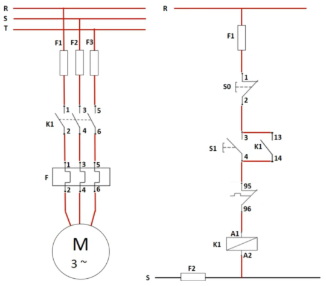
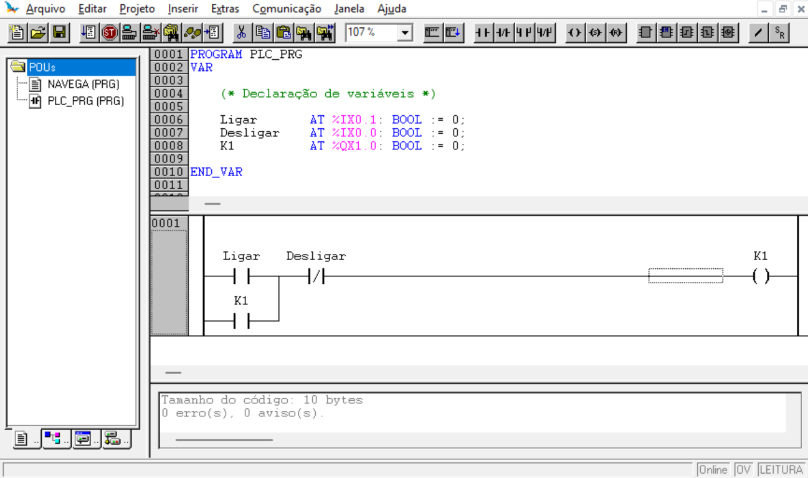
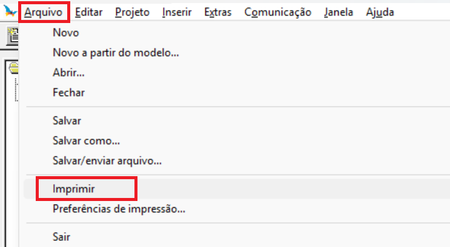
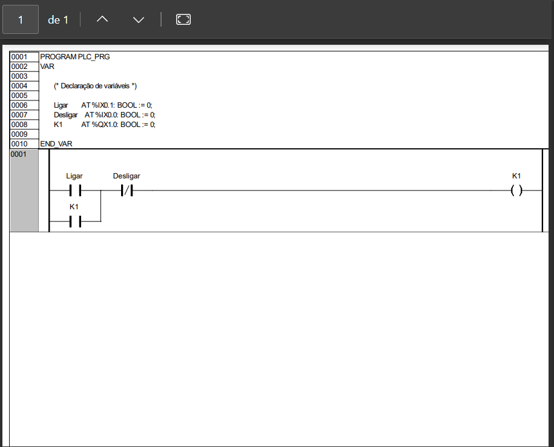

# Partida Direta de Motor

A partida direta de um motor é um dos circuitos de acionamento mais comuns na indústria, e ótimo para iniciar o aprendizado conhecendo os elementos dessa tecnolgia, já que sua lógica de acionamento é bem simples. 

A Figura 1 ilustra os diagramas de potência e de comandos, responsáveis pela alimentação trifásica do motor com o seu acionamento utilizando botoeiras.

| Figura 1: Diagrama de Potência e Comando de uma partida direta de motor |
|:------------------------------------------------:|
|   |
| Fonte: [PARTIDA DIRETA DE MOTORES - COMO LIGAR? - Ômega Treinamentos](https://youtu.be/V2DbwDzUdlQ?si=F2xr17v3h1VSgnTC) |

Explicação detalhada sobre o acionamento não faz parte do escopo deste material, sendo assim, seguem indicações:

1. [Sala da Elétrica](https://www.saladaeletrica.com.br/partida-direta-de-motor-trifasico/)
2. [PARTIDA DIRETA DE MOTORES - COMO LIGAR? - Ômega Treinamentos](https://youtu.be/V2DbwDzUdlQ?si=-oEMoCHHalq4K1QM&t=1)

| Vídeo 1: Animação de ligações em um comando de partida direta de motor |
|:-----:|
| <iframe width="560" height="315" src="https://www.youtube.com/embed/_97EQvxI12A?si=R9dSME2s-DAB5Cxm" title="YouTube video player" frameborder="0" allow="accelerometer; autoplay; clipboard-write; encrypted-media; gyroscope; picture-in-picture; web-share" referrerpolicy="strict-origin-when-cross-origin" allowfullscreen></iframe> |
| Fonte: [Comando Elétrico Super Fácil (Partida Direta) - Marcos Instalação Elétrica](https://youtu.be/_97EQvxI12A?si=6ZC8aJwrHlz5k8Ck)|

---

# Objetivo
Desenvolver uma aplicação, programa, 
para realizar uma partida direta de motor trifásico.

---

**Requisitos da solução**

* Componentes de interface
    * Botoeira ligar: S1;
    * Botoeira desligar: S0;
    * Contator de acionamento: K1;
 * Comportamento
    * Ao pressionar S1
	    * Ligar K1;
	* Ao pressionar S0, em qualquer momento:
		* Desligar K1.

---

**Planejamento do produto final**

* Apresentação de funcionamento em kit didático
* Arquivo .pdf contendo:
	* declaração de interface física, entradas e saídas com respectivos endereços;
	* programa em linguagem `Ladder`, `ST` ou `SFC(Grafcet)` contendo comportamento para a partida proposta.

**Ferramentas**

1. Software Master Tool IEC
2. Kit didático: TB131 Altus

**Materiais**

* Não há!

---

**Planejamento do processo**

- Abrir projeto a partir do modelo: `Modelo_DU350_DU351_v110.pro`
- Acrescentar objeto POU do tipo Programa em linguagem Ladder ou ST ou SFC
- Declarar entradas e saídas físicas (Mapa de Entradas e Saídas)
- Programar a lógica de funcionamento
- Testar comportamento

---

# Solução

**Mapa de Entradas e Saídas**

| Função  | Identificador | Descrição                 | Tipo |Endereço |
|:-------:|:-------------:|:-------------------------:|:----:|:-------:|
| Entrada | Ligar         | Ligar motor               | Bool |%IX0.1   |
| Entrada | Desligar      | Desligar motor            | Bool |%IX0.0   |
| Saída   | K1            | Contator que aciona motor | Bool |%QX1.0   |

**Programa em Linguagem Ladder**

Para imprimir o projeto, basta clicar em `Arquivo` e `Imprimir` e realizar a impressão em arquivo .pdf. 

**Impressão**

Caso haja necessidade, realize ajustes na folha de impressão. Cada software possui ajustes próprios. 

---
