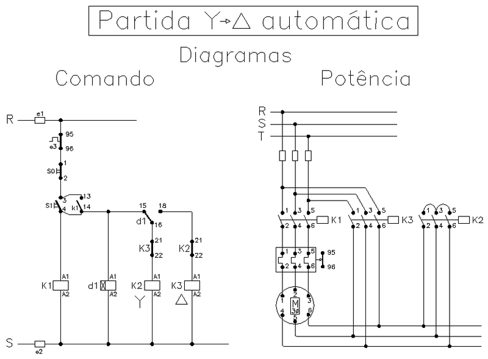

# Partida Estrela-Triângulo

---

**1. Objetivo**

Desenvolver uma aplicação, programa, 
para um dispositivo de comando para partida Estrela-Triângulo.

| Figura 1: Diagramas de comando e potência da partida Estrela-Triângulo |
|:-------------------:|
|  |
|Fonte: [Wikipedia](https://pt.wikipedia.org/wiki/Partida_estrela-tri%C3%A2ngulo) |

---

**2. - Requisitos da solução**

* Comportamento
    * Ao pressionar S1
	    * Ligar K1, K2 (fechamento estrela);
        * Temporizar 5 segundos
        * Desligar K2 e ligar K3 (fechamento triângulo).
	* Ao pressionar S0, em qualquer momento:
		* Desligar todos os contatores.

---

**3.1 Planejamento: Produto final**

* Apresentação de funcionamento em kit didático
* Arquivo .pdf contendo:
	* declaração de interface física, entradas e saídas com respectivos endereços;
	* declaração de bloco funcional contendo interface e comportamento para a partida proposta.

**3.2 Planejamento: Ferramentas**

1. Software Master Tool IEC
2. Kit didático: TB131 Altus

**3.3 Planejamento: Materiais**

* Não há!

**4.4 Planejamento: Processo**

  1. Abrir projeto a partir do modelo: `Modelo_DU350_DU351_v110.pro`;
  2. Acrescentar objeto POU do tipo Programa e escolher a linguagem;
  3. Produzir mapa de entradas e saídas;
  4. Declarar entradas e saídas físicas;
  5. Programar;
  6. Testar aplicação;
  7. Entregar funcionamento.

---

**4. Solução**

Produto ou processo que atinge o objetivo proposto, 
através da execução de seu planejamento e satisfação dos seus requisitos.

---

Bom Trabalho!
