#

**[Contexto Histórico](../slides/aula01-contexto_historico.pdf)**

---

- O problema da indústria;
- O desafio da General Motors - 1968;
- Modular Digital Controller (MODICON 084);
- Ler-Decidir-Acionar;
- Definições (ABNT, NEMA e IEC);
- Tipos de CLPs (Compactos e Modulares);
- Fabricantes;
- Norma IEC 61131-3;

---

**Contexto**

O final da década de 60 proporcionaram para o desenvolvimento tecnológico industrial um marco de extrema importância para o grande desenvolvimento da automação no chão de fábrica, o nascimento do primeiro controlador programável.

A General Motors, já uma grande montadora de veículos automotores, lançou um desafio técnico, que refletia um grande inconveniente para a produção, que precisava ser expandida, mas que possuia um gargalo tecnológico no *setup* da linha de produção.

| Figura 1: General Motors - Linha de montagem |
|:--------------------------------------------:|
| 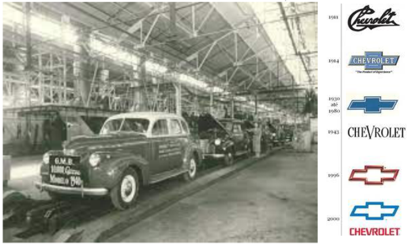          |

Para a alteração de um modelo de fabricação na linha de montagem, era necessário redesenhar todo o processo, remontando os paineis de acionamento e dispositivos, devido a alteração da lógica de acionamento, que era completamente realizada por circuitos a rele.

| Figura 2: Paineis montados com lógica de contatos - Reles |
|:---------------------------------------------------------:|
| 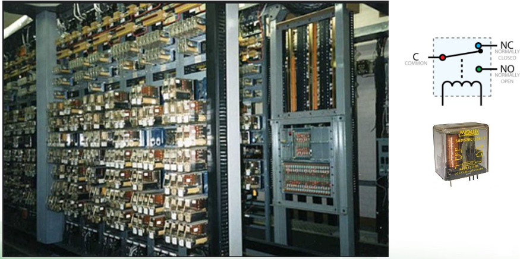                 |

Todo este processo demandava muito tempo, o que impedia a produção de ser executada em toda troca de modelo de produção, implicando em altos gastos de tempo e dinheiro.

Assim, a Hydronic Division da GM, em 1968, propôs que gostaria de um dispositivo com as seguintes características:

1. Facilidade de programação e reprogramação, linguagem de contatos;
2. Possibilidade de manutenção e reparo, blocos de entradas e saídas modulares;
3. Confiabilidade, para ser utilizado em ambiente industrial;
4. Redução de tamanho;
5. Custo competitivo.

No ano seguinte, a *Bedford Associate* cumpriu o desafio com o seu **Modular Digital Controller (MODICON 084)**, projeto este liderado pelo engenheiro Richard E. Morley (01/12/1932 –17/10/2017), entrando para a história pelo desenvolvimento de um dos mais importantes equipamentos tecnológicos da todos os tempos, revolucionando a indústria e impulsionando de forma inédita a automação industrial.

| Figura 3: Modular Digital Controller - MODICON 084 |
|:--------------------------------------------------:|
| 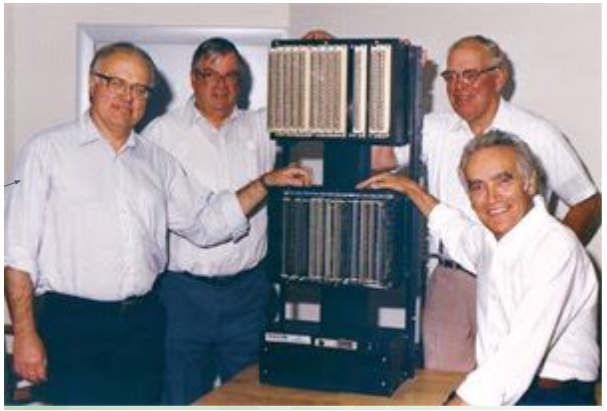              |

**O Controlador Digital e Modular**

O objetivo do MODICON 084 e de sua linhagem, até os dias atuais é, **controlar** máquinas ou processos por meio da **leitura** de sinais de entrada (como chaves ou sensores) e **decidir**, por meio de instruções pré-programadas, as ações a serem realizadas no **acionamento** de contatores, válvulas, motores e demais cargas.

| Figura 4: Controlador Digital e Modular            |
|:--------------------------------------------------:|
| 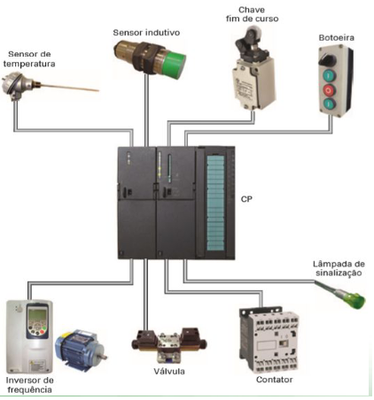           |

Desta forma, é possível substituir todo o volume de reles responsáveis por realizar as lógicas de acionamento de forma física, por operações lógicas processadas pelo controlador, sobrando apenas a interface simples entre os dispositivos de entrada de dados, inicialmente, de lógica booleana, como sensores, chaves, fins de curso, e dispositivos de saída, como contatores, válvulas e sinaleiros.

| Figura 5: Diagrama elétrico de comando e com o controlador digital modular |
|:--------------------------------------------------:|
| 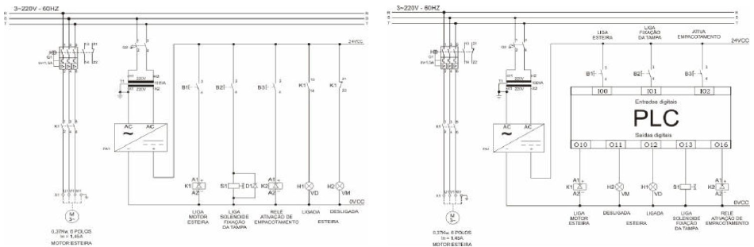                     |

Assim, para mudanças lógicas, no comportamento de um equipamento ou sistema sem mudar sua interface, não é necessário remontar todo o painel de comandos, apenas alterar o programa que está na memória do controlador que o comportamento do sistema muda.

**A Norma**

Existem várias definições para o **Controlador Lógico Programável (CLP)**, que convergem, mas com graus de profundidades diferentes, entre Associação Brasileira de Normas Técnicas (ABNT), *National Electrical Manufacturers Association* (NEMA) e a *International Electrotechnical Commission* (IEC). Apresento aqui a definição desta última:

> “**Sistema eletrônico** operando **digitalmente**, projetado para uso em um **ambiente industrial**, que usa uma **memória programável** para a armazenagem interna de instruções orientadas para o usuário para implementar **funções específicas**, tais como lógica, sequencial, temporização, contagem e aritmética, para controlar, através de entradas e saídas digitais ou analógicas, vários tipos de máquinas ou processos. O controlador programável e seus periféricos associados são projetados para serem **facilmente integráveis** em um sistema de **controle industrial** e **facilmente usados em todas suas funções previstas**.”

**Tipos de CLP**

Aqui são destacadas algumas classificações de CLPs, lembrando que podem haver divergências quanto aos conceitos dos tipos.

|                           | Figura 6: Tipos de CLP |
|:-----------------------------------------------|:--------------------------------------------|
| Compacto | Modular |
|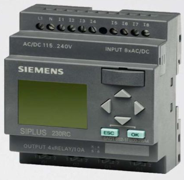 |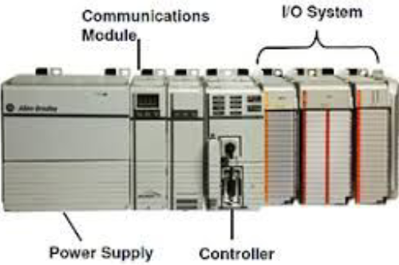 |

**Compacto**

Normalmente é composto por um só módulo digital com baixa capacidade de entradas e saídas, no máximo 16 de cada, de modo que possua baixo custo, e por consequencia uma reduzida capacidade de memória, em torno de 512 passos, comparado com outros dispositivos;

Tais características permitem que se aplique este tipo de dispositivo em diversas pequanas automações em que seria inviável economicamente o uso de um equipamento convencional para uso exclusivo industrial.

Entre as principais aplicações, destacam-se:

- Sistemas de iluminação;
- Comandos de portas e cancelas;
- Sistemas de energia;
- Sistemas de refrigeração e ar condicionado;
- Sistemas de ventilação;
- Sistemas de transporte;
- Controle de silos e elevadores;
- Comando de bombas e compressores;
- Sistemas de alarme;
- Comando de semáforos;
- Sistemas de irrigação;

**Modulares**

A principal característica, que nomeia a classificação é que foi uma exigência de concepção e a sua montagem de forma modular, separando cada bloco do circuito de modo a permitir a fácil substituição ou agregação de novos blocos com novas funcionalidades.

Os principais módulos que formam o CLP são:

- Fonte de alimentação;
- CPU Principal;
- CPUs Auxiliares;
- CPUs Dedicadas;
- E/S Digitais e Analógicas;
- E/S Especializados;
- Módulos de Rede Local ou Remota.

| Figura 7: Diversos modelos de CLP |
|:---------------------------------:|
| 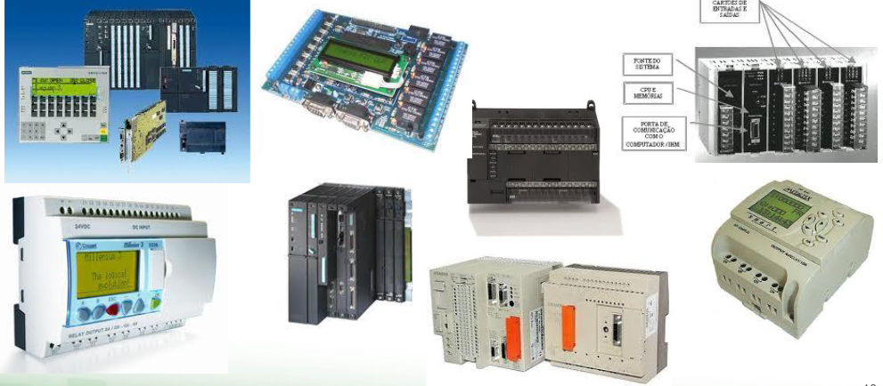   |

**Fabricantes e o Mercado**

**CLP** é marca registrada da Rockwell Automation, assim é comum, mesmo em português, o uso da sigla PLC de *Programmable Logic Controller* ou de forma mais genérica a denominação *Controlador Programável*.

| Figura 8: Principais fabricantes de CLP |
|:---------------------------------------:|
| 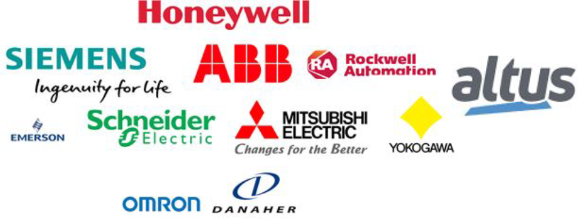 |

| Figura 9: Mercado de CLP        |
|:-------------------------------:|
| 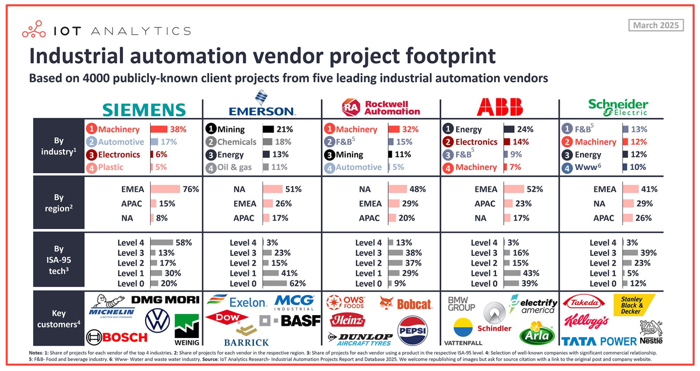 |
| Fonte: [Where Siemens, Emerson, Rockwell Automation, ABB, and Schneider Electric place emphasis - Carlos Unda - LinkedIn](https://www.linkedin.com/feed/?highlightedUpdateType=SHARED_BY_YOUR_NETWORK&highlightedUpdateUrn=urn%3Ali%3Aactivity%3A7308106145716461569)|

**IEC-61131**

Para que equipamentos industriais de automação sejam **facilmente integráveis** como pressupõe a norma, foram criados grupos de trabalho da IEC para avaliar e padronizar o projeto de CLPs em vários aspectos, tais como:

- Hardware;
- Forma de instalação;
- Procedimento de testes;
- Documentação;
- Formas de programação e comunicação.

Assim foi desenvolvida a norma IEC 61131 e suas várias seções:

- IEC 61131-1: Informações gerais. Nomenclaturas e conceitos.
- IEC 61131-2: Requisitos de Equipamentos e Testes. Parte eletrônica e mecânica;
- **IEC 61131-3: Linguagens de Programação. Linguagens e forma de execução de programas;**
- IEC 61131-4: Diretrizes de usuário. Instalação, manutenção etc;
- IEC 61131-5: Comunicação. Funções de comunicações com outros equipamentos;
- IEC 61131-6: Reservada;
- IEC 61131-7: Reservada para Lógica Fuzzy (Ferramenta Computacional);
- IEC 61131-8: Orientações para as formas de simplementação das linguagens de programação.

| Figura 10: Linguagens definidas pela Norma IEC 61131-3 |
|:------------------------------------------------------:|
| 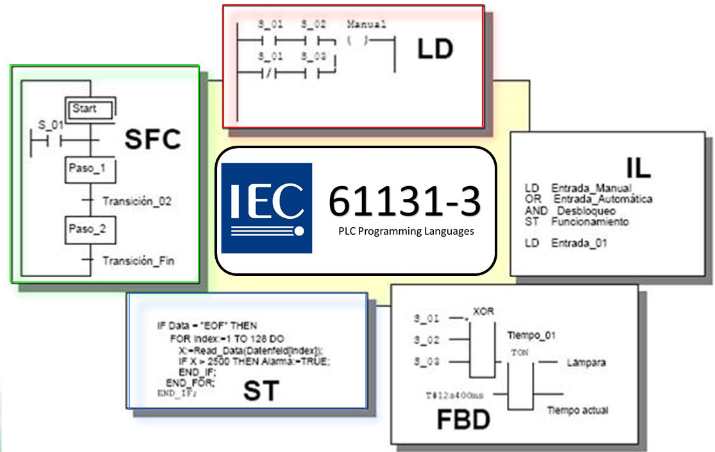                  |

---

**Material Complementar**

---

1. [Modicon: 50 anos de Pioneirismo e Inovações - Blog Schneider Electric](https://blog.se.com/br/automacao-industrial/2018/11/30/modicon-50-anos-de-pioneirismo-e-inovacoes/)
2. [A história dos controladores programáveis - Altus](https://www.altus.com.br/post/505/a-historia-do-controlador-programavel)
3. [Curiosidades sobre os CLPs ou PLC - O Professor Leandro](https://oprofessorleandro.wordpress.com/tag/modicon/)
4. [The Modicon 084 PLC Literally Changed the World - Kalil4.0](https://youtu.be/FPhPDF8v6AA?si=Gjuso6V5BH2-OWYc)
5. [Who is the Father of the PLC ? - RealPairs](https://youtu.be/4BxOizho1UE?si=6nlc-9I1SwYyh8mE)
6. [Programable Logic Controller Basics Explained - automation engineering - The Engineering Mindset](https://youtu.be/uOtdWHMKhnw?si=geIVApkCKgSr-l6P)

---
