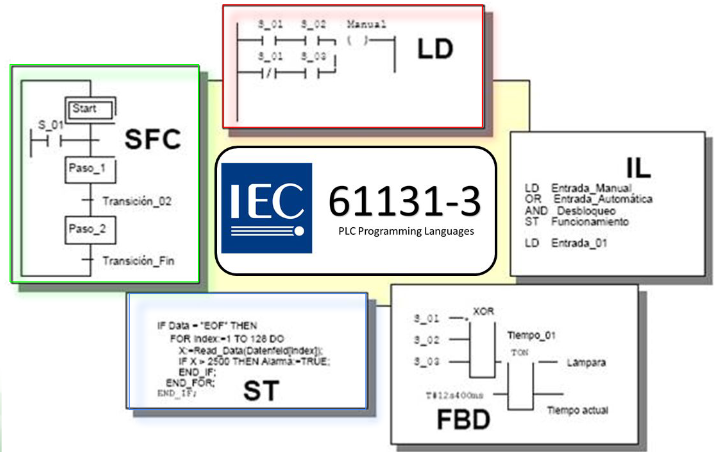
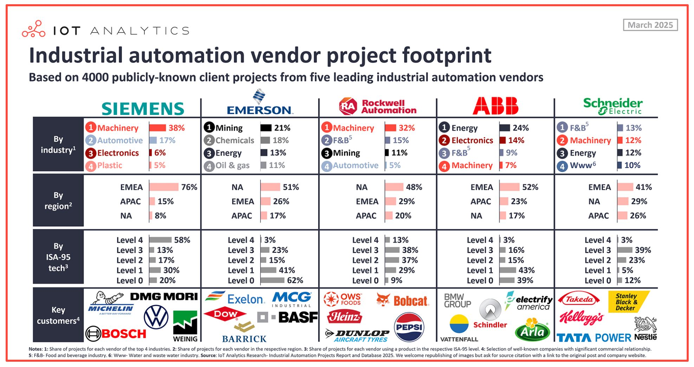

# [Controladores Lógicos Programáveis](../../../slides/CLP01-Fundamentos.pdf)

Os **Controladores Lógicos Programáveis (CLPs)** são definidos como computadores industriais projetados para controlar máquinas e processos, tendo evoluído originalmente como substitutos para sistemas de controle baseados em relés. Diferente de um computador pessoal, o CLP é construído para operar em ambientes industriais severos, suportando variações de temperatura, umidade e ruídos elétricos.

# 1. Arquitetura e Componentes de Hardware
Um sistema de CLP padrão consiste em quatro partes essenciais:

*   **Unidade Central de Processamento (CPU):** Composto por um microprocessador que executa a lógica do programa, gerencia a memória e controla a comunicação entre os módulos.

*   **Seção de Entrada/Saída (E/S):** Forma a interface com os dispositivos de campo. As entradas recebem sinais de sensores e botões, enquanto as saídas acionam atuadores como motores e válvulas. Existem dois tipos principais de configurações: 
    * **fixas**: típicas de CLPs pequenos, onde CPU e E/S estão no mesmo gabinete; 
    * **modulares**:que utilizam um rack ou chassi para conectar diversos módulos.

*   **Fonte de Alimentação:** Fornece a tensão e corrente contínua (CC) necessária para o funcionamento interno dos módulos do CLP.

*   **Dispositivo de Programação:** Geralmente um computador pessoal (PC) com software específico, utilizado para redigir a lógica e transferi-la para a memória do processador.

# 2. Princípio de Funcionamento (Ciclo de Varredura)
O CLP opera como um sistema de tempo real através de um processo repetitivo chamado **varredura ou scan**. Este ciclo consiste em três etapas principais:

1.  **Leitura das Entradas:** O processador examina o estado (ligado/desligado ou valor analógico) de cada dispositivo de entrada e grava esses dados em sua memória.

2.  **Execução do Programa:** A CPU executa as instruções da lógica ladder, degrau por degrau, utilizando os estados das entradas armazenados.

3.  **Atualização das Saídas:** Com base nos resultados da lógica, o processador atualiza os dispositivos de saída físicos.

# 3. Fundamentos de Programação e Linguagem Ladder
 
A linguagem de programação mais popular para CLPs é a **Ladder (LD)**, que utiliza símbolos gráficos semelhantes aos diagramas de contatos elétricos, porém existem outras linguagens de programação para CLP, como Structured Text (ST), Instruction List (IL), Function Block Diagram (FBD), e Sequential Function Chart (SFC), que foram padronizadas pela IEC 61131-3, de modo a padronizar e facilitar a integração de diferentes sistemas de controle.

 

# 4. Tipos de Sinais

*   **Sinais Digitais (ou Discretos):** Possuem apenas dois estados, como ligado/desligado ou 0/1. Exemplos comuns incluem botões de pressão e chaves-limite.

*   **Sinais Analógicos:** Representam grandezas físicas que variam continuamente em uma escala, como temperatura e pressão. Operam geralmente em faixas de 0 a 10 V ou 4 a 20 mA.

 

# 5. Vantagens do Uso de CLPs

A substituição da lógica de relés por CLPs oferece benefícios significativos:

- **maior flexibilidade**: as mudanças são feitas via software;
- **confiabilidade elevada**: componentes de estado sólido sem partes móveis;
- **facilidade na verificação de defeitos** através do monitoramento em tempo real;
- **redução de custos**.

---

# 6. Contexto Histórico

O final da década de 60 proporcionaram para o desenvolvimento tecnológico industrial um marco de extrema importância para o grande desenvolvimento da automação no chão de fábrica, o nascimento do primeiro controlador programável.

A General Motors, já uma grande montadora de veículos automotores, lançou um desafio técnico, que refletia um grande inconveniente para a produção, que precisava ser expandida, mas que possuia um gargalo tecnológico no *setup* da linha de produção.

| Figura 1: General Motors - Linha de montagem |
|:--------------------------------------------:|
|           |

Para a alteração de um modelo de fabricação na linha de montagem, era necessário redesenhar todo o processo, remontando os paineis de acionamento e dispositivos, devido a alteração da lógica de acionamento, que era completamente realizada por circuitos a rele.

| Figura 2: Paineis montados com lógica de contatos - Reles |
|:---------------------------------------------------------:|
|                  |

Todo este processo demandava muito tempo, o que impedia a produção de ser executada em toda troca de modelo de produção, implicando em altos gastos de tempo e dinheiro.

Assim, a Hydronic Division da GM, em 1968, propôs que gostaria de um dispositivo com as seguintes características:

1. Facilidade de programação e reprogramação, linguagem de contatos;
2. Possibilidade de manutenção e reparo, blocos de entradas e saídas modulares;
3. Confiabilidade, para ser utilizado em ambiente industrial;
4. Redução de tamanho;
5. Custo competitivo.

No ano seguinte, a *Bedford Associate* cumpriu o desafio com o seu **Modular Digital Controller (MODICON 084)**, projeto este liderado pelo engenheiro Richard E. Morley (01/12/1932 –17/10/2017), entrando para a história pelo desenvolvimento de um dos mais importantes equipamentos tecnológicos da todos os tempos, revolucionando a indústria e impulsionando de forma inédita a automação industrial.

| Figura 3: Modular Digital Controller - MODICON 084 |
|:--------------------------------------------------:|
|               |

**O Controlador Digital e Modular**

O objetivo do MODICON 084 e de sua linhagem, até os dias atuais é, **controlar** máquinas ou processos por meio da **leitura** de sinais de entrada (como chaves ou sensores) e **decidir**, por meio de instruções pré-programadas, as ações a serem realizadas no **acionamento** de contatores, válvulas, motores e demais cargas.

| Figura 4: Controlador Digital e Modular            |
|:--------------------------------------------------:|
|            |

Desta forma, é possível substituir todo o volume de reles responsáveis por realizar as lógicas de acionamento de forma física, por operações lógicas processadas pelo controlador, sobrando apenas a interface simples entre os dispositivos de entrada de dados, inicialmente, de lógica booleana, como sensores, chaves, fins de curso, e dispositivos de saída, como contatores, válvulas e sinaleiros.

| Figura 5: Diagrama elétrico de comando e com o controlador digital modular |
|:--------------------------------------------------:|
|                      |

Assim, para mudanças lógicas, no comportamento de um equipamento ou sistema sem mudar sua interface, não é necessário remontar todo o painel de comandos, apenas alterar o programa que está na memória do controlador que o comportamento do sistema muda.

---

# 7. A Norma

Existem várias definições para o **Controlador Lógico Programável (CLP)**, que convergem, mas com graus de profundidades diferentes, entre Associação Brasileira de Normas Técnicas (ABNT), *National Electrical Manufacturers Association* (NEMA) e a *International Electrotechnical Commission* (IEC). Apresento aqui a definição desta última:

> “**Sistema eletrônico** operando **digitalmente**, projetado para uso em um **ambiente industrial**, que usa uma **memória programável** para a armazenagem interna de instruções orientadas para o usuário para implementar **funções específicas**, tais como lógica, sequencial, temporização, contagem e aritmética, para controlar, através de entradas e saídas digitais ou analógicas, vários tipos de máquinas ou processos. O controlador programável e seus periféricos associados são projetados para serem **facilmente integráveis** em um sistema de **controle industrial** e **facilmente usados em todas suas funções previstas**.”

---

# 8. Fabricantes e o Mercado

**CLP** é marca registrada da Rockwell Automation, assim é comum, mesmo em português, o uso da sigla PLC de *Programmable Logic Controller* ou de forma mais genérica a denominação *Controlador Programável*.

| Figura 8: Principais fabricantes de CLP |
|:---------------------------------------:|
|  |

| Figura 9: Mercado de CLP        |
|:-------------------------------:|
|  |
| Fonte: [Where Siemens, Emerson, Rockwell Automation, ABB, and Schneider Electric place emphasis - Carlos Unda - LinkedIn](https://www.linkedin.com/feed/?highlightedUpdateType=SHARED_BY_YOUR_NETWORK&highlightedUpdateUrn=urn%3Ali%3Aactivity%3A7308106145716461569)|

---

# 9. IEC-61131

Para que equipamentos industriais de automação sejam **facilmente integráveis** como pressupõe a norma, foram criados grupos de trabalho da IEC para avaliar e padronizar o projeto de CLPs em vários aspectos, tais como:

- Hardware;
- Forma de instalação;
- Procedimento de testes;
- Documentação;
- Formas de programação e comunicação.

Assim foi desenvolvida a norma IEC 61131 e suas várias seções:

- IEC 61131-1: Informações gerais. Nomenclaturas e conceitos.
- IEC 61131-2: Requisitos de Equipamentos e Testes. Parte eletrônica e mecânica;
- **IEC 61131-3: Linguagens de Programação. Linguagens e forma de execução de programas;**
- IEC 61131-4: Diretrizes de usuário. Instalação, manutenção etc;
- IEC 61131-5: Comunicação. Funções de comunicações com outros equipamentos;
- IEC 61131-6: Reservada;
- IEC 61131-7: Reservada para Lógica Fuzzy (Ferramenta Computacional);
- IEC 61131-8: Orientações para as formas de simplementação das linguagens de programação.

| Figura 10: Linguagens definidas pela Norma IEC 61131-3 |
|:------------------------------------------------------:|
|                   |

---

# 10. Material Complementar

---

1. [Modicon: 50 anos de Pioneirismo e Inovações - Blog Schneider Electric](https://blog.se.com/br/automacao-industrial/2018/11/30/modicon-50-anos-de-pioneirismo-e-inovacoes/)
2. [A história dos controladores programáveis - Altus](https://www.altus.com.br/post/505/a-historia-do-controlador-programavel)
3. [Curiosidades sobre os CLPs ou PLC - O Professor Leandro](https://oprofessorleandro.wordpress.com/tag/modicon/)
4. [The Modicon 084 PLC Literally Changed the World - Kalil4.0](https://youtu.be/FPhPDF8v6AA?si=Gjuso6V5BH2-OWYc)
5. [Who is the Father of the PLC ? - RealPairs](https://youtu.be/4BxOizho1UE?si=6nlc-9I1SwYyh8mE)
6. [Programable Logic Controller Basics Explained - automation engineering - The Engineering Mindset](https://youtu.be/uOtdWHMKhnw?si=geIVApkCKgSr-l6P)

---

# Referências

1. PETRUZELLA, Frank D. **Controladores Lógicos Programáveis.** Tradução de Romeu Abdo; revisão técnica de Antonio Pertence Júnior. 4. ed. Porto Alegre: AMGH, 2014.
2. GEORGINI, Marcelo. **Automação Aplicada: Descrição e Implementação de Sistemas Sequenciais com PLCs**. 9. ed. São Paulo: Érica, 2007.
3. SILVA FILHO, Bernardo Severo da. **Curso de Controladores Lógicos Programáveis**. Rio de Janeiro: UERJ, Faculdade de Engenharia, Laboratório de Engenharia Elétrica, [s.d.].
4. MITSUBISHI ELECTRIC BRASIL. **CLP: O que é, para que serve e como funciona na indústria**. [s.l.]: YouTube, [s.d.]. 1 vídeo.
5. ALTUS. **O que é CLP e quando utilizá-lo?**. São Leopoldo: Altus, [s.d.]. Disponível em: Blog da Altus.

---
