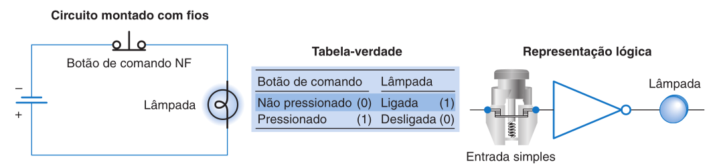

# [Sistema Numérico](../../slides/CLP03-Numeros_Logicas.pdf)

Os CLPs operam internamente através de números binários para processar e armazenar informações, por isso há um importância em conhecer como são representados os dados em algumas de suas diferentes formas.  


# 1. Sistemas de Numeração (Decimal, Binário, Octal e Hexadecimal)

*   **Sistema Decimal:** Utiliza a **base 10** e os dígitos de 0 a 9, onde o valor de cada dígito é determinado pelo seu peso (potência de 10) conforme sua posição.

*   **Sistema Binário:** É a base do funcionamento dos circuitos digitais e dos CLPs, utilizando a **base 2** (dígitos 0 e 1). Cada dígito binário é chamado de **bit**, sendo que um grupo de 8 bits forma um **byte** e um conjunto de dois ou mais bytes forma uma **palavra (word)**.

*   **Sistema Octal:** Baseado na **base 8** (dígitos 0 a 7), é usado para representar grupos de 3 bits, facilitando a leitura de números binários extensos. É comum no endereçamento de controladores como o PLC-5 da Allen-Bradley.

*   **Sistema Hexadecimal:** Utiliza a **base 16**, empregando os dígitos de 0 a 9 e as letras de **A a F** para representar valores decimais de 10 a 15. É amplamente utilizado para visualizar o estado de palavras de dados de 16 ou 32 bits em telas de programação.


---

## 1.2 Números Negativos e Aritmética Binária

*   **Números Negativos:** Como os CLPs não usam sinais de "+" ou "-", eles utilizam um **bit de sinal** no lado mais significativo (MSB), onde 0 indica positivo e 1 indica negativo. O método mais comum para expressar esses valores é o **complemento de 2**.

*   **Aritmética Binária:** Operações de soma, subtração, multiplicação e divisão são executadas pela CPU. Também são executadas **instruções de comparação** (Igual, Maior que, Menor que), fundamentais para o controle de processos baseados em valores acumulados de temporizadores e contadores.


---

# 2. Códigos Digitais (BCD, Gray e ASCII)

*   **BCD (Decimal Codificado em Binário):** Representa cada dígito decimal individualmente através de um **grupo de 4 bits**. É o formato utilizado por dispositivos externos como **chaves de tambor (thumbwheels)** e displays de LED.


*   **Código Gray:** Caracteriza-se por mudar apenas **um bit** na transição entre números consecutivos, sendo ideal para **codificadores (encoders) ópticos**, pois minimiza erros de leitura em movimentos rápidos.


*   **Código ASCII:** Código alfanumérico que utiliza 7 ou 8 bits para representar letras, números e caracteres especiais, permitindo a interface do CLP com teclados e impressoras.


---

# 3. Integridade de Dados

*   **Bit de Paridade:** É um dígito binário adicional anexado a uma palavra para **detectar erros** durante a transmissão de dados entre CLPs ou computadores. Pode ser configurado como paridade **par ou ímpar**, dependendo da lógica do sistema.


---

# 4. Fundamentos de lógica

O CLP opera com base no **princípio binário**, onde estados como ligado/desligado ou verdadeiro/falso são representados pelos dígitos **1 e 0**. Uma **porta lógica** é um circuito que possui várias entradas e uma única saída, ativada por combinações específicas dessas entradas. A lógica permite que o controlador tome decisões baseadas em um ou mais fatores antes de executar uma ação.

## 4.1 Funções Lógicas Fundamentais (AND, OR e NOT)

*   **Função AND:** A saída é 1 apenas se **todas as entradas forem 1**. Em termos elétricos, é análoga a dispositivos conectados em **série**.


```
        A        B                 Lâmpada
|------| |------| |------------------( )-----|
```


*   **Função OR:** A saída é 1 se **uma ou mais entradas forem 1**. É similar a dispositivos conectados em **paralelo**.


```
        A                         Lâmpada
|------| |---------------------------( )-----|
              |
        B     |
|------| |----'
```

*   **Função NOT:** Possui apenas uma entrada e sua saída é sempre o **inverso** desta, sendo por isso chamada de inversor.



```
        A                       Lâmpada
|------|/|------------------------( )-----|
```

*   **NAND, NOR e XOR:** Também temos as portas derivadas **NAND** (AND invertida), a **NOR** (OR invertida) e a **XOR (OR Exclusivo)**, cuja saída é 1 apenas se uma das entradas for 1, mas não ambas.

---

## 4.2. Álgebra Booleana

A **álgebra booleana** é o estudo matemático da lógica e fornece um método simples para escrever combinações complexas através de **equações**. É possível desenvolver circuitos lógicos a partir de expressões booleanas e vice-versa. 

### 4.2.1 Axiomas e Teoremas

Para a simplificação de expressões, as fontes destacam postulados fundamentais:

*   **Identidade:** 
    * $A + 0 = A$
    * $A \cdot 1 = A$

*   **Nulo (Absorvente):** 
    * $A + 1 = 1$
    * $A \cdot 0 = 0$

*   **Idempotência:** 
    * $A + A = A$
    * $A \cdot A = A$

*   **Complementaridade:** 
    * $A + \overline{A} = 1$
    * $A \cdot \overline{A} = 0$

*   **Involução (Dupla Negação):** 
    * $\overline{\overline{A}} = A$
    

### 4.2.2 Propriedades e Leis Algébricas

Essas leis regem a manipulação de expressões complexas e seguem princípios similares à álgebra convencional, com exceções específicas.

*   **Comutativa:** A ordem das variáveis não altera o resultado da operação
    * $A + B = B + A$
    * $A \cdot B = B \cdot A$
    
*   **Associativa:** O agrupamento de termos em somas ou produtos não altera o resultado final 
    * $A + (B + C) = (A + B) + C$
    * $A \cdot (B \cdot C) = (A \cdot B) \cdot C$
    
*   **Distributiva:** Permite a expansão ou fatoração de termos 
    * $A \cdot (B + C) = (A \cdot B) + (A \cdot C)$
    * $(A \cdot B) + C = (A + C) \cdot (B + C)$
    
*   **Absorção:** Termos redundantes são eliminados pela variável dominante 
    * $A + A \cdot B = A$
    * $A \cdot (A + B) = A$

---

### 4.2.3 Teoremas de De Morgan

Augustus De Morgan estabeleceu dois teoremas vitais que permitem a conversão entre operadores e a simplificação de barras de inversão sobre expressões complexas.

*   **Primeira Lei:** O complemento do produto de variáveis é igual à soma dos complementos individuais 
    * $\overline{A \cdot B} = \overline{A} + \overline{B}$
    
*   **Segunda Lei:** O complemento da soma de variáveis é igual ao produto dos complementos individuais 
    * $\overline{A + B} = \overline{A} \cdot \overline{B}$

### 4.2.4 Princípio da Dualidade

Toda expressão booleana permanece válida se os operadores AND e OR forem trocados entre si, simultaneamente com a troca dos valores lógicos 0 e 1. Este princípio é fundamental para a síntese de hardware, permitindo, por exemplo, a implementação de uma porta AND utilizando uma porta OR com entradas e saídas invertidas.

---

## 4.3 Lógica Instalada vs. Lógica Programada

*   **Lógica Instalada:** Refere-se a funções de controle determinadas por **conexões elétricas físicas** entre dispositivos (lógica de relés), que são difíceis de modificar.

*   **Lógica Programada:** Baseia-se em funções lógicas fundamentais executadas via **software** no CLP. A linguagem mais comum é a **Lógica Ladder**, que utiliza símbolos de contatos e bobinas para simplificar a conversão de esquemas de relés para programas.

---

## 4.4 Instruções Lógicas em Nível de Palavra

Muitos CLPs possuem instruções que realizam operações lógicas (AND, OR, XOR, NOT) não apenas em bits individuais, mas em **palavras de dados completas** (16 ou 32 bits). Essas instruções orientam o processador a comparar ou combinar dois endereços de origem e armazenar o resultado em um destino. Elas são frequentemente utilizadas em diagnósticos, como na comparação de estados reais de chaves com estados desejados.


---
