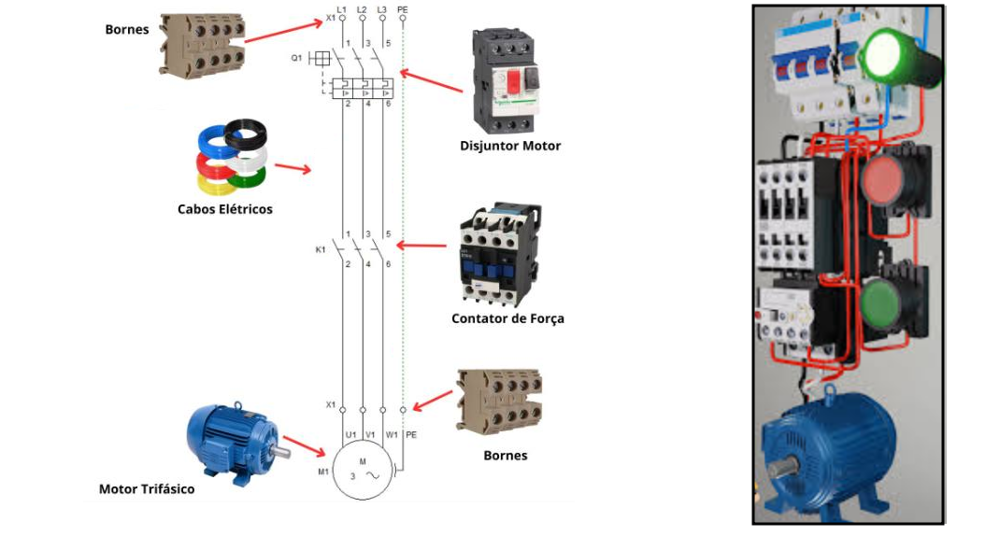
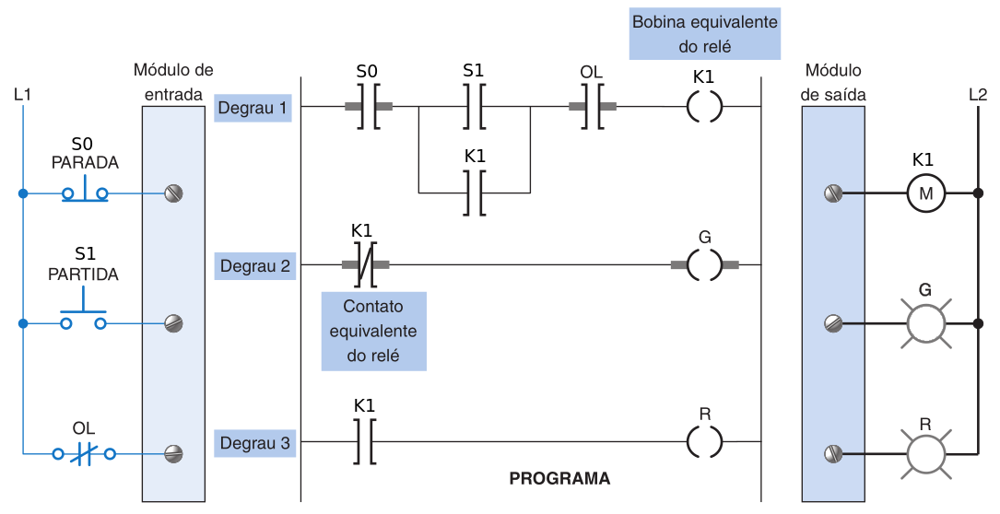

# [Acionamento Básico com CLP](../../slides/CLP04-PartidaDireta.pdf)


# 1. Partida Direta de Motor

Uma **partida de motor**, especificamente a chave de partida direta, é um dispositivo projetado para fornecer potência elétrica a motores de forma controlada.


## 1.1 Composição da Chave de Partida
Uma chave de partida direta é composta fundamentalmente por dois componentes acoplados física e eletricamente:

*   **Contator:** Funciona como uma chave magnética que estabelece e interrompe o fluxo de energia para o motor. Ele possui **contatos de potência** (para a corrente alta do motor) e **contatos auxiliares** (para o circuito de controle).

*   **Relé de Sobrecarga:** Sua função é proteger o motor contra correntes excessivas. Ele detecta o aumento de calor causado pela sobrecorrente e abre o circuito, desenergizando a bobina do contator e parando o motor para evitar danos.



---

## 1.2 Funcionamento do Acionamento Tradicional

No modo manual/eletromecânico, o acionamento ocorre da seguinte forma:

*   **Partida (S1):** Ao pressionar um botão de comando normalmente aberto, a **bobina do contator (K1)** é energizada. Isso fecha os contatos de potência, ligando o motor.

*   **Circuito de Selo:** Como o botão de partida é momentâneo, utiliza-se um **contato auxiliar** do próprio contator em paralelo com o botão. Quando o botão é liberado, este contato (chamado de selo ou manutenção) mantém a bobina energizada.

*   **Parada (S0):** O motor para quando o botão de parada (normalmente fechado) é pressionado ou quando o relé de sobrecarga atua, interrompendo o fluxo de corrente para a bobina.


| Figura 1: Diagrama de Potência e Comando de uma partida direta de motor |
|:------------------------------------------------:|
|   |
| Fonte: [PARTIDA DIRETA DE MOTORES - COMO LIGAR? - Ômega Treinamentos](https://youtu.be/V2DbwDzUdlQ?si=F2xr17v3h1VSgnTC) |


---

## 1.3 Acionamento Realizado via CLP

Ao utilizar um Controlador Lógico Programável, a lógica de fiação física é substituída pela **lógica programada (software)**.

*   **Conexão de Hardware:** Os botões de partida e parada são conectados aos **módulos de entrada** do CLP. A bobina da chave de partida é conectada ao **módulo de saída**.

*   **Lógica de Programação (Ladder):** O acionamento é realizado através de um programa em lógica Ladder que emula o circuito de selo. 
    *   **S1 - PARTIDA (Contato Normalmente Aberto):** Quando acionado realiza a partida do motor.
    *   **S0 - PARADA (Contato Normalmente Fechado):** Quando acionado realiza a parada do motor.
    *   **OL (Contato Normalmente Fechado):** Quando acionado indica sobrecarga no acionamento do motor.
    *   **M:** Ativa a bobina do contator que liga o motor.
    *   **G**: Ativa sinaleiro verde.
    *   **R**: Ativa sinaleiro vermelho.





``` title="Partida Direta de Motor com Sinalização"
      S0       S1        OL                       K1
|----| |-------| |------| |-----------------------( )-----|
           |         |
           |    K1   |
           '---| |---'

      K1                                           G
|-----|/|-----------------------------------------( )-----|

      K1                                           R
|-----| |-----------------------------------------( )-----|
```


---

## 1.4 Práticas Recomendas de Segurança

O programa do CLP é mais seguro quando utiliza um **contato auxiliar físico** do contator como sinal de entrada para o controlador. Isso fornece uma **realimentação positiva**, permitindo que o processador saiba se o motor realmente ligou ou se houve uma falha (como a atuação do relé de sobrecarga), evitando condições de operação perigosas. Além disso, botões de parada de emergência devem ser sempre conectados fisicamente para desenergizar o **relé mestre de controle (MCR)**, garantindo o desligamento independente do software.

---

# 2. Partida Direta com Reversão

A partida direta com reversão é um método de acionamento para motores elétricos trifásicos que permite alterar o sentido de giro do eixo. Isso é essencial em equipamentos como tornos, pontes rolantes e esteiras transportadoras. 


## 2.1 Como funciona?

O princípio básico é a inversão de duas das três fases que alimentam o motor. Ao trocar a sequência das fases (ex: de R-S-T para T-S-R), o campo magnético girante do estator muda de direção, forçando o motor a girar no sentido oposto. 

## 2.2 Componentes Principais

Para realizar essa manobra de forma segura, o painel elétrico utiliza:

* Dois Contatores (K1 e K2): Um para o sentido horário e outro para o anti-horário.
* Disjuntor Motor ou Relé Térmico: Protege o motor contra sobrecargas e curtos-circuitos.
* Botoeiras: Geralmente três botões — um para "Sentido 1", um para "Sentido 2" e um para "Parar".
* Intertravamento: Um recurso de segurança crítico (via contatos auxiliares NF) que impede que os dois contatores entrem simultaneamente, o que causaria um curto-circuito entre fases. 

## 2.3 Diagramas de Conexão

* Circuito de Potência: Mostra a ligação dos cabos que levam a energia ao motor, evidenciando a inversão física das fases nos contatores.

* Circuito de Comando: Define a lógica de funcionamento, garantindo que o motor só inverta o giro após ser desligado (ou conforme a configuração de segurança) e gerenciando o intertravamento. 

## 2.4 Atividade

Elabore o programa em linguagem Ladder para realizar o acionamento de uma partida direta com reversão conforme as indicações de entradas e saídas da figura a seguir.


---

# Referências

Explicação detalhada sobre o acionamento não faz parte do escopo deste material, sendo assim, seguem indicações:

1. [Sala da Elétrica](https://www.saladaeletrica.com.br/partida-direta-de-motor-trifasico/)
2. [PARTIDA DIRETA DE MOTORES - COMO LIGAR? - Ômega Treinamentos](https://youtu.be/V2DbwDzUdlQ?si=-oEMoCHHalq4K1QM&t=1)

| Vídeo 1: Animação de ligações em um comando de partida direta de motor |
|:-----:|
| <iframe width="560" height="315" src="https://www.youtube.com/embed/_97EQvxI12A?si=R9dSME2s-DAB5Cxm" title="YouTube video player" frameborder="0" allow="accelerometer; autoplay; clipboard-write; encrypted-media; gyroscope; picture-in-picture; web-share" referrerpolicy="strict-origin-when-cross-origin" allowfullscreen></iframe> |
| Fonte: [Comando Elétrico Super Fácil (Partida Direta) - Marcos Instalação Elétrica](https://youtu.be/_97EQvxI12A?si=6ZC8aJwrHlz5k8Ck)|


---
