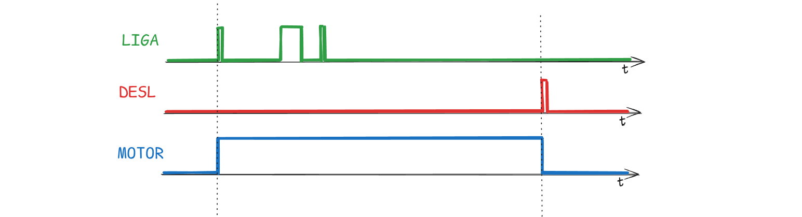

#

# [SET/RESET](../../slides/CLP05-SetReset.pdf)


As funções **SET** e **RESET** (também chamadas de **latch**(trava) e **unlatch**(destrava) em alguns sistemas) são instruções de saída utilizadas para controlar o estado de um bit de memória ou saída física de forma **retentiva**.

### Como funcionam e para que servem

Diferente de uma instrução de saída comum, que depende da continuidade lógica constante do degrau para permanecer ativa, as funções SET e RESET funcionam em pares e alteram o estado do bit permanentemente até que a instrução oposta seja executada.

*   **SET (Latch):** Quando uma borda de subida (degrau) é aplicado ao bloco da instrução SET, o processador grava um bit **1 (ligado)** no endereço especificado. Mesmo que as condições de entrada do degrau deixem de ser verdadeiras, o bit **permanece em 1**.

```st
      LIGA                           MOTOR
|-----| |-----------------------------(S)---|

```


*   **RESET (Unlatch):** Para desligar o bit que foi "setado", é necessária uma instrução **RESET** com o **mesmo endereço**. Quando o degrau do RESET torna-se verdadeiro, o processador grava um bit **0 (desligado)** no endereço.

```st
      DESL                           MOTOR
|-----| |-----------------------------(R)---|

```


*   **Retentividade:** Essas instruções são úteis porque mantêm o último estado mesmo em caso de falha de energia ou desligamento do sistema, permitindo que o processo reinicie exatamente de onde parou quando a energia for restaurada.





### Exemplos de uso

1.  **Partida de Motores:** Um botão de partida pulsador pode enviar um sinal para a instrução **SET**, ligando o motor. O motor continuará funcionando mesmo após o operador soltar o botão. Um botão de parada pulsador é então programado para a instrução **RESET**, que desliga o motor.
2.  **Controle de Nível de Tanques:** Em um sistema de caixa-d'água, se o sensor de **nível máximo** for atingido, a bomba de descarga é ativada via **SET** para esvaziar o tanque. Ela permanece ligada até que o sensor de **nível mínimo** seja acionado, ativando a instrução **RESET** para desligar a bomba.
3.  **Sinalização de Alarmes:** Se uma condição de falha for detectada (como sobrepressão ou temperatura excessiva), um bit de alarme pode ser **SET**. O alarme permanecerá ativo para alertar o operador, mesmo que a falha desapareça momentaneamente, exigindo que alguém pressione um botão de confirmação manual para dar o **RESET** no alarme.
4.  **Sequenciamento de Processos:** Em linhas de produção, as funções SET e RESET são usadas para "memorizar" que uma etapa foi concluída (como uma garrafa estar cheia), permitindo que a próxima etapa da sequência comece.

---

# Referências

1. PETRUZELLA, Frank D. **Controladores lógicos programáveis**. Tradução de Romeu Abdo; revisão técnica de Antonio Pertence Júnior. 4. ed. Porto Alegre: AMGH, 2014.

2. GEORGINI, Marcelo. **Automação aplicada**: descrição e implementação de sistemas sequenciais com PLCs. 9. ed. São Paulo: Érica, 2007.

3. SILVA FILHO, Bernardo Severo da (Orient.). **Curso de controladores lógicos programáveis**. Rio de Janeiro: Faculdade de Engenharia da UERJ, Laboratório de Engenharia Elétrica, [s.d.]


---