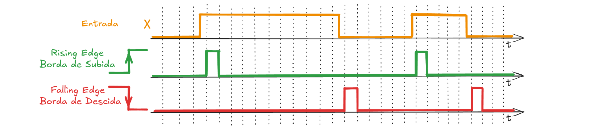

#

# [Detecção de Bordas](../../slides/CLP06-DeteccaoBordas.pdf)

Em automação industrial e programação de CLPs, os conceitos de bordas de sinal referem-se às transições de estado de uma entrada digital.

*   **Borda de Subida (Positive Transition / Rising Edge):** É o momento exato em que um sinal digital muda do estado **desligado (0 ou falso)** para o estado **ligado (1 ou verdadeiro)**. É a transição positiva do sinal.
*   **Borda de Descida (Negative Transition / Falling Edge):** É o momento em que o sinal muda do estado **ligado (1 ou verdadeiro)** para o estado **desligado (0 ou falso)**. Representa a transição negativa ou o encerramento de um pulso.

A detecção dessas transições é realizada por meio de instruções específicas na lógica de programação do CLP, que monitoram a mudança de estado entre um ciclo de varredura (*scan*) e outro:

## Principais Aplicações na Indústria

A detecção de bordas é essencial para funções que não devem ser repetidas continuamente enquanto um botão ou sensor estiver acionado. Suas principais aplicações incluem:

*   **Contadores:** Todos os contadores de CLP operam na **borda de subida** do sinal de entrada. Eles incrementam ou decrementam o valor acumulado apenas quando detectam a transição de desligado para ligado, garantindo que uma única peça passando por um sensor seja contada apenas uma vez.
*   **Cálculos Matemáticos:** A instrução de um disparo é frequentemente usada com instruções matemáticas (como ADD) para garantir que um **cálculo seja executado apenas uma vez** quando um evento ocorre, independentemente de quanto tempo o sensor de entrada permaneça fechado.
*   **Estabilização de Displays (Congelamento de Dados):** É utilizada para capturar e "congelar" momentaneamente valores que mudam rapidamente (como o tempo acumulado de um temporizador) em um display de LED, permitindo que o operador consiga ler o dado estabilizado no instante do acionamento.
*   **Reinicialização (Reset) de Sistemas:** Utiliza-se a borda de subida para disparar a instrução de **reinicialização (RES)** de contadores ou temporizadores por apenas uma varredura quando um botão de reset ou uma chave-limite é acionada.
*   **Monitoramento de Alarmes e Eventos:** Permite registrar o momento exato em que uma condição de falha surge ou desaparece, disparando sinalizadores ou sirenes de alerta.

---

# Referências

1. PETRUZELLA, Frank D. **Controladores lógicos programáveis**. Tradução de Romeu Abdo; revisão técnica de Antonio Pertence Júnior. 4. ed. Porto Alegre: AMGH, 2014.

2. GEORGINI, Marcelo. **Automação aplicada**: descrição e implementação de sistemas sequenciais com PLCs. 9. ed. São Paulo: Érica, 2007.

3. SILVA FILHO, Bernardo Severo da (Orient.). **Curso de controladores lógicos programáveis**. Rio de Janeiro: Faculdade de Engenharia da UERJ, Laboratório de Engenharia Elétrica, [s.d.]

---