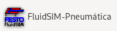
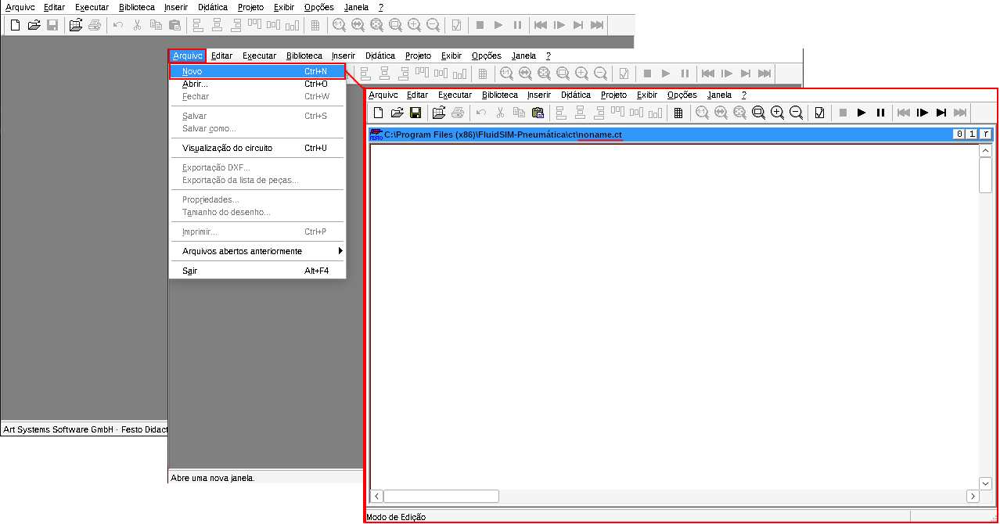
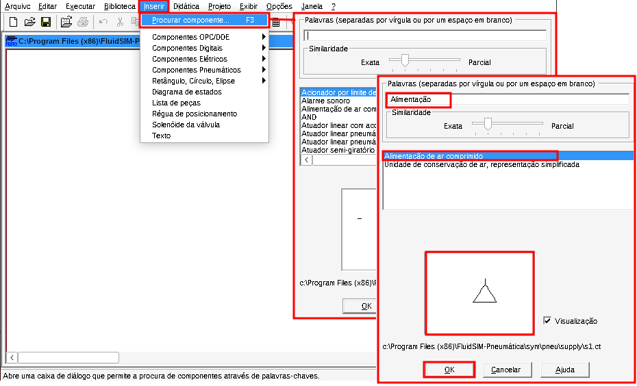
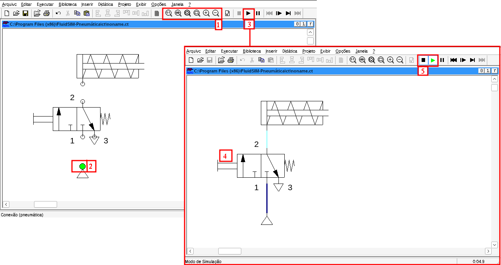
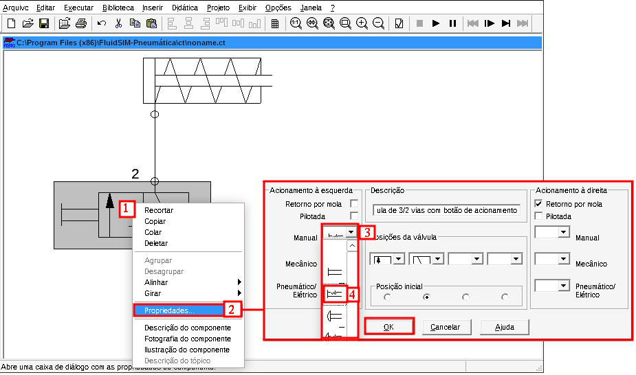
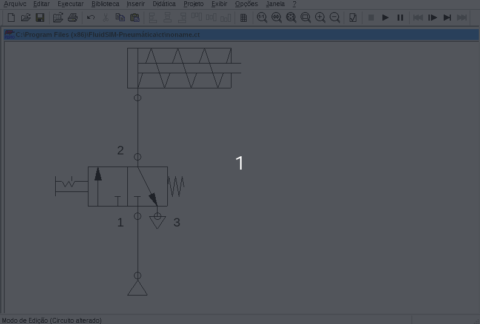
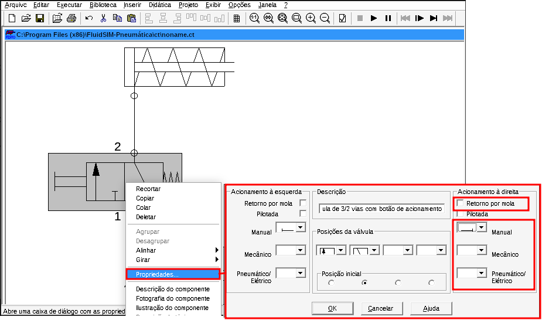
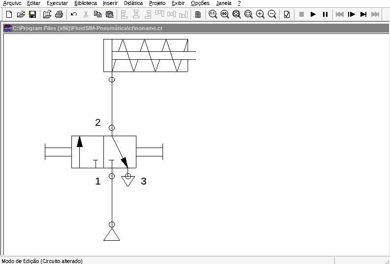

# 

**Primeira simulação no [FluidSim](https://www.festo.com/br/pt/c/formacao-tecnica/sistemas-de-aprendizagem/software/fluidsim-id_FDID_01_12_04/)**

Ao abrir o simulador `FluidSim Pneumática`, clique em:

1) `Arquivo`

2) `Novo            Ctrl+N`

3) Uma janela em branco é aberta com a indicação de arquivo `noname.ct`, como mostrado na Figura 1.

| Figura 1: Criando um novo arquivo para um circuito |
|:--------------------------------------------------:|
|             |
| Fonte: Autor                                       |

Para inserir os elementos do circuito pneumático, clique em:

4) `Inserir` e `Procurar componente ...    F3`

É aberta a janela para busca de componente, conforme mostrado na Figura 2.

No campo `Palavras ...`, fazer a busca pelas pelavras chave dos componentes que se quer inserir.

Uma lista de opções encontradas é exibida, em que pode ser feita a seleção do componente desejado.

Abaixo é mostrada uma visualização da simbologia do componente selecionado;

5) Ao selecionar o componente correto, clique em `OK` para inserí-lo na folha do circuito.

6) Lista de componentes a serem inseridos no item 4:

  - "Alimentação de ar comprimido"
  - "Cilindro de simples ação"
  - "Válvula 3/2 vias, com botão de acionamento, normalmente fechada"

| Figura 2: Inserindo componentes                         |
|:-------------------------------------------------------:|
|  |
| Fonte: Autor                                            |

Após inserir os componentes na folha do circuito, e posicioná-los de forma adequada para conexão dos componentes, use as ferramentas de ajuste e posicionamento da imagem no item 1 da Figura 3.

Conecte os dispositivos de acordo com o circuito proposto. Ao passar o mouse sobre o ponto de conexão, ele fica na cor verde, item 2 da Figura 3, e deve-se clicar e arrastar até o ponto de destino.

| Figura 3: Inserindo componentes                         |
|:-------------------------------------------------------:|
|                             |
| Fonte: Autor                                            |

Após conecatar todos os componentes, clique no botão de *start* para iniciar a simulação, item 3 da Figura 3.

Note que as linhas que ficam em azul escuro, representam um linha de pressão e as linhas em azul claro a pressão atmosférica.

É possivel clicar no dispositivo que representa o botão de acionamento da válvula, item 4 da Figura 3, comutando a válvula e acionando a o cilindro.

Ao soltar o botão, a mola retorna a válvula para a posição original e o cilindro recua, da mesma forma por ação de sua mola.

Para encerrar a simulação, clique em *Stop*, item 5 da Figura 3.

| Figura 4: Simulação de circuito pneumático                  |
|:-----------------------------------------------------------:|
|                  |
| Fonte: Autor                                                |

---

| Figura 5: Alteração de parâmetros dos elementos do circuito |
|:-----------------------------------------------------------:|
|        |
| Fonte: Autor                                                |

| Figura 6: Acionamento de válvula via botão com trava        |
|:-----------------------------------------------------------:|
|                       |
| Fonte: Autor                                                |

---

| Figura 7: Alteração do recuo da válvula                     |
|:-----------------------------------------------------------:|
|               |
| Fonte: Autor                                                |

| Figura 8: [Simulação](sim/fluidsimP-3_6professional.zip) de duplo acionamento manual |
|:-----------------------------------------------------------:|
|                       |
| Fonte: Autor                                                |

---
