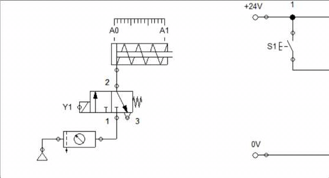
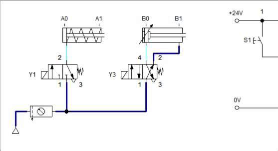
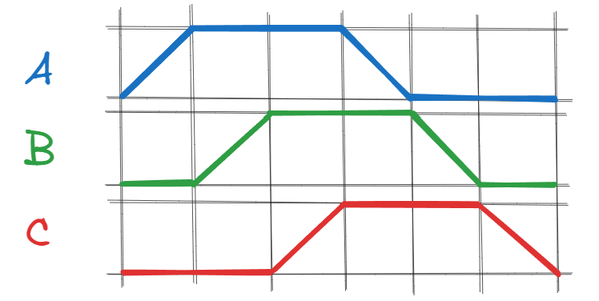
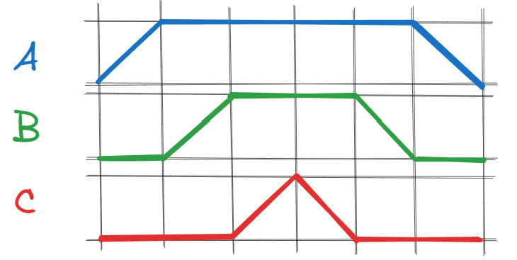
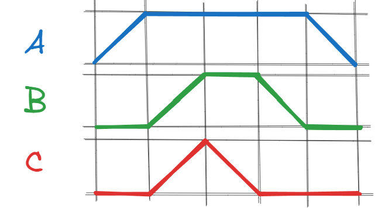
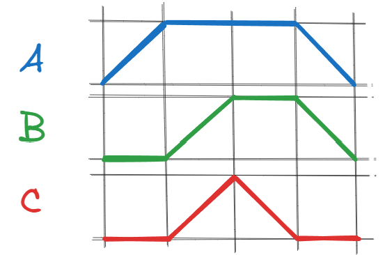

# 

**Exercícios**

Elabore o diagrama de acionamento dos circuitos eletopneumáticos das figuras 1, 2, 3 e 4.

| Figura 1: Sequencia de movimentos A+ A- |
|:---------------------------------------:|
|  |
| Fonte: Autor         |

| Figura 2: Sequencia de movimentos A+ B+ B- A- |
|:---------------------------------------------:|
|                       |
| Fonte: Autor                                  |

| Figura 3: Sequencia de movimentos A+ B+ A- B- |
|:---------------------------------------------:|
|                       |
| Fonte: Autor                                  |

| Figura 4: Sequencia de movimentos A+ A- B+ B- |
|:---------------------------------------------:|
|                       |
| Fonte: Autor                                  |

---

Elabore os diagramas pneumáticos e de acionamento das sequencias de movimento para os atuadores A, B e C das figuras 5, 6, 7 e 8.

| Figura 5: Diagrama Trajeto-Passo |
|:--------------------------------:|
|        |
| Fonte: Autor                     |

| Figura 6: Diagrama Trajeto-Passo |
|:--------------------------------:|
|        |
| Fonte: Autor                     |

| Figura 7: Diagrama Trajeto-Passo |
|:--------------------------------:|
|      |
| Fonte: Autor                     |

| Figura 8: Diagrama Trajeto-Passo |
|:--------------------------------:|
|     |
| Fonte: Autor                     |

---
