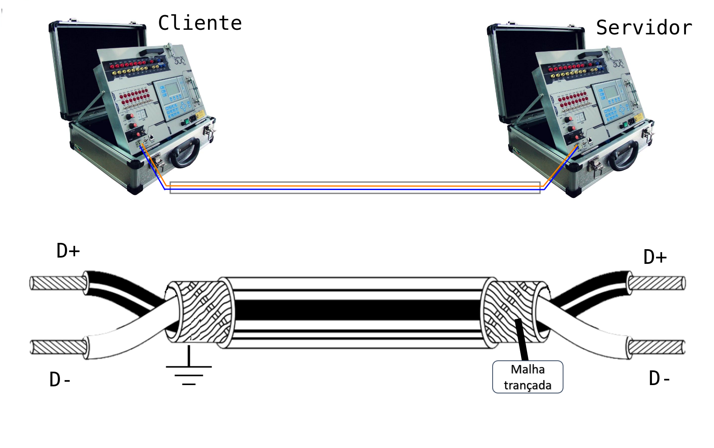
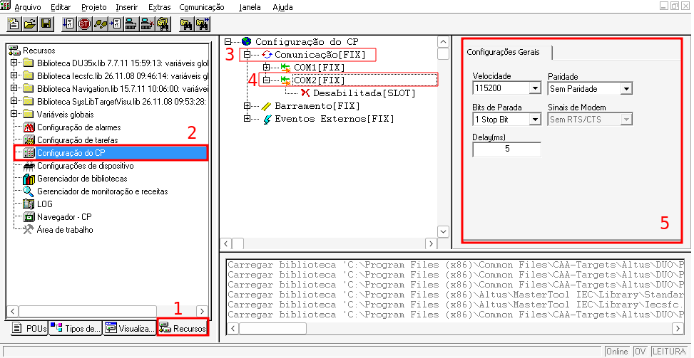
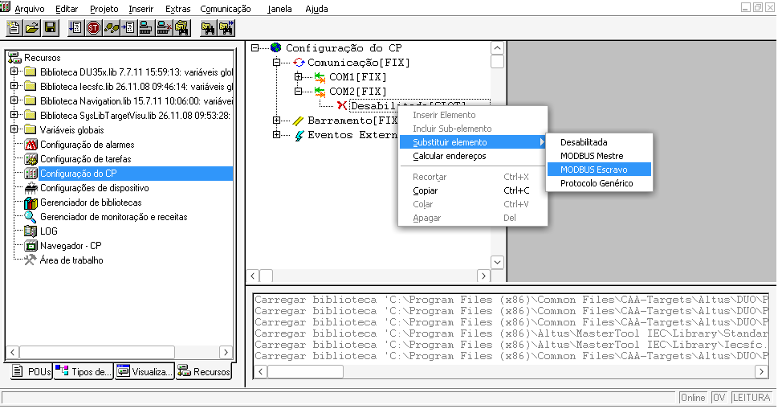
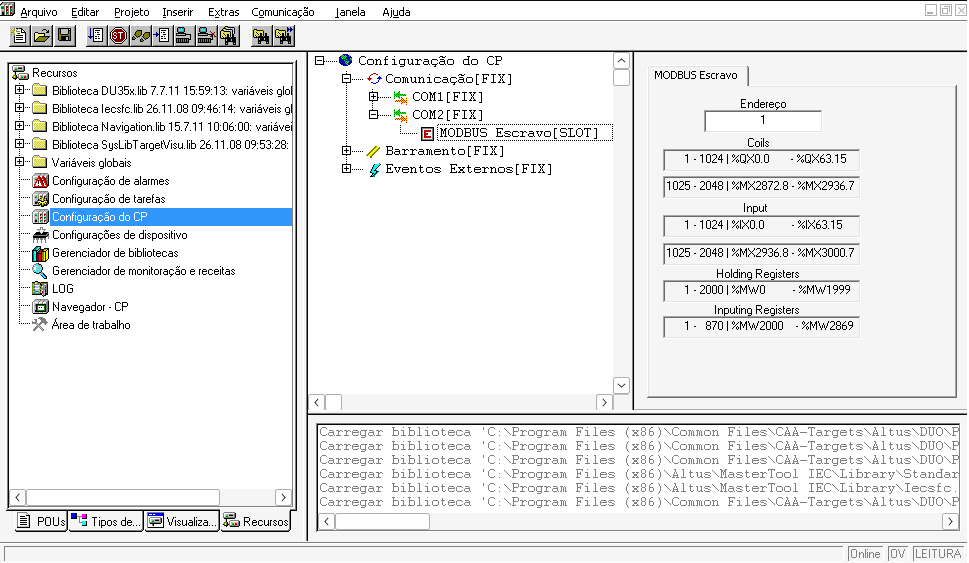
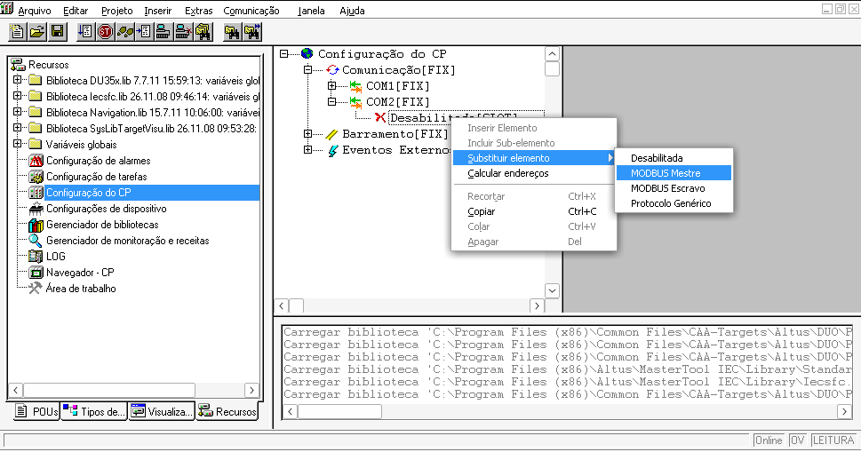
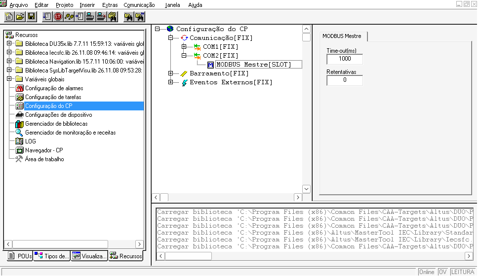
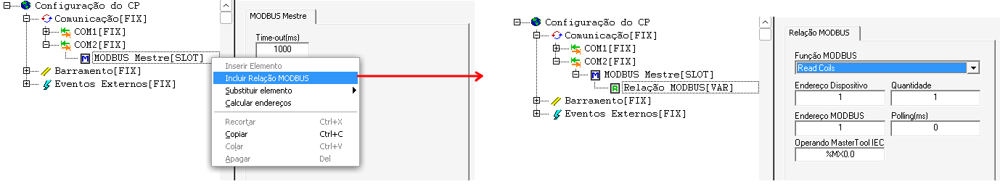
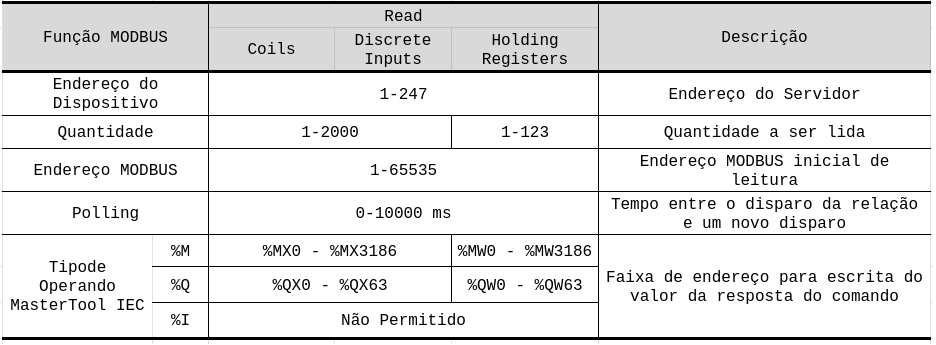
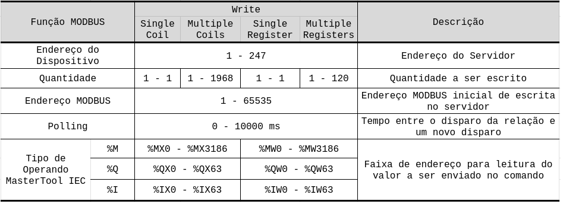

SLTRISS - [Ementa](../../ifsp-slt/automacao/sltriss_ementa.md) - [Plano de Aula](../../ifsp-slt/automacao/sltriss_plano_aula.md) - [Slide da aula](../../automacao/slides/SLTRISS-02-Topologia_meiosFisicos_memCLP.pdf)

---

#

#

# 1. Topologias, Meios Físicos e o Universo do CLP

No contexto da engenharia, a **topologia de rede** refere-se ao layout físico ou lógico da interconexão de dispositivos, determinando como os dados são roteados e como a rede se comporta diante de falhas. Enquanto redes comerciais (TI) priorizam a largura de banda e a flexibilidade, as redes industriais (TA) são projetadas com foco no **determinismo temporal** e na **robustez extrema**, exigindo topologias que garantam a continuidade da operação mesmo em ambientes hostis.

## 1.1. Classificação e Escala

As redes são classificadas globalmente por sua escala, variando de redes pessoais (PAN) e locais (LAN) até metropolitanas (MAN) e de longa distância (WAN). No ambiente industrial, o foco reside majoritariamente nas **LANs de chão de fábrica**, onde **a topologia dita a eficiência do controle de processos em tempo real**.

## 1.2. Topologia em Barramento (Bus)

Historicamente a mais difundida no campo industrial, a topologia em barramento conecta todos os nós a um único meio de transmissão compartilhado, conhecido como *trunkline* ou cabo tronco.

*   **Aplicações Industriais:** É a base de protocolos clássicos como o **Modbus RTU**, **PROFIBUS DP/PA** e **DeviceNet**.
*   **Vantagens e Soluções:** Apresenta baixo custo de cabeamento e facilidade de instalação em sistemas de grande extensão geográfica, como esteiras de produção.
*   **Problemas e Características Críticas:** O barramento exige obrigatoriamente o uso de **terminadores de rede** (resistores) em ambas as extremidades para evitar a reflexão de sinais, que causaria corrupção de dados. Além disso, uma falha física no cabo central pode paralisar toda a rede, e o desempenho degrada conforme mais nós são adicionados devido à disputa pelo meio (*collisions*).

## 1.3. Topologia em Estrela (Star)

Dominante nas redes comerciais modernas e em franca expansão na indústria via **Ethernet Industrial**, esta topologia utiliza um nó central concentrador, geralmente um **switch**.

*   **Uso Global:** É a arquitetura padrão para infraestruturas que conectam CLPs a sistemas supervisórios e bancos de dados.
*   **Vantagens:** O isolamento de falhas é seu ponto forte; se um cabo de um instrumento se rompe, apenas aquele nó fica inativo, sem comprometer os demais. Permite o uso de enlaces **full-duplex**, eliminando colisões de pacotes.
*   **Problemas:** O **ponto único de falha** desloca-se para o switch central. Se o switch falhar, toda a estrela colapsa. Na indústria, exige switches de grau industrial que suportem vibrações e temperaturas extremas, diferentemente dos modelos de escritório.

## 1.4. Topologia em Anel (Ring)

Nesta arquitetura, cada nó possui exatamente dois vizinhos, formando um caminho fechado para a informação.

*   **Redundância Industrial:** É a topologia preferida para sistemas de alta disponibilidade. Protocolos como **DLR** (*Device Level Ring*) e **HSR**(*High-availability Seamless Redundancy*) utilizam anéis para fornecer **redundância de caminho**, onde, em caso de rompimento do cabo, a informação é redirecionada automaticamente pelo sentido oposto.
*   **Mecanismo de Token:** Comum em redes como o **IBM Token Ring** e variantes industriais do **PROFIBUS**, utiliza um "bastão" lógico (*Token*) que circula no anel, garantindo que apenas o detentor do token possa transmitir, o que assegura o determinismo.
*   **Aspecto Técnico Relevante:** Em anéis puramente digitais, cada nó atua como um repetidor, introduzindo um retardo de alguns bits. Uma questão importante é o **tempo físico de 1 bit**: em um anel de 1 Mbps com 1000 metros, a circunferência da rede conterá apenas cerca de 5 bits trafegando simultaneamente.

## 1.5. Topologias Complementares e Aspectos Lógicos

*   **Árvore e Malha:** A topologia em árvore (hierárquica) é frequentemente usada para interconectar múltiplos switches em diferentes níveis da planta. Já as malhas (**Mesh**) são típicas de redes de sensores sem fio (**WirelessHART** ou **Zigbee**), oferecendo múltiplos caminhos dinâmicos e alta resiliência.
*   **Físico vs. Lógico:** Uma rede pode ser fisicamente uma estrela (cabos saindo de um switch), mas logicamente um anel ou barramento. Por exemplo, o **Token Bus (IEEE 802.4)** possui fiação em árvore ou linear, mas as estações são organizadas logicamente em um anel de passagem de permissões.

---

## 1.6. Padrões de Redes e Modelos de Referência

*   **Modelo ISO/OSI:** É orientado pelo padrão internacional **ISO 7498**.
*   **Ethernet:** Regida pelo padrão **IEEE 802.3** do *Institute of Electrical and Electronics Engineers*.
*   **Token Bus:** Padronizado como **IEEE 802.4**.
*   **Token Ring:** Definido pela norma **IEEE 802.5**.
*   **VLAN:** Configurada sob o padrão **IEEE 802.1Q**, que define as etiquetas (*tags*) para segmentação lógica.

### 1.6.1. Protocolos de Barramento de Campo e Industriais

*   **PROFIBUS:** Padronizado globalmente pela norma **EN 50 170**. A camada física específica para o **PROFIBUS-PA** segue o padrão **IEC 61158-2**.
*   **PROFINET:** Regulamentado pelas normas **IEC 61158-5** e **IEC 61158-6** (classificado como Protocolo Tipo 10).
*   **Foundation Fieldbus:** A sua camada física é regida pelos requisitos da norma **ANSI/ISA-S50.02-1992**.
*   **CAN (Controller Area Network):** Padronizado internacionalmente pela norma **ISO 11898**.
*   **HART:** Embora seja um protocolo aberto mantido por um grupo de usuários, sua padronização de modulação obedece ao padrão **Bell 202** (*Frequency Shift Keying*).
*   **Modbus:** Introduzido originalmente pela Modicon (Schneider Electric), é gerido pela organização **Modbus-IDA**. O **Modbus RTU** utiliza comumente os padrões físicos **RS-232** (**EIA-232**) ou **RS-485** (**EIA-485**).
*   **IEC 60870-5-104:** Criado pela **Comissão Internacional de Eletrotécnica (IEC)** especificamente para aplicações elétricas e subestações.

### 1.6.2. Segurança e Design

*   **PROFIsafe:** Baseia-se nos requisitos de segurança funcional das normas **IEC 61508** e **EN 954-1**.
*   **IPsec:** A arquitetura de segurança é definida na **RFC 4301**, com extensões nas **RFC 4302** (AH), **RFC 4303** (ESP) e **RFC 5996** (IKEv2).
*   **Segurança Wireless (WPA2/WPA3):** O WPA2 baseia-se no padrão **IEEE 802.11i**. O WPA3 é a evolução citada no planejamento para proteção de redes IIoT.
*   **ISA-101:** Norma da *International Society of Automation* que rege as diretrizes de design para Interfaces Homem-Máquina (IHM) em sistemas supervisórios.

---

# 2. Meios físicos de transmissão (Par trançado, Fibra óptica, Coaxial); 

Os meios físicos de transmissão constituem a **Camada 1 (Física)** do modelo ISO/OSI e representam o alicerce sobre o qual toda a rede é construída. Na engenharia, a escolha do meio depende do equilíbrio entre largura de banda, distância, custo e, primordialmente no ambiente industrial, a **robustez e imunidade a ruídos**.

Abaixo, detalham-se os principais meios guiados e suas aplicações nos contextos comercial e industrial:

## 2.1. Par Trançado (Twisted Pair)

Consiste em pares de fios de cobre isolados e enrolados em forma helicoidal para cancelar interferências eletromagnéticas e reduzir a diafonia (*crosstalk*).

*   **Tipos e Categorias:** 
    *   **UTP (Unshielded):** Sem blindagem, comum em escritórios (redes comerciais). 
    *   **STP/FTP (Shielded/Foiled):** Possuem blindagem de malha ou fita metálica, essenciais para o chão de fábrica.
    *   **Categorias:** Variam de **Cat 3** (telefonia) a **Cat 7** (blindagem individual por par e global), suportando de 10 Mbps a 10 Gbps.
*   **Vantagens:** Baixo custo, facilidade de instalação, manutenção simples e flexibilidade.
*   **Desvantagens:** Suscetibilidade a ruídos externos (se não blindado) e limitação de distância (tipicamente 100m para Ethernet).
*   **Uso Industrial:** É o meio padrão para **RS-485 (Modbus RTU, PROFIBUS DP)** e **Ethernet Industrial**. Na indústria, a blindagem e o aterramento correto da malha são críticos para evitar a corrupção de dados por motores de grande porte.

## 2.2. Fibra Óptica

Utiliza pulsos de luz transmitidos através de fios de vidro ultrafinos, baseando-se no princípio da reflexão interna total.

*   **Tipos:** 
    *   **Multimodo:** Núcleo maior (50 ou 62,5 μm), permite múltiplos caminhos de luz; usada para curtas e médias distâncias (até 2 km).
    *   **Monomodo:** Núcleo muito fino, a luz viaja em linha reta; ideal para longas distâncias (acima de 15 km) sem necessidade de repetidores.
*   **Vantagens:** **Imunidade total a interferências eletromagnéticas (EMI/RFI)**, isolamento elétrico entre sistemas, altíssima largura de banda e segurança contra interceptações.
*   **Desvantagens:** Custo elevado de componentes e instalação, exige mão de obra especializada e fragilidade física a dobras acentuadas.
*   **Uso Industrial:** Essencial em ambientes com ruído elétrico extremo, conexões entre prédios (backbones) e **áreas classificadas** (risco de explosão), onde o uso de eletricidade em cabos metálicos é perigoso.

## 2.3. Cabo Coaxial

Composto por um condutor central de cobre, isolante, uma malha condutora externa (blindagem) e capa protetora.

*   **Tipos:** Cabos de **50 ohms** (transmissões digitais) e **75 ohms** (analógicos/TV a cabo).
*   **Vantagens:** Blindagem superior ao par trançado comum, permitindo maiores distâncias e velocidades sem repetidores.
*   **Desvantagens:** Difícil de manusear (mais rígido) e está sendo amplamente substituído pela fibra óptica em rotas de longa distância.
*   **Uso Industrial:** Embora menos comum em novas instalações de automação, ainda é encontrado em sistemas legados e redes de monitoramento por vídeo (CFTV).

## 2.4. Aspectos Relevantes no Uso Industrial
Diferente do ambiente comercial, a indústria impõe desafios severos que exigem adaptações nos meios físicos:

1.  **Imunidade a EMI:** Motores, inversores de frequência e compressores geram campos eletromagnéticos que podem alterar os bits no cabo. O uso de cabos blindados (**STP**) e a continuidade da blindagem através de conectores é obrigatória.
2.  **Robustez Mecânica:** Cabos industriais utilizam coberturas resistentes a óleos, gases, luz solar e agentes químicos. Conectores robustos, como o padrão circular **M12** (selado), substituem o frágil RJ-45 de escritório para suportar vibrações e umidade.
3.  **Segurança Intrínseca:** Em indústrias químicas, os cabos de par trançado (como no **HART** ou **Fieldbus Foundation**) podem transportar sinal e alimentação simultaneamente em níveis de energia limitados para evitar faíscas.
4.  **Aterramento:** A prática padrão exige que **a blindagem do cabo seja aterrada em um único** ponto para evitar loops de terra que degradariam o sinal.

---

# 3. Arquitetura interna do CLP e conceitos de memória interna (coils, registers, inputs).

A relação entre a **arquitetura interna do CLP** e as **topologias e meios físicos** é a ponte necessária para transformar sinais elétricos brutos do chão de fábrica em informações lógicas acessíveis por sistemas de gestão e supervisão.

## 3.1. A Memória como "Interface Lógica" dos Meios Físicos

Os componentes da memória interna do CLP (**inputs, coils e registers**) funcionam como o destino ou a origem dos dados que trafegam pelos meios físicos de transmissão.

*   **Inputs (Entradas):** Sensores conectados fisicamente por **par trançado** ou **fibra óptica** enviam sinais que o hardware do CLP converte em bits (entradas discretas 1XXXX) ou palavras (entradas analógicas 3XXXX) em sua memória.
*   **Coils (Bobinas/Saídas):** Representam o estado lógico (0 ou 1) que será enviado via meio físico para acionar atuadores (solenoides, motores).
*   **Registers (Registradores):** Armazenam dados complexos de 16 bits. Quando um sistema supervisório solicita a leitura de um registrador (4XXXX), esses dados são encapsulados em quadros (*frames*) e transmitidos através da rede.

### 3.1.1 O mapeamento de endereços no protocolo Modbus

No protocolo Modbus, o mapeamento de endereços é a forma como a memória de um dispositivo (geralmente um CLP) é organizada para que um mestre possa ler ou escrever informações de forma estruturada. Essa divisão é baseada na arquitetura interna de memória dos controladores industriais, tratando os dados como bits individuais ou palavras de 16 bits.

Abaixo, detalha-se o mapeamento para cada tipo de dado:

### 3.1.2. Tipos de Dados e Faixas de Endereçamento
A memória Modbus é dividida em quatro grandes grupos, identificados por faixas de endereços fixas que facilitam a distinção entre entradas, saídas e variáveis internas:

*   **Coils (Bobinas ou Saídas Discretas - 0XXXX):** Representam estados ON-OFF (1 bit) para acionamento de atuadores, como solenoides e motores.
*   **Discrete Inputs (Entradas Digitais - 1XXXX):** Armazenam estados ON-OFF (1 bit) provenientes de sensores físicos.
*   **Input Registers (Entradas Analógicas - 3XXXX):** São registradores de 16 bits que armazenam valores provenientes de sensores analógicos após conversão A/D.
*   **Holding Registers (Registradores de Memória - 4XXXX):** Registradores de 16 bits usados para armazenar variáveis de processo e parâmetros internos do CLP.

### 3.1.3. Lógica de Endereçamento e Offset
Existe uma distinção fundamental entre o **endereço de referência** (usado por humanos e sistemas supervisórios) e o **endereço de protocolo** (enviado no quadro de dados da rede):

*   **Offset de -1:** Por convenção, o primeiro registrador de uma faixa, como o **40001**, é transmitido na rede como o endereço **0**. 
*   **Exemplo Prático:** Para ler o registrador de memória **40108**, o software mestre deve solicitar o endereço inicial **107** (que em hexadecimal é `006Bh`).

### 3.1.4. Comandos (Funções) Associados

As **funções Modbus** (também chamadas de códigos de função) são comandos enviados pelo dispositivo mestre ao escravo para especificar a ação que deve ser executada, como ler ou escrever em variáveis remotas. O campo de função possui **8 bits** e os códigos válidos variam de **1 a 255**, embora cada equipamento suporte apenas um subconjunto dessas funções.

Abaixo estão detalhadas as principais funções utilizadas, divididas pelo tipo de dado e permissão de acesso:

#### 3.1.4.1. Funções para Variáveis Discretas (Bits)

Essas funções lidam com estados ON-OFF (1 bit).

*   **Função 01 (Read Coils):** Efetua a leitura do estado de saídas discretas (bobinas - faixa 0XXXX).
*   **Função 02 (Read Discrete Inputs):** Efetua a leitura do estado de entradas discretas (faixa 1XXXX).
*   **Função 05 (Write Single Coil / Forçar Bobina):** Escreve o estado (ligado ou desligado) em uma única saída discreta.
*   **Função 15 (Write Multiple Coils):** Permite a escrita em múltiplas saídas discretas simultaneamente.

#### 3.1.4.2. Funções para Registradores (16 bits)

Essas funções manipulam "palavras" de memória (words) para dados analógicos ou parâmetros internos.

*   **Função 03 (Read Holding Registers):** Efetua a leitura dos valores de registradores de memória interna (faixa 4XXXX).
*   **Função 04 (Read Input Registers):** Efetua a leitura dos valores de entradas analógicas (faixa 3XXXX).
*   **Função 06 (Write Single Register):** Escreve um valor de 16 bits em um único registrador de memória.
*   **Função 16 (Write Multiple Registers):** Permite a escrita de valores em múltiplos registradores de memória de uma só vez.

#### 3.1.4.3. Mecanismo de Resposta e Erro

*   **Confirmação:** Em uma operação bem-sucedida, o escravo retorna o mesmo código de função enviado pelo mestre.
*   **Tratamento de Erros:** Se ocorrer um erro, o escravo modifica o código de função, definindo o **bit mais significativo (MSB) como 1**. Por exemplo, se o mestre enviar a função **03** e houver erro, o escravo retornará **0x83** (hexadecimal), seguido por um código específico de exceção no campo de dados.

#### 3.1.4.4 Tabela Resumo: Mapeamento de Funções
| Tipo de Dado | Faixa de Endereço | Código de Leitura | Código de Escrita |
| :--- | :--- | :--- | :--- |
| **Saídas Discretas (Coils)** | 0XXXX | 01 | 05, 15 |
| **Entradas Digitais** | 1XXXX | 02 | N/D (Somente Leitura) |
| **Entradas Analógicas** | 3XXXX | 04 | N/D (Somente Leitura) |
| **Registradores de Memória** | 4XXXX | 03 | 06, 16 |

---

## 3.2. O Papel das Topologias no Acesso à Memória

A **topologia de rede** dita as regras de trânsito para que o sistema consiga "abrir as gavetas" (variáveis) da memória do CLP:

*   **Topologia em Barramento (Bus):** Em redes como **Modbus RTU sobre RS-485**, a topologia exige que cada CLP tenha um endereço único. O mestre da rede percorre o barramento físico "perguntando" a cada escravo o valor de seus registradores internos. O determinismo aqui depende de não haver colisões no meio físico.
*   **Topologia em Estrela (Star):** Comum em **Ethernet Industrial**, permite que o supervisório acesse a memória de múltiplos CLPs de forma simultânea através de um switch, o que reduz a latência na atualização das telas em comparação ao barramento linear.
*   **Topologia em Anel (Ring):** Garante que, se o meio físico (cabo) se romper, a informação sobre o estado de uma bobina ou registrador ainda chegue ao destino por um caminho alternativo, mantendo a integridade do controle.

## 3.3. Aspectos Físicos e a Integridade do Dado

A escolha do **meio físico** impacta diretamente a confiabilidade dos valores armazenados na memória:

*   **Ruído Eletromagnético (EMI):** Se o meio físico (como um par trançado sem blindagem) for suscetível a ruídos, os bits que representam um valor de temperatura em um registrador podem ser corrompidos durante a transmissão. O CLP pode receber um dado falso, ou o sistema supervisório pode exibir uma leitura estática ("caldeira cega") porque o quadro de dados foi descartado devido a erros de CRC.
*   **Velocidade vs. Distância:** Meios como a **fibra óptica** permitem que grandes volumes de registradores de memória sejam lidos em altas velocidades e longas distâncias sem degradação, o que é vital para a convergência de dados até a camada de gestão.

Em resumo, enquanto a **arquitetura interna** organiza a "inteligência" e o estado da máquina em endereços de memória, as **topologias e meios físicos** são a infraestrutura de transporte que permite que esses estados sejam compartilhados e comandados à distância.

---

### Referências

ALBUQUERQUE, Pedro Urbano Braga de; ALEXANDRIA, Alzuir Ripardo de. **Redes industriais**: aplicações em sistemas digitais de controle distribuído. 2. ed. São Paulo: Ensino Profissional, 2009.

ALTUS. **Protocolos de comunicação**: o que são e quais os principais padrões utilizados na indústria. [S. l.]: Altus. E-book.

COELHO, Marcelo Saraiva. **Redes de comunicação industrial**: padrões industriais. [S. l.: s. n.], 2009. Apostila.

LAGES, Walter Fetter; PEREIRA, Carlos Eduardo. **Redes industriais**. Porto Alegre: UFRGS, 2004. Apresentação em slides.

STALLINGS, William. **Criptografia e segurança de redes**: princípios e práticas. 6. ed. São Paulo: Pearson Education do Brasil, 2015.

TANENBAUM, Andrew S.; WETHERALL, David J. **Redes de computadores**. 5. ed. São Paulo: Pearson, 2011.

---

---

# Pós-Ref 0 - Práticas de Laboratório

- Configuração de um ambiente simulado ou real de CLP (Ex: CODESYS ou CLP físico), realizando a declaração de variáveis de leitura (Sensores) e escrita (Atuadores).

## Objetivo

Monte uma rede ponto a ponto utilizando dois Controladores sendo um operando como Cliente e o outro como Servidor, através de uma rede do tipo RS-485 e protocolo MODBUS RTU. 

Implemente no dispositivo `Servidor` uma aplicação de uma partida Estrela-Triângulo e no dispositivo `Cliente` uma interface homem-máquina.
        

- Servidor:
    - Ligar;
    - Desligar;
    - K1 (Comum), K2 (Estrela) e K3 (Triângulo);
    - Entrada analógica - 0 a 100.

- Cliente:
    - IHM - Ligar;
    - IHM - Desligar;
    - IHM - Visualizar estado do motor (Parado, Partindo, Rodando);
    - IHM - Visualizar variável analógica (0 a 100).

---

## Configuração da porta de comunicação (COM2)

Parâmetros disponívels:

- Velocidade - Baud Rate (bps – bits por segundo): `1200`, `2400`, `4800`, `9600`, `19200`, `38400`, `57600`, **`115200`**;
- Paridade: **`Sem paridade`**, `Ímpar`, `Par`, `Sempre 1`, `Sempre 0`;
- Stop bits: **`1 Stop Bit`**, `2 Stop Bits`;
- Sinais de Modem: **`Sem RTS/CTS`**, `Com RTS/CTS`, `Com RTS sem CTS`, `RTS sempre ligado`;
- Delay: **`5`** a `1000` ms.

Para habilitar a porta de comunicação como Servidor Modbus, substitua o elemento existente por `MODBUS Escravo`.

O único parâmetro a ser configurado é o número do Servidor, no campo `Endereço`:

- **1 a 247**: Faixa de endereços válidos e exclusivos para identificar cada equipamento individualmente na rede.
- **0 (Zero)**: Endereço reservado para Broadcast, utilizado quando o Cliente envia um comando para todos os servidores simultaneamente (os dispositivos executam a instrução, mas não enviam resposta).
- **248 a 255**: Faixa de endereços reservados para finalidades internas ou especiais.

Para habilitar a porta de comunicação como Cliente Modbus, substitua o elemento existente por `MODBUS Mestre`.

Parâmetros do MODBUS Servidor:

- **Time-out(ms)**: Tempo que o Cliente aguarda a resposta do Servidor;
- **Retentativas**: Quantidade de vezes que o Cliente irá transmitir a solicitação no caso em que o Servidor não responde. 

Uma mensagem no protocolo MODBUS é chamada de relação MODBUS, que executa uma função MODBUS. É possível criar 16 relações para cada porta de comunicação, totalizando 32 mensagens possíveis. 

As relações são tratadas de forma sequencial, conforme são inseridas à arvore de relações.

Os parâmetros de configuração das relações(Funções MODBUS) são: 

---

# Pós-Ref 1 - Material Complementar

| #   | Material | Assuntos |
|:---:|:--------:|:--------:|
| 1   | [Manual de Utilização DU350 / DU351](https://www.altus.com.br/wp-content/uploads/2024/11/manual_de_utilizacao_serie_duo.pdf) | Configuração de periféricos do CLP DUO da Altus|

---
<!--
# Pós-Ref 2 - Recomendação de leitura

| Índice | Título do artigo | Link de acesso  | Conteúdos abordados |
| :----: | ---------------- | --------------- | ------------------- |
 _Artigo:_ "Análise comparativa de topologias de rede em ambientes de alta interferência eletromagnética".

---
-->
# Pós-Ref 2 - Perguntas mediadoras

1) Qual a função técnica dos resistores de terminação em barramentos RS-485 ou PROFIBUS?
<!-- Os resistores de terminação servem para o casamento de impedância da linha, evitando a reflexão do sinal elétrico nas extremidades do cabo. Sem eles, o sinal refletido retorna e causa interferência destrutiva, resultando em erros de CRC e queda na confiabilidade da rede. -->

2) Por que a topologia em Estrela é preferencial para a convergência TI/TA, mas exige switches industriais?
<!-- A topologia em estrela isola falhas (um cabo rompido não derruba a rede toda) e permite comunicação full-duplex. Switches industriais são exigidos porque possuem carcaças robustas, montagem em trilho DIN e suportam protocolos de redundância e priorização de mensagens críticas (QoS). -->

3) No mapeamento Modbus, qual a diferença de permissão entre um *Coil* e um *Discrete Input*?
<!-- Ambos são dados de 1 bit, mas os Coils (0XXXX) permitem leitura e escrita (comandos), enquanto os Discrete Inputs (1XXXX) são apenas para leitura, representando o estado físico de sensores. -->

4) Como o ruído eletromagnético (EMI) pode gerar o fenômeno da "caldeira cega"?
<!-- O EMI induz tensões no cabo que alteram os bits. A camada de enlace detecta o erro via CRC e descarta o frame. Se o supervisório não recebe novos dados, ele "congela" o último valor válido, impedindo o operador de ver aumentos críticos de temperatura. -->

5) Qual a faixa de endereços válidos para escravos em uma rede Modbus padrão?
<!-- A faixa vai de 1 a 247. O endereço 0 é reservado para mensagens de broadcast (envio para todos os escravos simultaneamente), que não geram resposta. -->

6) Em quais cenários a Fibra Óptica é superior ao Par Trançado no chão de fábrica?
<!-- A fibra é mandatória em ambientes com altíssimo ruído elétrico (motores de grande porte), em conexões de longa distância (acima de 100m) e em áreas classificadas, pois é imune a EMI e não gera faíscas [8, Albuquerque & Alexandria]. -->

7) Qual a diferença de capacidade de armazenamento entre um registrador Modbus e uma bobina?
<!-- Uma bobina (Coil) armazena apenas 1 bit (0 ou 1), enquanto um registrador (Register) armazena uma "palavra" de 16 bits, permitindo guardar valores analógicos ou contadores. -->

8) Por que o determinismo temporal é mais importante que a largura de banda na automação?
<!-- O determinismo garante que uma mensagem de controle (como uma parada de emergência) chegue em um tempo máximo conhecido. Na indústria, a precisão do tempo de entrega é vital para a estabilidade do processo real. -->

9) Qual o papel do campo CRC (Cyclic Redundancy Check) em um frame Modbus RTU?
<!-- O CRC é um código matemático calculado sobre os dados da mensagem. O receptor recalcula o valor e, se o resultado não bater com o CRC recebido, o frame é descartado por estar corrompido. -->

10) Como um PLC armazena o valor de uma temperatura lida por um sensor analógico?
<!-- O valor é convertido de analógico para digital (A/D) e armazenado em um Registrador de Entrada (Input Register - faixa 3XXXX) de 16 bits. -->

11) Qual a limitação física de distância do padrão RS-232 em comparação ao RS-485?
<!-- O RS-232 é limitado a aproximadamente 15 metros e conexões ponto-a-ponto, enquanto o RS-485 pode atingir 1.200 metros e suportar múltiplos dispositivos no mesmo barramento. -->

12) O que acontece se dois mestres tentarem falar ao mesmo tempo em um barramento sem controle?
<!-- Ocorre uma colisão de pacotes, corrompendo os sinais elétricos no meio físico e impedindo que qualquer mensagem seja entendida pelos destinatários. -->

13) Qual é a função de um Gateway em uma arquitetura de rede industrial?
<!-- O Gateway atua como um tradutor, permitindo interconectar segmentos de rede que utilizam protocolos diferentes, como converter dados de um barramento de campo para Ethernet TCP/IP. -->

14) Por que redes industriais costumam usar conectores M12 em vez do RJ-45 comum?
<!-- Os conectores M12 são circulares e rosqueados (selados), oferecendo maior resistência a vibrações, umidade e poeira, comuns no ambiente fabril, ao contrário do frágil conector RJ-45 de escritório. -->

15) No protocolo PROFIBUS, qual a função das estações ativas (Mestres)?
<!-- As estações ativas detêm o "token" e podem iniciar a comunicação no barramento, gerenciando a troca de dados com os escravos (estações passivas). -->

16) O que define a topologia lógica em Anel para garantir alta disponibilidade?
<!-- A topologia lógica define que cada nó tenha dois caminhos para a informação. Se um cabo se rompe, protocolos como DLR ou HSR redirecionam o tráfego pelo sentido oposto quase instantaneamente [Historico, Lages & Pereira]. -->

17) No Modbus, o manual aponta o endereço 40108, mas o frame de rede pede o endereço 107.
Por que existe essa diferença de "1" no endereçamento?
<!-- Isso ocorre devido ao "Offset de -1". Os endereços de referência para humanos começam em 1 (ex: 40001), mas o protocolo de rede transmite o endereço lógico começando em 0. Esquecer isso faz o sistema ler a variável vizinha errada. -->

18) Um bit trafegando a 1 Mbps em um cabo de cobre ocupa um espaço físico real.
Qual a relevância do comprimento físico de 1 bit para o projeto de redes em anel?
<!-- A 1 Mbps, um bit ocupa cerca de 200m. Se o anel for curto, a mensagem inteira não "cabe" fisicamente no cabo. Os nós devem atuar como repetidores, introduzindo retardos para garantir que o início da mensagem não colida com o seu próprio fim [Historico, Tanenbaum]. -->

19) A especificação Modbus pulou o dígito "2" ao definir as faixas de memória.
Qual o motivo técnico para não existir a faixa 2XXXX?
<!-- Matematicamente, as quatro combinações entre tipo de dado (bit ou palavra) e permissão (leitura ou escrita) já foram cobertas pelas faixas 0, 1, 3 e 4. Não havia necessidade funcional de uma quinta categoria. -->

20) Em redes seriais, apenas um dispositivo pode "mandar" na rede por vez.
Qual a função do modelo Mestre-Escravo na organização do tráfego?
<!-- O modelo garante que não haja colisões no meio físico. Apenas o mestre inicia transações, e os escravos só respondem quando solicitados, mantendo o controle rigoroso do barramento. -->

21) Cabos blindados são inúteis se a malha de proteção for aterrada incorretamente.
Qual a regra de ouro para o aterramento da blindagem (shield) em redes industriais?
<!-- A blindagem deve ser aterrada em um único ponto para evitar "loops de terra", que podem injetar mais ruído na rede do que a interferência externa que se pretendia filtrar. -->

22) Um escravo Modbus recebe um comando de escrita, mas o valor está fora dos limites permitidos.
Como o escravo sinaliza um erro lógico (exceção) ao mestre?
<!-- O escravo responde enviando o código da função com o bit mais significativo (MSB) definido em 1 (ex: 0x03 vira 0x83) e um código de erro no campo de dados. -->

23) Diferentes meios físicos possuem diferentes velocidades de propagação de sinal.
Por que a luz na fibra óptica ou a eletricidade no cobre não viajam na velocidade máxima da luz ($c$)?
<!-- Propriedades físicas como a densidade do vidro ou a resistência do cobre reduzem a velocidade de propagação para cerca de 2/3 de $c$ (aprox. 200.000 km/s) [143, Tanenbaum]. -->

24) Em redes Ethernet, um Hub e um Switch parecem iguais externamente.
Por que o Switch é preferível para o controle de tempo real?
<!-- O Hub replica o sinal para todas as portas, criando um único domínio de colisão. O Switch cria caminhos dedicados entre portas, eliminando colisões e permitindo tráfego paralelo e determinístico. -->

25) O padrão IEEE 802.1Q permite criar múltiplas redes virtuais sobre o mesmo cabo.
Como as VLANs auxiliam na segurança da convergência TI/TA?
<!-- Elas isolam logicamente o tráfego crítico da automação (TA) do tráfego administrativo da TI, impedindo que vírus ou excesso de dados do escritório interfiram no controle das máquinas [VLAN, Historico]. -->

26) Protocolos como o Token Bus organizam estações fisicamente em árvore mas logicamente em círculo.
Como a "passagem de bastão" resolve o problema da incerteza da Ethernet clássica?
<!-- Ao contrário da Ethernet, onde o acesso é probabilístico (tentativa e erro), no Token Passing o tempo de acesso ao meio é previsível, pois cada nó deve esperar sua vez na sequência lógica do anel. -->

27) Um sistema supervisório moderno deve registrar falhas de rede.
O que é um alarme de "Watchdog" ou "Com Fail"?
<!-- É um mecanismo que detecta se a atualização dos dados parou. Se o valor da temperatura não mudar por um tempo pré-definido ou se a resposta do CLP falhar, o sistema gera um alerta visual para o operador. -->

28) A comunicação industrial utiliza diferentes níveis de tensão para representar bits.
Qual a vantagem da sinalização diferencial (usada no RS-485) sobre a sinalização comum (referenciada ao terra)?
<!-- Na diferencial, o receptor olha a diferença entre dois fios. Ruídos externos costumam afetar ambos os fios igualmente, mantendo a diferença constante e tornando o sinal muito mais imune a interferências. -->

---

