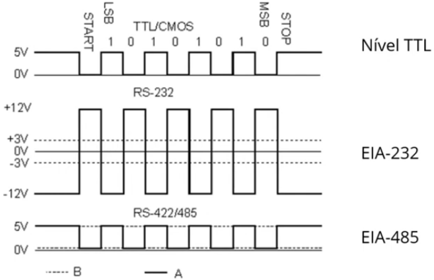
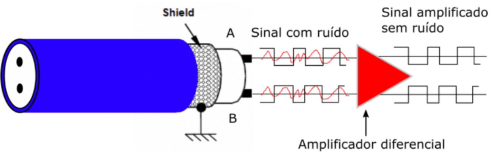
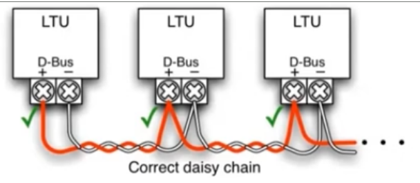
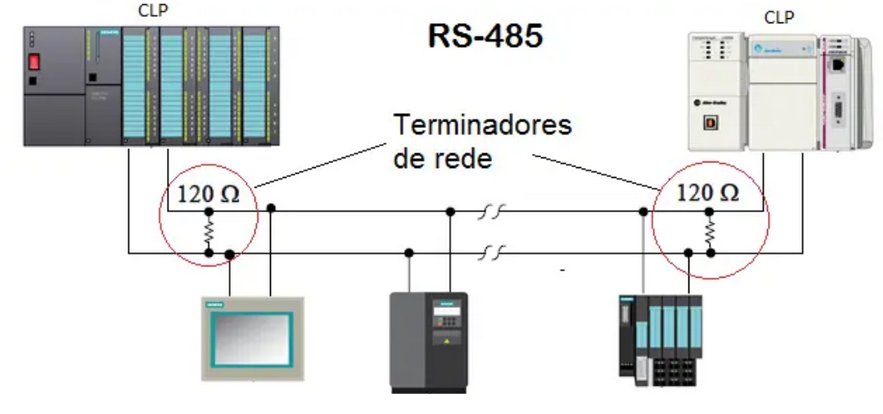
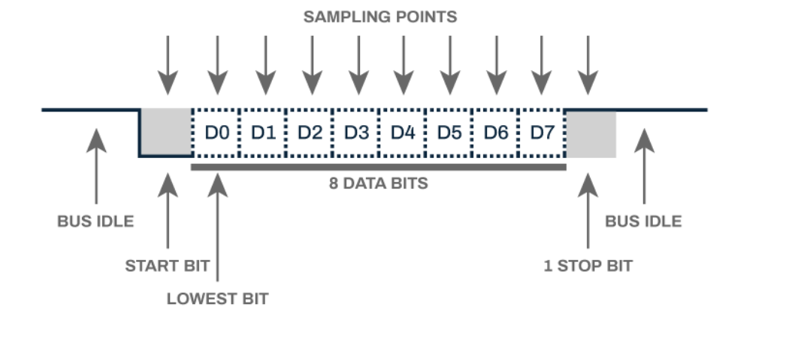
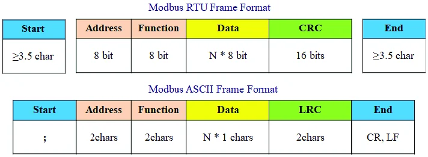
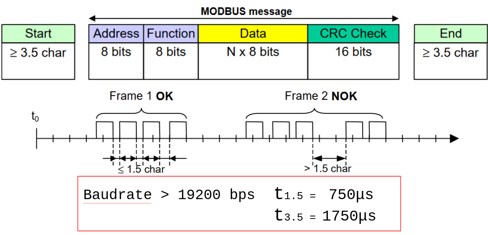
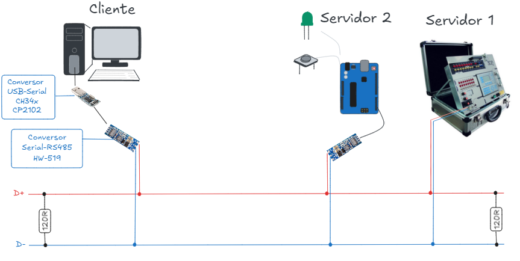

SLTRISS - [Ementa](../../ifsp-slt/automacao/sltriss_ementa.md) - [Plano de Aula](../../ifsp-slt/automacao/sltriss_plano_aula.md)

---

#

# Padrões de Comunicação Serial e plataformas de hardware aberto e de baixo custo

O objetivo principal é integrar plataformas de hardware aberto e baixo custo aos ecossistemas de automação industrial tradicional baseados em CLPs, permitindo uma arquitetura heretogênea para monitoramento secundário de ativos, através do meio físico de transmissão de dados RS485, que apesar de ser um padrão histórico, ainda é amplamente utilizado em ambientes fabris devido a sua transmissão de dados resiliente à interferências eletromagnéticas severas. 

## Padrões de Comunicação Serial: UART, RS-232 e RS-485

A comunicação serial consiste na transmissão sequencial de bits de dados através de uma única linha de sinal ou canal. Na automação, a escolha do padrão serial determina a distância, a velocidade e a imunidade a ruídos da rede:

### UART (Universal Asynchronous Receiver-Transmitter):

É a interface e o protocolo lógico assíncrono integrado ao nível de microcontroladores (como os chips do Arduino e ESP32).

- **Sinalização**: Opera com níveis de tensão lógicos simples (TTL: 0V para nível 0 e 3.3V ou 5V para nível 1). Por não possuir blindagem ou sinalização diferencial, a UART direta limita-se à comunicação de curtíssima distância (centímetros no mesmo circuito impresso).

### Padrão RS-232:

- **Sinalização**: *Single-ended* (referenciada a um terra comum) com lógica bipolar (nível lógico 1 entre -3V e -15V; nível lógico 0 entre +3V e +15V).
- **Topologia**: Comunicação estritamente ponto a ponto (conecta um dispositivo transmissor DTE a um receptor DCE).
- **Limitações**: Suscetível a diferenças de potencial entre os terras dos equipamentos e com alcance restrito a distâncias curtas (até 15 a 20 metros).

### Padrão RS-485:

- **Sinalização**: Sinalização diferencial balanceada através de um par de fios trançados (linhas A/TX+ e B/TX-). O receptor analisa a diferença de tensão entre os dois condutores em vez da tensão em relação ao terra.
- **Imunidade a Ruídos**: Se o ruído eletromagnético de um motor de alta potência induzir um pico de tensão no cabo, o ruído afetará ambos os fios igualmente (ruído de modo comum). A amplificação diferencial do receptor cancela esse ruído (Rejeição de Modo Comum - CMR).
- **Topologia e Alcance**: Suporta topologia em barramento multiponto com até 32 dispositivos receptores por segmento e distâncias de até 1200 metros a taxas de transmissão apropriadas.

## O Ecossistema Open-Hardware e Sensores Digitais de Processo

A introdução de microcontroladores de baixo custo, como o Arduino, na indústria não visa substituir os CLPs no controle crítico de malhas fechadas, mas sim atuar como gateways de aquisição secundária de dados.

Sensores de temperatura e umidade digitais, como o DHT22 / AM2302 por exemplo, utilizam um protocolo digital de fio único (*single-wire digital interface*), onde o microcontrolador envia um pulso de inicialização e o sensor responde enviando um trem de 40 bits de dados serializados, contendo os bytes de umidade, temperatura e um byte de checagem checksum.

---

<!-- ## Aprofundamento Teórico: Comunicação Serial Industrial e Ecossistemas de Hardware Aberto -->
# Aprofundamento teórico

## Física da Sinalização Serial: *Single-Ended* vs. Sinalização Diferencial Balanceada

A camada física (Camada 1 do Modelo OSI) define como os bits são convertidos em grandezas elétricas para propagação através dos meios de transmissão. Na comunicação serial industrial, a escolha do padrão físico determina a imunidade a ruídos, o alcance máximo do cabeamento e a capacidade de interligar múltiplos dispositivos.

### Sinalização *Single-Ended* (Referenciada ao Terra)

Padrões como a **UART TTL** (utilizada internamente em microcontroladores) e o **RS-232** utilizam a sinalização *single-ended*, na qual a tensão do sinal elétrico é medida em relação a um condutor de terra (*Ground* ou \\(V_{GND}\\)) comum.

*   **Mecanismo do RS-232:** A norma estabelece uma lógica invertida/bipolar em relação ao plano de terra: o nível lógico \\(1\\) (*Mark*) é representado por uma tensão negativa entre \\(-3\,\text{V}\\) e \\(-15\,\text{V}\\), enquanto o nível lógico \\(0\\) (*Space*) é representado por uma tensão positiva entre \\(+3\,\text{V}\\) e \\(+15\,\text{V}\\).

*   **Vulnerabilidades:**
    1. **Diferença de Potencial de Terra (\\(V_{GND1} \neq V_{GND2}\\)):** Em instalações industriais com dezenas ou centenas de metros de distância, os pontos de aterramento elétrico de diferentes painéis raramente estão no mesmo potencial absoluto. Essa diferença de potencial insere uma tensão contínua parasita na linha de sinal, corrompendo a leitura lógica do receptor ou destruindo as portas de comunicação.
    2. **Loops de Terra (*Ground Loops*) e Suscetibilidade a EMI:** Qualquer variação de campo magnético gerada pelo chaveamento de motores elétricos de grande porte ou inversores de frequência induz correntes no laço de terra criado entre o cabo de sinal e o aterramento da estrutura.

### Sinalização Diferencial Balanceada (RS-422 e RS-485)

Para superar as limitações do RS-232, os padrões RS-422 e RS-485 adotam a **sinalização diferencial balanceada** sobre par trançado (*Twisted Pair*).

*   **Mecanismo de Leitura:** O receptor não mede a tensão de nenhum condutor em relação ao terra, mas sim a **diferença de potencial elétrico** entre os dois fios da linha de transmissão (\\(V_{diff} = V_A - V_B\\)).
    *   Nível Lógico \\(1\\) (*Mark*): \\(V_A - V_B < -200\,\text{mV}\\) (ou \\(V_B > V_A\\)).
    *   Nível Lógico \\(0\\) (*Space*): \\(V_A - V_B > +200\,\text{mV}\\) (ou \\(V_A > V_B\\)).
*   **Mecanismo de Rejeição de Modo Comum (CMR - *Common-Mode Rejection*):** Quando um ruído eletromagnético externo (EMI) atinge o cabo industrial, a geometria helicoidal do par trançado garante que o ruído seja induzido com **mesma amplitude e mesma fase** em ambos os condutores (\\(V_{A,ruído} \approx V_{B,ruído}\\)). No estágio de entrada do transceptor receptor, a amplificação diferencial cancela o ruído induzido:

\\[V_{diff,recebido} = (V_A + V_{ruído}) - (V_B + V_{ruído}) = V_A - V_B\\]

Essa imunidade contra ruídos de modo comum permite ao RS-485 operar em distâncias de até \\(1200\,\text{m}\\) e suportar topologias multiponto com até \\(32\\) cargas padrão (*unit loads*) por segmento de rede sem o uso de repetidores.

---

## Propagação de Sinais, Impedância Característica e Fenômenos de Reflexão

Em frequências de comutação elevadas ou em cabos de grande comprimento, um condutor elétrico deixa de se comportar como um circuito de parâmetros concentrados e passa a atuar como uma **Linha de Transmissão** com parâmetros distribuídos (indutância \\(L\\), capacitância \\(C\\), resistência \\(R\\) e condutância \\(G\\) por unidade de comprimento).

### Impedância Característica (\\(Z_0\\)) e Casamento de Impedância

Cada modelo de cabo possui uma **Impedância Característica** (\\(Z_0\\)) intrínseca, determinada por sua geometria interna e pelo material dielétrico que isola os condutores:

\\[Z_0 = \sqrt{\frac{R + j\omega L}{G + j\omega C}}\\]

Em redes industriais RS-485 (como nos padrões Modbus RTU e PROFIBUS DP), o cabo trançado padrão apresenta \\(Z_0 \approx 120\,\Omega\\).

### Reflexão de Ondas e a Necessidade de Resistores de Terminação

Quando um pulso elétrico que se propaga pela rede encontra uma descontinuidade de impedância (como o fim de um cabo em circuito aberto, onde a impedância é infinita), a energia da onda incidente não é absorvida e **reflete-se de volta** em direção ao transmissor. O coeficiente de reflexão (\\(\Gamma\\)) na extremidade é dado por:

\\[\Gamma = \frac{Z_L - Z_0}{Z_L + Z_0}\\]

*   Se a extremidade estiver aberta (\\(Z_L = \infty\\)), \\(\Gamma = +1\\), resultando na reflexão total do sinal com a mesma polaridade. A sobreposição da onda incidente com a onda refletida cria picos de tensão, deforma as bordas dos pulsos (*overshoot/undershoot*) e causa **corrupção de bits e paradas aleatórias de comunicação** na planta.
*   **Solução:** Para anular as reflexões (\\(\Gamma = 0\\)), é obrigatório conectar **resistores de terminação** (\\(Z_L = Z_0 = 120\,\Omega\\), \\(1/4\,\text{W}\\)) em paralelo diretamente nas duas extremidades físicas do barramento linear (*daisy-chain*).

*   **Verificação Diagnóstica:** Com a rede desenergizada, a medição com multímetro da resistência equivalente entre os fios de sinal \\(A\\) e \\(B\\) em qualquer ponto do barramento deve resultar em aproximadamente \\(60\,\Omega\\) (equivalente a dois resistores de \\(120\,\Omega\\) colocados em paralelo nas pontas).

### Compromisso entre *Baud Rate* e Comprimento do Cabo

A atenuação do sinal por efeito pelicular (*skin effect*) e as perdas capacitivas aumentam conforme a frequência do sinal sobe. O projeto da camada física deve respeitar o limite do produto entre a velocidade de transmissão (*Baud Rate*) e o comprimento do segmento de cabo:

| *Baud Rate* (bps) | Comprimento Máximo Recomendado (Cabo Tipo A - RS-485) |
| :---: | :---: |
| **9.600 a 93.750 bps** | \\(1200\,\text{m}\\) |
| **187.500 bps** | \\(1000\,\text{m}\\) |
| **500.000 bps** | \\(400\,\text{m}\\) |
| **1.500.000 bps (1.5 Mbps)** | \\(200\,\text{m}\\) |
| **12.000.000 bps (12 Mbps)** | \\(100\,\text{m}\\) |

**Especificações Elétricas do Cabo Tipo A (RS-485 / PROFIBUS DP)**

Quando utilizado na tecnologia de transmissão RS-485, o Cabo Tipo A possui os seguintes parâmetros normalizados:

- Impedância Característica (Z0​): entre 135Ω e 165Ω (em frequências de 3 a 20 MHz).
- Capacitância do Cabo: menor que 30 pF/m.
- Resistência de Loop (Loop Resistance): 110Ω/km.
- Geometria e Bitola do Condutor: diâmetro de 0,64 mm (seção transversal >0,34 mm2 / AWG 22).
- Blindagem: malha ou fita de blindagem (shield) cobrindo o par trançado de condutores de cobre.

---

## Anatomia do Quadro de Comunicação Assíncrona (UART)

A interface **UART** (*Universal Asynchronous Receiver-Transmitter*) realiza a conversão paralelo-serial dos dados dentro dos microcontroladores. O termo *assíncrono* indica que não existe uma linha dedicada de relógio (*clock*) compartilhada entre transmissor e receptor. A sincronização é realizada caractere por caractere com base em transições de nível lógico no próprio sinal.

### Campos do Quadro UART

Um quadro UART padrão é composto sequencialmente por:

1. **Estado de Repouso (*IDLE / MARK*):** A linha permanece em nível lógico alto (\\(1\\)) quando nenhum dado está sendo transmitido.
2. **Start Bit:** Transição obrigatória do nível alto (\\(1\\)) para o nível baixo (\\(0\\)), durando exatamente \\(1\,\text{tempo de bit}\\) (\\(T_{bit} = \frac{1}{\text{Baud Rate}}\\)). Esse pulso avisa o receptor para iniciar seu contador interno de *clock*.
3. **Bits de Dados (*Data Bits*):** Sequência de \\(5\\) a \\(8\\) bits de informação enviada obrigatoriamente a partir do **bit menos significativo (LSb - *Least Significant Bit*)** até o bit mais significativo (MSb).
4. **Bit de Paridade (*Parity Bit* - Opcional):** Bit de checagem de erro adicionado após o MSb.
   * *Paridade Par (Even):* O bit assume \\(1\\) ou \\(0\\) para garantir que o número total de bits \\(1\\) no quadro seja par.
   * *Paridade Ímpar (Odd):* O bit garante que o número total de bits \\(1\\) seja ímpar.
5. **Stop Bit(s):** Retorno obrigatório da linha ao nível lógico alto (\\(1\\)) por um período de \\(1\\), \\(1.5\\) ou \\(2\\) tempos de bit para permitir que o receptor redefina seus registradores internos para o próximo caractere.

### Tolerância a Erros de *Baud Rate* e Dessincronização de Clock

Como o receptor amostra o nível de tensão no centro de cada bit (em \\(0.5 \times T_{bit}\\), \\(1.5 \times T_{bit}\\), etc.), qualquer diferença entre a frequência do oscilador interno do microcontrolador transmissor e a do receptor acumula um desvio temporal. Se o desvio acumulado ao longo do quadro ultrapassar \\(50\%\\) da largura do último bit, o receptor amostrará a transição e gerará um erro de enquadramento (*Framing Error*). A tolerância máxima de desvio de *clock* em quadros UART de 10 bits é tipicamente inferior a \\(\approx 2,5\%\\).

---

## Modos de Transmissão Industrial: Modbus ASCII vs. Modbus RTU

O protocolo Modbus opera na camada de aplicação sob uma arquitetura Cliente-Servidor (ou Mestre-Escravo). Quando implementado sobre meios físicos seriais (RS-232 ou RS-485), o protocolo define dois modos de transmissão distintos para codificar suas PDU (*Protocol Data Units*):

### Modbus ASCII

*   **Codificação:** Cada *byte* de dados da PDU é convertido e transmitido como **dois caracteres binários codificados em ASCII** (por exemplo, o byte `0x3F` é enviado como o caractere ASCII `'3'` [`0x33`] seguido de `'F'` [`0x46`]).
*   **Delimitação de Quadro:** Utiliza delimitadores visíveis: o caractere dois-pontos `':'` (`0x3A`) marca o início do quadro e a sequência de Controle de Carro / Alimentação de Linha `CR` (`0x0D`) e `LF` (`0x0A`) marca o final.
*   **Checagem de Erro:** Utiliza o algoritmo **LRC** (*Longitudinal Redundancy Check*) de 8 bits.
*   **Característica:** Apresenta baixa eficiência de banda (dobra o número de bytes transmitidos), porém permite pausas de até \\(1\,\text{segundo}\\) entre os caracteres do mesmo quadro sem causar erro de enquadramento, sendo ideal para enlaces de rádio lentos ou modems discados.

### Modbus RTU (*Remote Terminal Unit*)

*   **Codificação:** Cada *byte* é transmitido como **binário puro de 8 bits**, aproveitando toda a capacidade útil da linha.
*   **Delimitação de Quadro por Temporização:** Não existem caracteres especiais de início e fim. A delimitação de quadro é realizada estritamente pelo controle de tempo no barramento.
    *   O início e o fim de um quadro são identificados por um **intervalo de silêncio na linha igual ou superior a \\(3,5\\) tempos de caractere (\\(t_{3.5}\\))**.
    *   Se o intervalo entre dois caracteres dentro do mesmo quadro for superior a \\(1,5\\) tempos de caractere (\\(t_{1.5}\\)), o receptor considera a mensagem truncada e descarta o pacote por erro de sincronismo.
*   **Checagem de Erro:** Utiliza um polinômio de verificação de redundância cíclica de 16 bits (**CRC-16**), fornecendo alta segurança contra corrupção de dados por ruído impulsivo.

---

## Integração de Sistemas Mistos e o Papel do *Open-Hardware* na Planta

A integração de plataformas *Open-Hardware* (como Arduino e ESP32) na automação industrial exige uma clara distinção dos papeis funcionais entre os equipamentos de **Tecnologia Operacional (TA)** e as novas ferramentas de **Tecnologia da Informação (TI)**:

| Critério de Engenharia | CLP (Controlador Lógico Programável) - TA | Hardware Embarcado Aberto (Arduino/ESP32) - TI |
| :--- | :--- | :--- |
| **Domínio da Aplicação** | Controle crítico de malha fechada e intertravamentos de segurança de máquinas. | Monitoramento secundário de ativos, aquisição ambiental e nós *Edge/IoT*. |
| **Determinismo Temporal** | Ciclo de varredura (*Scan Cycle*) rígido e previsível, imune a travamentos de software. | Execução baseada em laço simples (`loop()`) ou RTOS sem garantia de isolamento total contra exceções. |
| **Condicionamento Elétrico** | Entradas e saídas optoisoladas, suportando surtos elétricos, transitórios e \\(24\,\text{VDC}\\) industriais. | Entradas diretas em nível lógico TTL (\\(3,3\,\text{V}\\) ou \\(5\,\text{V}\\)) sem proteção nativa contra sobretensões ou inversores. |
| **Arquitetura de Convivência** | Mestre da Rede / Controlador Principal (gerencia a linha crítica). | Nó Escravo de Aquisição Secundária (envia telemetria via RS-485 ou MQTT ao supervisório). |

### Justificativa Técnica para a Arquitetura Mista

A inserção do *Open-Hardware* na indústria não visa substituir o CLP, mas sim **descarregar o processador do CLP principal** de tarefas secundárias de telemetria (como a medição da temperatura ambiente do galpão ou a contagem de vibração preditiva de um motor auxiliar). 

Ao utilizar o Arduino como um **Gateway de Aquisição Secundária**, a equipe de engenharia mantém a rede de controle do CLP rodando seus algoritmos em alta velocidade determinística, enquanto o nó aberto consolida dados auxiliares e os disponibiliza para o sistema SCADA ou para bancos de dados na nuvem através de drivers seriais ou protocolos leves de telemetria.

---

---

# Referências

- ALTUS SISTEMAS DE AUTOMAÇÃO. Protocolos de comunicação: afinal, o que é isso?!. São Leopoldo: Altus, [201-?]. E-book.
- COELHO, Marcelo Saraiva. Apostila de Redes de Comunicação Industrial (RCI): Padrões industriais. Cubatão: Instituto Federal de Educação, Ciência e Tecnologia de São Paulo (IFSP), Campus Cubatão, 2008.
- DANUELLO, Jane Coelho; AMADEI, José Roberto Plácido. Guia para elaboração de referências: ABNT NBR 6023:2018. Bauru: Universidade de São Paulo, Campus Bauru, Serviço de Biblioteca e Documentação, 2023.
- LAGES, Walter Fetter; PEREIRA, Carlos Eduardo. Redes Industriais. Porto Alegre: Universidade Federal do Rio Grande do Sul (UFRGS), Escola de Engenharia, Departamento de Engenharia Elétrica, 2004.
- TANENBAUM, Andrew S.; WETHERALL, David J. Redes de Computadores. Tradução de Daniel Vieira. 5. ed. São Paulo: Pearson Education do Brasil, 2011.
- TOPOLOGIAS, MEIOS FÍSICOS E O UNIVERSO DO CLP. Topologias, meios físicos e o universo do CLP: Apostila técnica e conceitual. [S. l.: s. n.], 2026.

---

# Pós-Ref 0 - Situação-Problema

A empresa ***Baraldis Steelworks*** necessita implementar uma infraestrutura de aquisicao de dados da sua planta de usinagem CNC. Para selecionar o melhor parceiro tecnológico e prestador de serviços, a empresa promoveu um concurso técnico competitivo.

O desafio central consiste na implementação prática da célula pneumática com comunicação multiponto RS-485 / Modbus RTU. Cinco equipes de integracao de sistemas foram selecionadas para construir a prova de conceito (PoC) em bancada e demonstrar a robustez, confiabilidade e integracao dos dados ao dashboard/supervisorio da planta.

A equipe que obtiver a maior pontuacao geral ao final do processo vencerá o concurso e receberá o contrato direto de prestação de serviços para o fornecimento e implantação da infraestrutura completa de aquisição de dados da planta de CNC da ***Baraldis Steelworks***.

## Automação e Monitoramento de Célula Pneumática Multi-Servidor

Uma linha de fabricacao industrial necessita automatizar uma célula de estampagem e fixacao pneumática, integrando o controle de movimento e a supervisão ambiental em uma única rede de comunicação industrial.

Para atender aos requisitos de modularidade e baixo custo, a arquitetura de comunicação do sistema adota uma rede multiponto **RS-485** sob o protocolo **Modbus RTU**. O sistema e composto por um **Cliente Modbus** (sistema supervisório/dashboard em uma IHM/PC) responsável por requisitar periodicamente as informações de dois controladores programáveis (CLPs) operando como **Servidores Modbus**:

1. **Controlador Primário (Servidor Modbus - Endereço 01):** Responsável exclusivo pelo controle sequencial e monitoramento de posição do processo pnemático de atuação. O ciclo de movimento executado pelos atuadores de dupla ação é **$A+ B+ B- A-$**.
2. **Controlador Secundário (Servidor Modbus - Endereço 02):** Responsável pelo monitoramento das condições ambientais do setor e pela sinalização operacional. Ele realiza a leitura contínua de temperatura e umidade da célula e aciona uma torre luminosa amarela em modo intermitente (pisca-pisca) sempre que o controlador primario indicar que a sequẽncia pneumática está em execução.

---

### Mapeamento de Entradas e Saidas (I/O)

#### 1. Controlador Primario (Servidor Modbus ID: 01)

*Aplica-se ao controle da sequencia pneumatica $A+ B+ B- A-$.*

| Endereco | Tipo de I/O | Dispositivo / Elemento | Funcao no Processo |
| --- | --- | --- | --- |
| **I0.7** | Entrada Digital | Botao Pulsador (NA) | Comando de Inicio do Ciclo Pneumatico |
| **I0.0** | Entrada Digital | Sensor Final de Curso $a_0$ (NA) | Detecta Atuador A recuado |
| **I0.1** | Entrada Digital | Sensor Final de Curso $a_1$ (NA) | Detecta Atuador A avancado |
| **I0.2** | Entrada Digital | Sensor Final de Curso $b_0$ (NA) | Detecta Atuador B recuado |
| **I0.3** | Entrada Digital | Sensor Final de Curso $b_1$ (NA) | Detecta Atuador B avancado |
| **Q1.0** | Saida Digital | Solenoide $Y_1$ (Válvula 5/2 vias do Cilindro A) | Comanda o avanco do Atuador A ($A+$) |
| **Q1.1** | Saida Digital | Solenoide $Y_2$ (Válvula 5/2 vias do Cilindro A) | Comanda o recuo do Atuador A ($A-$) |
| **Q1.2** | Saida Digital | Solenoide $Y_3$ (Válvula 5/2 vias do Cilindro B) | Comanda o avanco do Atuador B ($B+$) |
| **Q1.3** | Saida Digital | Solenoide $Y_4$ (Válvula 5/2 vias do Cilindro B) | Comanda o recuo do Atuador B ($B-$) |

---

#### 2. Controlador Secundário (Servidor Modbus ID: 02)

*Aplica-se ao monitoramento ambiental e sinalizacao visual.*

| Endereço | Tipo de I/O | Dispositivo / Elemento | Função no Processo |
| --- | --- | --- | --- |
| **A0** | Entrada Analógica/Digital | Sensor de Temperatura (LM35/DHT11/22) | Leitura continuada da temperatura ambiente da celula |
| **D13** | Saida Digital | Sinalizador Luminoso Amarelo (Torre de LED) | Indicacao luminosa intermitente (processo em operacao) |

---

### Cronogarma

| Etapa | Data | Atividade | 
|:-----:|:----:|:--------- |
| 1     | 30/09 | Apresentação das especificações/situação problema |
| 2     | 30/09 | Levantamento de escopo e planejamento inicial |
| 3     | 30/09 | 10 minutos para realizar o *Pitch* de Escopo e Entregáveis, apresentando de forma objetiva a estratégia planejada e o produto final a ser entregue - Enviar arquivo pdf (1 folha) |
| 4     | 07,21/10 |Montagem, programação e integração |
| 5     | 21/10 | Elaboração de documentação técnica de entrega (Especificação de equipamentos, materiais, infraestrutura, instruções de manutenção, etc) e apresentação |
| 6     | 28/10 | Apresentação da equipe para banca de avaliadores |
| 7     | 28/10 | Entrega de documentação | 

---

### Critérios de Avaliação

| Categoria | Critérios |
|:---------:|:---------:|
| Arquitetura e Comunicação | Correto mapeamento de memório (Datapoints e Datasource) |
| Interface e Design | Usabilidade e alinhamento de elementos gráficos coerentes com o processo |
| Conceitos de supervisão | Sinalização de estados e alarmes |
| Funcionalidade prática | Operação em tempo real (usuário) |
| Domínio e apresentação | Clareza didática e defesa da explicação da lógica, das justificativas das escolhas e respondendo perguntas |
