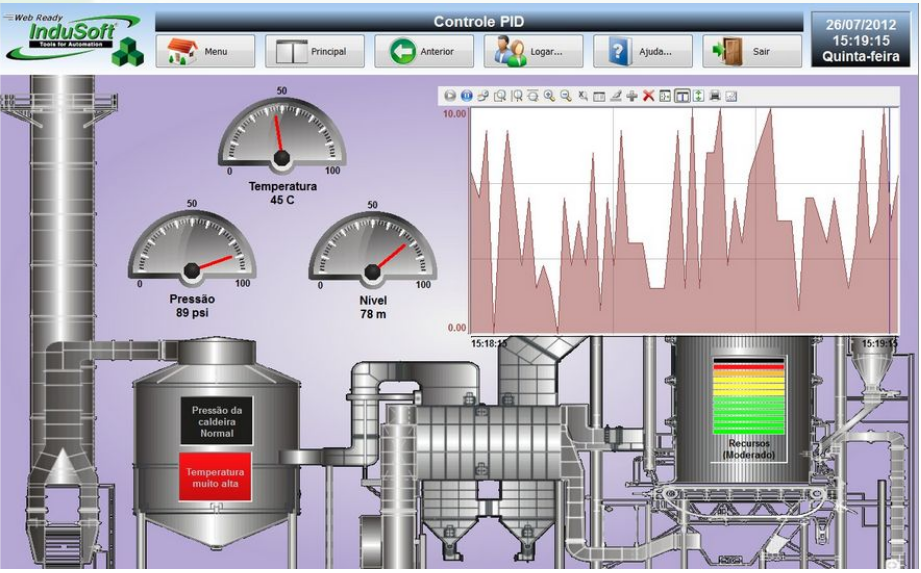
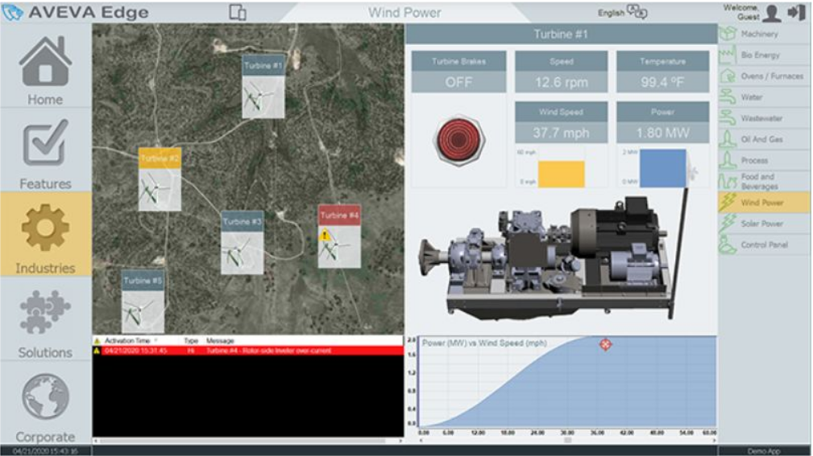

**Sistemas SCADA - Introdução**

 Como grandes operações, como usinas de energia, redes de saneamento ou linhas de produção complexas, são gerenciadas de forma centralizada e eficiente? A tecnologia chave para tudo isso é chamada de SCADA.

**1. O Que é um Sistema SCADA?**

O termo que você encontrará em toda a indústria é **SCADA**. Este acrônimo representa **Supervisory Control and Data Acquisition**, que em português se traduz como **Controle Supervisório e Aquisição de Dados**.

É comum encontrar outros nomes para se referir a essa tecnologia, como:

- Sistema Supervisório
- Sistema de Monitoramento Remoto
- Sistema de Supervisão Remota
- Software SCADA

Em termos simples, um sistema SCADA é um tipo de software projetado para permitir que um operador humano monitore e controle processos industriais ou infraestruturas, mesmo que estejam espalhados por grandes distâncias. De um centro de comando de uma planta industrial, uma única sala com várias telas, os operadores podem ver o status de todos os sistemas, monitorar dados vitais em tempo real e enviar comandos para fazer ajustes, tudo isso sem precisar estar fisicamente nos locais dos sensores ou atuadores. O SCADA oferece essa capacidade de visão e controle para uma fábrica inteira. A Figura 1 ilustra uma tela de processo no sistema Scada Indusoft. 

| Figura 1: Exemplos de SCADA - Indusoft |
|:--------------------------------------:|
|        | 

**2. Por Que o SCADA é Essencial? Os Objetivos e Benefícios**

Os sistemas SCADA não são apenas sobre conveniência, eles são projetados com objetivos claros que trazem benefícios tangíveis para qualquer operação,  e quando bem implementados, atingem objetivos fundamentais, que são a base de sua funcionalidade: 

- **Comunicação Multi-protocolo:** Garantir a capacidade de se conectar e coletar dados de equipamentos de diversos fabricantes, que "falam" linguagens (protocolos) diferentes, unificando a comunicação.
- **Interface Gráfica para Operação:** Apresentar dados em tempo real através de telas intuitivas (sinóticos, gráficos, dashboards) que permitem ao operador não só visualizar, mas também controlar o processo remotamente.
- **Registro de Eventos e Relatórios Históricos:** Armazenar dados e ocorrências do sistema para criar relatórios detalhados, essenciais para análise de performance, rastreabilidade e otimização de processos.
- **Gerenciamento de Alarmes Configuráveis:** Notificar os operadores sobre condições anormais ou falhas de forma imediata, permitindo uma resposta rápida para garantir a segurança e a estabilidade da operação.

Ao alcançar esses objetivos, os sistemas SCADA geram um impacto direto e positivo nos resultados do negócio:

1. **Aumento da eficiência operacional**
    - A centralização do controle e a visão completa do processo permitem tomar decisões mais rápidas e inteligentes, otimizando a produção.
2. **Redução de custos**
    - Ao monitorar o uso de recursos e prevenir falhas e paradas de produção dispendiosas, o SCADA ajuda a economizar energia, matéria-prima e custos de manutenção.
3. **Melhoria na qualidade do produto**
    - O controle preciso e imediato de variáveis como temperatura e pressão garante que o processo se mantenha dentro das especificações ideais, resultando em um produto final mais consistente e de maior qualidade.
4. **Segurança industrial**
    - A detecção antecipada de condições perigosas e a capacidade de operar equipamentos remotamente reduzem a exposição dos trabalhadores a ambientes de risco.

Para alcançar esses benefícios, o sistema SCADA depende de uma arquitetura bem definida que conecta o software à operação física. A figura 2 ilustra uma tela no software Scada Aveva, que anteriormente era conhecida como Indusoft, dominante no mercado industrial. 

| Figura 2: Ilustração de software Scada Aveva, antiga Indusoft |
|:-------------------------------------------------------------:|
|                                     |

**3. A Arquitetura de um Sistema SCADA**

Um sistema SCADA não funciona sozinho. Ele é a camada superior de uma arquitetura de automação que pode ser dividida em três níveis.

1. **Sistema SCADA**
    - Esta é a camada de software e hardware (computadores e servidores) onde tudo acontece para o operador. É aqui que os dados são apresentados em telas gráficas, conhecidas como Interface Homem-Máquina (HMI), e de onde os comandos de controle são enviados.
2. **Controladores**
    - Esta camada intermediária é composta por equipamentos como os **CLPs (Controladores Lógicos Programáveis)**. Eles recebem os comandos do SCADA e executam a lógica de controle localmente, tomando decisões em tempo real para gerenciar os equipamentos de campo.
3. **Atuadores e Sensores**
    - Esta é a camada de campo, onde a ação física ocorre. Os **sensores** (de temperatura, pressão, nível) coletam os dados do processo e os enviam para os controladores. Os **atuadores** (motores, válvulas, bombas) recebem os comandos dos controladores e executam as ações físicas.

A Figura 3 ilustra uma planta industrial com sistema supervisório Elipse, um dos mais populares no mercado. 

| Figura 3: Infraestrutura de uma planta industrial com sistema supervisório |
|:--------------------------------------------------------------------------:|
|                                               |
| Fonte: [Elipse](https://www.elipse.com.br/produto/elipse-e3/)              |

**4. Aplicações no Mundo Real**

Devido à sua capacidade de gerenciar operações complexas e geograficamente distribuídas, os sistemas SCADA são onipresentes em setores vitais para a sociedade.

Os sistemas SCADA são a espinha dorsal do monitoramento de infraestruturas essenciais, incluindo:

- Energia elétrica (geração e distribuição)
- Gás (transporte e distribuição)
- Água (estações de tratamento e redes de saneamento)
- Petróleo (refinarias e oleodutos)

Dentro do ambiente industrial, o SCADA desempenha papéis cruciais em diversas frentes:

1. **Monitoramento de Processos**
    - Permite o acompanhamento instantâneo de todas as ações na linha de produção. Ao organizar e gerenciar todas as variáveis em telas intuitivas, o sistema facilita a compreensão e permite a correção de falhas no momento exato em que elas surgem.
2. **Controle de Produção**
    - Todo o ciclo de produção pode ser controlado automaticamente para seguir os parâmetros definidos. Se for necessário ajustar a temperatura, pressão ou vazão, essas correções são feitas sem atrasos, mantendo a qualidade e a produtividade de todo o processo.
3. **Gerenciamento de Ativos**
    - Auxilia na supervisão da estrutura física da indústria, permitindo a criação de indicadores de produção baseados nas capacidades técnicas dos equipamentos. Isso possibilita ao gestor uma verificação precisa do ciclo de vida de cada material e ativo.

| Figura 4: Tela de monitoramento em sistema Elipse SCADA |
|:-------------------------------------------------------:|
|                           |

**5. Conclusão**

Em resumo, um sistema SCADA  coleta informações do mundo físico através dos sensores, processa esses dados em um centro de controle e permite que os operadores tomem decisões informadas e executem ações precisas através dos atuadores.

Entender o que é um SCADA e como ele funciona é dar o primeiro passo para compreender a base da automação moderna e a tecnologia que mantém nosso mundo funcionando de forma eficiente, segura e confiável.

---

**Referências**

- [ALTUS. BluePlant | Produtos](https://www.altus.com.br/produto/20/scada-blueplant) . Acesso em: 15 out.2024.
- [ALTUS. Como o sistema supervisório ajuda na produtividade de uma empresa?](https://www.altus.com.br/post/528/sistema-supervisorio-produtividade-empresa) Acesso em: 15 out. 2024.
- [ALTUS. Sistema SCADA: entenda sua importância para a indústria](https://www.altus.com.br/post/550/sistema-scada-importancia-para-industria) Acesso em: 15 out. 2024.
- [AVEVA. AVEVATM Edge - HMI and IoT Edge solution for OEMs and End Users](https://www.aveva.com/pt-br/products/edge/) Acesso em: 15 out. 2024.
- [ELIPSE. PLATAFORMA HMI/SCADA PARA APLICAÇÕES DE MISSÃO CRÍTICA](https://www.elipse.com.br/wp-content/uploads/2015/09/E3_Folder.pdf) Acesso em: 15 out. 2024.
- [SCADABR. ScadaBR](https://www.scadabr.com.br/) Acesso em: 15 out. 2024.
