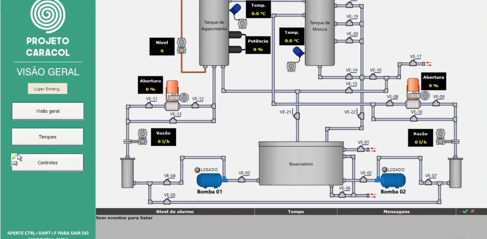

# [SCADA Br](https://scadabr.org/)

**Natureza e Origem**

*   **Software Open Source:** O ScadaBR é um software SCADA de código aberto (*Open Source*).
*   **Desenvolvimento:** Foi desenvolvido a partir do software SCADA *Open Source* chamado **Mango**.
*   **Início e Financiamento:** O projeto foi iniciado em 2006 em colaboração com a **Fundação CERTI e a UFSC** (Universidade Federal de Santa Catarina). Recebeu financiamento da **FINEP, SEBRAE e CNPq**.
*   **Tecnologia:** É desenvolvido em **Java**. É distribuído em formato **.war** (*Web application ARchive*) e utiliza dependências como Java 8 / Open JDK 8 e Tomcat 9.

**Características Técnicas e Acessibilidade**

O ScadaBR é notável por sua acessibilidade e capacidade de integração.

*   **Multiplataforma:** Pode ser instalado em ambientes **Windows ou Linux**. Novos instaladores também incluem suporte para arquitetura **ARM (Raspberry PI)**.
*   **Acesso Remoto via Browser:** A interface de usuário é acessada via **navegador**.
*   **Sem necessidade de Clientes:** Não requer a instalação de *clientes* e permite o acesso de qualquer lugar, seja por celular, tablet, notebook ou computador.
*   **Capacidade Ilimitada:** O sistema possui **views/usuários ilimitados** e permite a utilização de **tags/pontos ilimitados**, além de possibilitar o uso de quantos *drivers* o usuário desejar.
*   **Comunicação e Protocolos:** O ScadaBR é capaz de fazer aquisição de dados em **mais de 20 protocolos**, incluindo:
    *   Modbus TCP/IP e Serial.
    *   OPC, DNP3, IEC.
    *   Serial ASCII, HTTP, entre outros.
*   **Interfaces de Programação:** Oferece interfaces **SOAP e REST**.

| Figura : Exemplo de tela no ScadaBr |
|:-----------------------------------:|
|  |

**Setores de Aplicação**

O sistema SCADABR abrange uma vasta área de aplicações, sendo adequado para controlar e supervisionar qualquer sistema:

*   **Setor Industrial e Predial:** Automação industrial/Controle de processos, Automação residencial e Automação predial.
*   **Infraestrutura:** Sistemas de Energia e Saneamento básico. Exemplos de aplicação incluem monitoramento de geração de energia (como em microrredes) e sistemas de água/reservatórios (como a CASAN).
*   **Outras Áreas:** HVAC (Ventilação, Aquecimento e Ar-Condicionado), Eficiência energética, IoT, Automação rural/Agricultura, Aplicações para Redes de Sensores sem-fio e Estações Meteorológicas.
*   **Pesquisa:** Também é utilizado em Pesquisa e Desenvolvimento.
   

| Figura : Projeto Caracol |
|:-------------------------------:|
|  |
| Fonte: [Projeto Caracol](https://youtu.be/Jr4DVqzl8CI?si=I1nN0Up33fSFMEeX) |

---

| Figura : Scada LTS                   |
|:------------------------------------:|
|  | 
| Fonte: [Scada-LTS - GitHub](https://github.com/SCADA-LTS/Scada-LTS) |

|     |     |
|:---:|:---:|
| Price | Free (GPL License) |
| Annual Maintenance Fee | None |
| # of Data Points | Unlimited |
| User Connections | Unlimited |
| Protocols | All suported (no restrictions) |
| REST API | Yes |
| Reports | Yes |
| Creating a data warehouse | Optional (to order)|

---

---

**Referências**

- [SCADABR. ScadaBR](https://www.scadabr.com.br/) Acesso em: 15 out. 2024.
