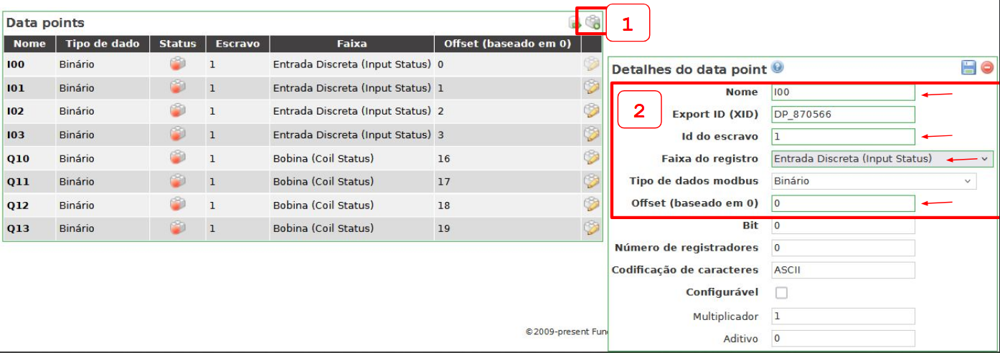
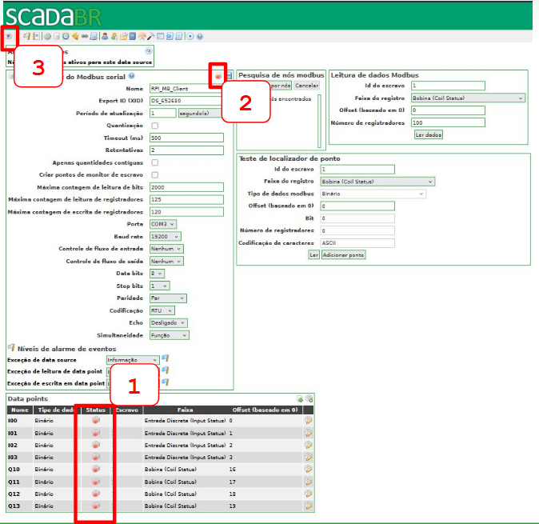
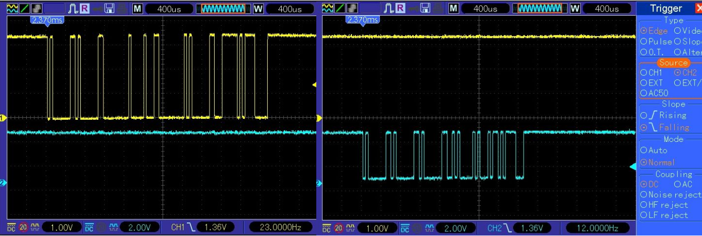

# [SCADA Br](https://scadabr.org/)

1) Login no Scada-Br

2) Seleção de canal de fonte de dados

3) Propriedades do Modbus Serial

4) Propriedades dos Modubs Serial

5) Adicionando um *Data points*

6) Salvando *Data points*
   

7) Visulizando *Data points* configurados

---

8) Sinal de comunicação serial

9) Múltiplos sinais de comunicação

10) *Frames* de envio e resposta modbus

---

**Referências**

- [SCADABR. ScadaBR](https://www.scadabr.com.br/) Acesso em: 15 out. 2024.
