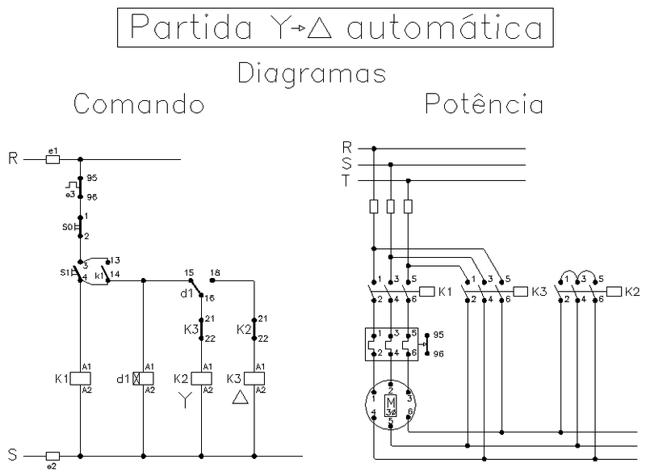

# Partida Estrela-Triângulo

---

# 1. Objetivo 

Desenvolver uma aplicação, programa, 
para um dispositivo de comando para partida Estrela-Triângulo.

| Figura 1: Diagramas de comando e potência da partida Estrela-Triângulo |
|:-------------------:|
|  |
|Fonte: [Wikipedia](https://pt.wikipedia.org/wiki/Partida_estrela-tri%C3%A2ngulo) |

---

## 1.1 - Requisitos da solução

### 1.1.1 Componentes de interface

- Botoeira ligar: S1;
- Botoeira desligar: S0;
- Contatores de acionamento: K1, K2 e K3;

### 1.1.2 Comportamento

- Ao pressionar S1
    - Ligar K1, K2 (fechamento estrela);
    - Temporizar 5 segundos
    - Desligar K2 e ligar K3 (fechamento triângulo).
- Ao pressionar S0, em qualquer momento:
    - Desligar todos os contatores.

---

# 2 Planejamentos 

## 2.1 Produto final

* Apresentação de funcionamento em kit didático
* Arquivo .pdf contendo:
	* declaração de interface física, entradas e saídas com respectivos endereços;
	* declaração de programa contendo interface e comportamento para a partida proposta.

## 2.2 Ferramentas

1. Software Master Tool IEC
2. Kit didático: TB131 Altus

## 2.3 Materiais

* Não há!

## 2.4 Processo

  1. Abrir projeto a partir do modelo: `Modelo_DU350_DU351_v110.pro`;
  2. Acrescentar objeto POU do tipo Programa e escolher a linguagem;
  3. Produzir mapa de entradas e saídas;
  4. Declarar entradas e saídas físicas;
  5. Programar;
  6. Testar aplicação;
  7. Entregar funcionamento.

---

# 3. Solução

Produto ou processo que atinge o objetivo proposto, 
através da execução de seu planejamento e satisfação dos seus requisitos.

---

Bom Trabalho!
