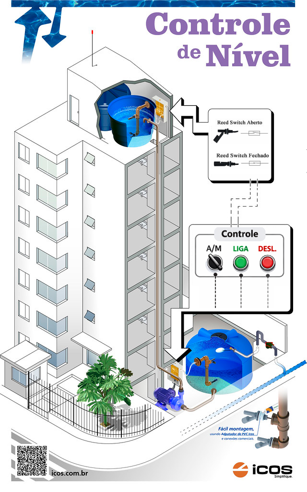

# Controle de Nível

---

# 1. Objetivo 

Desenvolver uma aplicação, programa, 
para controlar o acionamento de modo a controlar o nível em um reservatório de água no topo de um edifício. 

| Figura 1: Ilustração de sistema de controle de nível em caixa d'água |
|:-------------------:|
|  |
|Fonte: [Modificado de icos](https://www.eicos.com.br/controle-de-nivel/index.php) |

---

## 1.1 - Requisitos da solução

### 1.1.1 Componentes de interface

- LIGA: Botoeira ligar (Contato NA);
- DESL: Botoeira desligar (Contato NF);
- A/M:  Chave de seleção de operação Automática/Manual
- Sensores de nível (Presença de líquido - Fechado / Ausência de líquido - Aberto):
    - LSA1: Sensor de nível alto do reservatório superior;
    - LSA0: Sensor de nível baixo do reservatório superior;
    - LSB1: Sensor de nível alto do reservatório inferior;
    - LSB0: Sensor de nível baixo do reservatório inferior;
- K1: Acionamento do conjunto motor-bomba que enche a caixa superior.
    

### 1.1.2 Comportamento

- Chave A/M na posição desativada (Operação manual)
    - Comando LIGA acionado
        - Se houver água acima do nível mínimo no reservatório inferior, ligar K1 (motor-bomba) que envia água para o reservatório superior, até que o seu nível alto seja atingido.
        - Durante qualquer momento de operação da bomba, ela pode ser interrompida se pressionado o botão DESL. 
- Chave A/M na posição ativada (Operação automática)
    - O enchimento do reservatório superior deve iniciar quando o nível do reservatório superior estiver abaixo do sensor de nivel baixo, e deve encerrar quando o enchimento atingir o sensor alto do reservatório, desde que o sensor de nível baixo da caixa inferior esteja acionado, garantindo a existência de água e evitando a queima do conjunto motor-bomba. 
    
- A bomba não deve ser acionada se o nível de água estiver acima do nível alto no reservatório superior ou abaixo do nível baixo no reservatório inferior, para ambos os modos de operação.

---

# 2 Planejamentos 

## 2.1 Produto final

* Apresentação de funcionamento em kit didático
* Arquivo .pdf contendo:
	* declaração de interface física, entradas e saídas com respectivos endereços;
	* declaração de programa contendo interface e comportamento para a partida proposta.

## 2.2 Ferramentas

1. Software Master Tool IEC
2. Kit didático: TB131 Altus

## 2.3 Materiais

* Não há!

## 2.4 Processo

  1. Abrir projeto a partir do modelo: `Modelo_DU350_DU351_v110.pro`;
  2. Acrescentar objeto POU do tipo Programa e escolher a linguagem;
  3. Produzir mapa de entradas e saídas;
  4. Declarar entradas e saídas físicas;
  5. Programar;
  6. Testar aplicação;
  7. Entregar funcionamento.

---

# 3. Solução

Produto ou processo que atinge o objetivo proposto, 
através da execução de seu planejamento e satisfação dos seus requisitos.

---

Bom Trabalho!
