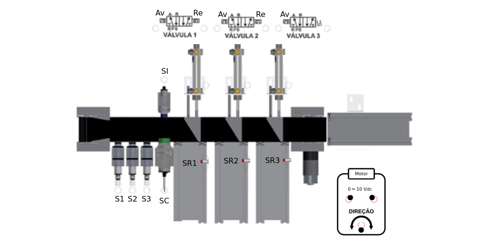

# Separador de peças por altura

---

# 1. Objetivo

Desenvolver uma aplicação, programa de PLC, 
para executar a separação de peças por altura em uma linha de produção. A Figura 1 ilustra o processo e a disposição de sensores e aturadores. 


|Figura 1: Processo de separação de peças      |
|:--------------------------------------------:|
|     |
| Fonte: Adaptado de Manual de Instruções Experimentais Mod. AMD-AI15 |


---

## 1.1 - Requisitos da solução - Componentes de interface

- A interface com o PLC deve obedecer a seguinte declaração de variáveis: 

``` pascal
PROGRAM PLC_PRG
VAR
	(* Entradas Digitais *)
	SENSOR_BAIXA		AT %IX0.0: BOOL;
	SENSOR_MEDIA		AT %IX0.1: BOOL;
	SENSOR_ALTA			AT %IX0.2: BOOL;
	SENSOR_CAP			AT %IX0.3: BOOL;
	SENSOR_IND			AT %IX0.4: BOOL;
	SENSOR_RAMPA_1		AT %IX0.5: BOOL;
	SENSOR_RAMPA_2		AT %IX0.6: BOOL;
	SENSOR_RAMPA_3		AT %IX0.7: BOOL;

	(* Saídas Digitais *)
	VALVULA_1_AV		AT %QX1.0: BOOL;
	VALVULA_1_RE		AT %QX1.1: BOOL;
	VALVULA_2_AV		AT %QX1.2: BOOL;
	VALVULA_2_RE		AT %QX1.3: BOOL;
	VALVULA_3_AV		AT %QX1.4: BOOL;

	(* Entradas/Saidas Analógicas *)
	AJUSTE_VEL			AT %IW4  : WORD;
	MOTOR				AT %QW4  : WORD;
	DISPLAY				AT %QW3  : WORD;

	(* Variáveis *)
	VEL_MAX						 : WORD := 75;

END_VAR
```


## 1.2 - Requisitos da solução - Comportamento

- Ao ligar o sistema, para a esteira entrar em movimento deve-se usar o potenciômetro do kit TB131 para ajustar a velocidade. 
- Com a esteira em movimento deve-se inserir apenas uma peça por vez no sistema de separação;
- Quando uma peça entra no sistema, a sua altura deve ser identificada e em seguida deve haver o acionamento do atuador responsável por sua separação. 
- A ordem dos sensores de altura e dos separadores com suas rampas fica a critério dos executores;
- Uma nova peça somente pode ser inserido após a peça em movimento ser ejetada para a sua rampa de separação, e contabilizada por altura;
- O programa principal deve ser realizado em linguagem Ladder;
- O programa principal deve ser estruturado usando Blocos Funcionais:
	- Bloco funcional `VerAltura`: verifica a altura da peça que entrou no sistema pela esteira;
	- Bloco funcional `Atuadores`: desvia as peças da esteira para as rampas de separação de acordo com suas alturas;
	- Bloco funcional `Esteira`: Faz o controle de acionamento, parada e velocidade de deslocamento da esteira. 
	- Cada bloco pode ser construído com qualquer linguagem de programação disponível no Master Tool IEC;
- Usar a IHM para:
	- Editar velocidade máxima permitida para a esteria. Intervalo de uso de 0 a 100%; 
	- Mostrar a contagem de peças por altura; 
- Usar um potenciômetro para ajustar a velocidade de movimentação da esteira entre o valor 0 e o valor máximo configurado na IHM;


---

# 2 Solução

- A entrega da solução deve acontecer em duas etapas:
	- Apresentação do funcionamento ao professor;
	- Entrega de programa no formato `.pdf` através do seguinte [endereço eletrônicos](https://forms.gle/6G8Q2jGoPpQSEQ5y6) ;
- Pode ser realizada a atividade avaliativa de forma individual, em dupla, trio ou no máximo, quarteto;
- O período de realização da atividade e entrega sem estar de recuperação é: 15, 19 e 22/06;
- Qualquer finalização e entrega após o dia 22/06 será considerado em processo de recuperação até o dia 29/06.

---

Bom trabalho!
