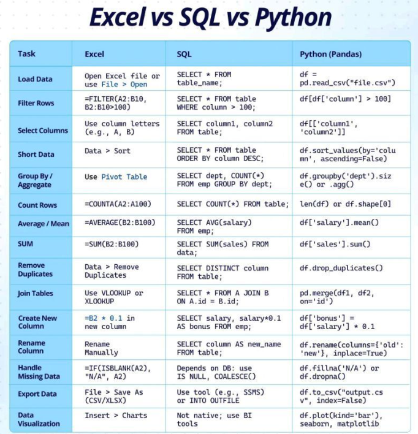
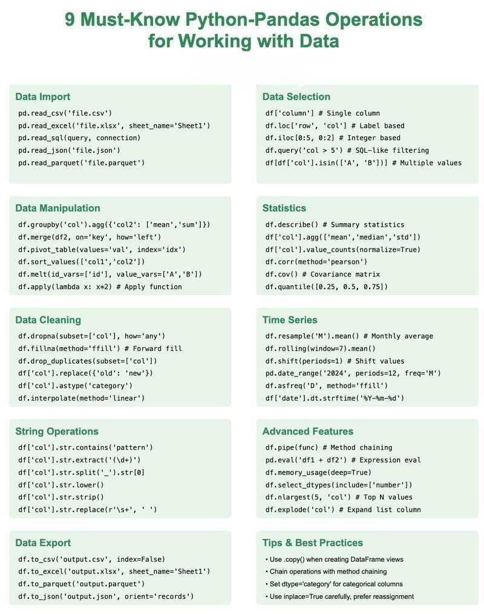

# Linguagem C

1. [Fundamentos da Linguagem C - debxp](https://youtube.com/playlist?list=PLXoSGejyuQGqk-_fjrmT5eHrM_gvldIQP&si=GpL-t4bcJmKdfsQa)
2. [Curso Básico da Linguagem C - debxp](https://youtube.com/playlist?list=PLXoSGejyuQGrDX08GVrQHAhh4j3KJ4iYN&si=6p_wntGpMzYG_2b2)

---

# Sistemas Digitais

1. [Sistemas Digitais - debxp](https://youtube.com/playlist?list=PLXoSGejyuQGp9mY5CxR695Hd-4BGmbq-3&si=bCgGKsE5SDVUynXT)

---

# MATLAB

1. [MATLAB Onramp](https://matlabacademy.mathworks.com/en/details/matlab-onramp/gettingstarted)
2. [MATLAB Plot Gallery](https://www.mathworks.com/products/matlab/plot-gallery.html)
3. 

---

# Lógica Fuzzy
[Aplicação da Lógica Fuzzy em sw e hw](https://doceru.com/doc/8cnnv08)

---

# Python

Fonte: LinkedIn Python

## FFT

[Como fazer Transformada de Fourier no Python? (FFT) | Sinais e Sistemas](https://youtu.be/1-i4byj3MqI?si=-6yPHQfrE-wjiHab)

---

# RISC-V

- [MC404 - Organização Básica de Computadores e Linguagem de Montagem](https://www.ic.unicamp.br/~rodolfo/mc404/)
- [An Introduction to Assembly Programming with RISC-V](https://riscv-programming.org/book/riscv-book.html)
- [Guia Prático RISC-V: Atlas de uma arquitetura aberta](http://riscvbook.com/portuguese/)
-  RISC-V Simulator, RISC-V Interpreter, Venus, QtRVSim.

# LaTeX

- [Lista de Símbolos Matemáticos](https://wp.ufpel.edu.br/fernandosimoes/files/2012/06/Simbolos-matematicos.pdf)

