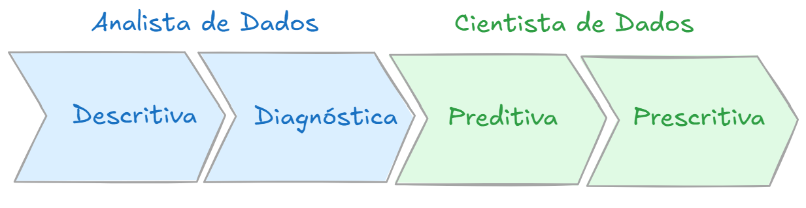

# Análise de Dados

A análise de dados é o processo de manipulação de dados através de ferramentas computacionais e estatísticas, de modo a buscar informações relevantes que auxiliam à tomada de decisão. 

São basicamente quatro os tipos de análise de dados:

1. Descritiva
2. Diagnóstica
3. Preditiva
4. Prescritiva

Eles são usadas em função do objetivo da análise e do conjunto de dados que se está 
trabalhando, começando pela avaliação do problema de negócio, 
em que são realizadas perguntas tais como:

1. O resultado da ação foi positivo ou negativo?
2. Por que os resultados foram esses?
3. Como tomar uma decisão?
	
Após a definição do problema que será estudado, 
deve-se **descrever** o comportamento dentro de um escopo bem definido, 
**diagnosticar** os motivos que produziram os comportamentos. 
Daí seguem etapas mais complexas, costumeiramente desenvolvidas por cientistas de dados, 
que envolver processos de **prever** o comportamento baseado em histórico e 
por fim **prescrever**/orientar ações para alcançar as metas do negócio. 
Estas duas últimas etapas são mais complexas, envolvem um ferramental estatístico 
mais avançado e técnicas de aprendizado de máquina. 

A Figura 1 ilustra um fluxo para análise de dados, 
que segue desde a análise descritiva até a prescritiva, porém, 
não é necessária a realização de todo o fluxo de análise, 
pois tudo depende da finalidade da análise. 

| Figura 1: Fluxo de análise de dados               |
|:-------------------------------------------------:|
||
| Fonte: Autor                                      |

A divisão entre analista e cientista é uma tendência, não uma obrigatoriedade, 
apenas uma separação em função do nível de aplicação de técnicas de análise. 

**Análise Descritiva**

Fornece um resumo simples de uma planilha de dados, 
através de **indicadores, gráficos e tabelas**. 
Realiza a exploração inicial dos dados, permitindo a compreensão da distribuição, 
valor central e dispersão dos dados, além da presença de possíveis _outliers_.

São características da Análise Descritiva:

1. Resumo de dados:
	1. Medidas de tendência central: Média, Moda e Mediana;
	2. Medidas de dispersão: Desvio padrão e Variância.
2. Visualização de dados:
	1. Relação entre variáveis.
3. Identificação de padrões.

As principais ferramentas utilizadas na análise descritiva são:

1. Planilhas de cálculo: Excel, Google Sheets;
2. Softwares estatísticos: SPSS, Stata;
3. Softwares de visualização de dados: Tableu, Power BI;
4. Linguagens de programação: Python e R.

**Análise Diagnóstica**

Busca entender os motivos ou causas por trás de determinado fenômeno ou resultado. 
Procura responder à pergunta "por quê?", busca identificar padrões e relações 
nos dados que podem explicar mudanças ou tendências observadas e ainda pode 
envolver a consideração de fatores externos ou internos.

São características da análise diagnóstica:

1. Investigativa:
	* Buscando entender as causas subjacentes de um fenômeno ou problema.
2. Baseada em Hipóteses:
	* Uma hipótese é proposta e a análise é usada para testar ela. 
3. Uso de dados históricos:
	* Identificar tendências, padrões e relações que podem explicar os resultados atuais.
4. Análise Multivariada:
	* Pode envolver múltiplas variáveis ao mesmo tempo para entender as interações complexas que podem estar influenciando um resultado
5. Interpretação cuidadosa

As principais ferramentas utilizadas na análise diagnóstica são: 

1. Análise de regressão: Identificar a relação entre variáveis dependentes e independentes;
2. Análise de correlação: Determinar a relação entre duas ou mais variáveis;
3. Análise de *cluster*: Agrupa por características semelhantes;
4. Análise de causa e efeito (Diagrama de Ishikawa): Proporciona uma visão ampla e identificação de possíveis causas de um problema.

**Análise Preditiva**

Análise estatística que tem como objetivo prever resultados futuros com base em 
dados históricos e técnicas de modelagem. O processo geralmente envolve a coleta de dados, 
o desenvolvimento de um modelo estatístico e  a previsão de resultados futuros com 
base nesse modelo. Esses modelos podem ser simples, envolvendo apenas algumas variáveis, 
ou extremamente complexos, envolvendo muitas variáveis e relações interdependentes.

São características da análise preditiva:

1. Baseada em modelos: Estatísticos e de *Machine Learning*.
2. Usa histórico de dados: Treinamento dos modelos.
3. Multivariável: Consideram a interação entre muitas variáveis para previsões.
4. Preditiva, mas não infalível: Sempre há um grau de incerteza. 
5. Orientada para a ação: Resultados orientam a tomada de decisão.

As principais ferramentas utilizadas na análise preditiva são:

1. Python: Juntamente com bibliotecas como Pandas, NumPy, Sci-kit Learn
2. R: Análise estatística e gráficos, principalmente no meio acadêmico e pesquisa.
3. SAS: *Statistical Analysis System*, muito usado em setores financeiro e saúde.
4. SPSS: Software de fácil usabilidade e com ampla gama de ferramentas disponíveis.
5. Excel: Aplicado quando não se requer técnicas estatísticas avançadas. 

**Análise Prescritiva**

Fornece recomendações sobre o que deve ser feito, utilizando **técnicas avançadas** 
que levam em consideração uma **variedade de cenários** e **possíveis resultados**, 
para ajudar os tomadores de decisão a entender as implicações de diferentes cursos de ação. 

São características da análise prescritiva:

1. Recomendações de ação;
2. Consideração de diferentes cenários;
3. Otimização de operações;
4. Auxílio à tomada de decisão;
5. Adaptação a mudanças nas condições: pode incorporar novos dados à medida que se tornem disponíveis.

As principais ferramentas da análise prescritiva são:

1. Softwares de modelagem: Python, R, SAS, SPSS
2. Ferramentas de otimização: Gurobi, CPLEX
3. Ferramentas de simulação: Simul8, AnyLogic
4. Ferramentas de visualização de dados: Tableau, Power BI
5. Plataformas de *machine learning*: Azure ML, Amazon SageMaker

Exemplo de análise preditiva: 

[Kaggle - Forecasting Future Passengers w/ PyCaret](https://www.kaggle.com/code/caesarmario/forecasting-future-passengers-w-pycaret)

---
