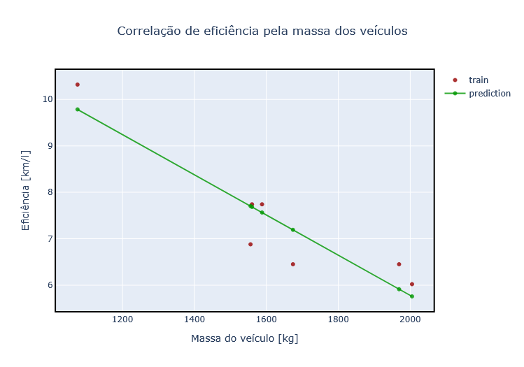

# Regressão linear - Atividade mediada

Objetivo: 
Encontrar os coeficientes de uma reta que melhor ilustra os pontos do exemplo da Figura 1.

|Figura 1: Relação Massa x Eficiência em veículos com reta de predição |
|:--------------------------------------------------------------------:|
|                                    |
| Fonte: Adaptado de [Regressão linear - Google](https://developers.google.com/machine-learning/crash-course/linear-regression?hl=pt-br) |


Utilizando o [Google Colab](https://colab.google/), execute o código a seguir:

Carregue o arquivo de dados diretamente do seu computador clicando no botão `Upload to session storage`, conforme indicado na Figura 2:

| Figura 2: Carregando um arquivo para área de armazenamento em nuvem |
|:-------------------------------------------------------------------:|
|                                   |
| Fonte: Autor                                                        |

1) O dataset utilizado pode ser baixado [aqui](../dataset/carro_eficiencia.csv).

2) Importando as bibliotecas:

```py
# Biblioteca para manipulação de conjunto de dados, incluindo arquivos .csv
import pandas as pd

# Biblioteca para calculo científico e algebra linear
import numpy as np
import math

# Bibliotecas para visualização de dados
import matplotlib.pyplot as plt
import plotly.express as px
import plotly.graph_objects as go

```

3) Realizando a leitura da tabela de dados para a variável `data`:

```py
data = pd.read_csv('carro_eficiencia.csv')
data.info()
```

4) Exibindo os dados:

```py
print(data.columns)
data.head(10)
```

5) Plotando os dados:

```py
fig = px.scatter(x = data['kg'], y=data['km_l'])
fig.update_layout(title = 'Eficiência x massa do veículo', title_x=0.5, xaxis_title= "Massa do veículo [kg]", yaxis_title="Eficiência [km/l]", height = 500, width = 700)
fig.update_xaxes(showline=True, linewidth=2, linecolor='black', mirror=True)
fig.update_yaxes(showline=True, linewidth=2, linecolor='black', mirror=True)
fig.show()
```

6) Calculando coeficientes `b` e `w`, de forma estatística:

```py
mean_x = np.mean(data['kg'])
mean_y = np.mean(data['km_l'])

var_x = np.var(data['kg'])
var_y = np.var(data['km_l'])


print('x stats: mean= %.3f   variance= %.3f' % (mean_x, var_x))
print('y stats: mean= %.3f   variance= %.3f' % (mean_y, var_y))


# Calcula a covariância entre x e y
def covariance(x, y):
    mean_x = np.mean(x)
    mean_y = np.mean(y)
    covar = 0.0
    for i in range(len(x)):
        covar += (x[i] - mean_x) * (y[i] - mean_y)
    return covar/len(x)


covar_xy = covariance(data['kg'], data['km_l'])
print(f'Cov(kg,km_l): {covar_xy}')


w = covar_xy / var_x
b = mean_y - w1 * mean_x

print(f'Coeficientes:\n b: {b}  w: {w} \n \n y = b + w.x')
```


7) Carregando variáveis `x` e `y` para facilitar plot dos dados e calculando `y_pred` com base nos parâmetros definidos anteriormente:

```py
x       = data['kg'].values.copy()
y       = data['km_l'].values
y_pred  = b + w * x

print(f'x: {x}')
print(f'\n\ny: {y}')
print(f'\n\ny_hat: {y_pred}')
```

8) Plotando dados reais e reta de predição:

```py
fig = go.Figure()
fig.add_trace(go.Scatter(x=data['kg'], y=data['km_l'],  name='train',       mode='markers',       marker_color='rgba(152, 0, 0, .8)'))
fig.add_trace(go.Scatter(x=data['kg'], y=y_pred,        name='prediction',  mode='lines+markers', marker_color='rgba(0, 152, 0, .8)'))

fig.update_layout(title = f'Correlação de eficiência pela massa dos veículos',title_x=0.5, xaxis_title= "Massa do veículo", yaxis_title="Eficiência")
fig.update_xaxes(showline=True, linewidth=2, linecolor='black', mirror=True)
fig.update_yaxes(showline=True, linewidth=2, linecolor='black', mirror=True)
fig.show()
```

---


**Exercício: Conjunto de dados de seguros sueco**

O conjunto de dados chamado [*`Auto Insurance in Sweden`*](../dataset/swedish_insurance.csv) (Seguro Automóvel na Suécia) e envolve a previsão do pagamento total de todas as reivindicações em milhares de *`Swedish Krona`* (Coroas suecas) (y) dado o número total de reclamações (x).

Isso significa que, para um novo número de reclamações (x), poderemos prever o pagamento total (y).

Elabora uma equação de predição para o conjunto de dados de seguros suecos.


---
**Referências**

1. [Regressão Linear](https://developers.google.com/machine-learning/crash-course/linear-regression?hl=pt-br)
2. Kaggle
---
