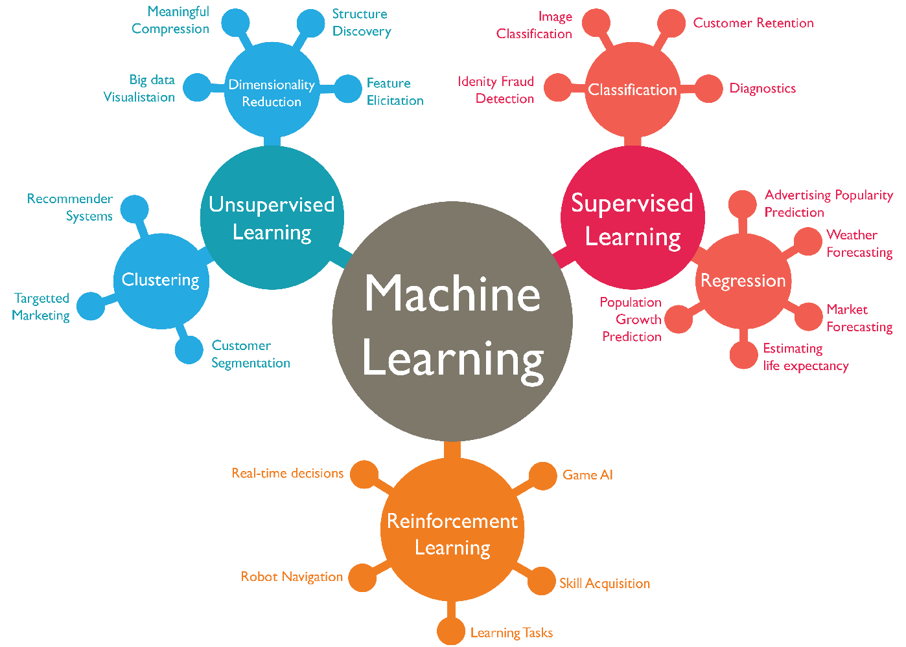

#

# Aprendizado de Máquina (Machine Learning - ML)

O **Aprendizado de Máquina (Machine Learning - ML)** é definido como o campo de estudo que dá aos computadores a capacidade de aprender sem serem explicitamente programados (Samuel, 1959 apud GÉRON, 2019). Em uma perspectiva de engenharia, um programa aprende a partir da experiência (dados) em relação a uma tarefa e uma medida de desempenho, caso seu desempenho nessa tarefa melhore com a experiência (MITCHELL, 1997 apud GÉRON, 2019).

Abaixo, detalham-se os principais conceitos que estruturam essa área:

### 1. Tipos de Aprendizado
Os sistemas de ML são geralmente classificados pela quantidade e tipo de supervisão que recebem durante o treinamento:

*   **Aprendizado Supervisionado:** O algoritmo é treinado com dados rotulados, ou seja, as respostas desejadas já são conhecidas (GÉRON, 2019; RASCHKA, 2015). Suas duas tarefas principais são a **Classificação** (prever rótulos categóricos ou classes) e a **Regressão** (prever valores numéricos contínuos) (MURPHY, 2012; DAUMÉ III, 2017).
*   **Aprendizado Não Supervisionado:** O sistema tenta aprender sem um "professor", lidando com dados não rotulados para encontrar estruturas ocultas (RASCHKA, 2015). Exemplos incluem o **Agrupamento (Clustering)**, a **Redução de Dimensionalidade** e a **Detecção de Anomalias** (GÉRON, 2019; MURPHY, 2022).
*   **Aprendizado por Reforço:** Um agente observa o ambiente, seleciona ações e recebe recompensas ou penalidades, aprendendo por conta própria a melhor estratégia (política) para maximizar a recompensa ao longo do tempo (GÉRON, 2019; MURPHY, 2022).
*   **Aprendizado Semissupervisionado:** Utiliza uma pequena quantidade de dados rotulados combinada com uma grande quantidade de dados não rotulados (GÉRON, 2019; MURPHY, 2022).

| Figura: Principais tipos de aprendizado de máquina |
|:--------------------------------------------------:|
|  |
| Fonte: Danish Khan: What are the types of Machine Learning? |

### 2. Generalização, *Overfitting* e *Underfitting*
O objetivo central do ML não é apenas performar bem nos dados de treino, mas sim **generalizar** para dados novos e nunca vistos (GÉRON, 2019; DAUMÉ III, 2017).

*   **Overfitting (Sobreajuste):** Ocorre quando o modelo é excessivamente complexo e "decora" o ruído ou padrões aleatórios dos dados de treinamento, falhando ao lidar com novos casos (alto erro de generalização ou alta variância) (MURPHY, 2012; DAUMÉ III, 2017; RASCHKA, 2015).
*   **Underfitting (Subajuste):** Acontece quando o modelo é simples demais para aprender a estrutura subjacente dos dados, resultando em baixo desempenho tanto no treino quanto no teste (alto viés) (GÉRON, 2019; DAUMÉ III, 2017).
*   **Bias/Variance Tradeoff:** É o equilíbrio necessário entre o viés (erro por suposições erradas) e a variância (erro por sensibilidade excessiva a pequenas variações nos dados) (GÉRON, 2019).

### 3. Dados: Atributos, Amostras e Divisão
Os dados são a matéria-prima do ML. Cada exemplo individual é chamado de **amostra ou instância**, e as propriedades usadas para descrevê-los são os **atributos (features)** (GÉRON, 2019; RASCHKA, 2015). É prática essencial dividir o conjunto de dados em:

*   **Conjunto de Treinamento:** Usado para ajustar os parâmetros do modelo (GÉRON, 2019).
*   **Conjunto de Validação:** Utilizado para comparar modelos e ajustar hiperparâmetros (GÉRON, 2019; SANTOS et al., 2025).
*   **Conjunto de Teste:** Reservado para estimar o erro de generalização final, devendo ser mantido isolado até o fim do processo para evitar o "viesamento de bisbilhoteiro" (*data snooping bias*) (GÉRON, 2019; DAUMÉ III, 2017).

### 4. Funções de Perda e Hiperparâmetros

*   **Função de Perda (Loss Function):** Medida que quantifica o quão "ruim" é uma previsão em relação ao valor real. O treinamento do modelo consiste em minimizar essa perda (MURPHY, 2022; DAUMÉ III, 2017).
*   **Hiperparâmetros:** São parâmetros do algoritmo de aprendizado que devem ser definidos antes do treinamento e permanecem constantes durante o processo (como a taxa de aprendizado ou a profundidade de uma árvore). Eles funcionam como "botões de ajuste" do modelo (GÉRON, 2019; RASCHKA, 2015; SANTOS et al., 2025).

---

### 5. Relação entre os Conceitos de ML
Os conceitos de Aprendizado de Máquina (ML) estão intrinsecamente conectados por meio do objetivo central de transformar dados em previsões ou conhecimentos que possam ser aplicados a situações novas (generalização) (DAUMÉ III, 2017; GÉRON, 2019). Abaixo, detalha-se como esses conceitos se relacionam e quais são os maiores desafios para o seu entendimento.

A estrutura do ML baseia-se em um ciclo onde os tipos de aprendizado e as técnicas de ajuste de modelos trabalham em conjunto:

*   **O Ciclo de Aprendizado:** Independentemente do tipo (supervisionado, não supervisionado ou por reforço), todos os algoritmos utilizam **atributos (features)** para representar os dados e ajustam seus **parâmetros** internos para minimizar uma **função de perda (loss function)** (GÉRON, 2019; MURPHY, 2022; DAUMÉ III, 2017).
*   **Generalização e o Tradeoff Viés/Variância:** A relação fundamental entre todos os modelos é o equilíbrio entre **viés (bias)** e **variância** (GÉRON, 2019). O viés refere-se a suposições erradas (modelo simples demais, causando **underfitting**), enquanto a variância refere-se à sensibilidade excessiva ao ruído dos dados de treino (modelo complexo demais, causando **overfitting**) (MURPHY, 2012; DAUMÉ III, 2017; RASCHKA, 2015).
*   **Controle via Hiperparâmetros:** Para navegar nesse equilíbrio, o cientista de dados ajusta os **hiperparâmetros** — "botões" que controlam a complexidade do algoritmo antes do treino começar (GÉRON, 2019; DAUMÉ III, 2017).
*   **Regularização como Ferramenta de Ajuste:** A **regularização** é o método que conecta a complexidade do modelo à sua capacidade de generalização, adicionando uma penalidade à função de perda para evitar que o modelo se torne "especialista" demais nos dados de treinamento (overfitting) (GÉRON, 2019; RASCHKA, 2015; MURPHY, 2022).
*   **Validação Cruzada:** Este conceito atua como o árbitro, utilizando conjuntos de **treinamento, validação e teste** para garantir que as escolhas de hiperparâmetros resultem em um modelo que realmente funcione em dados nunca vistos (generalização) (GÉRON, 2019; RASCHKA, 2015).

O domínio do ML apresenta desafios conceituais e práticos significativos, sendo estes as maiores dificuldades no entendimento e implementação :

1.  **Encontrar o "Ponto Ideal" (*Sweet Spot*):** A maior dificuldade teórica é gerenciar o *tradeoff* entre viés e variância. É difícil determinar exatamente quando um modelo parou de aprender padrões reais e começou a "decorar" o ruído (overfitting) (DAUMÉ III, 2017; GÉRON, 2019).
2.  **A Maldição da Dimensionalidade:** À medida que o número de atributos aumenta, o espaço de dados torna-se extremamente esparso, o que prejudica a eficácia de algoritmos baseados em distância (como KNN) e aumenta drasticamente o risco de overfitting (RASCHKA, 2015; MURPHY, 2012; DAUMÉ III, 2017).
3.  **Qualidade e Representatividade dos Dados:** O princípio "lixo entra, lixo sai" (*garbage in, garbage out*) é uma barreira constante. Se os dados de treinamento não forem representativos da realidade de produção (*data mismatch*), o modelo falhará, independentemente da sua sofisticação algorítmica (GÉRON, 2019; DAUMÉ III, 2017).
4.  **Interpretabilidade vs. Complexidade ("Caixas Pretas"):** Modelos poderosos como Redes Neurais Profundas são difíceis de interpretar. Entender o porquê de uma decisão algorítmica é um desafio crítico para a aceitação da tecnologia em setores sensíveis como a indústria e a saúde (RASCHKA, 2015; DAUMÉ III, 2017; POD ACADEMY, 2023).
5.  **Desafios de Otimização:** Em redes neurais profundas, problemas matemáticos como **gradientes que desaparecem ou explodem** (vanishing/exploding gradients) tornam o treinamento instável e difícil de configurar (RASCHKA, 2015; GÉRON, 2019; MURPHY, 2022).

---

### 6. Exemplo com situação-problema

> Você foi contratado como Engenheiro de IA por uma grande planta siderúrgica que opera 24 horas por dia. O principal ativo da fábrica é uma estação de usinagem CNC de alto desempenho. Recentemente, a quebra inesperada do cabeçote de corte dessa máquina causou uma parada na linha de produção que durou 36 horas, gerando um prejuízo estimado em R$ 150.000,00 entre peças de reposição urgentes, ociosidade da equipe e multas por atraso na entrega dos produtos aos clientes.

> A gerência de manutenção possui sensores que medem variáveis físicas da máquina a cada segundo, mas atualmente esses dados são apenas visualizados em telas isoladas e descartados. O seu desafio no semestre é interligar essa telemetria e criar um sistema inteligente capaz de prever uma falha mecânica com antecedência, permitindo que a equipe agende o reparo durante uma pausa planejada de produção.

Nesta situação-problema da planta siderúrgica, o desafio é transformar um cenário de manutenção corretiva — que resultou em um prejuízo de **R$ 150.000,00** — em uma estratégia de **Manutenção Preditiva (PdM)** baseada em Aprendizado de Máquina (ML) (ENCOPEL ROLAMENTOS, 2020; BOUSDEKIS et al., 2019). Abaixo, os conceitos fundamentais de ML são exemplificados e inter-relacionados dentro desse contexto:

### 1. Entendimento do Negócio e dos Dados (CRISP-DM)
O ciclo se inicia com a metodologia **CRISP-DM**: 
    
- O **entendimento do negócio** define o objetivo: evitar paradas de 36 horas e os custos associados (LET'S DATA, 2021). 
- O **entendimento dos dados** revela que a telemetria (sensores a cada segundo) é rica, mas atualmente descartada (POD ACADEMY, 2023). 
- A **integração desses dados** de vibração e temperatura é o primeiro passo para **criar um registro histórico** necessário para o treinamento (ENCOPEL ROLAMENTOS, 2020; BOUSDEKIS et al., 2019).

### 2. Atributos (Features) e Processamento
Os dados brutos dos sensores (telemetria por segundo) não podem ser usados diretamente sem preparo. No **pré-processamento**, transformamos essas leituras em **atributos (features)**, como a média da temperatura na última hora ou o pico de frequência de vibração (GÉRON, 2019). Se as escalas forem diferentes (ex: temperatura em graus e rotação em RPM), aplicamos a **normalização** para garantir que o algoritmo não dê importância indevida a uma variável apenas por sua magnitude numérica (RASCHKA, 2015; SANTOS et al., 2025).

### 3. Tipos de Aprendizado e Modelagem
Neste cenário, podemos inter-relacionar três abordagens:

*   **Aprendizado Supervisionado (Regressão):** O objetivo é prever a **Vida Útil Restante (RUL - *Remaining Useful Life*)** do cabeçote (BOUSDEKIS et al., 2019). O modelo aprende, a partir de falhas passadas, que certas combinações de atributos indicam que a máquina quebrará em, por exemplo, 48 horas (GÉRON, 2019; MURPHY, 2012).
*   **Aprendizado Supervisionado (Classificação):** O sistema classifica o estado atual como `Normal` ou `Em Risco` (BOUSDEKIS et al., 2019).
*   **Aprendizado Não Supervisionado (Detecção de Anomalias):** Como falhas são eventos raros, podemos treinar o modelo apenas com dados do estado `Normal` para que ele aprenda a reconhecer qualquer desvio padrão como uma anomalia, disparando um alerta preventivo (GÉRON, 2019; MURPHY, 2022).

### 4. Generalização, Overfitting e Underfitting
O sistema deve ser capaz de **generalizar**, ou seja, prever a falha em dados novos que não foram usados no treino (GÉRON, 2019). Se o modelo for complexo demais e "decorar" apenas a falha específica que causou o prejuízo de R$ 150 mil, ele sofrerá de **overfitting** e falhará ao detectar uma quebra levemente diferente no futuro (RASCHKA, 2015; DAUMÉ III, 2017). Para evitar isso, dividimos os dados em conjuntos de **treinamento e teste** (MURPHY, 2022; SANTOS et al., 2025).

### 5. Métricas de Avaliação
Na siderúrgica, o custo de um "Falso Negativo" (não prever a falha) é altíssimo (R$ 150 mil). Portanto, a métrica prioritária é o **Recall (Sensibilidade)**, garantindo que o sistema detecte todas as falhas possíveis (GÉRON, 2019; SANTOS et al., 2025). Entretanto, a **Precisão** também é importante: se o modelo gerar muitos "Falsos Positivos" (alarmes falsos), a equipe de manutenção perderá a confiança no sistema e parará a produção sem necessidade (ENCOPEL ROLAMENTOS, 2020; BOUSDEKIS et al., 2019).

### 6. Direcionamento: Da Predição à Prescrição
Ao interligar a telemetria, o sistema evolui da análise isolada para uma visão global. O objetivo final é a **Manutenção Prescritiva**, onde o software não apenas avisa "o cabeçote vai falhar em 10 horas", mas prescreve a ação: "reduza a velocidade de corte em 20% para estender a vida útil até a pausa planejada do próximo turno" (ENCOPEL ROLAMENTOS, 2020; BOUSDEKIS et al., 2019).

---

## Referências

ABNT - ASSOCIAÇÃO BRASILEIRA DE NORMAS TÉCNICAS. **ABNT NBR 14724**: informação e documentação: trabalhos acadêmicos: apresentação. 4. ed. Rio de Janeiro: ABNT, 2024.

ABNT - ASSOCIAÇÃO BRASILEIRA DE NORMAS TÉCNICAS. **ABNT NBR 6023**: informação e documentação: referências: elaboração. Rio de Janeiro: ABNT, 2018.

BOUSDEKIS, Alexandros; APOSTOLOU, Dimitris; MENTZAS, Gregoris. **Predictive maintenance in the 4th industrial revolution**: benefits business opportunities and managerial implications. [S. l.]: [s. n.], 2019.

DAUMÉ III, Hal. **A course in machine learning**. 2. ed. [S. l.]: Hal Daumé III, 2017. Disponível em: http://ciml.info/. Acesso em: 8 jul. 2026.

ENCOPEL ROLAMENTOS. **Webinar**: manutenção preditiva na indústria 4.0. [S. l.]: Youtube, 2020. Disponível em: https://www.youtube.com/watch?v=A8f9D590p8c. Acesso em: 8 jul. 2026.

GÉRON, Aurélien. **Hands-on machine learning with Scikit-Learn, Keras, and TensorFlow**: concepts, tools, and techniques to build intelligent systems. 2. ed. [S. l.]: O'Reilly Media, 2019.

INDUSTRIA 4.0. **Manutenção Preditiva On-Line - Industria 4.0**. [S. l.]: Youtube, 2020. Disponível em: https://www.youtube.com/watch?v=Fst5jZ8v7I8. Acesso em: 8 jul. 2026.

LET'S DATA. **CRISP-DM**: a melhor metodologia para projetos de Data Science. [S. l.]: Youtube, 2021. Disponível em: https://www.youtube.com/watch?v=fV7i6U-0Q7M. Acesso em: 8 jul. 2026.

MURPHY, Kevin P. **Machine learning**: a probabilistic perspective. [S. l.]: MIT Press, 2012.

MURPHY, Kevin P. **Probabilistic machine learning**: an introduction. [S. l.]: MIT Press, 2022.

POD ACADEMY | DATA & ANALYTICS. **Aprenda a metodologia CRISP-DM para tomada de decisão data-driven [Webinar PoD Academy]**. [S. l.]: Youtube, 2023. Disponível em: https://www.youtube.com/watch?v=C7QYm0fL2vA. Acesso em: 8 jul. 2026.

RASCHKA, Sebastian. **Python machine learning**. Birmingham: Packt Publishing, 2015.

SANTOS, Bruno J. et al. Electroencephalogram Signal Acquisition System with Machine Learning for Robotic Prosthesis Control: In Vivo Dataset. **Artificial Intelligence and Applications**, [S. l.], v. 00, n. 00, p. 1-22, 2025. DOI: 10.47852/bonviewAIA52024252.

---

Material produzido com auxílio de `NotebookLM` e `Gemini`

---

---
