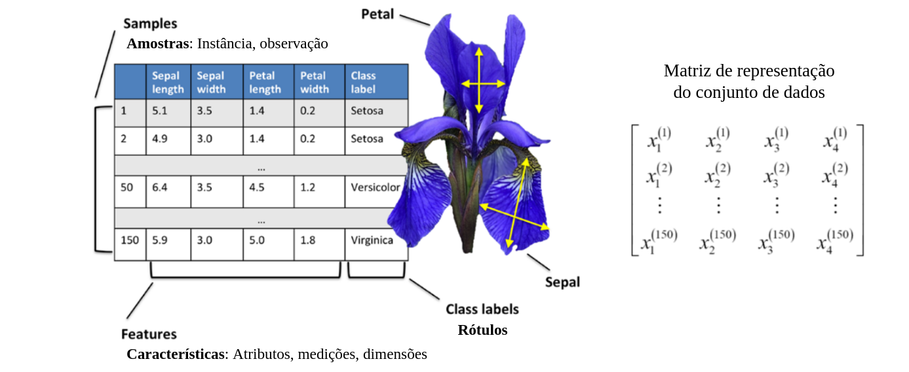
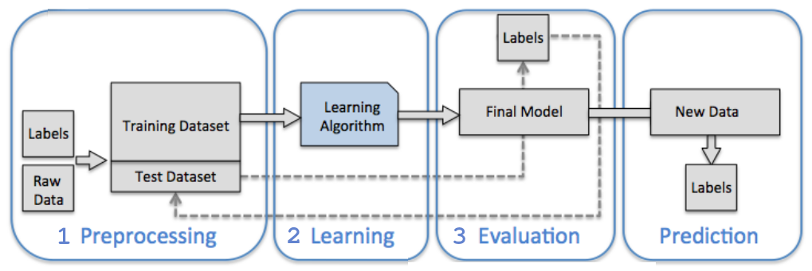

SLTINTA - [Ementa](../../ifsp-slt/dados/sltinta_ementa.md) - [Plano de Aula](../../ifsp-slt/dados/sltinta_plano_aula.md) - [Slide da aula](../../dados/slides/SLTINTA-01-intro_conceitos_iniciais.pdf)

---

#

# Aprendizado de Máquina (Machine Learning - ML)

O **Aprendizado de Máquina (Machine Learning - ML)** consolidou-se como o motor tecnológico da atualidade, permitindo que sistemas computacionais transformem o "dilúvio de dados" — estimado em **2,5 quintilhões de bytes gerados diariamente** — em conhecimento e previsões acionáveis (RASCHKA, 2015). No desenvolvimento tecnológico, o ML é um subcampo da Inteligência Artificial (IA) focado em algoritmos que detectam padrões automaticamente para prever dados futuros ou outros resultados de interesse, sendo essencial em domínios que vão da biologia molecular à robótica (MURPHY, 2012).

## Resgate Histórico e Evolução

A jornada da IA e do ML teve marcos fundamentais:

*   **Década de 1940:** Warren McCulloch e Walter Pitts (1943) criaram o conceito de **neurônio artificial**, estabelecendo a base lógica para a atividade nervosa (MCCULLOCH; PITTS, 1943).
*   **Décadas de 1940/50:** Donald Hebb (1949) propôs a regra de que conexões entre neurônios se fortalecem com o uso, o que inspirou Frank Rosenblatt (1957) a desenvolver o **Perceptron**, o primeiro modelo capaz de aprender pesos de forma automática para classificação (GÉRON, 2019; ROSENBLATT, 1958).
*   **Lacunas e "Invernos":** O interesse diminuiu após 1969, quando Minsky e Papert provaram que modelos lineares simples não resolviam problemas complexos como o XOR (MURPHY, 2022).
*   **Renascimento:** O campo renasceu em 1986 com a popularização do algoritmo de **backpropagation**, permitindo o treinamento de redes neurais com múltiplas camadas ocultas (GÉRON, 2019; RUMELHART; HINTON; WILLIAMS, 1986). Atualmente, vivemos a "revolução do Deep Learning", viabilizada pela abundância de dados e pelo poder de processamento massivo das GPUs (GÉRON, 2019).

## Propósitos e Métodos na Indústria

O Aprendizado de Máquina (ML) tem se mostrado fundamental na indústria moderna, atuando como o motor da **Indústria 4.0** ao transformar grandes volumes de dados em ganhos de eficiência, segurança e lucratividade (RASCHKA, 2015; BOUSDEKIS et al., 2019). Abaixo, apresentam-se cenários reais onde a aplicação dessa tecnologia gerou resultados expressivos.

### Cenários de Manutenção Preditiva (PdM)
A manutenção preditiva utiliza sensores e algoritmos para prever falhas antes que elas ocorram, calculando a **Vida Útil Restante (RUL)** dos componentes (INDUSTRIA 4.0, 2020; BOUSDEKIS et al., 2019).

*   **Caso Bosch (2016):** A empresa investiu cerca de R$ 46 mil no monitoramento inteligente de sete linhas de produção. O resultado foi um **retorno financeiro de R$ 65 mil logo no primeiro ano**, superando o investimento inicial através da prevenção de paradas (INDUSTRIA 4.0, 2020).
*   **Indústria de Embalagens Plásticas:** Um sistema de IA identificou uma falha iminente com **62 dias de antecedência** via e-mail. Isso permitiu que a equipe técnica emitisse uma ordem de serviço planejada, evitando uma interrupção catastrófica e inesperada na produção (INDUSTRIA 4.0, 2020).
*   **Monitoramento de Equipamentos Rotativos:** Empresas como a Encopel utilizam análise de vibração e temperatura para identificar desalinhamentos e falhas em rolamentos. Isso resulta no **aumento da vida útil das máquinas**, redução do estoque de peças sobressalentes e eliminação de horas extras para reparos emergenciais (ENCOPEL ROLAMENTOS, 2020).

### Ganhos de Produção e Controle de Qualidade
Além de prever falhas, o ML é utilizado para otimizar processos e garantir a qualidade dos produtos com o mínimo de desperdício.

*   **Detecção de Defeitos por Visão Computacional:** Algoritmos de Aprendizado Profundo (Deep Learning) são treinados para identificar itens defeituosos em linhas de montagem automaticamente (GÉRON, 2019). Isso substitui inspeções humanas manuais, que são lentas e sujeitas a erros, permitindo uma **estratégia de "zero defeitos"** (GÉRON, 2019; BOUSDEKIS et al., 2019).
*   **Competitividade e Produtividade:** Um fabricante brasileiro de peças automotivas relatou ter perdido um contrato para um concorrente italiano cujos preços eram 30% menores devido ao uso de tecnologias 4.0. Ao adotar essas tecnologias, a empresa previu um **ganho de produtividade de no mínimo 30%** (PANORAMA..., 2022).
*   **Diagnóstico de Falhas em Plantas Industriais:** Modelos probabilísticos são aplicados para diagnosticar falhas em sistemas complexos de tanques e tubulações, identificando vazamentos ou bloqueios através de medições ruidosas de fluxo e pressão (MURPHY, 2012).

### Aplicações em Robótica e Dispositivos Médicos
O ML também impulsiona ganhos em nichos industriais de alta tecnologia:

*   **Controle de Braços Robóticos:** Modelos de regressão não-linear são usados para prever o torque exato que cada articulação de um robô deve aplicar para alcançar um ponto no espaço, otimizando o movimento e a precisão (MURPHY, 2012).
*   **Próteses e Dispositivos de Saúde:** Pesquisas brasileiras demonstram o uso de ML para o **controle de próteses robóticas de membros superiores** através de sinais de EEG, atingindo 90% de precisão (SANTOS et al., 2025). Além disso, sistemas embarcados inteligentes são usados para o controle fisiológico de **dispositivos de assistência ventricular** (bombas cardíacas) (SANTOS et al., 2025).

**Resultados Industriais:** A adesão resultou em reduções de custos de manutenção, aumento da vida útil dos equipamentos e operações com foco em "zero defeitos" (ENCOPEL ROLAMENTOS, 2020; INDUSTRIA 4.0, 2020). No Brasil, entretanto, estima-se que apenas **1,6% das indústrias** estejam plenamente inseridas na Revolução 4.0, indicando um vasto campo para crescimento (PANORAMA..., 2022).

## Direcionamento Futuro

O futuro da área aponta para uma autonomia e integração ainda maiores:

*   **Manutenção Prescritiva:** Evoluir da predição para a prescrição, onde o sistema não apenas avisa da falha, mas recomenda a ação exata e ajusta parâmetros automaticamente (ENCOPEL ROLAMENTOS, 2020).
*   **AutoML:** A automação do próprio design de sistemas de ML para reduzir a dependência de intervenção humana constante (MURPHY, 2022).
*   **IA Ética e Alinhamento:** Foco em resolver o **"problema do alinhamento"**, garantindo que os objetivos dos algoritmos estejam em total conformidade com os valores e a segurança humana (CHRISTIAN, 2020; RUSSELL, 2019).

## Desvendando o aprendizado de máquina

Este material busca uma abordagem integrada e ascendente para o Aprendizado de Máquina (ML) industrial, estruturada em cinco fases críticas que transformam dados brutos de sensores em inteligência operacional para a manutenção preditiva.

**Camada de Borda e Instrumentação**

A jornada inicia-se com a extração de sinais físicos (temperatura, vibração) diretamente dos ativos. Utilizando microcontroladores ESP32 e programação em C++, realiza-se a conversão analógico-digital (ADC) e a calibração dos sensores, resultando na serialização dos dados no formato JSON (GARCIA et al., 2021). Essa fase é fundamental para garantir a fidelidade da telemetria antes do envio para a nuvem.

**Infraestrutura e Engenharia de Dados**

A segunda fase foca na resiliência do transporte dos dados via protocolo MQTT, operando sob a arquitetura Publish/Subscribe (ARENA et al., 2022). No lado do servidor, gateways desenvolvidos em Python processam esse fluxo assíncrono para garantir a persistência cronológica em bancos de dados, como o SQLite, criando um repositório estável e limpo para a modelagem analítica (AHELEROFER et al., 2020).

**Inteligência Artificial e Diagnóstico**

A transição para a IA ocorre de forma incremental, partindo do Aprendizado de Máquina clássico para o diagnóstico interpretável (GÉRON, 2019). Técnicas como PCA são usadas para reduzir a dimensionalidade e visualizar a saúde da máquina em 2D (ERHAN et al., 2021). Algoritmos como SVM e Random Forest são aplicados para lidar com o severo desbalanceamento de classes (raridade de falhas) e fornecer transparência através da importância dos atributos (Feature Importance), permitindo identificar quais variáveis aceleram a degradação mecânica (SANTOS et al., 2021).

**Modelagem de Falhas e Anomalias**

- Previsão de Longo Prazo: Redes recorrentes LSTM processam séries temporais e retêm memória de estados passados para prever quebras com horas de antecedência.
- Detecção Não Supervisionada: Em ativos novos sem histórico de falhas, utilizam-se Autoencoders treinados em dados normais; a detecção ocorre quando o Erro Médio Quadrático (MSE) de reconstrução excede um limite seguro.
- Agentes Autônomos: O ciclo teórico encerra-se com o Aprendizado por Reforço, utilizando Processos de Decisão de Markov e a Equação de Bellman para criar agentes que ajustam o funcionamento do ESP32, maximizando a eficiência via recompensas e punições.

**Integração de Sistemas (End-to-End)**

A consolidação prática do projeto ocorre em um sistema unificado "ponta a ponta".
Um dashboard web desenvolvido em Streamlit realiza inferências em tempo real a partir de dados do SQLite. 
A robustez do ecossistema é validada por simulações de estresse que auditam a latência e a capacidade de reconexão automática do Wi-Fi diante de anomalias injetadas.

---

## Conceitos iniciais 

O **Aprendizado de Máquina (Machine Learning - ML)** é definido como o campo de estudo que dá aos computadores a capacidade de aprender sem serem explicitamente programados (Samuel, 1959 apud GÉRON, 2019). Em uma perspectiva de engenharia, um programa aprende a partir da experiência (dados) em relação a uma tarefa e uma medida de desempenho, caso seu desempenho nessa tarefa melhore com a experiência (MITCHELL, 1997 apud GÉRON, 2019).

Abaixo, detalham-se os principais conceitos que estruturam essa área:

### Tipos de Aprendizado
Os sistemas de ML são geralmente classificados pela quantidade e tipo de supervisão que recebem durante o treinamento:

*   **Aprendizado Supervisionado:** O algoritmo é treinado com dados rotulados, ou seja, as respostas desejadas já são conhecidas (GÉRON, 2019; RASCHKA, 2015). Suas duas tarefas principais são a **Classificação** (prever rótulos categóricos ou classes) e a **Regressão** (prever valores numéricos contínuos) (MURPHY, 2012; DAUMÉ III, 2017).
*   **Aprendizado Não Supervisionado:** O sistema tenta aprender sem um "professor", lidando com dados não rotulados para encontrar estruturas ocultas (RASCHKA, 2015). Exemplos incluem o **Agrupamento (Clustering)**, a **Redução de Dimensionalidade** e a **Detecção de Anomalias** (GÉRON, 2019; MURPHY, 2022).
*   **Aprendizado por Reforço:** Um agente observa o ambiente, seleciona ações e recebe recompensas ou penalidades, aprendendo por conta própria a melhor estratégia (política) para maximizar a recompensa ao longo do tempo (GÉRON, 2019; MURPHY, 2022).
*   **Aprendizado Semissupervisionado:** Utiliza uma pequena quantidade de dados rotulados combinada com uma grande quantidade de dados não rotulados (GÉRON, 2019; MURPHY, 2022).

| Figura: Principais tipos de aprendizado de máquina |
|:--------------------------------------------------:|
|  |
| Fonte: Danish Khan: What are the types of Machine Learning? |

### Dados: Atributos, Amostras e Divisão

Os dados são a matéria-prima do ML, sendo o **Dataset** o conjunto de dados ou coleção organizada de informações relacionadas sobre um tema específico. Cada exemplo individual é chamado de **amostra (samples) ou instância**, e as propriedades usadas para descrevê-los são os **atributos (features)** (GÉRON, 2019; RASCHKA, 2015). É prática essencial dividir o conjunto de dados em:

*   **Conjunto de Treinamento:** Usado para ajustar os parâmetros do modelo (GÉRON, 2019).
*   **Conjunto de Validação:** Utilizado para comparar modelos e ajustar hiperparâmetros (GÉRON, 2019; SANTOS et al., 2025).
*   **Conjunto de Teste:** Reservado para estimar o erro de generalização final, devendo ser mantido isolado até o fim do processo para evitar o "viesamento de bisbilhoteiro" (*data snooping bias*) (GÉRON, 2019; DAUMÉ III, 2017).

- **Notação:** Segue-se a convenção de representar amostras como linhas em uma matriz de características $\mathbf{X}$ e os rótulos de classe como um vetor $\mathbf{y}$. O sobrescrito $(i)$ refere-se à $i$-ésima amostra de treinamento, e o subscrito $j$ refere-se à $j$-ésima dimensão.

| Figura: Terminologia |
|:--------------------:|
|  |
| Fonte: RASCHKA, 2015 |

### Fluxo de Trabalho para Sistemas de ML

Um roteiro típico para a construção de modelos preditivos é dividido em três fases críticas:

1. **Pré-processamento:** Considerado um dos passos mais cruciais, isso inclui a extração de características, escalonamento para desempenho ideal e a divisão aleatória do dataset em conjuntos de **treinamento** (para treinar e otimizar o modelo) e **teste** (para avaliação final).
2. **Treinamento e Seleção de Modelo:** Dado que diferentes algoritmos possuem vieses inerentes, é essencial comparar vários modelos para selecionar o melhor. Utiliza-se a **validação cruzada** para estimar o desempenho de generalização e técnicas de otimização de **hiperparâmetros** para ajustar o modelo.
3. **Avaliação:** Após selecionar um modelo ajustado no conjunto de treinamento, utiliza-se o conjunto de teste para estimar o erro de generalização. Se satisfeito com o desempenho, o modelo pode ser usado para prever dados futuros.

| Figura: Fluxo de trabalho para construir um modelo de aprendizado de máquina |
|:--------------------:|
|  |
| Fonte: RASCHKA, 2015 |

### Funções de Perda e Hiperparâmetros

*   **Função de Perda (Loss Function):** Medida que quantifica o quão "ruim" é uma previsão em relação ao valor real. O treinamento do modelo consiste em minimizar essa perda (MURPHY, 2022; DAUMÉ III, 2017).
*   **Hiperparâmetros:** São parâmetros do algoritmo de aprendizado que devem ser definidos antes do treinamento e permanecem constantes durante o processo (como a taxa de aprendizado ou a profundidade de uma árvore). Eles funcionam como "botões de ajuste" do modelo (GÉRON, 2019; RASCHKA, 2015; SANTOS et al., 2025).

### Generalização, *Overfitting* e *Underfitting*

O objetivo central do ML não é apenas performar bem nos dados de treino, mas sim **generalizar** para dados novos e nunca vistos (GÉRON, 2019; DAUMÉ III, 2017).

*   **Overfitting (Sobreajuste):** Ocorre quando o modelo é excessivamente complexo e "decora" o ruído ou padrões aleatórios dos dados de treinamento, falhando ao lidar com novos casos (alto erro de generalização ou alta variância) (MURPHY, 2012; DAUMÉ III, 2017; RASCHKA, 2015).
*   **Underfitting (Subajuste):** Acontece quando o modelo é simples demais para aprender a estrutura subjacente dos dados, resultando em baixo desempenho tanto no treino quanto no teste (alto viés) (GÉRON, 2019; DAUMÉ III, 2017).
*   **Bias/Variance Tradeoff:** É o equilíbrio necessário entre o viés (erro por suposições erradas) e a variância (erro por sensibilidade excessiva a pequenas variações nos dados) (GÉRON, 2019).

---

### Relação entre os Conceitos de ML

Os conceitos de Aprendizado de Máquina (ML) estão intrinsecamente conectados por meio do objetivo central de transformar dados em previsões ou conhecimentos que possam ser aplicados a situações novas (generalização) (DAUMÉ III, 2017; GÉRON, 2019). Abaixo, detalha-se como esses conceitos se relacionam e quais são os maiores desafios para o seu entendimento.

A estrutura do ML baseia-se em um ciclo onde os tipos de aprendizado e as técnicas de ajuste de modelos trabalham em conjunto:

*   **O Ciclo de Aprendizado:** Independentemente do tipo (supervisionado, não supervisionado ou por reforço), todos os algoritmos utilizam **atributos (features)** para representar os dados e ajustam seus **parâmetros** internos para minimizar uma **função de perda (loss function)** (GÉRON, 2019; MURPHY, 2022; DAUMÉ III, 2017).
*   **Generalização e o Tradeoff Viés/Variância:** A relação fundamental entre todos os modelos é o equilíbrio entre **viés (bias)** e **variância** (GÉRON, 2019). O viés refere-se a suposições erradas (modelo simples demais, causando **underfitting**), enquanto a variância refere-se à sensibilidade excessiva ao ruído dos dados de treino (modelo complexo demais, causando **overfitting**) (MURPHY, 2012; DAUMÉ III, 2017; RASCHKA, 2015).
*   **Controle via Hiperparâmetros:** Para navegar nesse equilíbrio, o cientista de dados ajusta os **hiperparâmetros** — "botões" que controlam a complexidade do algoritmo antes do treino começar (GÉRON, 2019; DAUMÉ III, 2017).
*   **Regularização como Ferramenta de Ajuste:** A **regularização** é o método que conecta a complexidade do modelo à sua capacidade de generalização, adicionando uma penalidade à função de perda para evitar que o modelo se torne "especialista" demais nos dados de treinamento (overfitting) (GÉRON, 2019; RASCHKA, 2015; MURPHY, 2022).
*   **Validação Cruzada:** Este conceito atua como o árbitro, utilizando conjuntos de **treinamento, validação e teste** para garantir que as escolhas de hiperparâmetros resultem em um modelo que realmente funcione em dados nunca vistos (generalização) (GÉRON, 2019; RASCHKA, 2015).

O domínio do ML apresenta desafios conceituais e práticos significativos, sendo estes as maiores dificuldades no entendimento e implementação :

1.  **Encontrar o "Ponto Ideal" (*Sweet Spot*):** A maior dificuldade teórica é gerenciar o *tradeoff* entre viés e variância. É difícil determinar exatamente quando um modelo parou de aprender padrões reais e começou a "decorar" o ruído (overfitting) (DAUMÉ III, 2017; GÉRON, 2019).
2.  **A Maldição da Dimensionalidade:** À medida que o número de atributos aumenta, o espaço de dados torna-se extremamente esparso, o que prejudica a eficácia de algoritmos baseados em distância (como KNN) e aumenta drasticamente o risco de overfitting (RASCHKA, 2015; MURPHY, 2012; DAUMÉ III, 2017).
3.  **Qualidade e Representatividade dos Dados:** O princípio "lixo entra, lixo sai" (*garbage in, garbage out*) é uma barreira constante. Se os dados de treinamento não forem representativos da realidade de produção (*data mismatch*), o modelo falhará, independentemente da sua sofisticação algorítmica (GÉRON, 2019; DAUMÉ III, 2017).
4.  **Interpretabilidade vs. Complexidade ("Caixas Pretas"):** Modelos poderosos como Redes Neurais Profundas são difíceis de interpretar. Entender o porquê de uma decisão algorítmica é um desafio crítico para a aceitação da tecnologia em setores sensíveis como a indústria e a saúde (RASCHKA, 2015; DAUMÉ III, 2017; POD ACADEMY, 2023).
5.  **Desafios de Otimização:** Em redes neurais profundas, problemas matemáticos como **gradientes que desaparecem ou explodem** (vanishing/exploding gradients) tornam o treinamento instável e difícil de configurar (RASCHKA, 2015; GÉRON, 2019; MURPHY, 2022).

---

### O Ecossistema Python

[Python](https://www.python.org/) é a linguagem mais popular para ciência de dados: ele permite focar nas ideias e colocar conceitos em ação rapidamente. 
As principais bibliotecas para o fluxo de trabalho de ML são:

- [NumPy](https://numpy.org/) e [SciPy](https://scipy.org/):  operações vetorizadas rápidas;
- [Scikit-learn](https://scikit-learn.org/stable/): a biblioteca de ML mais popular e acessível;
- [Pandas](https://pandas.pydata.org/): manipulação de dados tabulares;
- [Matplotlib](https://matplotlib.org/): visualização de dados em formato gráfico.

---

### Exemplo com situação-problema

> Você foi contratado como Engenheiro de IA por uma grande planta siderúrgica que opera 24 horas por dia. O principal ativo da fábrica é uma estação de usinagem CNC de alto desempenho. Recentemente, a quebra inesperada do cabeçote de corte dessa máquina causou uma parada na linha de produção que durou 36 horas, gerando um prejuízo estimado em R$ 150.000,00 entre peças de reposição urgentes, ociosidade da equipe e multas por atraso na entrega dos produtos aos clientes.

> A gerência de manutenção possui sensores que medem variáveis físicas da máquina a cada segundo, mas atualmente esses dados são apenas visualizados em telas isoladas e descartados. O seu desafio no semestre é interligar essa telemetria e criar um sistema inteligente capaz de prever uma falha mecânica com antecedência, permitindo que a equipe agende o reparo durante uma pausa planejada de produção.

Nesta situação-problema da planta siderúrgica, o desafio é transformar um cenário de manutenção corretiva — que resultou em um prejuízo de **R$ 150.000,00** — em uma estratégia de **Manutenção Preditiva (PdM)** baseada em Aprendizado de Máquina (ML) (ENCOPEL ROLAMENTOS, 2020; BOUSDEKIS et al., 2019). Abaixo, os conceitos fundamentais de ML são exemplificados e inter-relacionados dentro desse contexto:

### 1. Entendimento do Negócio e dos Dados (CRISP-DM)
O ciclo se inicia com a metodologia **CRISP-DM**: 
    
- O **entendimento do negócio** define o objetivo: evitar paradas de 36 horas e os custos associados (LET'S DATA, 2021). 
- O **entendimento dos dados** revela que a telemetria (sensores a cada segundo) é rica, mas atualmente descartada (POD ACADEMY, 2023). 
- A **integração desses dados** de vibração e temperatura é o primeiro passo para **criar um registro histórico** necessário para o treinamento (ENCOPEL ROLAMENTOS, 2020; BOUSDEKIS et al., 2019).

### 2. Atributos (Features) e Processamento
Os dados brutos dos sensores (telemetria por segundo) não podem ser usados diretamente sem preparo. No **pré-processamento**, transformamos essas leituras em **atributos (features)**, como a média da temperatura na última hora ou o pico de frequência de vibração (GÉRON, 2019). Se as escalas forem diferentes (ex: temperatura em graus e rotação em RPM), aplicamos a **normalização** para garantir que o algoritmo não dê importância indevida a uma variável apenas por sua magnitude numérica (RASCHKA, 2015; SANTOS et al., 2025).

### 3. Tipos de Aprendizado e Modelagem
Neste cenário, podemos inter-relacionar três abordagens:

*   **Aprendizado Supervisionado (Regressão):** O objetivo é prever a **Vida Útil Restante (RUL - *Remaining Useful Life*)** do cabeçote (BOUSDEKIS et al., 2019). O modelo aprende, a partir de falhas passadas, que certas combinações de atributos indicam que a máquina quebrará em, por exemplo, 48 horas (GÉRON, 2019; MURPHY, 2012).
*   **Aprendizado Supervisionado (Classificação):** O sistema classifica o estado atual como `Normal` ou `Em Risco` (BOUSDEKIS et al., 2019).
*   **Aprendizado Não Supervisionado (Detecção de Anomalias):** Como falhas são eventos raros, podemos treinar o modelo apenas com dados do estado `Normal` para que ele aprenda a reconhecer qualquer desvio padrão como uma anomalia, disparando um alerta preventivo (GÉRON, 2019; MURPHY, 2022).

### 4. Generalização, Overfitting e Underfitting
O sistema deve ser capaz de **generalizar**, ou seja, prever a falha em dados novos que não foram usados no treino (GÉRON, 2019). Se o modelo for complexo demais e "decorar" apenas a falha específica que causou o prejuízo de R$ 150 mil, ele sofrerá de **overfitting** e falhará ao detectar uma quebra levemente diferente no futuro (RASCHKA, 2015; DAUMÉ III, 2017). Para evitar isso, dividimos os dados em conjuntos de **treinamento e teste** (MURPHY, 2022; SANTOS et al., 2025).

### 5. Métricas de Avaliação
Na siderúrgica, o custo de um "Falso Negativo" (não prever a falha) é altíssimo (R$ 150 mil). Portanto, a métrica prioritária é o **Recall (Sensibilidade)**, garantindo que o sistema detecte todas as falhas possíveis (GÉRON, 2019; SANTOS et al., 2025). Entretanto, a **Precisão** também é importante: se o modelo gerar muitos "Falsos Positivos" (alarmes falsos), a equipe de manutenção perderá a confiança no sistema e parará a produção sem necessidade (ENCOPEL ROLAMENTOS, 2020; BOUSDEKIS et al., 2019).

### 6. Direcionamento: Da Predição à Prescrição
Ao interligar a telemetria, o sistema evolui da análise isolada para uma visão global. O objetivo final é a **Manutenção Prescritiva**, onde o software não apenas avisa "o cabeçote vai falhar em 10 horas", mas prescreve a ação: "reduza a velocidade de corte em 20% para estender a vida útil até a pausa planejada do próximo turno" (ENCOPEL ROLAMENTOS, 2020; BOUSDEKIS et al., 2019).

---

## Referências

AHELEROFF, S. et al. A Digital Twin-Driven Predictive Maintenance Architecture for IoT-Enabled Manufacturing. **Advanced Engineering Informatics**, v. 45, p. 101102, 2020. (Aheleroff et al., 2020).

ARENA, F. et al. An IoT-Based Predictive Maintenance Architecture for Industrial Equipment. **Sensors**, v. 22, n. 2, p. 485, 2022. (Arena et al., 2022).

BOUSDEKIS, Alexandros; APOSTOLOU, Dimitris; MENTZAS, Gregoris. **Predictive maintenance in the 4th industrial revolution**: benefits business opportunities and managerial implications. [S. l.]: [s. n.], 2019.

CHEN, B. et al. Edge Computing-Based Predictive Maintenance System for IoT Smart Factories. **IEEE Access**, v. 7, p. 29321-29334, 2019. (Chen et al., 2019).

CHRISTIAN, Brian. **The alignment problem**: machine learning and human values. 1. ed. [S. l.]: W. W. Norton & Company, 2020.

DALZOCHIO, J. et al. Predictive Maintenance in the Fourth Industrial Revolution: A Literature Review. **Computers & Industrial Engineering**, v. 142, p. 106486, 2020. (Dalzochio et al., 2020).

ENCOPEL ROLAMENTOS. **Webinar**: manutenção preditiva na indústria 4.0. [S. l.]: Youtube, 2020. Disponível em: https://www.youtube.com/watch?v=A8f9D590p8c. Acesso em: 8 jul. 2026.

ERHAN, L. et al. Anomaly Detection in Industrial Telemetry Data Using Unsupervised Machine Learning. **Journal of Ambient Intelligence and Humanized Computing**, v. 12, p. 3152-3164, 2021. (Erhan et al., 2021).

GARCIA, G.; ALBALADEJO, C.; MOLINA, J. M. Low-Cost IoT Sensor Node for Predictive Maintenance in Industrial Environments. **Electronics**, v. 10, n. 11, p. 1289, 2021. (Garcia; Albaladejo; Molina, 2021).

GÉRON, Aurélien. **Hands-on machine learning with Scikit-Learn, Keras, and TensorFlow**: concepts, tools, and techniques to build intelligent systems. 2. ed. [S. l.]: O'Reilly Media, 2019.

INDUSTRIA 4.0. **Manutenção Preditiva On-Line - Industria 4.0**. [S. l.]: Youtube, 2020. Disponível em: https://www.youtube.com/watch?v=Fst5jZ8v7I8. Acesso em: 8 jul. 2026.

KUMAR, A.; SINGH, S. Predictive Maintenance Using AI4I 2020 Dataset: A Comparative Study of Machine Learning Classifiers. **Procedia Computer Science**, v. 218, p. 211-220, 2023. (Kumar; Singh, 2023).

LET'S DATA. **CRISP-DM**: a melhor metodologia para projetos de Data Science. [S. l.]: Youtube, 2021. Disponível em: https://www.youtube.com/watch?v=fV7i6U-0Q7M. Acesso em: 8 jul. 2026.

MCCULLOCH, Warren S.; PITTS, Walter. A logical calculus of the ideas immanent in nervous activity. **Bulletin of Mathematical Biophysics**, [S. l.], v. 5, p. 115-133, 1943.

MURPHY, Kevin P. **Machine learning**: a probabilistic perspective. [S. l.]: MIT Press, 2012.

MURPHY, Kevin P. **Probabilistic machine learning**: an introduction. [S. l.]: MIT Press, 2022.

PANORAMA da Indústria 4.0 no Brasil e os impactos no mercado de trabalho | Transição. [S. l.]: Youtube, 2022. Disponível em: https://www.youtube.com/watch?v=q6O2O9eZ1_I. Acesso em: 8 jul. 2026.

POD ACADEMY | DATA & ANALYTICS. **Aprenda a metodologia CRISP-DM para tomada de decisão data-driven [Webinar PoD Academy]**. [S. l.]: Youtube, 2023. Disponível em: https://www.youtube.com/watch?v=C7QYm0fL2vA. Acesso em: 8 jul. 2026.

**PREDICTIVE maintenance in the 4th industrial revolution**: benefits business opportunities and managerial implications. [S. l.]: [s. n.], 2019.

RASCHKA, Sebastian. **Python machine learning**. Birmingham: Packt Publishing, 2015.

ROSENBLATT, Frank. The Perceptron: a probabilistic model for information storage and organization in the brain. **Psychological Review**, [S. l.], v. 65, n. 6, p. 386-408, 1958.

RUMELHART, David E.; HINTON, Geoffrey E.; WILLIAMS, Ronald J. Learning internal representations by error propagation. **Nature**, [S. l.], v. 323, p. 533-536, 1986.

RUSSELL, Stuart. **Human compatible**: artificial intelligence and the problem of control. [S. l.]: Viking, 2019.

SANTOS, Bruno J. et al. Electroencephalogram Signal Acquisition System with Machine Learning for Robotic Prosthesis Control: In Vivo Dataset. **Artificial Intelligence and Applications**, [S. l.], v. 00, n. 00, p. 1-22, 2025. DOI: 10.47852/bonviewAIA52024252.

SANTOS, R. et al. Imbalanced Data Treatment in P
redictive Maintenance Machine Learning Models. **Applied Sciences**, v. 11, n. 18, p. 8542, 2021. (Santos et al., 2021).

SCHMIDT, M. et al. Interactive Dashboards for Predictive Maintenance: User-Centered Design in Industry 4.0. **International Journal of Industrial Ergonomics**, v. 89, p. 103310, 2022. (Schmidt et al., 2022).

ZONTA, T. et al. Machine Learning for Predictive Maintenance in Industry 4.0: A Review. **International Journal of Production Research**, v. 58, n. 18, p. 5766-5784, 2020. (Zonta et al., 2020).

---

Material produzido com auxílio de `NotebookLM` e `Gemini`

---

---

