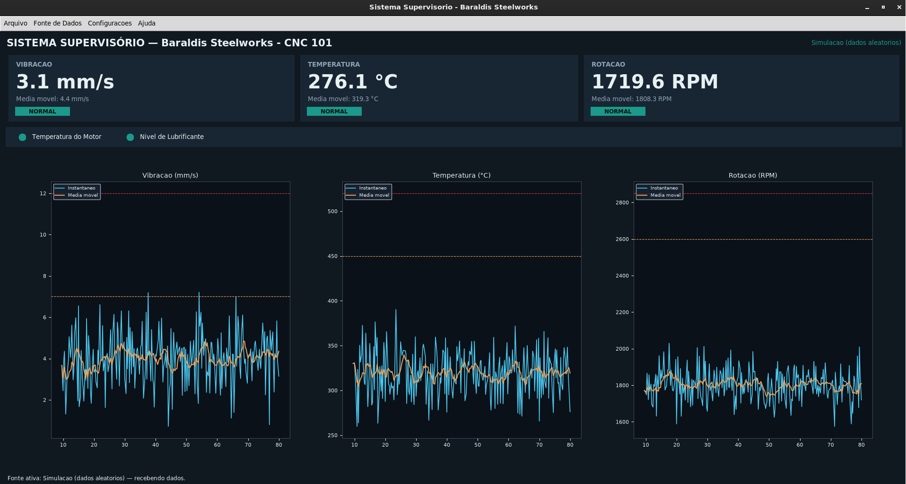

SLTINTA - [Ementa](../../ifsp-slt/dados/sltinta_ementa.md) - [Plano de Aula](../../ifsp-slt/dados/sltinta_plano_aula.md) 

---


#

## 🎯 Objetivo

*   **Aprender sobre Infraestrutura de Borda**, abordando a programação do microcontroladores para a aquisição de sinais analógicos/digitais e a estruturação de dados industriais.

## 🔴 Situação-Problema Contextualizada

A equipe de manutenção da siderúrgica instalou microcontroladores nas máquinas CNC. Contudo, os sensores físicos originais operam enviando sinais elétricos brutos (tensões de 0 a 3.3V) que o servidor de IA não consegue interpretar diretamente. O desafio é programar o controlador para ler esses sinais analógicos, converter os sinais de volta para as unidades físicas reais (como graus Celsius ou mm/s de vibração) e organizar essas variáveis em uma string padronizada.

## 🏁 Descritivo de Metas da Atividade Prática

*   **Meta 1:** Configurar o controlador para realizar leitura e conversão das variáveis dos sensores para suas reapectivas grandezas físicas.
*   **Meta 2:** Implementar um algoritmo de simulação matemática (usando geradores de ruído e aleatoriedade) no controlador que replique o comportamento dinâmico do dataset analisado na Semana 1.
*   **Meta 3:** Serializar as variáveis de leitura em um objeto CSV ou JSON estruturado contendo as chaves `temperatura`, `vibracao` e `rpm`, exibindo o resultado formatado no Monitor Serial a cada 2 segundos.

## 🛠️ Ferramentas

*   **Hardware:** Placa de desenvolvimento com PIC, AVR, 8051, ARM, RISC-V (Arduino, ESP32, STM32, Raspberry Pi, etc).
*   **IDE:** Arduino IDE, VS Code, PlatformIO, etc.
*   **Bibliotecas C++:** *ArduinoJson.h* (de Benoit Blanchon), etc.

## 🧠 Conhecimento Teórico

*   **Arquitetura de Dispositivos de Borda:** Compreender o processamento interno de um microcontrolador SoC (System on Chip).
*   **Conversão Analógico-Digital (ADC):** Entender a resolução de bits do ADC do controlador e aplicar equações de mapeamento linear (\\(f(x) = ax + b\\)) para calibrar sensores.
*   **Serialização de Dados:** Vantagens de usar o formato estruturado JSON em comparação com strings de texto puro em sistemas distribuídos.

## 💻 Atividade Prática

1. Instalar o suporte às placas de desenvolvimento no gerenciador de placas da IDE, se for o caso.
2. Escrever o código base para a inicialização das portas de leitura e da comunicação Serial a 115200 bps.
3. Criar variáveis dinâmicas em C++ para simular o comportamento estável da máquina siderúrgica.
4. Instalar a biblioteca de serialização de dados. <!--*ArduinoJson* e instanciar o objeto `StaticJsonDocument`.-->
5. Codificar a rotina para converter os dados numéricos para JSON e imprimir o buffer na porta serial de forma cíclica usando uma função não bloqueante (evitando o travamento do processador que o `delay()` causa).

## 🔗 Indicação de Artigo Científico

*   [Non-Intrusive Low-Cost IoT-Based Hardware System for Sustainable Predictive Maintenance of Industrial Pump Systems ](https://www.mdpi.com/2079-9292/14/14/2913)


---

# Sistemas Supervisórios para Manutenção Preditiva

[Dashboard supervisório](https://github.com/JoseWRPereira/sltinta-borda_com_dashboard) para monitoramento de vibração, temperatura e rotação.



<!-- Este material está dividido em dois capítulos:

- **Capítulo 1** — Construção de interfaces gráficas em Python com Tkinter e Matplotlib, do zero até o `dashboard_supervisorio.py`.
- **Capítulo 2** — Aquisição e tratamento de sinais físicos, culminando na implementação do protocolo Modbus RTU (Arduino como escravo, Python como mestre).

Cada seção apresenta um conceito isolado, um exemplo mínimo executável, variações de uso e, ao final de cada capítulo, o mapeamento explícito de onde aquele conceito aparece no projeto entregue. -->

---

# 1 — Interfaces Gráficas com Tkinter e Matplotlib

## 1.1 Por que Tkinter?

Tkinter é a biblioteca gráfica que acompanha o Python por padrão, sendo assim, não há necessidade de instalar nada extra e nem lidar com dependências gráficas complexas.

O conceito central do Tkinter é a **janela raiz** (`root window`): todo programa Tkinter cria uma janela principal, adiciona *widgets* (botões, textos, gráficos etc.) dentro dela, e entra em um laço de eventos (`mainloop`) que fica "escutando" cliques, teclas e atualizações até a janela ser fechada.

### Exemplo mínimo

```python
import tkinter as tk

janela = tk.Tk()
janela.title("Minha primeira janela")
janela.geometry("1280x720") 

janela.mainloop()
```

**O que aconteceu:**

- `tk.Tk()` cria a janela principal.
- `.title()` e `.geometry()` configuram aparência.
- `.mainloop()` é a linha mais importante do Tkinter: ela é o motor que processa eventos (cliques, redesenhos, timers). 

> **Variação 1:** troque `janela.geometry("1280x720")` por `janela.geometry("1280x720+400+100")` — os dois últimos números posicionam a janela na tela (deslocamento X e Y a partir do canto superior esquerdo).

---

## 1.2 Widgets básicos: Label, Button e a função de *callback*

Um *widget* é qualquer elemento visual: texto, botão, caixa de entrada etc. Todo widget é criado passando o "pai" (a janela ou outro widget que vai contê-lo) como primeiro argumento.

```python
import tkinter as tk

def cumprimentar():
    label_resultado.config(text="Sistema operando dentro dos parâmetros normais.")

janela = tk.Tk()
janela.title("Exemplo de botão")

label_titulo = tk.Label(janela, text="Clique para verificar o status:")
label_titulo.pack(pady=10)

botao = tk.Button(janela, text="Verificar", command=cumprimentar)
botao.pack()

label_resultado = tk.Label(janela, text="")
label_resultado.pack(pady=10)

janela.mainloop()
```

**Conceitos-chave:**

- `command=cumprimentar` — note que passamos o nome da função, sem o uso de parênteses, pois se a função for atribuída `command=cumprimentar()`, ela é executa imediatamente ao montar a interface, e não quando o botão é clicado. 
- `.config(text=...)` — todo widget pode ter suas propriedades alteradas depois de criado, chamando `.config()`. É assim que o dashboard atualiza os valores dos cartões em tempo real.
- `.pack()` — organiza o widget na tela (ver próxima seção).

> **Variação 2:** adicione um segundo botão "Reiniciar" que chama `label_resultado.config(text="")`. 

---

## 1.3 Gerenciadores de layout: pack, grid e place

Tkinter não usa coordenadas fixas para posicionar widgets (na maioria dos casos) — ele usa **gerenciadores de layout**. Existem três:

| Gerenciador | Lógica | Quando usar |
|---|---|---|
| `pack()` | Empilha widgets em uma direção (cima/baixo ou lado a lado) | Layouts simples, sequenciais (cartões, barras de status) |
| `grid()` | Organiza em linhas e colunas, como uma planilha | Formulários, diálogos com vários campos alinhados |
| `place()` | Posição absoluta em pixels ou percentual | Casos especiais (raramente usado em telas responsivas) |

### `pack()`

```python
import tkinter as tk

janela = tk.Tk()
janela.geometry("1280x720") 

tk.Label(janela, text="Topo").pack(side="top")
tk.Label(janela, text="Esquerda").pack(side="left")
tk.Label(janela, text="Direita").pack(side="right")
tk.Label(janela, text="Base").pack(side="bottom")

janela.mainloop()
```

`side` controla para qual borda o widget "gruda". É assim que os três cartões (vibração, temperatura, rotação) do dashboard ficam lado a lado: cada um usa `.pack(side="left", expand=True, fill="both")`.

### `grid()`

```python
import tkinter as tk

janela = tk.Tk()

tk.Label(janela, text="Vibração (mm/s):").grid(row=0, column=0, sticky="e", padx=5, pady=5)
tk.Entry(janela).grid(row=0, column=1)

tk.Label(janela, text="Temperatura (°C):").grid(row=1, column=0, sticky="e", padx=5, pady=5)
tk.Entry(janela).grid(row=1, column=1)

janela.mainloop()
```

`grid()` é ideal quando você precisa alinhar rótulos e campos de entrada em colunas retas — é exatamente o padrão usado no diálogo de configuração da simulação aleatória do dashboard (média e desvio padrão de cada variável, alinhados em grade).

**Regra prática:** nunca misture `pack()` e `grid()` **dentro do mesmo widget pai** — o Tkinter trava/gera erro. É seguro usar `pack()` em um frame e `grid()` dentro de um frame filho, como o dashboard faz.
 
> **Variação 3:** no exemplo do `grid()`, adicione `columnspan=2` em um título no topo (`row=-1` não existe, use `row=0` e empurre os campos para baixo) para ver como um widget pode ocupar múltiplas colunas.

---

## 1.4 Organizando com Frame

`Frame` é um "contêiner invisível" — um widget que só serve para agrupar outros widgets, permitindo estruturar visualmente a tela em blocos.

```python
import tkinter as tk

janela = tk.Tk()
janela.configure(bg="#101820")

cartao = tk.Frame(janela, bg="#182634")
cartao.pack(padx=20, pady=20, ipadx=10, ipady=10)

tk.Label(cartao, text="VIBRAÇÃO", bg="#182634", fg="#8fa3b3").pack(anchor="w")
tk.Label(cartao, text="4.3 mm/s", bg="#182634", fg="white", font=("Segoe UI", 24, "bold")).pack(anchor="w")

janela.mainloop()
```

Isso é um padrão para criar um "cartão" no dashboard: um `Frame` com fundo de cor diferente da janela (simulando um "cartão" visual), contendo rótulos empilhados dentro dele com `pack(anchor="w")` (alinhados à esquerda).

> **Variação 4:** crie três frames lado a lado (`side="left"`), cada um com cores de fundo diferentes, para simular os três cartões do dashboard antes de ligá-los a dados reais.

---

## 1.5 Menus

Um menu Tkinter tem uma estrutura em árvore: uma barra de menu (`Menu` associado à janela), contendo "menus" (`Menu` filhos, exibidos como "Arquivo", "Configurações"...), que por sua vez contêm comandos.

```python
import tkinter as tk

def sair():
    janela.quit()

janela = tk.Tk()
menubar = tk.Menu(janela)

menu_arquivo = tk.Menu(menubar, tearoff=0)
menu_arquivo.add_command(label="Novo", command=lambda: print("Novo!"))
menu_arquivo.add_separator()
menu_arquivo.add_command(label="Sair", command=sair)

menubar.add_cascade(label="Arquivo", menu=menu_arquivo)
janela.config(menu=menubar)

janela.mainloop()
```

**Conceitos-chave:**

- `tearoff=0` remove uma linha pontilhada legada que permitia "destacar" o menu — quase sempre você vai querer desativá-la.
- `add_cascade` é o que faz um menu abrir um submenu ao clicar (o "Arquivo" da barra abre a lista com "Novo"/"Sair").
- Cada `add_command` recebe um `command`, exatamente como um botão.

> **Variação 5:** adicione um segundo menu "Ajuda" com um comando "Sobre" que abre um `messagebox.showinfo("Sobre","IFSP - Salto \n SLTINTA")`. 

---

## 1.6 Widgets adicionais usados no projeto

### Canvas (para desenhar os LEDs indicadores)

`Canvas` é uma área de desenho livre — você desenha formas geométricas (retângulos, círculos, linhas) e pode alterar suas propriedades depois.

```python
import tkinter as tk

janela = tk.Tk()
canvas = tk.Canvas(janela, width=40, height=40, bg="white", highlightthickness=0)
led = canvas.create_oval(5, 5, 35, 35, fill="gray")  # retorna um ID do objeto desenhado
canvas.pack(pady=20)

def ligar():
    canvas.itemconfig(led, fill="#1b998b")  # verde

def desligar():
    canvas.itemconfig(led, fill="#e63946")  # vermelho

tk.Button(janela, text="Ligar", command=ligar).pack(side="left", padx=10)
tk.Button(janela, text="Desligar", command=desligar).pack(side="right", padx=10)

janela.mainloop()
```

**Conceitos-chave:**

- `create_oval(x1, y1, x2, y2)` desenha um círculo inscrito no retângulo definido pelos dois pontos.
- `canvas.itemconfig(id, fill=cor)` é a chave para "acender e apagar" o LED.

### Checkbutton e ttk.Combobox

```python
import tkinter as tk
from tkinter import ttk

janela = tk.Tk()

variavel_checkbox = tk.BooleanVar()
tk.Checkbutton(janela, text="Repetir em loop", variable=variavel_checkbox).pack()

combo = ttk.Combobox(janela, values=["COM3", "COM4", "/dev/ttyACM0"], state="readonly")
combo.current(0)
combo.pack()

def mostrar():
    print("Loop:", variavel_checkbox.get(), "| Porta:", combo.get())

tk.Button(janela, text="OK", command=mostrar).pack()
janela.mainloop()
```

Repare no padrão `tk.BooleanVar()` + `variable=...` + `.get()`: é assim que o Tkinter lê o estado de um checkbox — você não lê o widget diretamente, lê a variável associada a ele. O mesmo padrão vale para `tk.StringVar()`.

`ttk` é um "sub-módulo" do Tkinter com widgets de aparência mais moderna (o `Combobox`, entre outros, só existe em `ttk`, não no `tk` "clássico").

> **Variação 6:** troque `state="readonly"` por remover esse parâmetro e veja a diferença: sem ele, o usuário pode digitar um valor que não está na lista.

---

## 1.7 Diálogos: messagebox, simpledialog, filedialog e Toplevel

Tkinter oferece diálogos prontos para casos comuns, além da possibilidade de criar diálogos totalmente customizados.

```python
import tkinter as tk
from tkinter import messagebox, simpledialog, filedialog

janela = tk.Tk()

def testar_messagebox():
    messagebox.showinfo("Título", "Esta é uma mensagem informativa.")
    confirmou = messagebox.askyesno("Confirmação", "Deseja continuar?")
    print("Usuário confirmou:", confirmou)

def testar_simpledialog():
    nome = simpledialog.askstring("Entrada", "Digite um valor:")
    numero = simpledialog.askfloat("Entrada numérica", "Digite um limite:", initialvalue=10.0)
    print(nome, numero)

def testar_filedialog():
    caminho = filedialog.askopenfilename(filetypes=[("CSV", "*.csv")])
    print("Arquivo escolhido:", caminho)

tk.Button(janela, text="messagebox", command=testar_messagebox).pack(pady=5)
tk.Button(janela, text="simpledialog", command=testar_simpledialog).pack(pady=5)
tk.Button(janela, text="filedialog", command=testar_filedialog).pack(pady=5)

janela.mainloop()
```

Esses três módulos cobrem praticamente todas as interações "de uma pergunta só" do dashboard: 

- confirmar limites;
- perguntar um intervalo em uma grandeza;
- escolher um arquivo CSV para exportar ou reproduzir.

### Diálogo customizado com `Toplevel`

Quando uma única pergunta não é suficiente (por exemplo, pedir *vários* campos de uma vez, como no diálogo de configuração da simulação aleatória), criamos uma **janela secundária** com `Toplevel` — que se comporta como uma `Tk()` filha, aceitando os mesmos widgets (Label, Entry, Button) vistos até aqui:

```python
import tkinter as tk

def abrir_dialogo_customizado():
    janela_filha = tk.Toplevel(janela)
    janela_filha.title("Configuração avançada")
    janela_filha.geometry("250x150")

    tk.Label(janela_filha, text="Média:").pack(pady=5)
    entrada_media = tk.Entry(janela_filha)
    entrada_media.pack()

    def confirmar():
        print("Valor digitado:", entrada_media.get())
        janela_filha.destroy()  # fecha só a janela filha

    tk.Button(janela_filha, text="OK", command=confirmar).pack(pady=10)

janela = tk.Tk()
tk.Button(janela, text="Abrir configuração", command=abrir_dialogo_customizado).pack(pady=20)
janela.mainloop()
```


> **Variação 7:** no exemplo acima, adicione uma segunda `Entry` para "Desvio padrão" e imprima os dois valores — isso já reproduz em miniatura o diálogo de simulação aleatória do projeto.

---

## 1.8 O problema da concorrência: threads e o padrão `queue` + `after()`

Esta é a seção mais importante do capítulo, porque é o conceito que faz o dashboard **não travar** enquanto espera dados de uma porta serial.

### O problema

O Tkinter roda em **uma única thread**. Se você chamar dentro de um `command` uma função que demora (por exemplo, `time.sleep(5)` ou uma leitura bloqueante de porta serial), a janela inteira congela até essa função terminar — nenhum clique, redesenho ou movimento de mouse é processado nesse meio tempo.

```python
import tkinter as tk
import time

def tarefa_lenta():
    time.sleep(5)   # <-- durante estes 5 segundos, a janela FICA CONGELADA
    label.config(text="Pronto!")

janela = tk.Tk()
label = tk.Label(janela, text="Aguardando...")
label.pack()
tk.Button(janela, text="Iniciar", command=tarefa_lenta).pack()
janela.mainloop()
```

Rode este exemplo e tente redimensionar a janela durante os 5 segundos — ela não responde. É exatamente esse problema que aconteceria se o dashboard tentasse ler a porta serial diretamente dentro do laço principal da interface.

### A solução: thread separada + fila (queue) + `after()`

A solução padrão é: a tarefa demorada roda em uma **thread separada** (não trava a interface), e ela **não atualiza a interface diretamente** (threads secundárias não devem tocar em widgets Tkinter). Em vez disso, ela deposita os resultados em uma `queue.Queue()` — uma estrutura de dados segura para troca de informações entre threads. A interface, periodicamente, verifica se há algo novo na fila usando `janela.after(intervalo_ms, funcao)`, que agenda uma função para rodar depois de um tempo **sem bloquear nada**.

```python
import tkinter as tk
import threading
import queue
import time

fila = queue.Queue()

def trabalho_em_segundo_plano():
    for i in range(10):
        time.sleep(1)
        fila.put(f"Processado item {i + 1} de 10")

def verificar_fila():
    while not fila.empty():
        mensagem = fila.get_nowait()
        label.config(text=mensagem)
    janela.after(200, verificar_fila)  # se reagenda a cada 200 ms, indefinidamente

janela = tk.Tk()
label = tk.Label(janela, text="Aguardando...")
label.pack(pady=20)

threading.Thread(target=trabalho_em_segundo_plano, daemon=True).start()
verificar_fila()  # inicia o "polling" da fila

janela.mainloop()
```

Rode este exemplo: repare que agora a janela continua respondendo (pode ser movida, redimensionada) enquanto os itens são processados um a um, em segundo plano.

**Conceitos-chave:**

- `threading.Thread(target=..., daemon=True)` — `daemon=True` garante que a thread morre automaticamente quando a janela principal fecha (sem isso, o programa poderia "travar" tentando fechar).
- `fila.put(...)` (na thread secundária) e `fila.get_nowait()` (na thread principal) — é o único ponto de contato seguro entre as duas threads.
- `janela.after(200, verificar_fila)` — este padrão de "a função reagenda a si mesma no final" cria um laço de verificação periódica sem bloquear o `mainloop()`.

<!-- Este é **exatamente** o mecanismo por trás de `LeitorModbusRTU`, `LeitorCSV` e `GeradorAleatorio` (que rodam como threads, cada uma colocando dicionários de dados na fila) e do método `_atualizar_gui()` do dashboard (que consome a fila a cada 200 ms via `self.after(200, self._atualizar_gui)`). -->

> **Variação 8:** modifique o exemplo para que a thread simule uma leitura de sensor (`random.uniform(0, 100)`) a cada 300 ms, indefinidamente (sem limite de 10 iterações), e a fila carregue números em vez de texto. 

---

## 1.9 Integrando gráficos com Matplotlib

Matplotlib é a biblioteca de gráficos mais usada em Python, mas ela não "sabe" desenhar dentro de uma janela Tkinter por padrão — é preciso uma ponte, fornecida pelo próprio Matplotlib: `FigureCanvasTkAgg`.

```python
import tkinter as tk
from matplotlib.figure import Figure
from matplotlib.backends.backend_tkagg import FigureCanvasTkAgg

janela = tk.Tk()

figura = Figure(figsize=(5, 3), dpi=100)
eixo = figura.add_subplot(111)
eixo.plot([0, 1, 2, 3], [10, 15, 7, 12])
eixo.set_title("Exemplo estático")

canvas = FigureCanvasTkAgg(figura, master=janela)
canvas.get_tk_widget().pack(fill="both", expand=True)
canvas.draw()

janela.mainloop()
```

**Conceitos-chave:**

- `Figure` é o "papel" onde se desenha; 
- `add_subplot(111)` cria um eixo (área de plotagem) dentro dele — o `111` significa "grade 1×1, primeiro (e único) gráfico".
<!-- (o dashboard usa `add_subplot(1, 3, i)` para criar três gráficos lado a lado). -->
- `FigureCanvasTkAgg` transforma a `Figure` em um widget Tkinter (`.get_tk_widget()`), que pode ser posicionado com `pack()`/`grid()` como qualquer outro.
- `.draw()` renderiza (ou re-renderiza) o gráfico na tela.

### Atualizando o gráfico dinamicamente

Para um gráfico que muda com o tempo, o padrão é: limpar o eixo, redesenhar, e chamar `draw_idle()` (uma versão mais eficiente de `draw()` para atualizações frequentes):

```python
import tkinter as tk
from matplotlib.figure import Figure
from matplotlib.backends.backend_tkagg import FigureCanvasTkAgg
import random

historico = []

def atualizar():
    historico.append(random.uniform(0, 10))
    if len(historico) > 50:
        historico.pop(0)

    eixo.clear()
    eixo.set_title("Sinal simulado")
    eixo.plot(historico)
    canvas.draw_idle()

    janela.after(300, atualizar)

janela = tk.Tk()
figura = Figure(figsize=(5, 3), dpi=100)
eixo = figura.add_subplot(111)
canvas = FigureCanvasTkAgg(figura, master=janela)
canvas.get_tk_widget().pack(fill="both", expand=True)

atualizar()
janela.mainloop()
```

<!-- Note que a atualização do gráfico usa o **mesmo padrão `after()`** da seção anterior — não é coincidência: tanto a leitura da fila quanto o redesenho do gráfico do dashboard são agendados dentro do mesmo ciclo de `_atualizar_gui()`. -->

> **Variação 9:** adicione uma segunda curva ao mesmo eixo (`eixo.plot(...)` chamado duas vezes antes do `canvas.draw_idle()`) representando uma média móvel do histórico.

<!-- esse é o mesmo recurso usado em `_atualizar_graficos()` do dashboard, que desenha a curva instantânea e a média móvel juntas, mais duas linhas horizontais tracejadas (`eixo.axhline(...)`) marcando os limites de alerta e crítico. -->

---

## 1.10 Chegando ao `dashboard_supervisorio.py`

Agora que cada peça foi vista isoladamente, o dashboard nada mais é do que a composição de todos esses conceitos, organizados dentro de uma classe que herda de `tk.Tk`:

```python
class DashboardSupervisorio(tk.Tk):
    def __init__(self):
        super().__init__()
        # ... configura janela, fila, threads, canais de dados ...
        self._montar_menu()      # Seção 1.5
        self._montar_layout()    # Seções 1.3, 1.4, 1.6, 1.9
        self._atualizar_gui()    # Seção 1.8
```

| Conceito do Capítulo 1 | Onde aparece no projeto |
|---|---|
| Janela raiz (`tk.Tk`) | `class DashboardSupervisorio(tk.Tk)` |
| Label / Button | Cartões de valor, botões dos diálogos |
| `pack()` | Cartões lado a lado, painéis empilhados |
| `grid()` | Diálogo de configuração da simulação aleatória |
| `Frame` | `_criar_cartao()`, painéis de LEDs e gráficos |
| `Menu` / `add_cascade` | `_montar_menu()` |
| `Canvas` + `create_oval` | `_criar_led()`, `_atualizar_leds()` |
| `ttk.Combobox` | Seleção de porta serial |
| `BooleanVar` / `StringVar` | Checkboxes de coils, `descricao_fonte` |
| `messagebox` / `simpledialog` / `filedialog` | Confirmações, limites, exportar/abrir CSV |
| `Toplevel` | `_dialogo_fonte_modbus()`, `_dialogo_fonte_aleatoria()`, `_dialogo_coils()` |
| Thread + `queue` + `after()` | `LeitorModbusRTU`/`LeitorCSV`/`GeradorAleatorio` + `_atualizar_gui()` |
| `FigureCanvasTkAgg` | Painel de gráficos de histórico |

### Exercícios propostos

1. Adicione um quarto cartão para uma variável de "pressão", sem nenhuma fonte de dados real — apenas com um valor fixo, para praticar a criação de `Frame`s.
2. Troque a paleta de cores (`COR_FUNDO`, `COR_PAINEL` etc.) por um tema claro e observe o que precisa ser ajustado para manter a legibilidade.
3. Adicione um botão "Pausar atualização" que interrompe temporariamente o `after()` de `_atualizar_gui()` sem parar a fonte de dados.
4. Implemente um diálogo `Toplevel` novo que exiba um resumo estatístico (mínimo, máximo, média) do histórico atual de cada variável.

---

# 2 — Aquisição de Dados e Implementação do Protocolo Modbus RTU

## 2.1 Do sensor ao dado supervisionado

Antes de qualquer protocolo, é preciso entender a cadeia completa que um sinal físico percorre até aparecer como um número na tela:

```
Sensor (físico) → Sinal elétrico analógico → ADC (conversor A/D) → Valor bruto (0–1023) →
Escala de engenharia (ex: mm/s, °C, RPM) → Protocolo de comunicação → Software supervisório
```

Este capítulo constrói cada uma dessas etapas, culminando na implementação completa do protocolo Modbus RTU nos dois lados (Arduino como escravo, Python como mestre).

## 2.2 Leitura analógica no Arduino: o ponto de partida

O Arduino Uno tem um ADC (conversor analógico-digital) de 10 bits: qualquer tensão entre 0V e 5V é convertida em um número inteiro entre 0 e 1023.

```cpp
void setup() 
{
  Serial.begin(9600);
}

void loop() 
{
  int leituraBruta = analogRead(A0);              // 0 a 1023
  float tensao = leituraBruta * (5.0 / 1023.0);   // converte para Volts
  Serial.println(tensao);
  delay(500);
}
```

Isso já resolve a aquisição, mas gera dois problemas que motivam tudo que vem a seguir:

1. **Ruído do ADC**: uma leitura isolada pode variar bastante entre uma amostra e outra, mesmo com o sinal físico estável.
2. **Unidade errada**: o programa supervisório não quer "tensão", quer "mm/s de vibração" ou "°C de temperatura".


### Filtragem simples por média

```cpp
float lerMediaAnalogica(uint8_t pino, uint8_t nAmostras) 
{
  long soma = 0;
  for (uint8_t i = 0; i < nAmostras; i++) 
  {
    soma += analogRead(pino);
    delayMicroseconds(200);
  }
  return( (float)soma / nAmostras );
}
```

Fazer a média de 8 leituras rápidas e consecutivas reduz o efeito de ruído aleatório de alta frequência — é a mesma função `lerMediaAnalogica()` usada no firmware final.


### Escala linear (regra de três)

```cpp
float escalar(float leituraADC, float minEng, float maxEng) 
{
  float tensao = (leituraADC / 1023.0) * 5.0;
  float proporcao = tensao / 5.0;                   // 0.0 a 1.0
  return minEng + proporcao * (maxEng - minEng);
}
```

Se um acelerômetro de vibração entrega 0–5V para uma faixa física de 0–20 mm/s, basta chamar `escalar(leitura, 0.0, 20.0)`. Essa é a mesma lógica usada para os três sensores do projeto (vibração, temperatura, rotação), cada um com seus próprios limites `CAL_..._MIN`/`CAL_..._MAX`.

> **Variação 1:** experimente uma calibração não-linear (por exemplo, um termopar tipo K exige compensação de junta fria e uma curva não perfeitamente linear). Nesse caso, `escalar()` precisaria ser substituída por uma tabela de consulta ou um polinômio de calibração — fica como exercício para quando for usar sensores reais em bancada.

---

## 2.3 Por que não bastava "imprimir os números"? Motivando um protocolo estruturado

Uma primeira versão deste projeto, antes da introdução do Modbus, enviava os dados direto pela serial:

```
V:4.32,T:187.65,R:1450.20,F:1,N:1
```

Funciona para um protótipo rápido, mas tem limitações sérias assim que o sistema cresce:

- **Sem padronização**: cada projeto inventa seu próprio formato de texto — não existe ferramenta, biblioteca ou outro fabricante que "fale" esse formato.
- **Sem verificação de integridade robusta**: se um byte se corromper no meio do texto, não há como detectar isso de forma confiável (um "V:4.32" corrompido vira "V:4.x2" e o `float()` do Python simplesmente falha ou pior, aceita um valor errado).
- **Não escala**: e se amanhã você tiver três Arduinos no mesmo barramento RS-485? O formato texto não tem conceito de "endereço de dispositivo".
- **Sem separação entre leitura e escrita**: não dá para, por exemplo, o supervisório mandar um comando para o Arduino (como "ajuste este limite de alarme") de forma estruturada.

Esses são exatamente os problemas que um protocolo industrial como o **Modbus** resolve — e é por isso que ele é, até hoje, um dos protocolos mais usados em automação industrial, décadas depois de criado.

---

## 2.4 Fundamentos do Modbus RTU

Modbus é um protocolo **cliente-servidor** (também chamado mestre-escravo): existe um dispositivo mestre (nosso dashboard em Python) que sempre inicia a comunicação, e um ou mais escravos (nosso Arduino) que só respondem quando questionados.

### Estrutura de um quadro Modbus RTU

```
[Endereço do escravo (1 byte)] [Código de função (1 byte)] [Dados (N bytes)] [CRC16 (2 bytes)]
```

- **Endereço**: identifica para qual escravo o pedido se destina (permite múltiplos dispositivos no mesmo barramento).
- **Código de função**: o que fazer (ler bits, ler registradores, escrever, etc.).
- **Dados**: varia conforme a função (endereço inicial, quantidade, valores a escrever...).
- **CRC16**: um "checksum" que garante a integridade do quadro — se um único bit for corrompido no caminho, o CRC calculado na chegada não bate com o CRC recebido, e o quadro é descartado.

### Quatro tipos de dados

O Modbus organiza a memória do escravo em quatro áreas, cada uma com um propósito bem definido:

| Tipo | Tamanho | Acesso | Uso típico |
|---|---|---|---|
| **Coils** | 1 bit | Leitura e escrita | Saídas digitais (relés, sirenes, válvulas) |
| **Discrete Inputs** | 1 bit | Somente leitura | Entradas digitais (sensores on/off, chaves) |
| **Holding Registers** | 16 bits | Leitura e escrita | Parâmetros configuráveis (setpoints, limites) |
| **Input Registers** | 16 bits | Somente leitura | Medidas de sensores (temperatura, pressão...) |

### As 8 funções implementadas neste projeto

| Código | Nome | Opera sobre |
|---|---|---|
| 0x01 | Read Coils | Coils |
| 0x02 | Read Discrete Inputs | Discrete Inputs |
| 0x03 | Read Holding Registers | Holding Registers |
| 0x04 | Read Input Registers | Input Registers |
| 0x05 | Write Single Coil | 1 Coil |
| 0x06 | Write Single Register | 1 Holding Register |
| 0x0F | Write Multiple Coils | N Coils |
| 0x10 | Write Multiple Registers | N Holding Registers |


### O mapa de memória definido para a caldeira

Antes de escrever qualquer código, é preciso **decidir e documentar** o mapa de memória — ele precisa ser idêntico nos dois lados (mestre e escravo), porque não existe nenhuma negociação automática de significado no Modbus: o endereço 0 só "significa" vibração porque nós decidimos isso.

```
COILS (R/W)              0: Saída digital 1 (reservada)     1: Saída digital 2 (reservada)
DISCRETE INPUTS (R)      0: Temperatura do motor            1: Nível de lubrificante
INPUT REGISTERS (R)      0: Vibração ×100    1: Temperatura ×100    2: Rotação ×10
HOLDING REGISTERS (R/W)  0-1: Limites vibração (alerta/crítico) ×100
                         2-3: Limites temperatura (alerta/crítico) ×100
                         4-5: Limites rotação (alerta/crítico) ×10
```

> **Por que multiplicar por 100 ou 10?** Registradores Modbus são inteiros de 16 bits sem sinal (0 a 65535) — não existe ponto flutuante no protocolo. Multiplicar por um fator fixo antes de enviar (e dividir pelo mesmo fator ao receber) é a forma padrão de transportar casas decimais. A rotação usa fator 10 (não 100) porque sua faixa (até 3000 RPM) excederia 65535 se multiplicada por 100.

---

## 2.5 CRC16: verificação de integridade, passo a passo

O CRC16 usado pelo Modbus é calculado bit a bit sobre todos os bytes do quadro (exceto o próprio CRC). O algoritmo é sempre o mesmo, então vale a pena implementá-lo uma vez e reaproveitar:

```python
def crc16_modbus(dados: bytes) -> int:
    crc = 0xFFFF                      # valor inicial padrão do Modbus
    for byte in dados:
        crc ^= byte                   # XOR do byte atual com o CRC acumulado
        for _ in range(8):            # processa os 8 bits do byte
            if crc & 0x0001:          # se o bit menos significativo é 1...
                crc >>= 1
                crc ^= 0xA001         # ...aplica o polinômio padrão do Modbus
            else:
                crc >>= 1
    return crc
```

O mesmo algoritmo, em C++ para o Arduino, usa exatamente a mesma lógica bit a bit:

```cpp
uint16_t calcularCRC16(const uint8_t *dados, uint8_t tamanho) 
{
  uint16_t crc = 0xFFFF;
  for (uint8_t pos = 0; pos < tamanho; pos++) 
  {
    crc ^= (uint16_t)dados[pos];
    for (uint8_t i = 8; i != 0; i--) 
    {
      if (crc & 0x0001) 
      {
        crc >>= 1;
        crc ^= 0xA001;
      } 
      else 
      {
        crc >>= 1;
      }
    }
  }
  return crc;
}
```

**Por que isso importa pedagogicamente:** o CRC é só aritmética binária determinística, e qualquer implementação correta em qualquer linguagem vai produzir exatamente o mesmo número para a mesma sequência de bytes. É esse valor compartilhado que permite ao mestre e ao escravo "confiarem" um no outro sem trocarem senhas ou handshakes complexos.

> **Variação 2:** calcule manualmente (ou com o código acima) o CRC de `bytes([0x01, 0x03, 0x00, 0x00, 0x00, 0x06])` e verifique que bate com o valor usado nos testes do projeto. Depois, altere um único byte e observe como o CRC resultante muda completamente — essa "propriedade de avalanche" é o que torna o CRC eficaz para detectar erros.

---

## 2.6 Construindo o escravo Modbus no Arduino, peça por peça

### Passo A — O mapa de memória como variáveis

```cpp
#define NUM_COILS 2
bool coils[NUM_COILS] = { false, false };

#define NUM_DISCRETE_INPUTS 2
bool entradasDiscretas[NUM_DISCRETE_INPUTS] = { false, false };

#define NUM_INPUT_REGISTERS 3
uint16_t registrosEntrada[NUM_INPUT_REGISTERS] = { 0, 0, 0 };

#define NUM_HOLDING_REGISTERS 6
uint16_t registrosHolding[NUM_HOLDING_REGISTERS] = { 700, 1200, 45000, 52000, 26000, 28500 };
```

Cada uma dessas quatro áreas do mapa Modbus vira, na prática, apenas um **array na memória do microcontrolador**. Todo o protocolo, no fundo, é sobre ler e escrever posições nesses arrays de forma padronizada.

### Passo B — Recepção não bloqueante do quadro

Diferente de uma leitura simples com `Serial.readline()` (que espera por uma quebra de linha), um quadro Modbus é binário e não tem terminador — o fim do quadro é detectado por um **silêncio** na linha (nenhum byte novo chega por um tempo mínimo).

```cpp
#define MAX_FRAME 32
uint8_t bufferRecepcao[MAX_FRAME];
uint8_t idxBuffer = 0;
unsigned long ultimoByteRecebido = 0;
const unsigned long TIMEOUT_ENTRE_BYTES_US = 3000;  // 3 ms de silêncio = fim de quadro

void loop() 
{
  while (Serial.available()) 
  {
    if (idxBuffer < MAX_FRAME) 
    {
      bufferRecepcao[idxBuffer++] = Serial.read();
    } 
    else 
    {
      Serial.read();  // descarta excedente
    }
    ultimoByteRecebido = micros();
  }
  if (idxBuffer > 0 && (micros() - ultimoByteRecebido) > TIMEOUT_ENTRE_BYTES_US) 
  {
    processarFrame(bufferRecepcao, idxBuffer);
    idxBuffer = 0;
  }
  // ... outras tarefas do loop (amostragem de sensores) ...
}
```

> **Nota técnica:** a especificação Modbus RTU "oficial" define esse silêncio como 3,5 tempos de caractere (variável com o *baud rate*). Para um link ponto-a-ponto via USB (como neste projeto), um valor fixo de poucos milissegundos é mais robusto contra o *jitter* introduzido pelo driver USB-serial do que tentar cravar o valor exato da especificação — uma decisão de engenharia prática, documentada nos comentários do firmware.

### Passo C — Validação do quadro recebido

```cpp
void processarFrame(uint8_t *quadro, uint8_t tamanho) 
{
  if (tamanho < 4) return;

  uint16_t crcRecebido = quadro[tamanho - 2] | (quadro[tamanho - 1] << 8);
  uint16_t crcCalculado = calcularCRC16(quadro, tamanho - 2);
  if (crcRecebido != crcCalculado) return;  // quadro corrompido: ignora silenciosamente

  uint8_t endereco = quadro[0];
  if (endereco != MODBUS_SLAVE_ID) return;  // não é para este escravo

  uint8_t funcao = quadro[1];
  switch (funcao) {
    case 0x01: tratarLeituraBits(quadro, tamanho, coils, NUM_COILS, funcao); break;
    // ... demais casos ...
  }
}
```

Note a ordem: primeiro verifica-se o **CRC** (o quadro é confiável?), depois o **endereço** (é para mim?), só então o **código de função** é despachado para a rotina correta.

### Passo D — Implementando a leitura (funções 0x01 a 0x04)

As quatro funções de leitura seguem exatamente a mesma lógica — por isso o firmware usa **uma única função genérica** para bits e outra para registradores, parametrizadas pelo array de destino:

```cpp
void tratarLeituraBits(uint8_t *quadro, uint8_t tamanho, bool *mapaBits,
                        uint8_t numBitsDisponiveis, uint8_t funcao) 
{
  uint16_t enderecoInicial = (quadro[2] << 8) | quadro[3];
  uint16_t quantidade      = (quadro[4] << 8) | quadro[5];

  if ((uint32_t)enderecoInicial + quantidade > numBitsDisponiveis) 
  {
    enviarExcecao(funcao, 0x02);  // endereço de dado ilegal
    return;
  }

  uint8_t byteCount = (quantidade + 7) / 8;
  uint8_t resposta[5];
  resposta[0] = MODBUS_SLAVE_ID;
  resposta[1] = funcao;
  resposta[2] = byteCount;
  resposta[3] = 0;
  resposta[4] = 0;

  for (uint16_t i = 0; i < quantidade; i++) 
  {
    if (mapaBits[enderecoInicial + i]) 
    {
      resposta[3 + (i / 8)] |= (1 << (i % 8));
    }
  }
  enviarQuadro(resposta, 3 + byteCount);
}
```

Chamando essa mesma função com `coils` (função 0x01) ou com `entradasDiscretas` (função 0x02), evitamos duplicar código — um princípio de engenharia de software (reuso) aplicado dentro de um firmware embarcado.

> **Variação 3 (didática):** implemente uma versão *sem* generalização — copie a função duas vezes, uma para cada tipo de bit — e compare a legibilidade e o risco de erro (por exemplo, esquecer de atualizar as duas cópias ao corrigir um bug) contra a versão genérica.

### Passo E — Escrita de um único bit/registrador (0x05 e 0x06): o truque do "eco"

Uma particularidade elegante do Modbus: quando a escrita de um único valor é bem-sucedida, **a resposta é idêntica ao pedido**. Isso permite uma implementação extremamente simples:

```cpp
void tratarEscritaBitUnico(uint8_t *quadro, uint8_t tamanho) 
{
  uint16_t endereco = (quadro[2] << 8) | quadro[3];
  uint16_t valor    = (quadro[4] << 8) | quadro[5];

  if (endereco >= NUM_COILS) { enviarExcecao(0x05, 0x02); return; }

  coils[endereco] = (valor == 0xFF00);  // 0xFF00 = "ligado" no protocolo Modbus
  digitalWrite(PINOS_SAIDA[endereco], coils[endereco] ? HIGH : LOW);

  enviarBruto(quadro, tamanho);  // "ecoa" o pedido inteiro como resposta — já tem CRC válido!
}
```

Como o quadro recebido já passou pela validação de CRC (Passo C), reenviá-lo integralmente é uma resposta correta e válida — não é preciso recalcular nada.

### Passo F — Escrita múltipla (0x0F e 0x10)

Diferente da escrita única, a resposta de uma escrita múltipla **não ecoa os dados**, apenas confirma o endereço inicial e a quantidade escrita (o mestre já sabe quais valores mandou, não precisa que o escravo os repita):

```cpp
void tratarEscritaRegistrosMultiplos(uint8_t *quadro, uint8_t tamanho) 
{
  uint16_t enderecoInicial = (quadro[2] << 8) | quadro[3];
  uint16_t quantidade      = (quadro[4] << 8) | quadro[5];
  uint8_t  byteCount       = quadro[6];

  if ((uint32_t)enderecoInicial + quantidade > NUM_HOLDING_REGISTERS) 
  {
    enviarExcecao(0x10, 0x02);
    return;
  }

  for (uint16_t i = 0; i < quantidade; i++) 
  {
    uint16_t valor = (quadro[7 + i * 2] << 8) | quadro[7 + i * 2 + 1];
    registrosHolding[enderecoInicial + i] = valor;
  }

  uint8_t resposta[6] = { MODBUS_SLAVE_ID, 0x10, quadro[2], quadro[3], quadro[4], quadro[5] };
  enviarQuadro(resposta, 6);
}
```

É esta função que permite ao dashboard enviar, em uma única transação, os 6 registradores de limites de alarme de uma vez (em vez de 6 escritas separadas).

### Passo G — Respostas de exceção

Quando um pedido é inválido (endereço fora da faixa, função não suportada, tamanho de dados incorreto), o Modbus define um formato de resposta padronizado:

```cpp
void enviarExcecao(uint8_t funcao, uint8_t codigoExcecao) 
{
  uint8_t resposta[3];
  resposta[0] = MODBUS_SLAVE_ID;
  resposta[1] = funcao | 0x80;   // o bit mais significativo marcado indica "isto é uma exceção"
  resposta[2] = codigoExcecao;
  enviarQuadro(resposta, 3);
}
```

O mecanismo `funcao | 0x80` é como o mestre reconhece, só de olhar o segundo byte da resposta, que algo deu errado — sem precisar interpretar o resto do quadro para descobrir.

### Passo H — Ligando os sensores ao mapa de memória

Finalmente, uma função separada (chamada periodicamente, independente da chegada de pedidos Modbus) é responsável por atualizar o mapa de memória com os valores físicos mais recentes:

```cpp
void atualizarRegistros() 
{
  float vibracao = escalar(lerMediaAnalogica(PIN_VIBRACAO), CAL_VIB_MIN_MMS, CAL_VIB_MAX_MMS);
  float temperatura = escalar(lerMediaAnalogica(PIN_TEMPERATURA), CAL_TEMP_MIN_C, CAL_TEMP_MAX_C);
  float rotacao = escalar(lerMediaAnalogica(PIN_ROTACAO), CAL_RPM_MIN, CAL_RPM_MAX);

  registrosEntrada[0] = (uint16_t)(vibracao * 100.0);
  registrosEntrada[1] = (uint16_t)(temperatura * 100.0);
  registrosEntrada[2] = (uint16_t)(rotacao * 10.0);

  entradasDiscretas[0] = !digitalRead(PIN_CHAMA);
  entradasDiscretas[1] = !digitalRead(PIN_NIVEL_AGUA);
}
```

Note a separação de responsabilidades: o Modbus **não sabe nada sobre sensores** — ele só lê e escreve posições de memória. É esta função que faz a ponte entre o "mundo físico" e o "mundo do protocolo". Essa separação é o que torna o firmware fácil de estender: adicionar um quarto sensor não muda uma linha do código Modbus, só acrescenta uma posição no array `registrosEntrada` e uma linha em `atualizarRegistros()`.

---

## 2.7 Construindo o mestre Modbus em Python, peça por peça

### Passo A — Enviando um pedido

```python
import struct

def montar_pedido(slave_id, function_code, pdu: bytes) -> bytes:
    quadro = bytes([slave_id, function_code]) + pdu
    crc = crc16_modbus(quadro)
    return quadro + bytes([crc & 0xFF, (crc >> 8) & 0xFF])

# Exemplo: pedir a leitura de 3 Input Registers a partir do endereço 0
pdu = struct.pack(">HH", 0, 3)   # ">HH" = 2 inteiros de 16 bits, big-endian
pedido = montar_pedido(slave_id=1, function_code=0x04, pdu=pdu)
print(pedido.hex())
```

`struct.pack(">HH", endereco, quantidade)` transforma dois números Python em exatamente 4 bytes binários, no formato *big-endian* (byte mais significativo primeiro) exigido pelo Modbus — a mesma conversão que o `(quadro[2] << 8) | quadro[3]` faz manualmente no lado do Arduino, só que usando uma função de biblioteca em vez de bitwise manual.

### Passo B — Interpretando a resposta

A resposta de uma função de **leitura** tem um formato *variável* (depende de quantos bytes de dados vêm); a resposta de uma **escrita** tem formato *fixo*. É por isso que o mestre precisa tratar os dois casos separadamente:

```python
def ler_resposta_de_leitura(conexao_serial) -> bytes:
    cabecalho = conexao_serial.read(2)          # endereço + função
    endereco, funcao = cabecalho[0], cabecalho[1]

    if funcao & 0x80:                            # bit de exceção marcado
        resto = conexao_serial.read(3)           # código de exceção + CRC(2)
        raise RuntimeError(f"Exceção Modbus: código {resto[0]}")

    byte_count = conexao_serial.read(1)[0]
    dados = conexao_serial.read(byte_count)
    crc = conexao_serial.read(2)
    return dados
```

Este é o esqueleto simplificado do método `_receber_resposta()` da classe `ModbusRTUMaster` do projeto — a versão completa também verifica o CRC recebido contra um CRC recalculado localmente, exatamente como o Arduino faz ao receber um pedido.

### Passo C — Uma função por código de função

Com o padrão de envio e recepção estabelecido, cada uma das 8 funções vira um método curto:

```python
def read_input_registers(self, slave_id, address, count):
    pdu = struct.pack(">HH", address, count)
    self._enviar(slave_id, 0x04, pdu)
    dados = self._receber_resposta(com_byte_count=True)
    return list(struct.unpack(f">{count}H", dados))

def write_multiple_registers(self, slave_id, address, valores):
    quantidade = len(valores)
    pdu = struct.pack(">HHB", address, quantidade, quantidade * 2)
    for v in valores:
        pdu += struct.pack(">H", v & 0xFFFF)
    self._enviar(slave_id, 0x10, pdu)
    self._receber_resposta(com_byte_count=False)
```

`struct.unpack(f">{count}H", dados)` faz o processo inverso do `pack`: transforma uma sequência de bytes de volta em uma lista de inteiros Python — é assim que os bytes brutos recebidos do Arduino viram os valores `[432, 18765, 14502]` (vibração, temperatura e rotação, ainda multiplicados pela escala).

### Passo D — Thread-safety: por que um `Lock`?

O dashboard tem, potencialmente, duas fontes de acesso à mesma porta serial ao mesmo tempo: a thread de *polling* contínuo (lendo sensores a cada 300 ms) e a interface principal (quando o usuário sincroniza limites ou testa uma coil). Se as duas tentarem enviar um pedido Modbus simultaneamente, as respostas se misturam e nenhuma das duas transações é válida.

```python
class ModbusRTUMaster:
    def __init__(self, conexao_serial, timeout=1.0):
        self.ser = conexao_serial
        self._lock = threading.Lock()

    def read_input_registers(self, slave_id, address, count):
        with self._lock:          # só uma thread por vez pode estar aqui dentro
            pdu = struct.pack(">HH", address, count)
            self._enviar(slave_id, 0x04, pdu)
            dados = self._receber_resposta(com_byte_count=True)
        return list(struct.unpack(f">{count}H", dados))
```

O `with self._lock:` garante que, mesmo que duas threads chamem métodos da mesma instância de `ModbusRTUMaster` ao mesmo tempo, as transações (pedido + resposta) nunca se intercalam — cada uma espera sua vez.

---

## 2.8 Integrando o mestre Modbus ao pipeline de aquisição do dashboard

Reaproveitando o padrão de thread + fila do (cap 1 seção 1.8), a classe `LeitorModbusRTU` conecta o `ModbusRTUMaster` ao restante do dashboard:

```python
class LeitorModbusRTU(FonteDadosBase):
    def run(self):
        self.conexao = serial.Serial(self.porta, self.baudrate, timeout=1.0)
        self.mestre = ModbusRTUMaster(self.conexao)

        while self._rodando.is_set():
            brutos = self.mestre.read_input_registers(self.slave_id, 0, 3)
            bits = self.mestre.read_discrete_inputs(self.slave_id, 0, 2)

            dados = {
                "vibracao": brutos[0] / 100.0,      # desfaz a escala ×100 do firmware
                "temperatura": brutos[1] / 100.0,
                "rotacao": brutos[2] / 10.0,         # desfaz a escala ×10
                "chama": bits[0],
                "nivel_agua": bits[1],
            }
            self.fila_saida.put(("dados", dados))
            time.sleep(0.3)
```

Note a simetria perfeita: o firmware multiplica por 100/10 antes de guardar no `registrosEntrada`; o mestre divide pelos mesmos fatores ao receber. Essa "combinação de chaves" entre os dois lados — o mapa de endereços e os fatores de escala — é o **contrato** que faz o protocolo funcionar, e é por isso que ele precisa estar documentado e idêntico nos dois arquivos.

### Do dado bruto ao dado tratado

A partir daqui, o pipeline de tratamento é o mesmo já apresentado: os dicionários que chegam pela fila alimentam `CanalDados.adicionar()`, que mantém:

- **Valor atual** (`self.valor_atual`);
- **Histórico limitado** (`deque(maxlen=TAMANHO_HISTORICO)`) para os gráficos;
- **Média móvel** (`deque(maxlen=JANELA_MEDIA_MOVEL)`), recalculada a cada nova amostra;
- **Status de alarme** (`NORMAL`/`ALERTA`/`CRÍTICO`), comparando o valor atual contra os limites — os mesmos limites que podem ser sincronizados de volta ao Arduino via Modbus (Holding Registers, função 0x10).

### Expansões habilitadas pela arquitetura Modbus

Como o mapa de memória tem áreas dedicadas a escrita (Coils e Holding Registers) que não são estritamente necessárias para o monitoramento básico, ficam prontas para expansões futuras sem qualquer mudança estrutural:

- **Novo atuador**: basta usar uma das Coils reservadas (endereços 0/1) e ligar fisicamente um relé ao pino correspondente no Arduino — o código de comunicação (FC01/05/0F) já existe.
- **Novo parâmetro configurável**: basta aumentar `NUM_HOLDING_REGISTERS` e adicionar a lógica de uso no firmware — a leitura/escrita (FC03/06/10) já existe.
- **Novo sensor**: aumentar `NUM_INPUT_REGISTERS`, adicionar a leitura em `atualizarRegistros()`, e ajustar `QTD_INPUT_REGISTERS` no lado Python.

### Validação sem hardware: testando o protocolo por *loopback*

Uma técnica importante para ensinar (e usada durante o desenvolvimento deste projeto): antes de ter o Arduino físico em mãos, é possível validar toda a lógica de framing do mestre criando um "escravo de mentira" em Python, que implementa a mesma lógica de `processarFrame()` do firmware, e trocando pedidos e respostas em memória:

```python
class SerialFakeSincrono:
    """Simula uma porta serial: write() já processa e prepara a resposta."""
    def write(self, dados: bytes):
        self._buffer_resposta = processar_pedido_como_arduino_faria(dados)

    def read(self, n: int) -> bytes:
        dados = self._buffer_resposta[:n]
        self._buffer_resposta = self._buffer_resposta[n:]
        return dados
```

Essa técnica (chamada de *mock* ou *dublê de teste*) permite testar cada uma das 8 funções, incluindo os casos de exceção, sem depender de hardware — é assim, inclusive, que a implementação apresentada neste material foi validada antes da entrega.

### Exercícios propostos (Capítulo 2)

1. Adicione um quarto Input Register (por exemplo, "pressão de óleo") no firmware e no dashboard, seguindo os mesmos passos apresentados: array → `atualizarRegistros()` → `QTD_INPUT_REGISTERS` → conversão de escala no `LeitorModbusRTU`.
2. Implemente, no dashboard, um botão que leia os 6 Holding Registers do Arduino ao conectar (função 0x03) e **pré-preencha** os limites de alarme locais com os valores vindos do equipamento, em vez de usar os valores padrão do código Python.
3. Escreva um pequeno programa Python (fora do dashboard) que force um erro de CRC de propósito (altere um byte do quadro antes de enviar) e observe como o Arduino reage (dica: ele simplesmente ignora o quadro corrompido — não deveria travar nem responder incorretamente).
4. Discuta em grupo: quais seriam as mudanças necessárias para migrar este projeto de um link serial ponto-a-ponto (USB) para um barramento RS-485 real, com múltiplos escravos? (Dica: pesquise sobre transceptores RS-485 half-duplex e o papel do pino *driver enable*.)

---

## Referência 

Os arquivos foram gerados com auxílio de Claude.IA e refatorados para atender às demandas pedagógicas da situação problema proposta.

- `dashboard_supervisorio.py` — aplicação completa em Python (Tkinter + Matplotlib + cliente Modbus RTU)
- `borda.ino` — firmware completo do Arduino Uno (escravo Modbus RTU)

 

---

