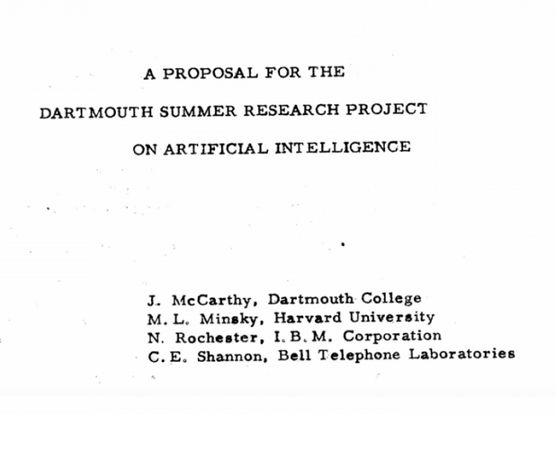
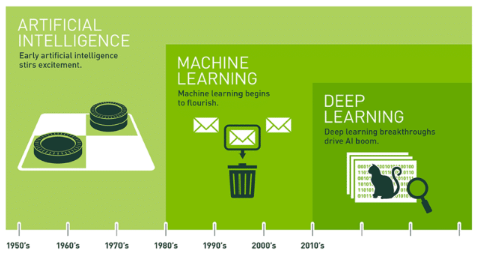
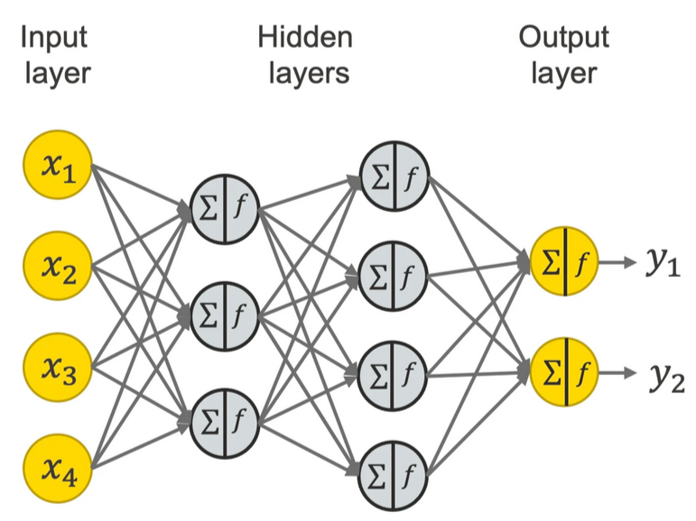
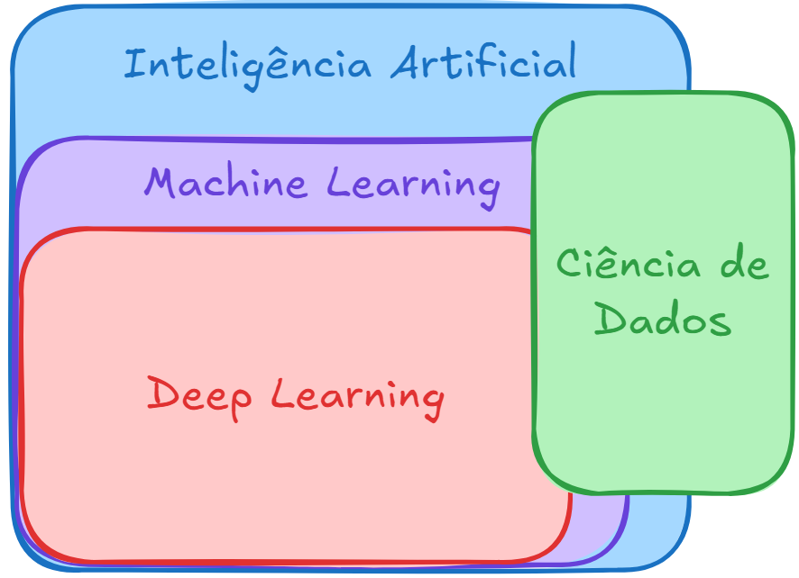

# Inteligência Artificial

A proposta inicial para o termo `Inteligência Artificial` foi elaborada em uma 
conferência de um projeto de pesquisa de verão da Universidade de Dartmouth, 
no ano de 1956 com a participação dos cientistas e matemáticos, 
como ilustrado na capa do relatório na Figura 1, 
John McCarthy (Organizador), Marvin Minsky, Nathaniel Rochester e Claude Shannon. 

| Figura 1 : Uma proposta para o projeto de pesquisa de verão de Dartmouth sobre inteligência artificial |
| :-------------------------------------------------: |
|  |
| Fonte: [Artificial Intelligence Coined at Dartmouth](https://home.dartmouth.edu/about/artificial-intelligence-ai-coined-dartmouth) |

A hipótese proposta foi a de que 
"toda característica do aprendizado ou qualquer outra característica da inteligência pode, 
em princípio, ser tão precisamente descrita, que uma máquina pode ser feita para simulá-la". 
Nasceu assim uma nova área de pesquisa, a **Inteligência Artificial (IA)**. 

Ainda na década de 60 foram desenvolvidos o primeiro chatbot ELIZA, 
que imitava um profissional de psicanálise, e Shakey, um robô que unia mobilidade, 
fala e certa autonomia de ação. 

O período compreendido entre meados dos anos 70 e início dos 80, 
ficou conhecido como `Inverno da Inteligência Artificial`, 
por ter havido pouco desenvolvimento da área. 

Nos anos 80 foram desenvolvidas técnicas que permitiram produzir sistemas especialistas, 
capazes de produzir resultados interessantes em tarefas específicas. 
Nasce a **aprendizagem de máquina (*Machine Learning - ML*).**

O aprendizado de máquina - *machine learning* - é um conjunto de técnicas para usar 
algoritmos que analisam dados e 'aprendem' com eles, de modo a tomar uma decisão baseado 
nessa 'experiência'. Desta forma, no lugar de escrever códigos para realizar uma tarefa, 
o algoritmo é treinado com um certo volume de dados significativos para poder, 
após o treinamento, realizar a tarefa baseado no que foi 'aprendido'. 

Várias **técnicas** de *machine learning* surgiram para cumprir objetivos específicos, 
como a aprendizagem por árvore de decisão, programação lógica indutiva, agrupamento, 
aprendizagem por reforço, redes bayesianas, entre outras. 

Uma das melhores aplicações ocorreu com a visão computacional, 
mesmo utilizando muitos códigos manuais para cumprir com o seu objetivo, 
como a utilização de filtros de detecção de bordas, 
filtros para detecção de formas e classificadores para reconhecer caracteres. 
Partindo o resultados desses classificadores, algoritmos conferem sentido às imagens e 
determinam se é o objeto procurado ou não. 

| Figura 2: Linha do tempo das técnicas de inteligência artificial  |
| :---------------------------------------------------------------: |
|                            |
| Fonte: [Qual é a Diferença entre Inteligência Artificial, Machine Learning e Deep Learning? 10 de março de 2021 por Michael Copeland - Blog NVIDIA)](https://blog.nvidia.com.br/blog/qual-e-a-diferenca-entre-inteligencia-artificial-machine-learning-e-deep-learning/) |

Geoffrey Hinton, da Universidade de Toronto propôs uma técnica denominada de **Rede Neural**, 
que utiliza o conceitos biológicos de neurônios e suas conexões, 
além de direções de propagação de dados para criar uma rede com camadas de processamento. 
Essa técnica somente se tornou relevante a partir da disponibilidade das 
Unidade de Processamento Gráficos (GPUs). Assim, em 2012, Andrew Ng, no Google, 
fez o reconhecimento de gatos utilizando milhares de vídeos do Youtube para treinar a sua rede, 
desenvolvida com uma maior quantidade de neurônios e camadas, tornando eficaz o seu uso, 
chamando essa técnica de Rede Profunda - **Deep Learning**. 

A Figura 3 ilustra uma rede neural com quatro camadas, sendo uma camada de entrada, 
uma camada de saída e duas camadas ocultas, neste exemplo. 
Redes neurais profundas apresentam mais nós, e mais camadas, 
o que confere uma maior complexidade. 

| Figura 3: Exemplo de representação de Rede Neural   |
| :-------------------------------------------------: |
|            |
| Fonte: [A Friendly Introduction to [Deep] Neural Networks - August 23, 2021 - Kathrin Melcher - KNIME](https://www.knime.com/blog/a-friendly-introduction-to-deep-neural-networks) |

**Níveis de técnicas e ferramentas**

A inteligência artificial tornou-se um termo muito amplo, 
e abarca um grande conjunto de ferramentas, incluindo `Machine Learning` e `Deep Learning`, 
como ilustrado na Figura 4. Sua aplicação, da mesma forma, 
é muito vasta e está cada vez mais presente no cotidiano das empresas nos mais diversos 
segmentos, tais como setor financeiro, industrial, comercial, científicos, 
entre outros, em aplicações como a filtragem de spam, análise de crédito, 
diagnóstico médico, reconhecimento facial, recomendações, chatbots, anúncios direcionados, etc.

Para trabalhar com tomada de decisão baseada em dados, 
profissionais cada vez mais especializados são demandados. 
De início foram adaptados profissionais como estatísticos e programadores, 
até a difusão de profissionais como Cientistas de Dados, 
que simplificadamente executam a fusão das duas áreas, aplicando técnicas estatísticas 
para realizar análises de dados, através de ferramentas de informática ou 
linguagens de programação, de modo a produzir análises preditivas. 
Conhecer a área de análise/negócio também é fundamental para a qualidade do resultado. 

A Figura 4 ilustra a área de ciência de dados interseccionando todos os níveis de ferramentas, 
podendo executar tarefas que necessitem de técnicas de inteligência artificial, 
*machine learning* ou mesmo de *deep learning*. 

| Figura 4: Ferramentas de um Cientista de Dados |
| :--------------------------------------------: |
|             |
| Fonte: [Qual a Diferença Entre Cientista de Dados e Engenheiro de Machine Learning? 31 de Outubro de 2024 - Data Science Academy](https://blog.dsacademy.com.br/qual-a-diferenca-entre-cientista-de-dados-e-engenheiro-de-machine-learning/) |

Com o aumento da demanda de trabalho, as equipes que trabalham com dados vão se 
especializando e produzindo novos cargos, como Engenheiro de dados e Engenheiro de 
Machine Learning. Enquanto o primeiro é o responsável por todo o processo de 
transporte de dados, desde sua aquisição, limpeza, armazenamento e 
disponibilização dos dados para serem analisados pelos algoritmos e a entrega dos 
resultados aos gestores do setor ou da empresa. 
Já o Engenheiro de Machine Learning é responsável por escolher e implementar a melhor 
técnica a ser utilizada para resolver os problemas propostos. 

A Figura 5 ilustra a busca do termo `Engenheiro de Machine Learning` no Google trends, 
mostrando os países em que tal termo é mais buscado bem como seu incrível crescimento, 
haja visto que uma década atrás essa demanda não existia. 

| Figura 5: Busca por Engenheiro de Machine Learning |
| :------------------------------------------------: |
|     |
|                Fonte: Google Trends                |

A inteligência artificial é cada vez mais presente e tem perspectiva de um 
crescimento ainda maior para os próximos anos, o que garante a necessidade de 
conhecer e aprender ferramentas que possam servir de apoio a sua área de trabalho, 
seja ela qual for, mas em especial atenção no setor industrial e educacional, 
setor ao qual estamos ligados. 

**Referências e complementos**

1. [Artificial Intelligence Coined at Dartmouth](https://home.dartmouth.edu/about/artificial-intelligence-ai-coined-dartmouth)
2. [Qual é a Diferença entre Inteligência Artificial, Machine Learning e Deep Learning? 10 de março de 2021 por Michael Copeland - Blog NVIDIA)](https://blog.nvidia.com.br/blog/qual-e-a-diferenca-entre-inteligencia-artificial-machine-learning-e-deep-learning/)
3. [A história da inteligência artificial - TecMundo](https://www.tecmundo.com.br/mercado/135413-historia-inteligencia-artificial-video.htm)
4. [O que é aprendizado de máquina (ML)? - IBM](https://www.ibm.com/br-pt/topics/machine-learning)
5. [A Friendly Introduction to [Deep] Neural Networks - August 23, 2021 - Kathrin Melcher - KNIME](https://www.knime.com/blog/a-friendly-introduction-to-deep-neural-networks)

---
