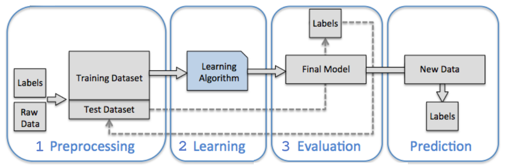

# Aprendizado de Máquina - *Machine Learning*

Aprendizado de máquina (Machine Learning - ML) pode ser definida como: "aplicação e ciência de algoritmos que transformam grandes volumes de dados em conhecimento".

ML é então uma alternativa mais eficiente para a extração de conhecimento dos dados, melhorando o desempenho de modelos preditivos e as tomadas de decisão baseadas neles.

---

# Os Três Tipos de Aprendizado de Máquina

São três as subáreas principais, ou mais comuns para a divisão da área de ML, cada uma adequada a diferentes tipos de tarefas:

- **Aprendizado Supervisionado:** O objetivo principal é aprender um modelo a partir de dados de treinamento rotulados, permitindo fazer previsões sobre dados futuros ou não vistos. Ele se divide em:
    - **Classificação:** Focada em prever rótulos de classes categóricas e discretas (ex: identificar se um e-mail é spam ou não).
    - **Regressão:** Envolve a predição de desfechos contínuos com base em variáveis explicativas (ex: prever o preço de uma casa ou a nota de um exame).

- **Aprendizado Não Supervisionado:** Lida com dados não rotulados ou de estrutura desconhecida, permitindo explorar os dados para extrair informações significativas sem a guia de uma variável alvo conhecida. Suas técnicas principais são:
    - **Agrupamento (Clustering):** Técnica exploratória que organiza informações em subgrupos (clusters) com base na similaridade, sem conhecimento prévio de suas associações.
    - **Redução de Dimensionalidade:** Frequentemente utilizada no pré-processamento para remover ruído, economizar espaço de armazenamento e comprimir dados em um subespaço de menor dimensão, mantendo a maior parte da informação relevante.

- **Aprendizado por Reforço:** Busca desenvolver um sistema (agente) que melhora seu desempenho com base em interações com o ambiente. O feedback não é o rótulo correto, mas uma medida de quão bem a ação foi executada através de uma função de recompensa, permitindo o aprendizado por tentativa e erro, como em motores de xadrez.

| Figura: Principais tipos de aprendizado de máquina |
|:--------------------------------------------------:|
|  |
| Fonte: Danish Khan: What are the types of Machine Learning? |

---

# Terminologia e Notação

- **Dataset:** Conjunto de dados ou coleção organizada de informações relacionadas sobre um tema específico.
- **Amostras (Samples):** Cada observação ou linha no conjunto de dados.
- **Características (Features):** As medições ou colunas do *dataset* (atributos).
- **Notação:** Segue-se a convenção de representar amostras como linhas em uma matriz de características $\mathbf{X}$ e os rótulos de classe como um vetor $\mathbf{y}$. O sobrescrito $(i)$ refere-se à $i$-ésima amostra de treinamento, e o subscrito $j$ refere-se à $j$-ésima dimensão.

| Figura: Terminologia |
|:--------------------:|
|  |
| Fonte: RASCHKA, 2015 |

---

# Fluxo de Trabalho para Sistemas de ML

Um roteiro típico para a construção de modelos preditivos é dividido em três fases críticas:

1. **Pré-processamento:** Considerado um dos passos mais cruciais, isso inclui a extração de características, escalonamento para desempenho ideal e a divisão aleatória do dataset em conjuntos de **treinamento** (para treinar e otimizar o modelo) e **teste** (para avaliação final).
2. **Treinamento e Seleção de Modelo:** Dado que diferentes algoritmos possuem vieses inerentes, é essencial comparar vários modelos para selecionar o melhor. Utiliza-se a **validação cruzada** para estimar o desempenho de generalização e técnicas de otimização de **hiperparâmetros** para ajustar o modelo.
3. **Avaliação:** Após selecionar um modelo ajustado no conjunto de treinamento, utiliza-se o conjunto de teste para estimar o erro de generalização. Se satisfeito com o desempenho, o modelo pode ser usado para prever dados futuros.

| Figura: Fluxo de trabalho para construir um modelo de aprendizado de máquina |
|:--------------------:|
|  |
| Fonte: RASCHKA, 2015 |

---

# O Ecossistema Python

[Python](https://www.python.org/) é a linguagem mais popular para ciência de dados: ele permite focar nas ideias e colocar conceitos em ação rapidamente. 
As principais bibliotecas para o fluxo de trabalho de ML são:

- [NumPy](https://numpy.org/) e [SciPy](https://scipy.org/):  operações vetorizadas rápidas;
- [Scikit-learn](https://scikit-learn.org/stable/): a biblioteca de ML mais popular e acessível;
- [Pandas](https://pandas.pydata.org/): manipulação de dados tabulares;
- [Matplotlib](https://matplotlib.org/): visualização de dados em formato gráfico.

---

# Referências

1. RASCHKA, Sebastian. Python Machine Learning: unlock deeper insights into machine learning with this vital guide to cutting-edge predictive analytics. Birmingham: Packt Publishing, 2015
2. Danish Khan: What are the types of Machine Learning?  https://python.plainenglish.io/what-are-the-types-of-machine-learning-540b15dc467f Acesso em 15/01/2026

---
