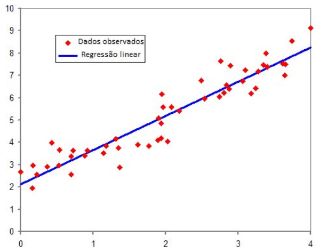

# Aprendizado de Máquina - *Machine Learning*

O aprendizado de máquina (*machine Learning*) ou aprendizado automático, deriva da engenharia com a ciência da computação, evoluindo de estudos de reconhecimeto de padrões e da teoria do aprendizado computacional em inteligência artificial.

A sua definição foi definida por Arthur Samuel em 1959 como: "campo de estudo que dá aos computadores a habilidade de aprender sem serem explicitamente programados".

O aprendizado de máquina é o estudo e a construção de algoritmos que, utilizando dados, realizam previsões e aprendem com os próprios erros. Estes algoritmos recebem amostras a partir das entradas do modelo, de modo a realizar previsões e tomadas de decisões guiadas pelos dados e não por instruções programadas. 

O aprendizado de máquina, utiliza o raciocínio indutivo para produzir os seus resultados, diferenciando-se da inteligência artificial, que pode além disso, utilizar o raciocínio dedutivo.

<!-- 
Raciocínio indutivo (Carro x Ônibus, Gato x Cachorro, etc)

Dados do treinamento: Características observadas
Rótulos: Nomes das características 
-->

> Machine Learning é a arte de programar computadores que aprendem através de dados.

---

**Modelos**

Um modelo é uma representação de um objeto ou sistema. Pode ser físico (protótipo, maquete) ou abstrato (expressão matemática, diagrama, descrição).

Na engenharia ou na ciência de dados, os modelos simulam um comportamento de modo a permitir uma interferência em parâmetros de funcionamento para estudar a mudança de comportamento.

**Algoritmo**

Um algoritmo é uma **sequência finita** de ações executáveis que tem como **objetivo** a **solução** de um determinado **problema**. 

---

**Programação tradicional X Aprendizado de máquina**

| Programação Tradicional | Aprendizado de Máquina |
|:----------------------- |:---------------------- |
| 1. Seleciona exemplos   2. Encontra alguns padrões   3. Escreve as regras   4. Testa o algoritmo | 1. Seleciona exemplos  2. Encontra alguns padrões  3. Extrai as características  4. Treina o algoritmo de ML  5. Testa o algoritmo de ML |

<!-- 
Os algoritmos de Machine Learning aprendem automaticamente quais as
combinações de características são boas preditoras de uma pessoa que não
vai pagar o boleto dentro dos 3 dias de expiração. Como resultado, o
algoritmo é muito menor, mais fácil de manter e mais acurado.
Na programação tradicional, a cada mudança de comportamento, você
precisa adicionar novas regras, ao passo que Machine Learning atualizar o
seu “conjunto de regras” automaticamente sem a sua intervenção. 
-->

**Histórico de desenvolvimento**

| Década | Aprendizado | Altoritmo | Aplicação |
|:------:|:-----------:|:--------- |:--------- |
|     60 | Supervisionado | KNN - *K Nearest Neighbors*   *Linear Regression* | Reconhecimento de padrões   Análises preditivas |
|     70 | Não Supervisionado | *K-means*   Redes Neurais Aritificiais  | Aprende sem o uso de rótulos nos treinos |
|     80 | *Ensemble learning* | *Decision Tree* | Aumento significativo na precisão dos modelos de ML |
|  00/10 | | | *Big Data*   Capacidade Computacional   Redes neurais profundas   *Cloud Computing*   Processamento Paralelo |

---

**Aplicações de Aprendizado de Máquina**

1. Identificação de defeitos em imagens de cameras.
2. Detecção de tumores em imagens médicas.
3. Deteção de objetos em imagens.
4. Classificação de notícias automaticamente.
5. Atribuição de sentimentos as notícias.
6. Remoção de comentários, artigos ou vídeos ofensivos.
7. Resumo de longos textos.
8. Criação de chatbot e assistentes pessoais.
9. Previsão de faturamento.
10. Elasticidade de preço.
11. Reconhecimento facial e de voz.
12. Detecção de fraude de cartão de crédito.
13. Segmentação de clientes
14. Recomendação de produtos

---

**Tipos de Aprendizado**

Os 4 principais tipos de aprendizagem são:

1. Aprendizado Supervisionado
2. Aprendizado Não-Supervisionado
3. Aprendizado Semi-Supervisionado
4. Aprendizado por Reforço

No aprendizado supervisionado, o conjunto de dados para treinamento utiliza um rótulo que identifica a característica observada, usada para o treinamento do algorítmo e separação dos dados em classes.

A aprendizagem supervisionada resolve, basicamente, problemas de **Classificação** e **Regressão**.

**Tarefa de classificação**

Quando o conjunto de treinamento possui o rótulo do fenômeno observado como uma variável discreta, dizemos que é um problema de classificação, ou seja, o algoritmo precisa aprender a classificar os exemplos do conjunto, através da interpretação de suas características, em rótulos ou classes.

| Figura 1: Classificação |
|:-----------------------:|
| |
| Fonte: [Data Hackers - Medium](https://medium.com/data-hackers/knn-k-nearest-neighbor-o-que-%C3%A9-aeebe0f833eb)|

Variáveis discretas são usadas para medir características que podem assumir apenas um número finito contável de valores e, assim, somente fazem sentido valores inteiros. Por exemplo, número de filhos, número de bactérias por litro de leite, número de cigarros fumados por dia e etc.

**Tarefa de regressão**

Quando o conjunto de treinamento possui o rótulo do fenômeno observado como uma variável real ou contínua, como o salário e o peso, por exemplo. Nesse tipo de tarefa, o algoritmo tenta ajustar um novo ponto, ao conjunto de pontos do conjunto de dados, de modo que apresente a menor distância possível dos pontos do conjunto de dados. Por exemplo, peso, salário, número de vendas, preço do produto, propensão de compra, número de dias até a primeira venda acontecer, etc

| Figura 2: Regressão linear                        |
|:-------------------------------------------------:|
|  |
| Fonte: [Dicionário Financeiro](https://www.dicionariofinanceiro.com/regressao-linear/) |

**Algoritmos de Aprendizado de Máquina: Classificação**

1. K-Nearest Neighbors
2. Naive Bayes
3. Light Gradient Boost Machine ( LGBM )
4. Categorical Boost ( CatBoost )
5. Logistic Regression
6. Support Vector Machine ( SVM )
7. Decision Tree
8. Random Forests
9. Neural Networks

**Algoritmos de Aprendizado de Máquina: Regressão**

1. Linear Regression
2. Polinomial Regression

<!-- 
***Nearest Neighbors - KNN***
“K-vizinhos
mais próximos”.
O KNN é um algoritmo de Machine Learning da classe de aprendizado
supervisionado. Ele pode ser utilizando tanto para resolver problemas de
classificação quanto problema de regressão.
Nessa ciclo, vamos estudar o KNN como algoritmo supervisionado para resolver
um problema de classificação.

**Processo de treino**
Passo 01: Carregue os dados
Passo 02: Defina o número K vizinhos mais próximos.
Passo 03: Para cada exemplo sem rótulo:
Passo 04: Calcule a distância entre o ponto sem rótulo e todos os outros
pontos rotulados do conjunto de dados.
Passo 05: Encontre o K pontos mais próximos.
Passo 06: Identifique os rótulos de cada um dos K vizinhos mais próximos.
Passo 07: Calcule a “moda” dos K vizinhos mais próximos.
Passo 08: Classifique o ponto sem rótulo com a moda de seus k vizinhos
mais próximos
 -->

---

**Referências**

[Machine Learning 1959: Uma Visão Histórica do Machine Learning - Awari](https://awari.com.br/machine-learning-1959-uma-visao-historica-do-machine-learning/)
[Introdução ao Machine Learning: Conceitos Básicos - Elaine Cecília Gatto - Portal Embarcados](https://embarcados.com.br/introducao-ao-machine-learning/)

---
