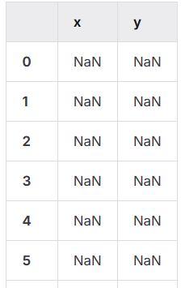

# *Nearest Neighbors - KNN* (K-vizinhos mais próximos)

O KNN é um algoritmo de Machine Learning da classe de aprendizado supervisionado. 

Ele pode ser utilizado para resolver problemas de classificação e de regressão.

**KNN: Premissas**
> A proximidade entre duas evidências de um fenômeno observado, pode ser representada por uma medida de distância.

Objetos similares estão próximos uns aos outros, portanto, as características precisam ser numéricas. Assim, é calculada a distância entre um ponto sem rótulo e todos os seus K vizinhos mais próximos, e o rótulo que possuir o maior número de vizinhos é atribuído ao ponto. 

O melhor K é obtido testando valores diferentes e calculando o erro do algoritmo. O algoritmo que apresentar o menor erro, possui o melhor K.


**Exemplos de uso**

- Sistemas de recomendação: Dado um filme, encontre os K filmes mais similares;
- Classificação de notícias: Dada uma notícia, em qual categoria ela se encaixa?
- Classifiação de cliente: Dado um novo cliente, qual o grupo ele pertence dado o seu perfil?
- Sistema de busca: Dada uma nova consulta, quais notícias podem ser retornadas?


**Vantagens**

1. O KNN é fácil de entender e simples de explicar o seu funcionamento.
2. Não há a necessidade de construir um modelo, ajustar vários parâmetros ou assumir premissas adicionais.
3. O KNN é versátil. Ele pode ser usando para resolver problemas de classificação, regressão e busca.


**Desvantagens**

1. O KNN se tornar significativamente devagar quanto mais o número de exemplos e/ou preditores aumenta. Com o aumento da dimensionalidade dos dados através das colunas, o cálculo da distância fica mais demorado.
2. Em alta dimensionalidade, a distância entre os pontos podem ser distorcidas. Os mesmos pontos podem se aproximar ou se distanciar dependendo da quantidade de colunas na tabela e isso pode alterar os rótulos. O que foi classificado como A, pode ser reclassificado como B.


**Processo de treino em problema de classificação**

1. Carregue os dados
2. Defina o número K vizinhos mais próximos.
3. Para cada exemplo sem rótulo:
      1. Calcule a distância entre o ponto sem rótulo e todos os outros pontos rotulados do conjunto de dados.
      2. Encontre o K pontos mais próximos.
      3. Identifique os rótulos de cada um dos K vizinhos mais próximos.
      4. Calcule a “moda” dos K vizinhos mais próximos.
      5. Classifique o ponto sem rótulo com a moda de seus k vizinhos
mais próximos

**Cálculo de Distância**

Dados dois pontos \(P\) e \(Q\) localizados, respectivamente, nas coordenadas \((P_x,P_y)\) e \((Q_x,Q_y)\).

- Distância Euclidiana: \( d = \sqrt{ (P_x-Q_x)^2 + (P_y-Q_y)^2 } \)
- Distância de Manhattan: \( d = |P_x-Q_x| + |P_y-Q_y| \)
- Distância de Mahallanobis: \( d= \sqrt{ \frac{(P_x-Q_x)^2 + (P_y-Q_y)^2}{ \sigma_{xy}^2} } \)

---


[**Exemplo de Aplicação Simples**](https://gitlab.com/JoseWRPereira/ml_knn_simplest/-/blob/main/knn_simplest.ipynb?ref_type=heads)


Objetivo: Desenvolver uma análise simples utilizando o classificar KNN (K Nearest Neighbors). 

- Dado um plano cartesiano, produzir um conjunto de pontos coordenados (x,y) aleatórios, somente no quadrante I, sendo os valores de x e y dentro do intervalo de 0 a 100;
- Classificar os pontos em dois grupos (GrupoA e GrupoB). O segmento de reta diagonal, da origem (0,0) até o ponto (100,100), separa os grupos;
- Executar o treinamento do classificador KNN com os dados aleatórios;
- Produzir novos dados aleatórios;
- Fazer a classificação com esses novos dados;
- Produzir métrica de performance do algorítmo/classificador.


Etapas:

1. Instalação e importação de bibliotecas;
2. Dataset de treino;
3. Aplicar uma regra de classificação;
4. Exibir os dados;
5. Treinar o classificador KNN;
6. Produzir a predição;
7. Produzir métricas de avaliação (Acurácia, Precisão e Recall);
8. Carregar dados de teste;
9. Produzir predição;
10. Produzir métricas de avaliação (Acurácia, Precisão e Recall).


**1. Instalação e importação de bibliotecas**
```py
# Instalação de bibliotecas
!pip install pandas
!pip install scikit-learn
!pip install matplotlib
!pip install random
```


```ipynb
# importação de bibliotecas
import pandas as pd
from sklearn.neighbors import KNeighborsClassifier
from sklearn import metrics as mt
import matplotlib.pyplot as plt
import random
```

**2. Dataset de treino**

Neste exemplo de estudo, é criado um dataframe com 30 linhas e duas colunas (x e y).

```py
df = pd.DataFrame(index=range(30), columns=['x', 'y'])
df
```



Cada uma das linhas recebe valores aleatórios para x e y, dentro de um intevalor 0..100.

```py
df['x'] = df.apply(lambda x: random.randint(0, 100), axis=1)
df['y'] = df.apply(lambda x: random.randint(0, 100), axis=1)
df
```


Plotando o resultado dos pontos coordenados aleatórios.

```py
plt.plot( df.x, df.y, 'r.' )
plt.show()
```


**3. Aplicar uma regra de classificação**

- Separar o dataframe em dois grupos:
    - GrupoA: se valor de x < y
    - GrupoB: se valor de x >= y

```py
df['Categoria'] = df.apply( lambda x: "GrupoA" if x['x'] < x['y'] else "GrupoB", axis = 1)
df
```


**4. Exibir os dados**

Filtrando somente elementos do `GrupoA` em `grA` somente elementos do `GrupoB` em `grB`.

```py
grA = df.loc[df.Categoria.values=='GrupoA']
grB = df.loc[df.Categoria.values=='GrupoB']
```

Plotando os dois grupos, com marcadores diferentes para observar as suas localizações.

```py
plt.plot( grA.x, grA.y, 'rx' )
plt.plot( grB.x, grB.y, 'b.' )
plt.show()
```


Obs: Exemplo meramente ilustrativo, pois, para cada execução do passo 2, novos valores são gerados, produzindo um resultado diferente. 


**5. Treinar o classificador KNN**

Selecionando as características (*features*) a serem usadas no treinamento.

```py
features = ['x','y']
label = ['Categoria']
```

Em *label*, temos o rótulo da coluna de resultado de referência para o treinamento.


Separando os dados de treino, `x_train` para as características e `y_train` para os rótulos.
```py
x_train = df.loc[:,features]
y_train = df.loc[:,label].values.ravel()
```

Visualizando dados de treino.

```py
x_train
```


```py
y_train
```


Treinamento do algoritmo KNN.

```py
knn_classifier = KNeighborsClassifier( n_neighbors = 8 )
knn_classifier.fit( x_train, y_train )
```

**6. Produzir a predição**

Uma predição é gerada utilizando os mesmos dados de treinamento.
```py
y_pred = knn_classifier.predict( x_train )
```

Inclusão de dados de predição no *dataframe* de dados.

```py
df['Predicao'] = y_pred
df
```


**7. Produzir métricas de avaliação (Acurácia, Precisão e Recall)**

Para a **Matriz Confusão**, são inseridos como parâmetros os rótulos de treinamento e os valores de predição produzidos pelo classificador treinado.

```py
mt.confusion_matrix( y_train, y_pred )
```


Acurácia

```py
mt.accuracy_score( y_train, y_pred )
```

```py
0.8666666666666667
```


Precisão
```py
mt.precision_score( y_train, y_pred, average="binary", pos_label='GrupoA' )
```
```py
0.8
```


Recall

```py
mt.recall_score( y_train, y_pred, average='binary', pos_label='GrupoA' )
```
```py
0.8
```


**8. Carregar dados de teste**

```py
dftest = pd.DataFrame(index=range(100), columns=['x', 'y'])
```


```py
dftest['x'] = dftest.apply(lambda x: random.randint(0, 100), axis=1)
dftest['y'] = dftest.apply(lambda x: random.randint(0, 100), axis=1)
dftest
```


```py
plt.plot( dftest.x, dftest.y, 'r*' )
plt.show()
```


**9. Produzir predição**

Previsão das observações

```py
y_pred = knn_classifier.predict( dftest[['x','y']] )
```
```py
dftest['Predicao'] = y_pred
dftest
```


```py
dftest['Categoria'] = dftest.apply( lambda x: "GrupoA" if x['x'] < x['y'] else "GrupoB", axis = 1)
dftest
```


**10. Produzir métricas de avaliação (Acurácia, Precisão e Recall)**

Para a **Matriz Confusão**, são inseridos como parâmetros os rótulos dos dados e os valores de predição produzidos pelo classificador treinado.

```py
mt.confusion_matrix( dftest['Categoria'], dftest['Predicao'] )
```
```py
array([[46,  5],
       [ 3, 46]])
```

Acurácia

```py
mt.accuracy_score( dftest['Categoria'], dftest['Predicao'] )
```
```py
0.92
```


Precisao
```py
mt.precision_score( dftest['Categoria'], dftest['Predicao'], average="binary", pos_label='GrupoA' )
```
```py
0.9387755102040817
```


Recall
```py
mt.recall_score( dftest['Categoria'], dftest['Predicao'], average='binary', pos_label='GrupoA' )
```
```py
0.9019607843137255
```


Seleção dos pontos classificados como `True Positive`.
```py
tp = dftest.loc[ (dftest.Categoria.values=='GrupoA') & (dftest.Predicao.values=='GrupoA') ]
tp
```


Seleção dos pontos classificados como `True Negative`.
```py
tn = dftest.loc[ (dftest.Categoria.values=='GrupoB') & (dftest.Predicao.values=='GrupoB') ]
tn
```


Seleção dos pontos classificados como `False Positive`.
```py
fp = dftest.loc[ (dftest.Categoria.values=='GrupoB') & (dftest.Predicao.values=='GrupoA') ]
fp
```


Seleção dos pontos classificados como `False Negative`.
```py
fn = dftest.loc[ (dftest.Categoria.values=='GrupoA') & (dftest.Predicao.values=='GrupoB') ]
fn
```


Plotando dados classificados de modo a destacar os pontos classificados incorretamente.

```py
plt.plot(dftest.index, dftest.index, 'g-');
plt.plot(tp.x, tp.y, 'r.');
plt.plot(tn.x, tn.y, 'b.');
plt.plot(fp.x, fp.y, 'rx');
plt.plot(fn.x, fn.y, 'bx');
plt.show()
```


---


**Exemplo no Kaggle**

- [knn-CreditCardLimitClassification](https://gitlab.com/JoseWRPereira/knn-creditcardlimitclassification/-/blob/main/knn-CreditCardLimitClassification.ipynb?ref_type=heads)


---
**Referências**

1. [O que é: Distância de Mahalanobis - Aprenda estatística Fácil](https://estatisticafacil.org/glossario/o-que-e-distancia-de-mahalanobis/)


---
