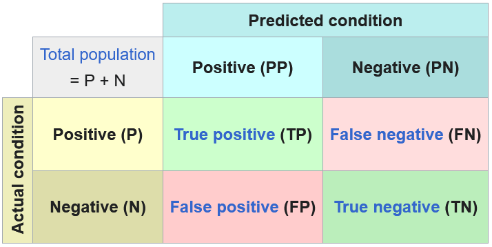
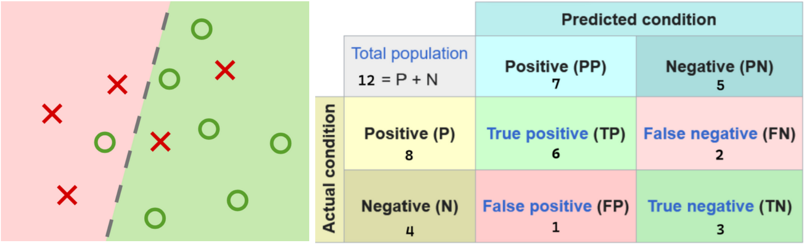

# Matriz de confusão

A **Matriz de confusão** é uma ferramenta para medir a performance de uma algoritmo.

**Exemplo**

| # |1|2|3|4|5|6|7|8|9|10|11|12|
|:-:|:-:|:-:|:-:|:-:|:-:|:-:|:-:|:-:|:-:|:--:|:--:|:--:|
| Diag. |1|1|1|1|1|1|1|1|0|0|0|0|
| Pred. |0|0|1|1|1|1|1|1|1|0|0|0| 

| Figura 1: Matriz de Confusão            |
|:---------------------------------------:|
|  |
| Fonte: [Wikipedia](https://en.wikipedia.org/wiki/Confusion_matrix) |

- *True Positive* : Classificação correta da classe positiva
- *True Negative* : Classificação correta da classe negativa
- *False Positive* : Classificação errada da classe positiva
- *False Negative* : Classificação errada da class negativa

| Figura 2: Classificação de elementos e matriz de confusão |
|:---------------------------------------------------------:|
|                 |
| Fonte: Modificado de [Wikipedia](https://en.wikipedia.org/wiki/False_positives_and_false_negatives#False_negative_error)   |

**Acurácia**

<!-- Acurácia é a quantidade de previsões acertadas nas duas condições dividida pelo total de eventos.  -->

$$
Acurácia = \frac{TP+TN}{P+N}
$$

**Precisão**

$$
Precisão = \frac{TP}{TP+FP}
$$

**Recall**

$$
Recall = \frac{TP}{TP+FN}
$$

---
