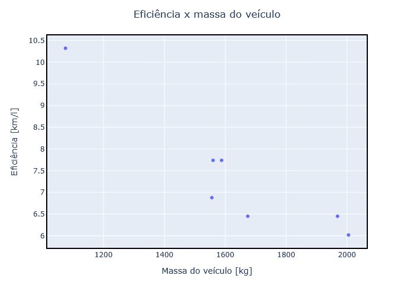

# Regressão linear

A regressão linear, encontra, através de técnicas estatísticas, a relação entre variáveis, que no contexto de *Machine Learning*, significa a relação entre atributos e rótulo.

Como exemplo, temos a tabela a seguir com a relação simplificada entre a massa de veículos e a eficiência no consumo de combustível. 

| kg  |km/l|
|:---:|:--:|
|1588 |7.74|
|1674 |6.45|
|1560 |7.74|
|1556 |6.88|
|1969 |6.45|
|2005 |6.02|
|1075 |10.32|

Ao plotarmos um gráfico utilizando os dados da tabela, obtemos o seguinte resultado:

|Figura 1: Relação Massa x Eficiência em veículos |
|:-----------------------------------------------:|
|                       |
| Fonte: Adaptado de [Regressão linear - Google](https://developers.google.com/machine-learning/crash-course/linear-regression?hl=pt-br) |


Com isso, o objetivo é traçar uma reta que represente os pontos com o menor erro possível, de modo a permitir a extrapolação de resultados mediante valores que não estão na tabela inicial. A Figura 2 ilustra a reta de predição. 

|Figura 2: Relação Massa x Eficiência em veículos com reta de predição |
|:--------------------------------------------------------------------:|
|                                       |
| Fonte: Adaptado de [Regressão linear - Google](https://developers.google.com/machine-learning/crash-course/linear-regression?hl=pt-br)  |


---

**Equação de regressão linear**

Em termos algébricos, o modelo é definido como 

$$y = mx + b$$

em que:

- $y$ é o valor em km por litro que queremos prever;
- $m$ é a inclinação da linha, coeficiente angular;
- $x$ é o valor de entrada, neste caso a massa em kg;
- $b$ é a intersecção com o eixo y.

No aprendizado de máquina, escrevemos a equação de um modelo de regressão linear da seguinte maneira:

$$y' = b + w_1 x_1$$

- $y'$ é o **rótulo** previsto, ou seja, a saída;
- $b$ é o **viés** (*bias*) do modelo, é um parâmetro calculado durante o treinamento e representa o mesmo conceito da intersecção de `y` na equação algébrica de uma linha;
- $w_1$ é o **peso** do elemento. O peso é o mesmo conceito da inclinação da reta na equação algébrica de uma linha. O peso também é um parâmetro do modelo calculado durante o treinamento;
- $x_1$ é um **recurso**, ou seja, a entrada.


Para uma modelagem com um número maior de recursos, ou seja, entradas, como no exemplo, além da massa, poderíamos ter a aceleração, o número de cilindros, a potência, etc, a equação ficaria algo como:

$$y' = b + w_1 x_1 + w_2 x_2 + w_3 x_3 + w_4 x_4$$

Sendo os valores de `x` correspondente as grandezas de entrada e os valors de `w`, respectivos coeficiêntes gerados no treimento. 

---

**Atividade mediada**

Objetivo: 
Encontrar os coeficientes de uma reta que melhor ilustra os pontos do exemplo da Figura 2.

Utilizando o [Google Colab](https://colab.google/), execute o código a seguir:

1) Carregar o arquivo de dados ([*dataset*](../dataset/carro_eficiencia.csv)) diretamente do seu computador clicando no botão `Upload to session storage`, conforme indicado na Figura 3:

| Figura 3: Carregando um arquivo para área de armazenamento em nuvem |
|:-------------------------------------------------------------------:|
|                                   |
| Fonte: Autor                                                        |


2) Importar as bibliotecas utilizados no projeto:
 
```py
# Biblioteca para manipulação de conjunto de dados, incluindo arquivos .csv
import pandas as pd

# Biblioteca para calculo científico e algebra linear
import numpy as np
import math

# Bibliotecas para visualização de dados
import matplotlib.pyplot as plt
import plotly.express as px
import plotly.graph_objects as go

```

3) Carregar a tabela de dados para a variável `data`:

```py
data = pd.read_csv('carro_eficiencia.csv')
data.info()
```

4) Exibir os dados:

```py
print(data.columns)
data.head(10)
```

5) Plotar os dados:

```py
fig = px.scatter(x = data['kg'], y=data['km_l'])
fig.update_layout(title = 'Eficiência x massa do veículo', title_x=0.5, xaxis_title= "Massa do veículo [kg]", yaxis_title="Eficiência [km/l]", height = 500, width = 700)
fig.update_xaxes(showline=True, linewidth=2, linecolor='black', mirror=True)
fig.update_yaxes(showline=True, linewidth=2, linecolor='black', mirror=True)
fig.show()
```

6) Estimar os coeficientes de `b` e `w`, de forma empírica:

```py
b = 0.0
w = 1.0

print(f'Coeficientes:\n b: {b} \n w: {w} \n \n y = b + w.x')
```

7) Carregar as variáveis `x` e `y` para facilitar o plot dos dados e calcular `y_pred` com base nos parâmetros definidos anteriormente. 

```py
x       = data['kg'].values.copy()
y       = data['km_l'].values
y_pred  = b + w * x

print(f'x: {x}')
print(f'\n\ny: {y}')
print(f'\n\ny_hat: {y_pred}')
```

8) Plotar dados reais e reta de predição:

```py
fig = go.Figure()
fig.add_trace(go.Scatter(x=data['kg'], y=data['km_l'],  name='train',       mode='markers',       marker_color='rgba(152, 0, 0, .8)'))
fig.add_trace(go.Scatter(x=data['kg'], y=y_pred,        name='prediction',  mode='lines+markers', marker_color='rgba(0, 152, 0, .8)'))

fig.update_layout(title = f'Correlação de eficiência pela massa dos veículos',title_x=0.5, xaxis_title= "Massa do veículo", yaxis_title="Eficiência")
fig.update_xaxes(showline=True, linewidth=2, linecolor='black', mirror=True)
fig.update_yaxes(showline=True, linewidth=2, linecolor='black', mirror=True)
fig.show()
```

Caso a reta não esteja, visualmente ajustada aos pontos, retorne e ajuste os valores de `b` e `w`.


<!-- ```py
mean_x = np.mean(data['kg'])
mean_y = np.mean(data['km_l'])

var_x = np.var(data['kg'])
var_y = np.var(data['km_l'])


print('x stats: mean= %.3f   variance= %.3f' % (mean_x, var_x))
print('y stats: mean= %.3f   variance= %.3f' % (mean_y, var_y))


# Calcula a covariância entre x e y
def covariance(x, y):
    mean_x = np.mean(x)
    mean_y = np.mean(y)
    covar = 0.0
    for i in range(len(x)):
        covar += (x[i] - mean_x) * (y[i] - mean_y)
    return covar/len(x)


covar_xy = covariance(data['kg'], data['km_l'])
print(f'Cov(kg,km_l): {covar_xy}')


w1 = covar_xy / var_x
b1 = mean_y - w1 * mean_x

print(f'Coeficientes:\n b: {b1}  w: {w1} ')
``` -->

---

**Exercício: Conjunto de dados de seguros sueco**

O conjunto de dados chamado [*`Auto Insurance in Sweden`*](../dataset/swedish_insurance.csv) (Seguro Automóvel na Suécia) e envolve a previsão do pagamento total de todas as reivindicações em milhares de *`Swedish Krona`* (Coroas suecas) (y) dado o número total de reclamações (x).

Isso significa que, para um novo número de reclamações (x), poderemos prever o pagamento total (y).

Elabora uma equação de predição para o conjunto de dados de seguros suecos.


---

**Referências**

1. [Regressão Linear](https://developers.google.com/machine-learning/crash-course/linear-regression?hl=pt-br)
2. Kaggle

---
