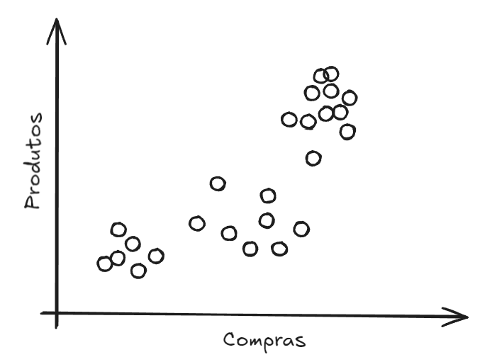
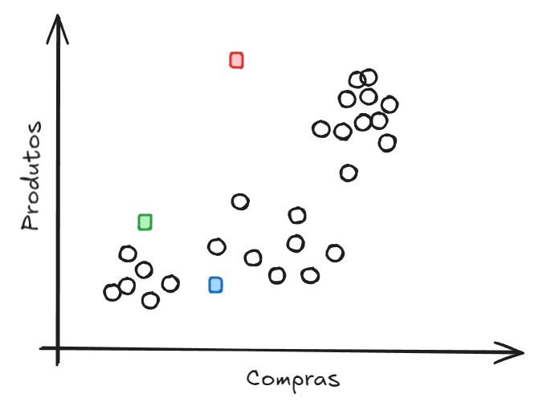
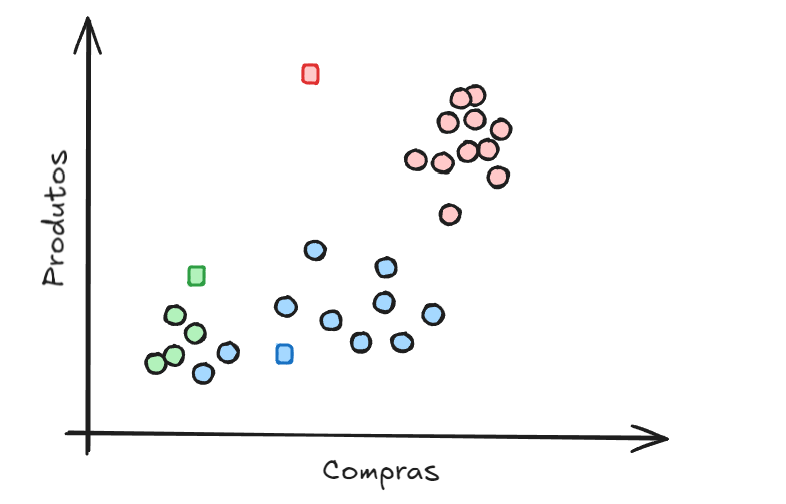
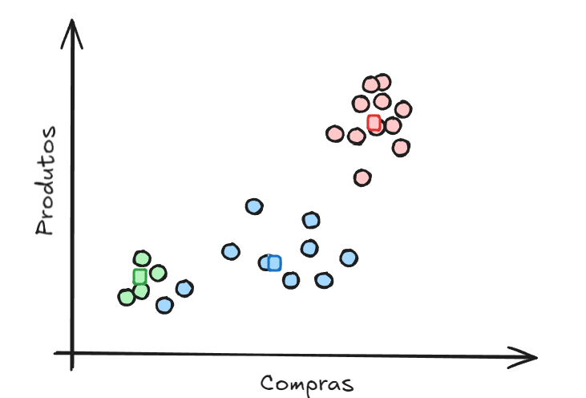
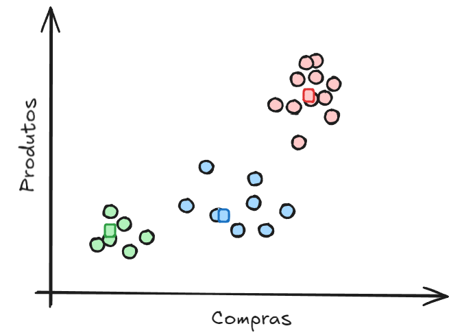
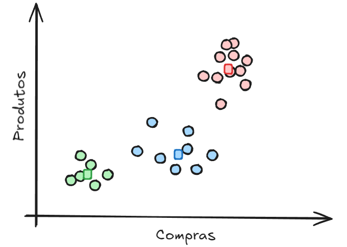

# K-Means *Clustering* (Clusterização - Agrupamento)

O algoritmo de Lloyd, mais conhecido como K-means, é um algoritmo não supervisionado que busca padrões para agrupar os elementos, ou seja, produzir *clusters*, ou grupos com características similares.

Cada um desses grupos é representado por um centróide, que é o ponto médio entre os pontos do grupo.


Claro que neste exemplo a visualização destes três grupos é fácil, o que não ocorre em conjunto de dados reais com tanta facilidade. 



A etapa inicial é definir o número de centróides que desejamos utilizar. Neste caso três (3). Eles são dispostos em posições aleatórios inicialmente. 



Em seguida são calculadas as distâncias de cada ponto para todos os centróides, e o ponto recebe uma classificação inicial do centróide mais próximo. 



Em seguida, os centróides são reposicionados de modo a se localizarem na posição central em relação aos pontos do seu agrupamento. 



Seguem ciclos de cálculo das distância de cada ponto para os centróides novamente, sendo que alguns pontos trocaram de grupo por estarem, agora, mais próximos de outro centróide. 



Este ciclo se repete até que não haja mudança de pontos de agrupamentos. 



Como resultado final do algoritmo, temos os três grupos de clientes em uma loja de comércio eletrônico, que podem ser classificados com os seguintes perfis: 

- o grupo de clientes que compram com pouca frequência e poucos produtos;
- o grupo de clientes que compram com uma frequência maior com um pouco mais de produtos em seus carrinhos;
- o grupo de clientes mais valioso, pois são aqueles que possuem um frequência de compra alta e compram muitos produtos. 

---

**Vantages**

- Simples entender e aplicar;
- Eficiente computacionalmente, permitindo trabalhar com grande quantidade de dados.

**Desvantagens**

- Especificar o número de *clusters* previamente;
- Para obter boa performance, os *clusters* devem ser esféricos e densos.
---

**Atividade mediada**

Objetivo: Compreender o uso do algoritmo *K-Means* e definir o número de K agrupamentos. 

1) Utilize o [Google Colab](https://colab.google/) ou jupyter notebook;


2) Carregar o arquivo de dados: [cluster_data.csv](../dataset/cluster_data.csv);


3) Importar bibliotecas:

```py
import pandas as pd
from sklearn.cluster import KMeans
from sklearn import metrics
import matplotlib.pyplot as plt
```

4) Carregar dataset:

```py
data = pd.read_csv('cluster_data.csv')
data
```

5) Selecionar as características para a variável x:

```py
x = data.loc[:,['Feature 1', 'Feature 2']]
x
```

6) Plotar os dados:

```py
fig, ax = plt.subplots()
ax.scatter(x['Feature 1'], x['Feature 2'])
plt.show()
```

7) Aplicar o algoritmo K-Means com número de clusters = 2:

```py
kmeans2 = KMeans(n_clusters=2).fit(x)
```

8) Exibir os rótulos de agrupamento:

```py
kmeans2.labels_
```

9) Plotar 2 agrupamentos:

```py
fig, ax = plt.subplots()
ax.scatter(x['Feature 1'], x['Feature 2'], c=kmeans2.labels_)
plt.show()
```

10) Plotar 3 agrupamentos:

```py
kmeans3 = KMeans(n_clusters=3).fit(x)
kmeans3.labels_
fig, ax = plt.subplots()
ax.scatter(x['Feature 1'], x['Feature 2'], c=kmeans3.labels_)
plt.show()
```

11) Plotar 4 agrupamentos:

```py
kmeans4 = KMeans(n_clusters=4).fit(x)
kmeans4.labels_
fig, ax = plt.subplots()
ax.scatter(x['Feature 1'], x['Feature 2'], c=kmeans4.labels_)
plt.show()
```

12) Plotar 5 agrupamentos:

```py
kmeans5 = KMeans(n_clusters=5).fit(x)
kmeans5.labels_
fig, ax = plt.subplots()
ax.scatter(x['Feature 1'], x['Feature 2'], c=kmeans5.labels_)
plt.show()
```


13) Plotar 6 agrupamentos:

```py
kmeans6 = KMeans(n_clusters=6).fit(x)
kmeans6.labels_
fig, ax = plt.subplots()
ax.scatter(x['Feature 1'], x['Feature 2'], c=kmeans6.labels_)
plt.show()
```

14) Percorrendo diferentes valores de K:

```py
valores_k = [] 
inercias =  []

for i in range(1,15):
  kmeans = KMeans(n_clusters=i, random_state=0).fit(x)
  valores_k.append(i)
  inercias.append(kmeans.inertia_)

fig, ax = plt.subplots()
ax.plot(valores_k, inercias)
plt.show()
```


15) Plotar agrupamentos de k=2 e k=3:

```py
fig, ax = plt.subplots(ncols=2, figsize=(15,6))
ax[0].scatter(x['Feature 1'], x['Feature 2'], c=kmeans2.labels_)
ax[1].scatter(x['Feature 1'], x['Feature 2'], c=kmeans3.labels_)
plt.show()
```


16) Coeficiente Silhueta para K=2:

```py
metrics.silhouette_score(x, kmeans2.labels_)
```

17) Coeficiente Silhueta para K=3:

```py
metrics.silhouette_score(x, kmeans3.labels_)
```

18) Percorrendo diferentes valores de K:

```py
valores_k = []
s = [] 

for i in range(2,15):
  kmeans = KMeans(n_clusters=i,random_state=0).fit(x)
  valores_k.append(i)
  s.append(metrics.silhouette_score(x, kmeans.labels_))
```

19) Plotar silhueta para diferentes valores de K
```py
fig, ax = plt.subplots()
ax.plot(valores_k, s)
plt.show()
```


---

**Referências**

1. [O que é agrupamento k-means? - IBM](https://www.ibm.com/br-pt/think/topics/k-means-clustering)
2. [Entendendo Clusters e K-Means - Igor Felcam - Medium](https://medium.com/cwi-software/entendendo-clusters-e-k-means-56b79352b452)
3. [Scikit learn](https://scikit-learn.org/stable/modules/generated/sklearn.cluster.KMeans.html)
4. [K means Clustering – Introduction - geeksforgeeks](https://www.geeksforgeeks.org/k-means-clustering-introduction/)
5. [Como funciona o algoritmo K-Means? - ComunidadeDS](https://youtu.be/OWyWevKhM0c?si=A8_4GgATVlUG5Ejb)
6. [Introdução ao algoritmo k-means - IA Expert Academy](https://youtu.be/WqMnQuC19Rg?si=BiRb3aUYN6pqSi1K)
7. [Scikit learn - Clustering](https://scikit-learn.org/stable/modules/clustering.html)
8. [Algoritmo K-Means. Passo a passo, com animação e cálculos! - Prof. JH](https://youtu.be/KN44-5oXZ7w?si=3XUjdxwJ3ciPhsGJ)


---
