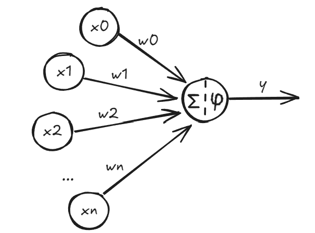
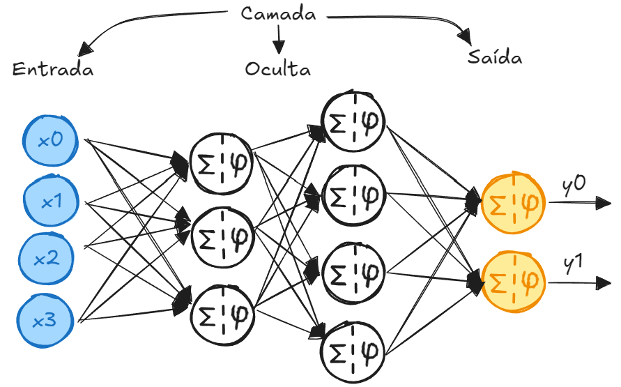

# Rede Neural

Rede Neural é um modelo computacional, ou seja, uma representação de uma rede baseada no comportamento de um neurônio biológico.




- $x_0, x_1, x_2, ..., x_n$: Sinais de entrada;
- $w_0, w_1, w_2, ... w_n$: Weight (Peso);
- $\Sigma$: Somatório dos sinais de entrada;
- $\varphi$: Função de Ativação. Operação de não linearidade;
- $y$: Saída.


A conexão entre vários neurônios, organizados em camadas, formam uma rede neural.




Quando a quantidade de camadas aumenta, surge o termo *Deep Learning*.

---

O treinamento de um modelo de *machine learning* consiste em produzir um algoritmo, fornecer valores de entrada e valores de saída, de modo que o algoritmo **ajuste adequadamente os pesos da rede** até que o resultado seja satisfatório. 


---

**Código de exemplo**

```py title='Importação de bibliotecas'
import numpy as np
import matplotlib.pyplot as plt
```

```py title='Criando o dataset'
def get_linear_curve(x, w, b=0, noise_scale=0):
  return w*x + b + noise_scale*np.random.randn(x.shape[0])

x = np.arange(0, 40.1, 2)
y = get_linear_curve(x, 1.8, 32, noise_scale=2.5)

plt.scatter(x, y)
plt.ylabel('°F', fontsize=20)
plt.xlabel('°C', fontsize=20)
```

```py title='Construindo o modelo: Função forward'
# inputs: Entradas
# w: weight - peso
# b: bias - viés

def forward(inputs, w=1.0, b=0):
  return w*inputs + b
```

```py title='Construindo o modelo: Função Erro Quadrático Médio'
# mse: Mean Square Error - Erro Quadrático Médio
# y: valores reais
# ym: valores do modelo

def mse(y, ym):
  return (y-ym)**2
```
```py title='Construindo o modelo: Função de retroalimentação'
# inputs: Entradas
# outputs: Valores de saída calculados
# target: Valores de saída reais
# w: weight - peso
# b: bias - viés
# lr: learning rate - taxa de aprendizagem

def backpropagation(inputs, outputs, targets, w, b, lr):
  w -= lr*(-2*inputs*(targets-outputs)).mean()
  b -= lr*(-2*(targets-outputs)).mean()

  return w, b
```

```py title='Construindo o modelo: Função de ajuste dos parâmetros'
# inputs: Entradas
# target: Valores reais
# w: weight - peso
# b: bias - viés
# epochs: épocas - qtd de iterações
# lr: learning rate - taxa de aprendizagem

def model_fit(inputs, target, w, b, epochs = 200, lr = 0.001):

  for epoch in range(epochs):

    outputs = forward(inputs, w, b)
    loss = np.mean(mse(target, outputs))
    w, b = backpropagation(inputs, outputs, target, w, b, lr)

    if (epoch+1) % (epochs/10) == 0:
      print(f'Epoch: [{(epoch+1)}/{epochs}] Loss: [{loss:.4f}]')

  return w, b
```

```py title='Utilizando o modelo'
# Inicialização

w = np.random.randn(1)
b = np.zeros(1)

w, b = model_fit(x, y, w, b, epochs=20000, lr=0.0008)
print(f'w: {w[0]:.3f}, b: {b[0]:.3f}')
```

```py title='Plotando: Resultado x Valores reais'
plt.scatter(x, y)
plt.plot(x, get_linear_curve(x, w, b),'g', lw=3)
```


---

**Referências**

1. [O que é Rede Neural Artificial e como funciona | Pesquisador de IA explica | IA Descomplicada](https://youtu.be/i6l3R7j95x8?si=ZifbipBY92RXpY5n)
2. [Redes Neurais - Introdução às Redes Neurais - UniVESP](https://youtu.be/kzFqGhK8Q2s?si=k9br8YGYsInt6WAD)
3. [Redes Neurais Artificiais](https://sites.icmc.usp.br/andre/research/neural/)
4. [O que é uma rede neural? - IBM](https://www.ibm.com/br-pt/think/topics/neural-networks)
5. [Neurônios e Redes Neurais Artificiais - Blog do Nei](https://neigrando.com/2022/03/03/neuronios-e-redes-neurais-artificiais/)
6. [Introdução completa a Redes Neurais em Python utilizando Tensorflow/Keras - Pedro Didier](https://youtu.be/PdFf_QOfjCg?si=9-xpSamvS0xzBYuT)
7. [Redes Neurais e Machine Learning | Nerdologia Tech](https://youtu.be/1_c_MA1F-vU?si=Wmc3qwZTDKdK7G5U)
8. [Rede neural do zero em Python: Modelo básico | Machine Learning para humanos](https://youtu.be/x8glTaEselM?si=ZipSVysbdKYfdaeT)
9. [ep13 Treino, teste e validação | Cérebro Eletrônico IFSP](https://youtu.be/1pxw6lMT1Tw?si=Ms9vDx5ADHAUJZGq)
10. [APRENDA REDES NEURAIS EM PYTHON - TEORIA E PRÁTICA | Inteligência Mil Grau](https://youtu.be/I8MkOHFOmhc?si=dLs1iw06YDc4Thue)


---
