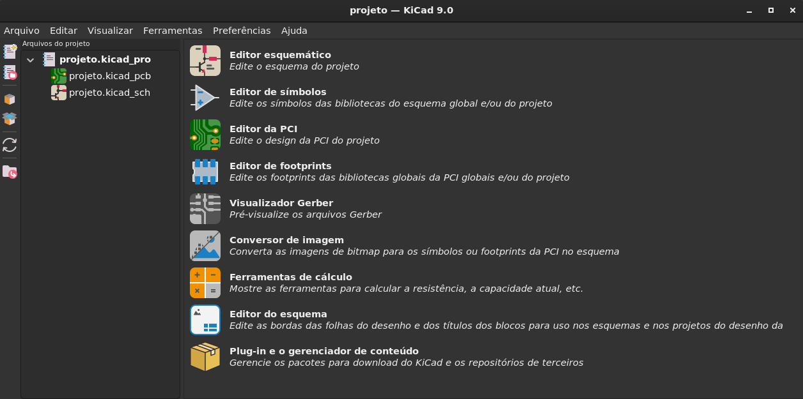

# Criando um novo projeto vazio

1) Abra o software KiCad.

2) No menu `Arquivo`, clique em `Novo projeto...        Ctrl+N`

2.1) Selecione o **local** e defina um **nome** para o projeto. 

---

# Referências

KICAD. **Homepage**. Disponível em: https://www.kicad.org/. Acesso em: 24 fev. 2026.

LIMA, Charles Borges de; VILLAÇA, Marco Valério Miorim. **AVR e Arduino**: Técnicas de Projeto. 2. ed. Florianópolis: Edição dos Autores, 2012.

TAVARES, Rodrigo. **Curso de Projeto de PCB com KiCAD**. YouTube. [s. d.]. Playlist (26 vídeos). Disponível em: https://www.youtube.com/playlist?list=PL8kCnofYYWZrkhUis1svLGux1tjYNJy2Z. Acesso em: 24 fev. 2026.

