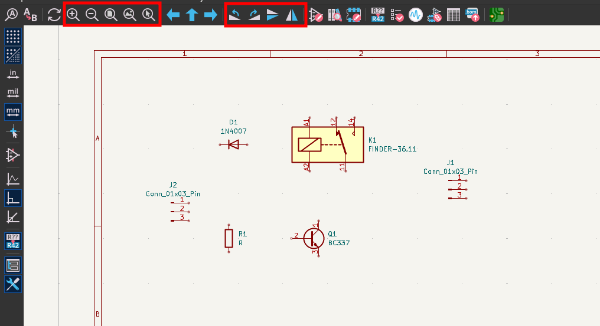
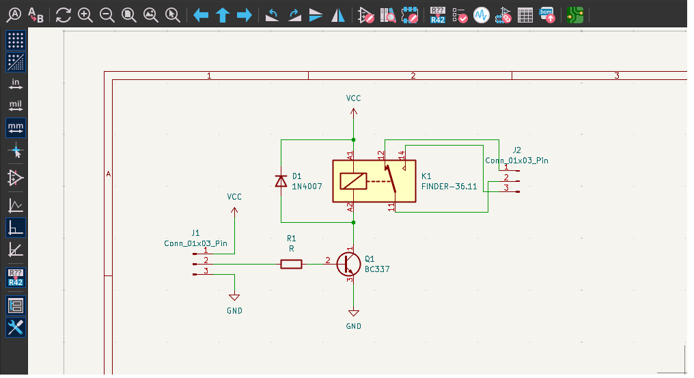

# Esquemático - Inserindo componentes e montando circuitos

1) Abra o esquemático do projeto.

O esquemático, ou diagrama esquemático, do projeto é o local em que o circuito eletrônico é representado através de seus símbolos gráficos padronizados, bem como suas interconexões de modo que realizem suas funcionalidades específicas.

Para a elaboração de uma placa de circuito impresso (PCI), o diagrama esquemático é a etapa inicial, base para a construção da etapa seguinte que consiste no posicionamento físico dos componentes na elaboração do leiaute (*layout*). 

1) Abrir esquemático do projeto 

1.1) Clique duplo no arquivo com o nome do projeto e extensão `.kicad_sch`.

1.2) Mantenha a seleção recomendada para cópia da biblioteca global de símbolos.

1.3) Clique em `OK`

2) Adicionar símbolos

2.1) Clique em `Posicionar` e em seguida `Posicionar símbolos` ou no ícone correspondente, conforme imagem ou use o atalho `A`;

2.2) A primeira vez que esta opção for executada, uma janela solicitando o carregamento de biblioteca e feita, mantenha a opção recomendada e confirme. 

2.3) Digite no campo de pesquisa o componente desejado

Se for inserir mais de uma unidade do mesmo componente, selecione a opção `Posicione cópias repetidas`

2.4) Inserir componentes no esquemático

Insira os componentes no esquemático e use as ferramentas de lupa, rotação e espelhamento para melhor posicionar os componentes no circuito. 

2.5) Conecte os terminais dos componentes com linhas clicando no terminal de origem e no de destino. 

---

# Referências

KICAD. **Homepage**. Disponível em: https://www.kicad.org/. Acesso em: 24 fev. 2026.

LIMA, Charles Borges de; VILLAÇA, Marco Valério Miorim. **AVR e Arduino**: Técnicas de Projeto. 2. ed. Florianópolis: Edição dos Autores, 2012.

TAVARES, Rodrigo. **Curso de Projeto de PCB com KiCAD**. YouTube. [s. d.]. Playlist (26 vídeos). Disponível em: https://www.youtube.com/playlist?list=PL8kCnofYYWZrkhUis1svLGux1tjYNJy2Z. Acesso em: 24 fev. 2026.

