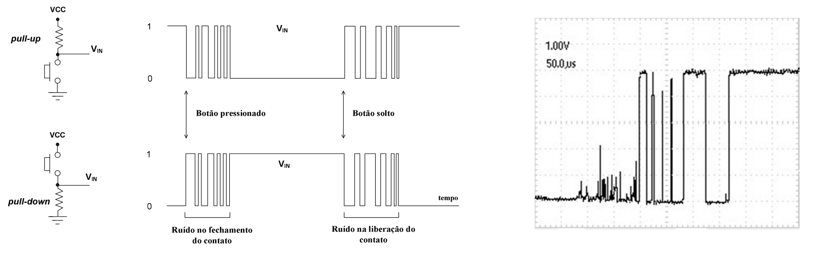

#

# 1. Chave Táctil, Botão de Pressão ou *Push-Button*

É um dispositivo que realiza condução ou interrupção elétrica entre, ao menos, dois de seus terminais de forma momentânea. 

São usados para realizar um comando de forma mecânica para um dispositivo eletrônico ao pressionar o botão. 

São compostos de dois ou mais terminais, e contatos que fecham ou abrem ao se realizar o acionamento. Esses contatos retornam à posição original ao deixar de pressionar o botão. Sendo assim, temos botões de pressão cujos contatos estão abertos normalmente (NA ou NO) e são fechados quando o botão é acionado e botões de pressão cujos contatos estão fechados normalmente(NF ou NC) e são abertos quando o botão é acionado. 

*   **Necessidade de Resistor:** Um dispositivo digital necessita obrigatoriamente receber um nível de tensão bem estabelecido, geralmente +5V ou 0V, por exemplo. Um pino de microcontrolador que recebe este estímulo não pode ficam em aberto, configurando um estado indefinido de tensão. Para evitar esta condição, usa-se um ramo alimentado pela fonte e com resistor em série com a chave táctil, de modo a garantir um nível lógico bem definido quando os contatos da chave estiverem em aberto. 
*   **Valor do Resitor:** O objetivo é definir um nível de tensão que seja reconhecido como `1` ou `0` lógico, e não há necessidade de injeção de corrente no pico do microcontrolador, já que o estímulo é pela tensão. Assim, costuma-se usar um resistor de valor alto, para que o consumo de corrente seja baixo, reduzindo o consumo de energia do circuito. O valor mais comum é de **10 k$\Omega$**. Outros valores na mesma escala de resistência podem ser usados. 

As duas configurações possíves são mostradas na ilustração abaixo, em que o botão está conectado ao Vcc e a outra em que o botão está conectado ao terra.

| Ligação do resistor de *pull-down*      | Ligação do resistor de *pull-up*     |
|:---------------------------------------:|:------------------------------------:|
| |  |

Na configuração pull-down o resistor está conectado ao terra, o que garante, quando o botão estiver aberto, o nível lógico 0 (terra/GND) chegando no pino do uC.

Ao pressionar o botão, ele fecha e conecta o ponto de conexão com o pino ao Vcc, aplicando o nível lógico 1 a ele.

Na configuração pull-up o resistor está conectado ao positivo da fonte, Vcc. O botão na condição de não acionado está com contato aberto, assim a tensão sobre ele é a tensão da fonte, nesse caso 5V, conforme a 2ª lei de Kirchhoff, garantindo o nível lógico 1.

Ao pressionar o botão, ele fecha, ligando o ponto de conexão com o pino do uC ao GND, aplicando o nível lógico 0 a ele.

A configuração com o resistor de pull-down é a que proporciona uma lógica direta a entrada do dado: botão pressionado.

## 2. O Fenômeno do *Bounce* (Trepidação)

Na prática, os botões mecânicos não estabelecem contato de forma instantânea e limpa. Quando pressionados ou soltos, os contatos metálicos sofrem um repique mecânico, gerando o chamado bounce. Esse ruído produz oscilações na tensão que podem durar cerca de 10 ms, fazendo com que o microcontrolador (que opera em alta velocidade) interprete um único clique físico como múltiplos acionamentos lógicos.

| Figura: Exemplos de ruído gerados no pressionar e soltar um botão |
|:-----------------------------------------------------------------:|
|  |
| Fonte: Lima e Vilaça (2012) |

### 2.1 Técnicas de Debounce

Para solucionar o problema da trepidação, utiliza-se a técnica de **debounce**. Em sistemas microcontrolados ela é comumente realizada via software, porém o **debounce por hardware** é uma técnica que filtra essas oscilações antes mesmo que o sinal chegue ao pino do microcontrolador, economizando recursos de processamento da CPU.

As fontes descrevem duas formas principais de realizar o debounce via hardware:

#### 2.1.1 Filtros RC (Resistor-Capacitor)

A maneira mais comum de filtrar o ruído é através do uso de **capacitores** e resistores.

*   **Funcionamento:** Um capacitor é colocado em paralelo com o botão ou entre o pino de entrada e o terra. Ele funciona como um filtro passa-baixa, suavizando as transições rápidas de tensão causadas pelo repique mecânico.

*   **Constante de Tempo ($\tau$):** O tempo de estabilização é determinado pela fórmula $\tau = R \times C$. Para que o filtro seja eficaz, o período das oscilações de ruído deve ser significativamente menor que a constante de tempo do circuito.

*   **Valores típicos:** Em circuitos de reset, por exemplo, é comum o uso de resistores de $10\text{ k}\Omega$ e capacitores de $100\text{ nF}$ para garantir uma inicialização estável.

| Figura: Exemplos de circuito de Debounce com filtro RC |
|:------------------------------------------------------:|
|  |
|  |

#### 2.1.2 Eliminadores de Trepidação com Latches (Biestáveis)

Sistemas que exigem uma transição lógica extremamente limpa, como o computador didático SAP-1, utilizam circuitos integrados de lógica digital para criar um debouncer.

*   **Latch RS:** Utiliza-se um biestável (flip-flop) construído com duas portas **NAND** (como as do CI 7400) ou portas **NOR** acopladas de forma cruzada.

*   **Funcionamento:** Quando o botão toca o primeiro contato, ele "seta" o latch para um estado estável. Quaisquer vibrações subsequentes no mesmo contato são ignoradas pela lógica das portas, mantendo a saída inalterada até que o botão seja movido para a posição oposta.

*   **Aplicações:** Esse método é ideal para gerar pulsos de clock manuais ou sinais de controle de etapa única (*single-step*), onde um único pulso limpo é obrigatório para evitar múltiplos avanços no programa.

Embora o debounce por software seja mais econômico por não exigir componentes extras, o **debounce por hardware** é superior em sistemas críticos onde a **velocidade de resposta** e a **previsibilidade temporal** são fundamentais, pois o microcontrolador não precisa "perder tempo" executando rotinas de atraso para validar a entrada.

---

# 3. Detecção de borda 

A **detecção de borda** é o processo de identificar a **transição de estado** em um sinal digital, ou seja, o exato momento em que a tensão muda de um nível lógico para outro. Em sistemas embarcados, essa técnica é fundamental para reagir a eventos externos, como o pressionar de um botão ou o sinal de um sensor, permitindo que o microcontrolador execute uma ação específica apenas no instante da mudança, em vez de processar continuamente enquanto o nível permanece estático.

Existem dois tipos principais de bordas:

*   **Borda de Subida (*Rising Edge*):** Quando o sinal transita do nível lógico baixo (0) para o nível lógico alto (1).
*   **Borda de Descida (*Falling Edge*):** Quando o sinal transita do nível lógico alto (1) para o nível lógico baixo (0).

Na ilustração seguinte os sinais para a detecção de bordas de subida e descida em função de um sinal de entrada e intervalos discretos (t0, t1, ..., tn) representando o tempo de execução de cada ciclo de execução do programa principal. 

| Figura: Detecção de bordas de subida (*rising*) e descida (*falling*)|
|:--------------------------------------------------------:|
|                               |
| Fonte: Autor                                             |

## 3.1 Como realizá-la de forma genérica

A detecção de borda pode ser implementada tanto por **hardware dedicado** (periféricos internos) quanto por **lógica de software**.

Em aplicações simples onde o uso de interrupções não é viável, a detecção é feita via Software (Polling), comparando o estado atual de um pino com o seu estado anterior dentro do laço principal (*loop*).

*   **Algoritmo genérico:**
    1.  Lê o estado atual do pino.
    2.  Compara com o estado salvo na iteração anterior.
    3.  Se (Anterior == 0 e Atual == 1), houve uma **borda de subida**.
    4.  Atualiza o estado anterior para a próxima leitura.
*   **Atenção:** Ao realizar a detecção via software em botões mecânicos, é indispensável implementar uma técnica de **debounce** para filtrar o ruído (trepidação) que ocorre durante a transição, evitando que múltiplas bordas falsas sejam detectadas em um curto intervalo de tempo.

| Figura: Detecção de borda para incremento e decremento |
|:--------------------------------------------------------:|
|           |
| Fonte: Autor                                             |

---
# Referências

1. LIMA, Charles Borges de; VILLAÇA, Marco V. M. **AVR e Arduino: técnicas de projeto**. 2. ed. Florianópolis: Edição dos Autores, 2012..
2. VALVANO, Jonathan W. **Embedded Systems: Introduction to ARM® Cortex™-M Microcontrollers**. 5. ed. [S.l.]: Jonathan Valvano, 2014. v. 1..
3. [**SAP-1**](https://www.google.com/url?sa=t&source=web&rct=j&opi=89978449&url=https://www.ic.unicamp.br/~ducatte/mc542/2012S2/sap-1.pdf&ved=2ahUKEwiDudPG_7OSAxXOK7kGHaWnASEQFnoECBIQAQ&usg=AOvVaw1vCyc0wwa3fZKVV3eVa875) (Simple-As-Possible Computer 1).

---
