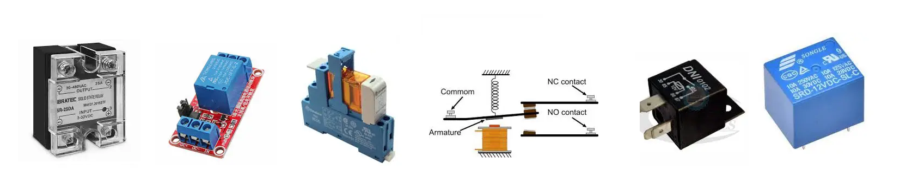
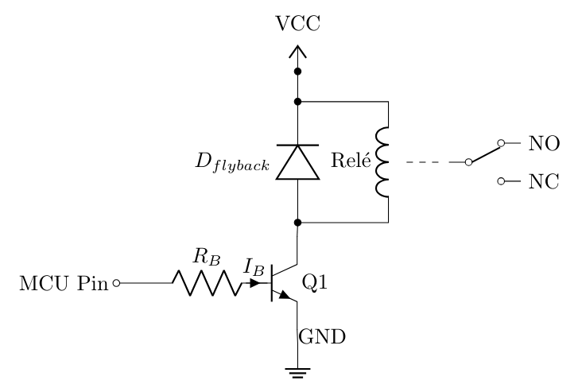

#

# Rele

Um **rele** é um dispositivo eletromecânico que atua como um **interruptor elétrico**, permitindo abrir ou fechar contatos em resposta a uma tensão aplicada em sua bobina interna. Ele é essencialmente um solenoide que opera mecanicamente um interruptor.

## Funcionamento Básico

*   **Bobina e Campo Magnético:** Quando uma corrente elétrica percorre a bobina do relé, ela gera um campo magnético que atrai uma armadura metálica, provocando o movimento físico dos contatos do interruptor.
*   **Isolação Elétrica:** Uma das características mais importantes é que o circuito de controle (entrada) é **eletricamente isolado** do circuito de carga (saída), o que protege o controlador.
*   **Mediação de Potência:** O relé permite que um circuito de baixa potência (como um microcontrolador) controle dispositivos que operam com tensões ou correntes muito mais elevadas, como motores ou lâmpadas.

## Terminais e Configurações

Em um relé típico, o interruptor pode apresentar diferentes terminais:

*   **Comum (COM):** O ponto de conexão principal do interruptor.
*   **Normalmente Aberto (NA ou NO):** O contato permanece aberto enquanto a bobina não estiver energizada.
*   **Normalmente Fechado (NF ou NC):** O contato permanece fechado até que a bobina seja ativada.
*   **Configurações de Polos:** Os relés podem ser classificados pelo número de interruptores que controlam simultaneamente, como **SPST** - *Single Pole Single Throw* (um interruptor simples) ou **DPDT** - *Double Pole - Double Throw* (dois interruptores de duas vias).

## Tipos de Relés

1.  **Eletromagnético (EM):** Utiliza uma bobina e contatos físicos móveis para realizar o chaveamento.
2.  **Estado Sólido (SSR):** Não possui partes móveis; utiliza componentes semicondutores (transistores) para permitir ou bloquear a corrente, sendo ideal para situações com muitos ciclos de acionamento.
3.  **Reed Relay:** Um tipo menor de relé eletromagnético usado para chavear sinais eletrônicos de baixo nível.

## Necessidade de Interface
Como a maioria das bobinas de relés exige uma corrente superior àquela que os pinos de um microcontrolador (como o Arduino) podem fornecer com segurança (geralmente acima de 40 mA), é necessário utilizar um **transistor** como driver para acioná-los. Além disso, devido à natureza indutiva da bobina, o uso de um **diodo de proteção** é fundamental para suprimir picos de tensão (força contra-eletromotriz) que ocorrem no desligamento.

### Interface de Acionamento Recomendada

A interface padrão consiste no uso de um **transistor funcionando como chave**. A configuração típica envolve os seguintes componentes:

1.  **Transistor (NPN ou MOSFET):** Atua como um interruptor eletrônico. Quando o pino do microcontrolador vai para nível lógico alto (HIGH), o transistor entra em saturação, permitindo que a corrente flua através da bobina do relé para o terra (GND). Modelos comuns para essa finalidade são o **2N2222**, **BC547** ou **BC548**.
2.  **Resistor de Base:** Deve ser colocado entre o pino do microcontrolador e a base do transistor para limitar a corrente e proteger o pino de saída. Um valor comum e seguro é **1 kΩ**.
3.  **Diodo de Proteção (Flyback ou Roda Livre):** É essencial conectar um diodo (como o **1N4007**, **1N4148** ou **1N914**) em paralelo com a bobina do relé, com a polaridade invertida em relação à alimentação.
    *   **Por que usar:** Cargas indutivas, como bobinas de relés, geram uma **força contra-eletromotriz (back EMF)** de alta tensão quando a corrente é interrompida subitamente. Sem o diodo para curto-circuitar esse pico de tensão, o transistor pode ser danificado permanentemente.

### Esquema de Ligação
*   **VCC (Alimentação externa):** Conectado a um dos terminais da bobina do relé e ao catodo do diodo.
*   **Pino do Microcontrolador:** Conectado ao resistor de base.
*   **Base do Transistor:** Conectada à outra extremidade do resistor de base.
*   **Coletor do Transistor:** Conectado ao outro terminal da bobina do relé e ao anodo do diodo.
*   **Emissor do Transistor:** Conectado ao **GND comum** do circuito e da fonte externa.

### Alternativas de Interface
*   **Relés de Estado Sólido (SSR):** Estes podem, por vezes, ser acionados diretamente pelo pino do microcontrolador, pois sua entrada funciona de forma semelhante a um LED, consumindo baixa corrente (ex: 10 mA).
*   **Circuitos Integrados (Drivers):** Se houver necessidade de acionar múltiplos relés, podem ser usados CIs como o **ULN2003** ou **ULN2803**, que já possuem transistores Darlington e diodos de proteção integrados.

---

---
# Referências

- LIMA, C. B. VILLAÇA, M. V. M. **AVR e Arduino: Técnicas de Projeto**. 2. ed. Florianópolis: Ed. dos autores, 2012.

- MARGOLIS, M. **Arduino Cookbook**. 2. ed. Sebastopol: O'Reilly Media, 2012.

- PEREA, F. P. **Arduino Essentials**. Birmingham: Packt Publishing, 2015.

- RUSSELL, D. J. **Introduction to Embedded Systems: Using ANSI C and the Arduino Development Environment**. [S.l.]: Morgan & Claypool, 2010.

- VALVANO, J. W. **Embedded Systems: Introduction to ARM Cortex M Microcontrollers**. 5. ed. [S.l.: s.n.], 2012.

---
