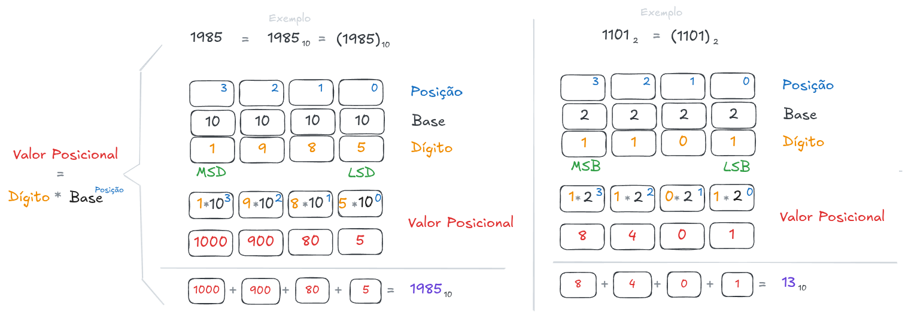

# [Sistemas de Numeração](../../slides/SDIG00-Apresentacao.pdf)

Sistemas de numeração são estruturas matemáticas fundamentais compostas por um conjunto de símbolos e regras que permitem a representação e a atribuição de valores numéricos a grandezas, objetos ou fenômenos do cotidiano. Historicamente, a dependência humana de atribuir valores numéricos aumentou em uma escala sem precedentes, sendo que, na eletrônica moderna, o entendimento desses sistemas é essencial para descrever como os circuitos processam informações.

Os sistemas de numeração possuem as seguintes características principais:

*   **Natureza Posicional:** O valor de um número é determinado pela combinação de dígitos, onde cada posição possui um peso ou valor posicional baseado em potências da base (ou radix) do sistema. Por exemplo, no sistema decimal, as posições representam unidades, dezenas, centenas (potências de 10), enquanto no binário representam potências de 2.

| Figura 1: Valor Posicional ou peso |
|:----------------------------------:|
| |
| Fonte: Autor |

*   **Sistemas de Bases Diversas:**
    *   **Decimal (Base 10):** É o sistema mais popular e universalmente utilizado, composto por dez caracteres (0 a 9).
    *   **Binário (Base 2):** Utiliza apenas dois caracteres (0 e 1), denominados *bits* (*binary digits*), sendo a base fundamental para o processamento de informações em dispositivos digitais.
    *   **Octal (Base 8) e Hexadecimal (Base 16):** São utilizados como formas compactas ou "taquigráficas" para representar grandes quantidades de bits, facilitando o trabalho em computadores digitais e a programação de microcontroladores. O hexadecimal, especificamente, utiliza os dígitos de 0 a 9 e as letras de A a F para representar 16 valores.

| Figura 2: Sistema posicional e conversão para a base decimal |
|:----------------------------------:|
| |
| Fonte: Autor |

*   **Significância dos Dígitos:** Em qualquer representação numérica, o caractere mais à esquerda é chamado de dígito mais significativo (*Most Significant Decimal* - MSD ou *Most Significant Bit* - MSB), pois possui o maior peso, enquanto o caractere mais à direita é o dígito menos significativo (*Least Significant Decimal* - LSD ou *Least Significant Bit* - LSB).
*   **Conversão e Interconectividade:** No contexto de sistemas digitais, é frequentemente necessário converter números entre essas bases, como transformar uma entrada analógica (decimal) em formato binário para processamento e, posteriormente, reconvertê-la para apresentação ao usuário.

Em resumo, sistemas de numeração em nível acadêmico são compreendidos como linguagens matemáticas que permitem a abstração e manipulação de dados discretos, sendo a base binária a "matéria-prima" da lógica digital.

---

# Códigos ASCII, BCD e Gray

No âmbito dos sistemas digitais, códigos são conjuntos de símbolos e regras utilizados para representar informações, sejam elas numéricas, alfanuméricas ou de controle, de maneira que circuitos eletrônicos possam processá-las. Os códigos ASCII, BCD e Gray possuem finalidades distintas na arquitetura de computadores e no design de circuitos lógicos.

## Código ASCII
O **ASCII** (*American Standard Code for Information Interchange*) é um código alfanumérico universalmente adotado para a transferência de informações entre computadores e dispositivos periféricos. 

*   **Estrutura:** O padrão original utiliza 7 bits para representar até 128 caracteres, incluindo letras (maiúsculas e minúsculas), algarismos, sinais de pontuação e caracteres de controle.

*   **Expansão:** Existe o ASCII estendido, que utiliza 8 bits (um byte) para incluir mais 128 símbolos, como caracteres acentuados e símbolos matemáticos.

*   **Aplicação Prática:** É a base para o processamento de textos e comunicação de dados em sistemas computacionais.

| Figura 3: Tabela ASCII |
|:----------------------------------:|
| |
| Fonte: [Quais as principais diferenças entre Unicode, UTF, ASCII, ANSI? - Stackoverflow](https://pt.stackoverflow.com/questions/156951/quais-as-principais-diferen%C3%A7as-entre-unicode-utf-ascii-ansi) |

## Código BCD 
O **BCD** (*Binary Coded Decimal*) é um método de codificação onde cada dígito de um número decimal é representado individualmente pelo seu equivalente em binário de 4 bits.

*   **Funcionamento:** Diferente do binário puro, o BCD trata cada posição decimal separadamente. Por exemplo, o número decimal 137 em binário puro é `10001001`, mas em BCD é representado como `0001 0011 0111`.

*   **Limitações:** Como utiliza apenas os códigos de 0000 (0) a 1001 (9), os seis agrupamentos restantes de 4 bits (1010 a 1111) são considerados **proibidos** ou ilegais; a presença de qualquer um deles indica erro no sistema.

*   **Vantagem:** A principal facilidade reside na conversão direta entre decimal e binário para interfaces de visualização, como calculadoras e mostradores de sete segmentos.

## Código Gray

O **Código Gray** é um sistema de codificação binária cuja principal característica é a mudança de apenas um bit entre dois valores sucessivos.

*   **Natureza:** Ao contrário do sistema binário convencional, o Gray é um código **não ponderado**, o que significa que as posições dos bits não possuem pesos fixos (como 1, 2, 4, 8).

*   **Vantagens e Aplicações:** Por variar apenas um bit por transição, ele é significativamente menos propenso a erros em sistemas de comunicação digital e em dispositivos de comutação mecânica. É amplamente utilizado em encoders de posição e na simplificação de funções sequenciais através de Mapas de Karnaugh.

| Figura 4: Código Gray |
|:----------------------------------:|
| |
| Fonte: [Applications of gray code](https://www.geeksforgeeks.org/digital-logic/applications-of-gray-code/) |

Em resumo, enquanto o **ASCII** foca na representação de textos, o **BCD** facilita a interface com humanos através de números decimais, e o **Gray** otimiza a confiabilidade das transições de estado em circuitos lógicos.

---

# Exercícios

1) Preencha a tabela realizando a devida conversão conforme indicado nas colunas:

| # | Binário | Octal | Decimal | Hexadecimal |
|:-:|:-------:|:-----:|:-------:|:-----------:|
| 0 | 10101   | 25    | 21      | 15          |
| 1 | 101010  |       |         |             |
| 2 | 1010100 |       |         |             |
| 3 |         |       | 168     |             |
| 4 |         |       | 26      |             |
| 5 |         |       | 50      |             |
| 6 |         |  78   |         |             |
| 7 |         | 125   |         |             |
| 8 |         |       |         | C3          |
| 9 |         |       |         | 4A          |

---

2) Converta as cadeias de caracteres (strings) em sequência de números hexadecimais correspondentes da tabela ASCII:

> Um número hexadecimal 49 pode ser representado 0x49 ou 49h para evitar erros de interpretação do número.

| # | String | Sequência numérica hexadecimal | Conversão Maiúsuclas -> Minúsculas |
|:-:|:-:|:-:|:-:|
| 0 | "IFSP" | 49 46 53 50 | 69 66 73 70 |
| 1 | "OLA MUNDO" |  |  |
| 2 | "SALTO 2026" |  |  |
| 3 |  Seu nome |  |  |

---

3) Converta os números decimais em BCD:

| # | Decimal | BCD |
|:-:|:-:|:-:|
| 0 | 42 | 0100 0010 |
| 1 |   379 | |
| 2 | 6194 | |
| 3 | 5800 |  |
| 4 | 918273 | |

---

4) Converta o código Binário convencional em código Gray

| # | Binário | Gray |
|:-:|:-:|:-:|
|0  | 0000 | 0000 |
|1  | 0001 | |
|2  | 0010 | |
|3  | 0011 | |
|4  | 0100 | |
|5  | 0101 | |
|6  | 0110 | |
|7  | 0111 | |
|8  | 1000 | |
|9  | 1001 | |
|10 | 1010 | |
|11 | 1011 | |
|12 | 1100 | |
|13 | 1101 | |
|14 | 1110 | |
|15 | 1111 | |

---

# Referências e complementos

- **TOCCI, Ronald J.; WIDMER, Neal S.** _Sistemas Digitais: Princípios e Aplicações_. 8. ed. Pearson, 2015.
- **PALANIAPPAN, Ramaswamy.** _Digital Systems Design_. bookboon.com, 2011.
- **TRINDADE JUNIOR, Rosumiro; JULIÃO, Jodelson Moreira.** _Circuitos Digitais_. Manaus: Centro de Educação Tecnológica do Amazonas (CETAM), 2012.
- **D’AMORE, Roberto.** _VHDL: Descrição e Síntese de Circuitos Digitais_. LTC.

---
