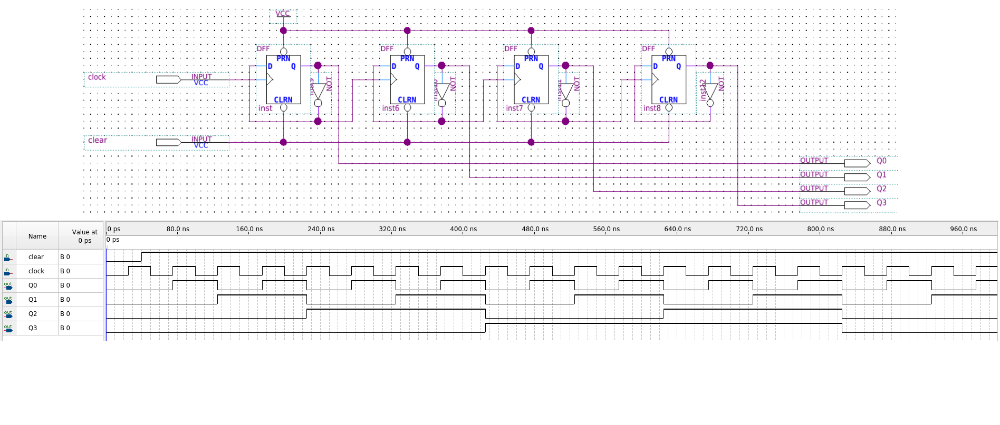

# 

#

Um circuito divisor de frequência utilizando flip-flops tipo D em uma estrutura de contador assíncrono baseia-se na capacidade de cada estágio de alternar seu estado lógico (*toggle*) a cada ciclo de relógio, reduzindo a frequência pela metade a cada nível. Para que um flip-flop tipo D opere nesse modo e funcione como um divisor por 2, é necessário que sua saída invertida ($\bar{Q}$) seja conectada diretamente à sua entrada de dados ($D$).

### Configuração do Modo de Comutação (*Toggle*)

Diferente dos flip-flops JK, que possuem um modo de comutação nativo quando as entradas J e K estão em nível alto, o flip-flop D precisa dessa realimentação externa ($\bar{Q}$ para $D$) para que o próximo estado seja sempre o oposto do estado atual no momento do disparo do *clock*. Assim, a saída $Q$ mudará de estado apenas na transição ativa (borda de subida ou descida) do sinal de entrada, completando um ciclo completo de saída para cada dois ciclos de entrada.

### Estrutura do Contador Assíncrono (Ripple Counter)

Para construir um contador assíncrono com essa mesma estrutura, os estágios são cascateados da seguinte forma:

*   **Primeiro Estágio:** O sinal de *clock* externo (frequência $f_{in}$) é aplicado apenas à entrada de relógio do primeiro flip-flop.
*   **Interconexão de Estágios:** A saída $Q$ de um flip-flop é conectada à entrada de *clock* do flip-flop subsequente. Em sistemas disparados por borda de descida, a transição de ALTO para BAIXO de um estágio aciona o próximo.
*   **Estrutura de Dados:** Cada flip-flop individual na cadeia mantém a conexão de $\bar{Q}$ para $D$ para garantir que todos operem como divisores por 2.

### Divisão de Frequência Acumulada

A frequência resultante em cada estágio segue uma progressão geométrica de razão 1/2:

1.  A saída do primeiro flip-flop ($Q_0$) terá uma frequência de $f_{in}/2$.
2.  A saída do segundo flip-flop ($Q_1$), sendo acionada por $Q_0$, terá uma frequência de $f_{in}/4$.
3.  De forma geral, para um contador assíncrono com $n$ flip-flops, a frequência na saída do $n$-ésimo estágio será $f_{out} = f_{in} / 2^n$.

Essa estrutura é amplamente utilizada em subsistemas digitais para converter frequências de *clock* elevadas em sinais de tempo mais lentos e manejáveis, como em relógios digitais ou divisores de base de tempo para microprocessadores. No entanto, deve-se observar que, por ser uma estrutura assíncrona, os atrasos de propagação de cada flip-flop se acumulam, o que pode limitar a frequência máxima de operação para evitar saídas incorretas (efeito de pulsação ou *ripple*).

---

# Referências e complementos

- **TOCCI, Ronald J.; WIDMER, Neal S.** _Sistemas Digitais: Princípios e Aplicações_. 8. ed. Pearson, 2015.
- **PALANIAPPAN, Ramaswamy.** _Digital Systems Design_. bookboon.com, 2011.
- **TRINDADE JUNIOR, Rosumiro; JULIÃO, Jodelson Moreira.** _Circuitos Digitais_. Manaus: Centro de Educação Tecnológica do Amazonas (CETAM), 2012.
- **D’AMORE, Roberto.** _VHDL: Descrição e Síntese de Circuitos Digitais_. LTC.

---

---
